# データ セット

Microsoft は、多数のデータ セットを 1 つのプラットフォーム (Microsoft Defender 脅威インテリジェンス (Defender TI) に一元化し、Microsoft のコミュニティと顧客がインフラストラクチャ分析を容易にします。 Microsoft の主な焦点は、さまざまなセキュリティユース ケースをサポートするために、インターネット インフラストラクチャに関するできるだけ多くのデータを提供することです。

Microsoft は、インターネット データを収集、分析、インデックス付けして、ユーザーが脅威の検出と対応、インシデントの優先順位付け、組織をターゲットとするアクター グループに関連する敵対者のインフラストラクチャの事前特定を支援します。 Microsoft は、その PDNS センサー ネットワーク、仮想ユーザーのグローバル プロキシ ネットワーク、ポート スキャンを介してインターネット データを収集し、マルウェアや追加されたドメイン ネーム システム (DNS) データに対してサード パーティのソースを利用します。

このインターネット データは、従来と高度の 2 つの異なるグループに分類されます。 従来のデータ セットには、解像度、Whois、SSL 証明書、サブドメイン、ハッシュ、DNS、リバース DNS、およびサービスが含まれます。 高度なデータ セットには、トラッカー、コンポーネント、ホスト ペア、Cookie が含まれます。 トラッカー、コンポーネント、ホスト ペア、Cookie データ セットは、クロールされた Web ページのドキュメント オブジェクト モデル (DOM) を観察して収集されます。 さらに、コンポーネントとトラッカーは、ポート スキャンまたは SSL 証明書の詳細からのバナー応答に基づいてトリガーされる検出規則からも観察されます。

## 解決策

パッシブ DNS (PDNS) は、特定の場所、レコード、および時間枠の DNS 解決データを格納するレコードのシステムです。 この履歴解決データ セットを使用すると、IP アドレスに解決されたドメインとその逆をユーザーが表示できます。 このデータ セットを使用すると、ドメインまたは IP の重複に基づく時間ベースの関連付けができます。
PDNS を使用すると、以前に不明な、または新しく立ち上がった脅威アクター インフラストラクチャを識別できます。 ブロックリストにインジケーターをプロアクティブに追加すると、キャンペーンが行われる前に通信パスを遮断できます。 [解像度] データ セット タブ内にレコード解決データが表示され、[DNS データ セット] タブにさらに種類の DNS レコードが表示されます。

PDNS 解決データには、次のものが含まれます。

- **解決:** 解決するエンティティの名前 (IP アドレスまたはドメイン)
- **場所:** IP アドレスがホストされている場所。
- **ネットワーク:** IP アドレスに関連付けられているネットブロックまたはサブネット。
- **ASN:** 自律システム番号と組織名
- **最初に確認:** この解決を最初に観察した日付を表示するタイムスタンプ。
- **最終表示:** この解決を最後に観察した日付を表示するタイムスタンプ。
- **ソース:** リレーションシップの検出を有効にしたソース。
- **タグ:** Defender TI システムでこのアーティファクトに適用されたすべてのタグ。

![[データ] タブの解像度](media/dataTabResolutions.png)

## このデータ セットに関する質問は、次の回答に役立つ場合があります。

### ドメイン
- ドメインが Defender TI によって IP アドレスに解決されたことが最初に確認されたのはいつですか?

    

- 最後に Defender TI によって IP アドレスに積極的に解決されたのはいつですか?
    

- 現在解決されている IP アドレスは何ですか?
    
  
### IP アドレス
- IP アドレスはルーティング可能ですか?

    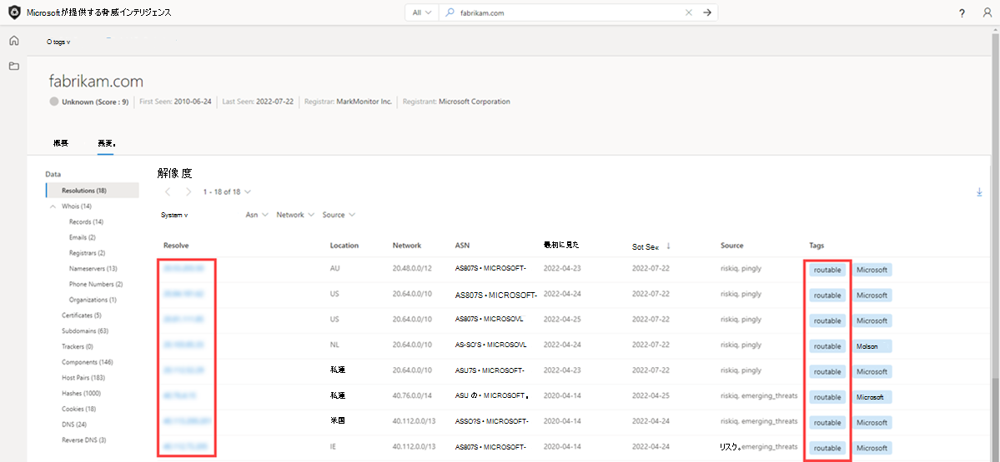

- どのサブネットの一部ですか?

    

- サブネットに関連付けられている所有者はいますか?
  
    

- どのような AS の一部ですか?

    

- 位置情報は何ですか?
    

## Whois

1 日に数千回、ドメインは個人と組織の間で購入または転送されます。 このすべてを実現するプロセスは簡単で、レジストラー プロバイダーに応じて数分で約 7 ドルかかります。 支払いの詳細を超えて、自分に関する追加情報を指定する必要があります。ドメインが設定されると、その一部は Whois レコードの一部として保存されます。 これはパブリック ドメインの登録と見なされます。 ただし、プライベート ドメイン登録サービスがあり、ドメインの Whois レコードから個人情報を非表示にすることができます。 このような状況では、ドメイン所有者の情報は安全であり、レジストラーの情報に置き換えられます。 より多くのアクター グループがプライベート ドメイン登録を実行して、アナリストが所有する他のドメインを見つけるのが難しくなります。 Defender TI は、Whois レコードが潜在顧客を提供しない場合にアクターの共有インフラストラクチャを見つけるために、さまざまなデータ セットを提供します。

Whois は、だれでもドメイン、IP アドレス、またはサブネットに関する情報を照会できるプロトコルです。 脅威インフラストラクチャ研究における Whois の最も一般的な機能の 1 つは、Whois レコード内で共有される一意のデータに基づいて、異種エンティティを識別または接続することです。 注意深く読んだり、ドメインを自分で購入したことがある場合は、レジストラーから要求されたコンテンツが検証されないことに気付いた可能性があります。 実際には、レコードに何かを入れて (多くの人が行う) 可能性があります。これにより、世界に表示されます。

各 Whois レコードには複数の異なるセクションがあり、すべて異なる情報を含めることができる場合があります。 一般的に見られるセクションには、"レジストラー"、"登録者"、"管理者"、"技術" が含まれており、それぞれがレコードの異なる連絡先に対応している可能性があります。 多くの場合、このデータはセクション間で重複しますが、場合によっては、特にアクターが間違いを犯した場合、わずかな不一致が発生する可能性があります。 Defender TI 内で Whois 情報を表示すると、データを重複除去し、データのどの部分から取得したかを示す要約されたレコードが表示されます。 このプロセスにより、アナリスト ワークフローが大幅に高速化され、データの見落としが回避されることがわかりました。 Defender TI の Whois 情報は、WhoisIQ™ データベースによって提供されます。

Whois データには、次のものが含まれます。
- **更新されたレコード:** Whois レコードが最後に更新された日を示すタイムスタンプ。
- **最終スキャン:** Defender TI システムがレコードを最後にスキャンした日付。
- **有効期限:** 登録の有効期限 (使用可能な場合)。
- **作成済み:** 現在の Whois レコードの年齢。
- **Whois Server:** サーバーは ICANN 認定レジストラーによってセットアップされ、その中に登録されているドメインに関する最新の情報を取得します。 
- **レジストラー:** アーティファクトの登録に使用されるレジストラー サービス。
- **ドメインの状態:** ドメインの現在の状態。 "アクティブ" ドメインはインターネット上に存在します。 
- **Email:** Whois レコードに含まれるすべての電子メール アドレスと、それぞれの連絡先の種類が関連付けられている (管理者、技術など)。
- **名前:** レコード内の連絡先の名前と、それぞれの連絡先の種類が関連付けられます。
- **組織:** レコード内の任意の組織の名前と、それぞれの連絡先の種類が関連付けられます。
- **番地:** レコードに関連付けられている任意の住所と、関連付けられている連絡先の種類。
- **市区町村:** レコードに関連付けられている住所に記載されているすべての都市と、関連付けられている連絡先の種類。
- **状態:** レコードに関連付けられているアドレスに一覧表示されているすべての状態と、関連付けられている連絡先の種類。
- **郵便番号:** レコードに関連付けられている住所に記載されているすべての郵便番号と、関連付けられている連絡先の種類。
- **国:** レコードに関連付けられている住所に記載されているすべての国、および関連付けられている連絡先の種類。
- **電話番号:** レコードに一覧表示されている電話番号と、関連付けられている連絡先の種類。
- **ネーム サーバー:** 登録済みエンティティに関連付けられているすべてのネーム サーバー。

## 現在の Whois 参照

Defender TI の現在の Whois リポジトリでは、現在登録され、対象の Whois 属性に関連付けられている Microsoft の Whois コレクション内のすべてのドメインが強調表示されます。 このデータでは、ドメインの登録と有効期限の日付と、ドメインの登録に使用される電子メール アドレスが強調表示されます。 このデータは、プラットフォームの [Whois Search] タブに表示されます。

## 履歴 Whois 参照

Defender TI の Whois History リポジトリを使用すると、システムの観察に基づいて、Whois 属性に対するすべての既知の履歴ドメイン関連付けにアクセスできます。 このデータ セットでは、ユーザーがピボットする属性に関連付けられているすべてのドメインが、クエリ対象のドメインと属性の間の関連付けを初めておよび最後に観察した時点で強調表示されます。 このデータは、現在の [Whois Search] タブの横にある別のタブに表示されます。

**このデータ セットに関する質問は、次の回答に役立つ場合があります。**

- ドメインは何歳ですか?

    

- 情報はプライバシー保護されているように見えますか?

    

- 任意のデータが一意に見えますか?

    

- 使用されるネーム サーバーは何ですか?

    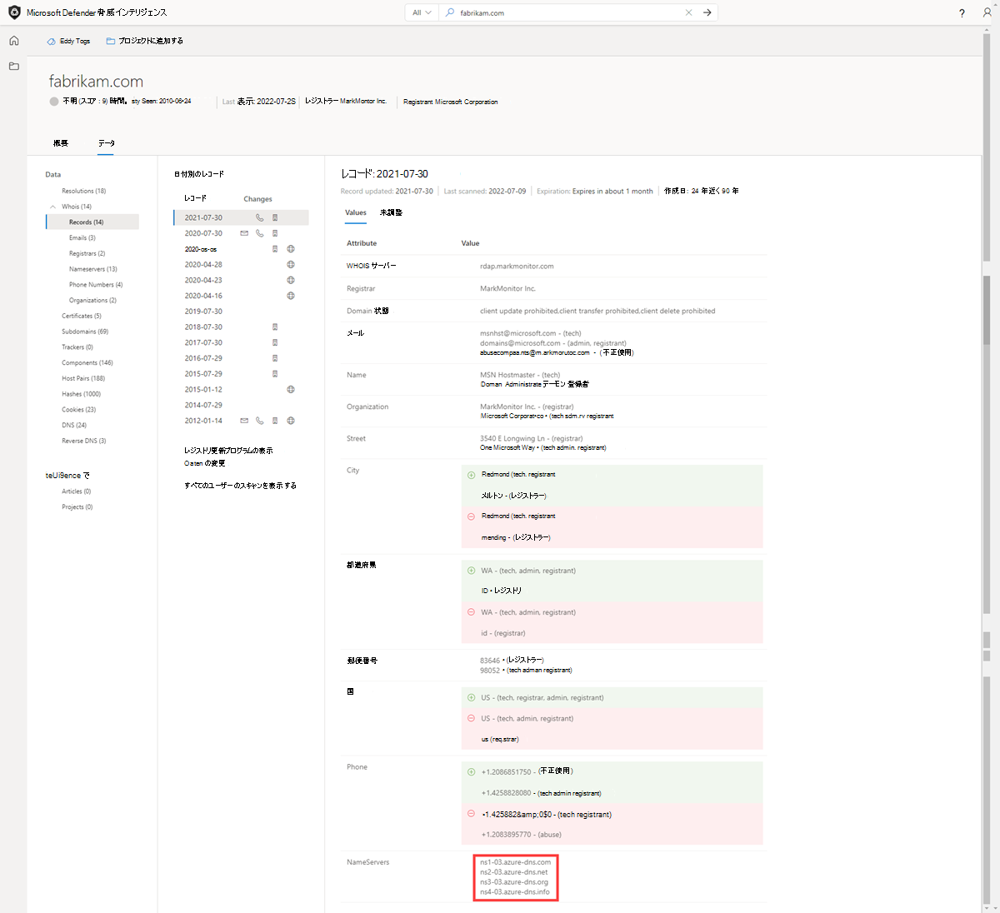

- これはシンクホール ドメインですか?

    

- これは、パークされたドメインですか?

    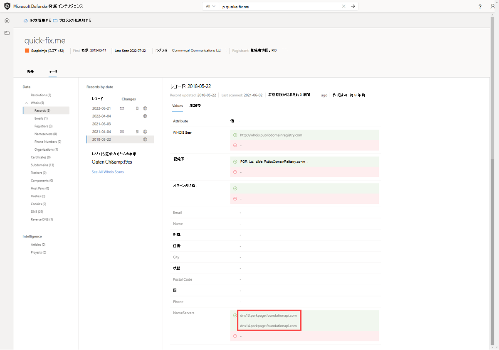

- これはハニーポット ドメインですか?

    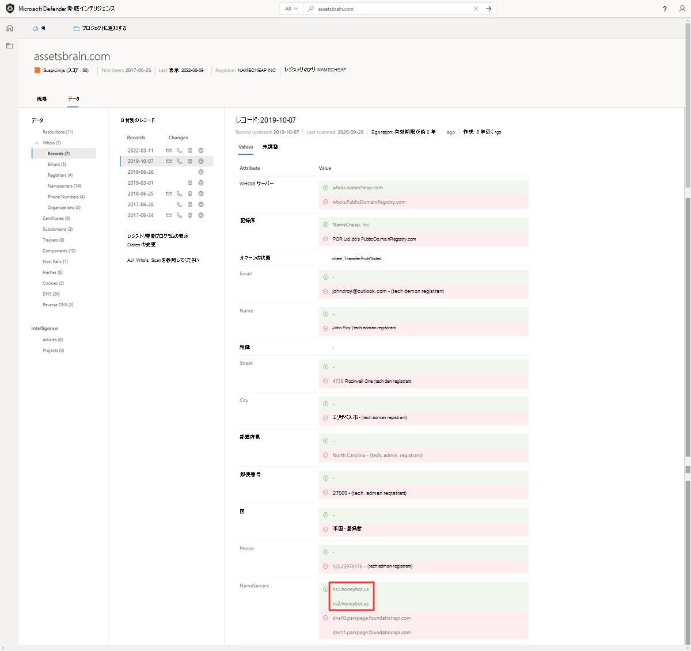

- 履歴はありますか?

    

- 偽のプライバシー保護メールはありますか?

    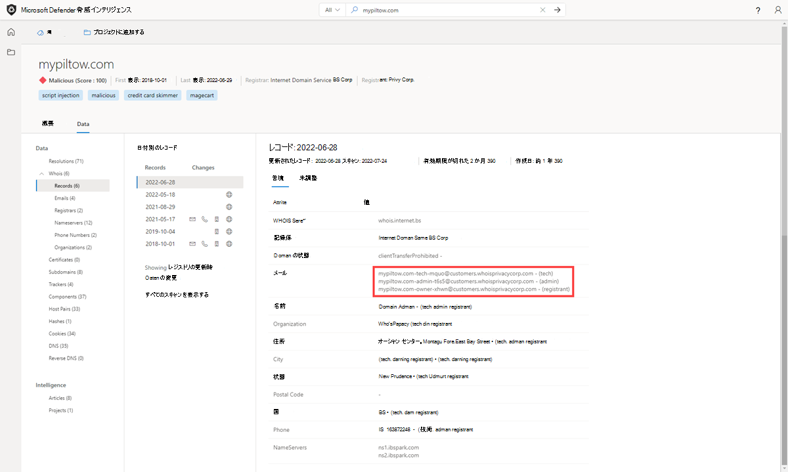

- Whois レコードに偽の名前はありますか?

- ドメイン間で共有されている可能性のある Whois 値を検索して、関連するその他の IOC を特定しましたか?

    

## 証明書
SSL 証明書は、データのセキュリティ保護以外にも、ユーザーが異なるネットワーク インフラストラクチャに接続するための素晴らしい方法です。 最新のスキャン手法を使用すると、インターネット上のすべてのノードに対して数時間でデータ要求を実行できます。つまり、証明書を定期的にホストしている IP アドレスに簡単に関連付けることができます。

Whois レコードと同様に、SSL 証明書では、最終的な製品を生成するためにユーザーから情報を提供する必要があります。 ドメインとは別に、SSL 証明書は (自己署名がない限り) 作成されます。追加情報は、ユーザーが作成できます。 Microsoft のユーザーが SSL 証明書から最も価値を得ているのは、証明書の生成時に誰かが使用できる一意のデータではなく、それがホストされている場所であるとは限りません。

SSL 証明書にアクセスするには、Web サーバーに関連付け、特定のポート (ほとんどの場合は 443) を介して公開する必要があります。 毎週大量のインターネット スキャンを使用すると、すべての IP アドレスをスキャンし、ホストされているすべての証明書を取得して、証明書データの履歴リポジトリを構築できます。 IP アドレスのデータベースを SSL 証明書マッピングに使用すると、インフラストラクチャ内の重複を識別する方法がユーザーに提供されます。

この概念をさらに説明するために、アクターが自己署名 SSL 証明書を使用してサーバーを設定したとします。 数日後、防御者はインフラストラクチャに対して賢明になり、悪意のあるコンテンツをホストする Web サーバーをブロックします。 アクターは、すべてのハード ワークを破棄する代わりに、すべてのコンテンツ (SSL 証明書を含む) をコピーし、新しいサーバーに配置するだけで済みます。 ユーザーとして、証明書の一意の SHA-1 値を使用して、両方の Web サーバー (1 つはブロックされ、1 つは不明) が何らかの方法で接続されていることを示す接続ができるようになりました。

SSL 証明書の価値を高めるのは、パッシブ DNS または Whois データが見逃す可能性がある接続を行うことができるということです。 これは、潜在的な悪意のあるインフラストラクチャを関連付け、アクターの潜在的な運用セキュリティ障害を特定するより多くの方法を意味します。 Defender TI は、2013 年から現在までの 3,000 万件を超える証明書を収集し、証明書の内容と履歴を関連付けるツールをユーザーに提供しています。

SSL 証明書は、暗号化キーをユーザーが指定した一連の詳細にデジタルでバインドするファイルです。 Defender TI は、インターネット スキャン手法を使用して、さまざまなポートの IP アドレスから SSL 証明書の関連付けを収集します。 これらの証明書はローカル データベースの内部に格納され、特定の SSL 証明書がインターネットに表示された場所のタイムラインを作成できます。

証明書データには、次のものが含まれます。

- **Sha1:** SSL 証明書資産の SHA1 アルゴリズム ハッシュ。
- **最初に確認:** アーティファクトでこの証明書を最初に観察した日付を表示するタイムスタンプ。
- **最終表示:** アーティファクトでこの証明書を最後に観察した日付を表示するタイムスタンプ。
- **インフラストラクチャ:** 証明書に関連付けられているすべての関連インフラストラクチャ。

![[データ] タブの証明書の一覧](media/dataTabCertificatesList.png)

ユーザーが SHA1 ハッシュを展開すると、ユーザーは次の内容に関する詳細を表示できます。これには次のものが含まれます。
- **シリアル番号:** SSL 証明書に関連付けられているシリアル番号。
- **発行：** 証明書が発行された日付。
- **有効 期限：** 証明書の有効期限が切れる日付。
- **サブジェクト共通名:** 関連付けられている SSL 証明書のサブジェクト共通名。
- **発行者共通名:** 関連付けられている SSL 証明書の発行者共通名。
- **サブジェクトの別名:** SSL 証明書の代替共通名。
- **発行者の別名:** 発行者の追加名。
- **サブジェクト組織名:** SSL 証明書の登録にリンクされている組織。
- **発行者組織名:** 証明書の問題を調整した組織の名前。
- **SSL バージョン:** 証明書が登録された SSL のバージョン。
- **サブジェクト組織単位:** 証明書を担当する組織内の部署を示す省略可能なメタデータ。
- **発行者組織単位:** 証明書を発行する組織に関する追加情報。
- **件名住所:** 組織が配置されている住所。
- **発行者の住所:** 発行者組織が配置されている住所。
- **サブジェクトのロケール:** 組織が配置されている都市。
- **発行者のロケール:** 発行者組織が配置されている都市。
- **サブジェクトの州/州:** 組織が配置されている州または都道府県。
- **発行者の州/州:** 発行者組織が配置されている州または都道府県。
- **サブジェクトの国:** 組織が配置されている国。
- **発行者の国:** 発行者組織が存在する国。
- **関連インフラストラクチャ:** 証明書に関連付けられているすべての関連インフラストラクチャ。

![[データ] タブの証明書の詳細](media/dataTabCertificateDetails.png)

**このデータ セットに関する質問は、次の回答に役立つ場合があります。**

- この証明書は、他にどのようなインフラストラクチャに関連付けられているのですか?

    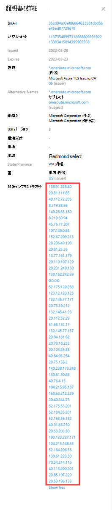

- 証明書に、適切なピボット ポイントとして機能する一意のデータ ポイントはありますか?

    

- 証明書は自己署名されていますか?

    

- 証明書は無料のプロバイダーから取得されていますか?

    

- 証明書が使用中に観察された期間は何時ですか?

    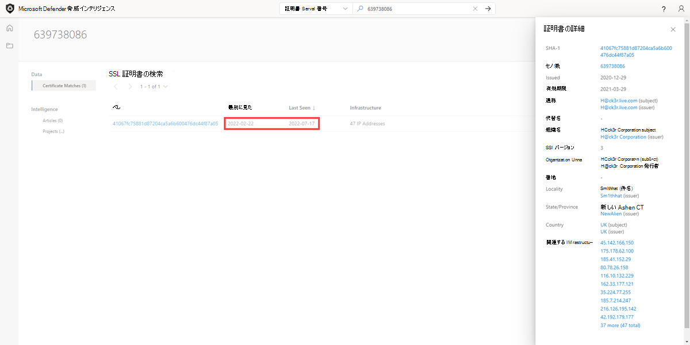

## サブドメイン

サブドメインは、プライマリ ドメインの一部であるインターネット ドメインです。 サブドメインは"ホスト" とも呼ばれます。 たとえば、"docs.microsoft.com" は "microsoft.com" のサブドメインです。 サブドメインごとに、ドメインの解決先となる新しい IP アドレスのセットが存在する可能性があります。これは、関連するインフラストラクチャを検索するための優れたデータ ソースになる可能性があります。

サブドメイン データには、次のものが含まれます。

- **ホスト名:** 検索されたドメインに関連付けられているサブドメイン。
- **タグ:** Defender TI システムでこのアーティファクトに適用されたすべてのタグ。

![[データ] タブのサブドメイン](media/dataTabSubdomains.png)

**このデータ セットに関する質問は、次の回答に役立つ場合があります。**

- より高いレベルのドメインに関連付けられているサブドメインが増えていますか?

    

- 悪意のあるアクティビティに関連付けられているサブドメインはありますか?

    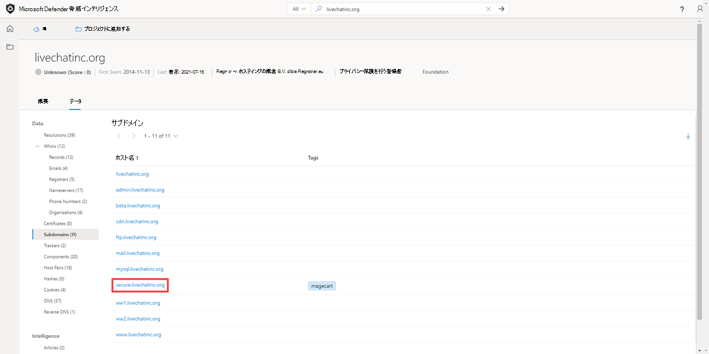

- これがドメインの場合、サブドメインは見慣れていないと思われますか?

- 他の悪意のあるドメインに関連付けられているサブドメインへのパターンはありますか?

- 各サブドメインをピボットオフすると、ターゲットに関連付けられていない新しい IP 領域が明らかにされますか?

- ルート ドメインと一致しない他の無関係なインフラストラクチャは何ですか?

## トラッカー

トラッカーは、Web ページ内で見つかった一意のコードまたは値であり、多くの場合、ユーザーの操作を追跡するために使用されます。 これらのコードは、異なる Web サイト のグループを中央エンティティに関連付けるために使用できます。 多くの場合、アクターは、フィッシング キャンペーンの偽装を探している被害者の Web サイトのソース コードをコピーします。 ユーザーが Microsoft の Trackers データ セットを使用してこれらの不正なサイトを識別できるこれらの ID を削除する時間を取ることはめったにありません。 アクターは、トラッカー ID をデプロイして、サイバー攻撃キャンペーンの成功を確認することもできます。 これは、マーケティング キャンペーンの成功を追跡するために、Google Analytics トラッカー ID などの SEO ID を利用するマーケティング担当者と似ています。

Microsoft の Tracker データ セットには、Google、Yandex、Mixpanel、New Relic、Clicky などのプロバイダーからの ID が含まれており、定期的に増加し続けています。

トラッカー データには、次のものが含まれます。

- **ホスト名:** トラッカーが検出されたインフラストラクチャをホストするホスト名。
- **最初に確認:** アーティファクトでこのトラッカーを最初に観察した日付を表示するタイムスタンプ。
- **最後に見た:** アーティファクトでこのトラッカーを最後に観察した日付を表示するタイムスタンプ。
- **型:** 検出されたトラッカーの種類 (GoogleAnalyticsID、JarmHash など)。
- **値:** トラッカーの識別値。
- **タグ:** Defender TI システムでこのアーティファクトに適用されたすべてのタグ。

**このデータ セットに関する質問は、次の回答に役立つ場合があります。**

- 同じ分析 ID を使用している他のリソースはありますか?

    

- これらのリソースは組織に関連付けられているか、侵害攻撃を行おうとしていますか?

- トラッカー間に重複はありますか。他の Web サイトと共有されていますか?

- Web ページ内で見つかったトラッカーの種類は何ですか?

    

- トラッカーの時間の長さはどのくらいですか?

    

- トラッカー値の変更頻度はどのくらいですか。

- Web サイトの複製ソフトウェア (MarkOfTheWeb または HTTrack) にリンクしているトラッカーはありますか?

    

- 悪意のある C2 サーバー マルウェア (JARM) にリンクしているトラッカーはありますか?

    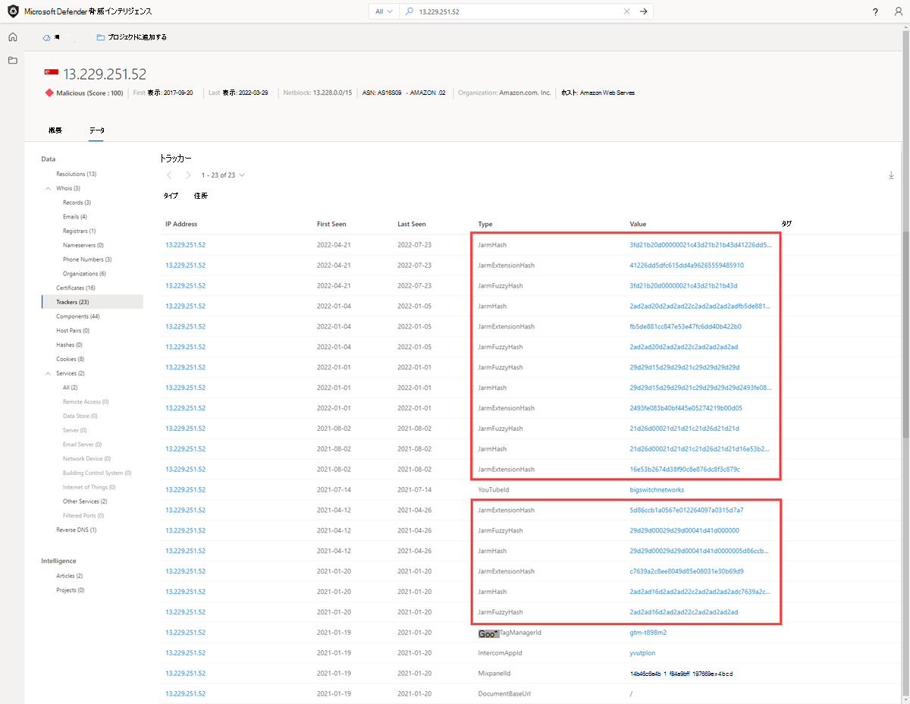

## コンポーネント

Web コンポーネントは、Web クロールまたはスキャンを実行する Microsoft から収集された Web ページまたはサーバー インフラストラクチャを説明する詳細です。 これらのコンポーネントを使用すると、ユーザーは Web ページの構成、または特定のインフラストラクチャを推進するテクノロジとサービスを理解できます。
一意のコンポーネントをピボットすると、侵害されたアクターのインフラストラクチャやその他のサイトを見つけることができます。 ユーザーは、Web サイトが実行されているテクノロジに基づいて、特定の攻撃や侵害に対して脆弱である可能性があるかどうかを理解することもできます。

コンポーネント データには、次のものが含まれます。

- **ホスト名:** コンポーネントが検出されたインフラストラクチャをホストするホスト名。
- **最初に見た:** アーティファクトでこのコンポーネントを最初に観察した日付のタイムスタンプ。
- **最後に見た:** アーティファクトでこのコンポーネントを最後に観察した日付のタイムスタンプ。
- **カテゴリ:** 検出されたコンポーネントの種類 (オペレーティング システム、Framework、リモート アクセス、サーバーなど)。
- **名前とバージョン:** コンポーネント名と成果物で実行されているバージョン (Microsoft IIS (v8.5 など)。
- **タグ:** Defender TI システムでこのアーティファクトに適用されたすべてのタグ。

![[データ] タブコンポーネント](media/dataTabComponents.png)

**このデータ セットに関する質問は、次の回答に役立つ場合があります。**

- どのような脆弱なインフラストラクチャを使用していますか?

    

    

    Magento v1.9 は非常に古いので、Microsoft はその特定のバージョンの信頼性の高いドキュメントを見つけることができませんでした。

- 他のドメインに追跡できる脅威アクターは、どのような一意の Web コンポーネントを使用していますか?

- 悪意のあるコンポーネントはマークされていますか?

- 識別される Web コンポーネントの数は何個ですか?

    

- 一意のテクノロジや奇妙なテクノロジはあまり見られませんか?

    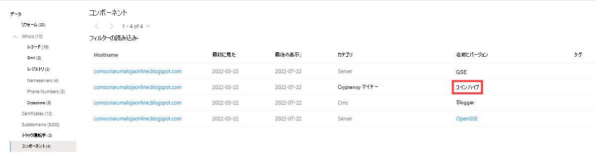

- 特定のテクノロジの偽のバージョンはありますか?

- Web コンポーネントの変更の頻度はどのくらいですか。多くの場合、またはほとんど行われません。

- 不正使用が知られている不審なライブラリはありますか?

- 脆弱性に関連するテクノロジはありますか?

## ホストペア

ホスト ペアは、仮想ユーザーの Web クロールから観察された接続を共有する 2 つのインフラストラクチャ (親と子) です。 接続の範囲は、最上位レベルのリダイレクト (HTTP 302) から、iframe やスクリプト ソース参照などのより複雑なものまでです。

ホスト ペア データには、次のものが含まれます。

- **親ホスト名:** 資産を参照しているホスト、または子ホストに "手を差し伸ばす" ホスト
- **子ホスト名:** 親ホストによって呼び出されるホスト
- **最初に確認:** ホストとの関係を最初に観察した日付のタイムスタンプ。
- **最終表示:** ホストとの関係を最後に観察した日付のタイムスタンプ。
- **原因:** 親ホスト名と子ホスト名の間の接続の種類。 考えられる原因には、script.src、link.href、redirect、img.src、unknown、xmlhttprequest、a.href、finalRedirect、css.import、または parentPage 接続が含まれます。
- **タグ:** Defender TI システムでこのアーティファクトに適用されたすべてのタグ。

**このデータ セットに関する質問は、次の回答に役立つ場合があります。**

- 接続されているアーティファクトのいずれかがブロックリストに含まれていますか?
- 接続されているアーティファクトにタグ付けされていますか (フィッシング、APT、悪意のある、疑わしい、脅威アクター名)。
- このホストは、ユーザーを悪意のあるコンテンツにリダイレクトしていますか?

    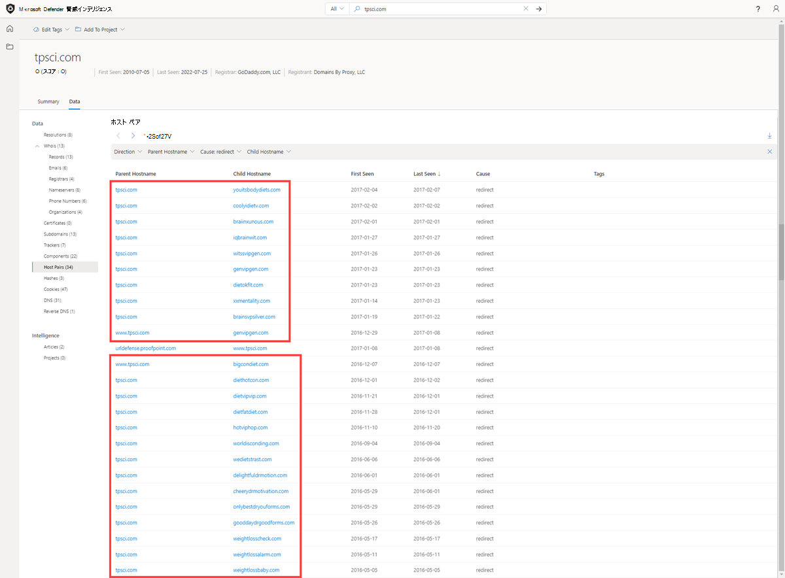

- 侵害攻撃を設定するためにリソースが CSS または画像をプルしていますか?

    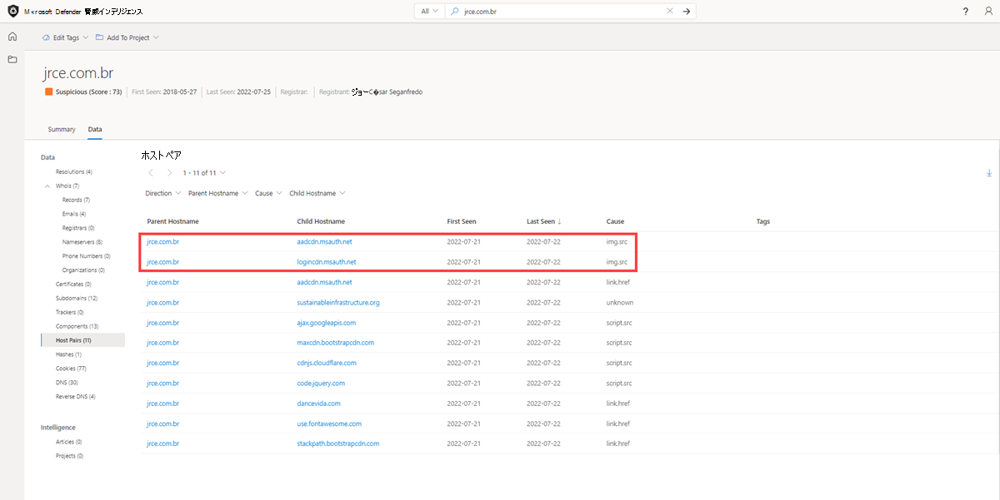

- リソースがスクリプトをプルしているか、link.href を参照して Magecart 攻撃またはスキット攻撃を設定していますか?
    

- ユーザーはどこからリダイレクトされますか?

- どのような種類のリダイレクトが行われますか?

## Hashes

Microsoft は Proofpoint と提携し、ユーザー検索のドメイン、ホスト、または IP アドレスに関連付けられた MD5 [マルウェア](/microsoft-365/security/intelligence/malware-naming) ハッシュを表示します。 MD5 ハッシュの詳細を分析する場合は、Proofpoint で新たな脅威ライセンスを購入することをお勧めします。 このデータは、ユーザーが攻撃者のアクターの機能、意図、および動機を理解するのに役立ち、同時にインフラストラクチャを相互に接続するのに役立ちます。 各結果には一意のハッシュが含まれています。

ハッシュ データには、次のものが含まれます。

- **ソース:** ハッシュの検出に使用されるソース。
- **サンプル:** 検出されたハッシュの一意の識別コード。
- **収集日:** 指定されたソースによってハッシュ サンプルが収集された日。

**このデータ セットに関する質問は、次の回答に役立つ場合があります。**

- ドメインはマルウェアに接続しますか?

    

- この IP アドレスにマルウェアが関連付けられているか。
    

- 収集されたハッシュはマルウェアに関連付けられているか。

- この不審なアクティビティは最近どのように観察されましたか?

- 悪意のあるバイナリを観察したベンダー/ソースはどれですか?

- クエリ対象の IP またはドメインは、マルウェアのコマンドアンドコントロール サーバーとして機能していますか?

- 特定のクエリのハッシュに関連付けられているファイルを評価すると、脅威の検出目的で他のインジケーターに移動できますか?

## Cookie

Cookie は、ユーザーがインターネットを閲覧すると、サーバーからクライアントに送信される小さなデータです。 これらの値には、アプリケーションまたは追跡データのビット数の状態が含まれる場合があります。 Defender TI では、Web サイトのクロール時に観察された Cookie 名が強調表示され、インデックスが作成され、ユーザーはクロールとデータ収集で特定の Cookie 名を観察したあらゆる場所を掘り下げることができます。 Cookie は、悪意のあるアクターが感染した被害者を追跡したり、後で使用するデータを保存したりするためにも使用されます。

Cookie データには、次のものが含まれます。

- **ホスト名:** Cookie に関連付けられているホスト インフラストラクチャ。
- **最初に見た:** アーティファクトでこの Cookie を最初に観察した日付のタイムスタンプ。
- **最後に見た:** アーティファクトでこの Cookie を最後に観察した日付のタイムスタンプ。
- **名前:** Cookie の名前 (JSESSIONID、SEARCH_NAMESITEなど)。
- **ドメイン:** Cookie に関連付けられているドメイン。
- **タグ:** Defender TI システムでこのアーティファクトに適用されたすべてのタグ。

**このデータ セットに関する質問は、次の回答に役立つ場合があります。**

- 同じ Cookie を発行している他の Web サイトは何ですか?

    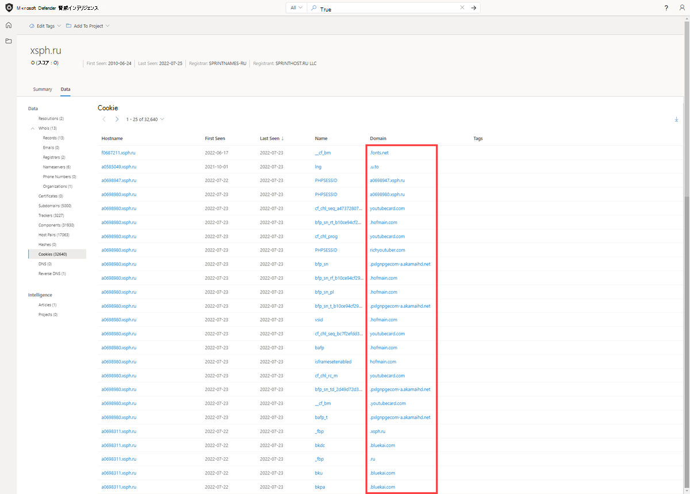

- 同じ Cookie を追跡している他の Web サイトは何ですか?
    

- Cookie ドメインはクエリと一致しますか?

- アーティファクトに関連付けられている Cookie の数は何個ですか?

    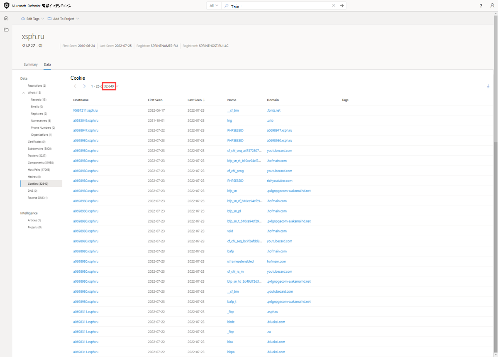

- 一意の Cookie 名またはドメインはありますか?

- Cookie に関連付けられている期間は何ですか?

- 新しく観察された Cookie または Cookie に関連付けられている変更の頻度は何ですか?

## サービス

サービス名とポート番号は、TCP、UDP、DCCP、SCTP などのトランスポート プロトコルで実行されるさまざまなサービスを区別するために使用されます。 ポート番号は、特定のポートで実行されているアプリケーションの種類を示すことができます。 ただし、アプリケーションまたはサービスを変更して、別のポートを使用して、IP アドレス上のサービスまたはアプリケーションを難読化または非表示にすることができます。 ポートとヘッダー/バナーの情報を知ることで、実際のアプリケーション/サービスと、使用されているポートの組み合わせを識別できます。 Defender TI は、[サービス] タブ内に 14 日間の履歴を表示し、観察されたポートに関連付けられた最後のバナー応答を表示します。

Microsoft のサービス データには、次のものが含まれます。

- 監視されるポートを開く
- ポート番号
- コンポーネント
- サービスが観察された回数
- ポートが最後にスキャンされたとき
- プロトコル接続
- ポートの状態
  - [開く]
  - Filtered
  - クローズ
- バナーの応答

**このデータ セットに関する質問は、次の回答に役立つ場合があります。**

- 特定の IP アドレスの特定のポートで実行されているアプリケーションは何ですか?

    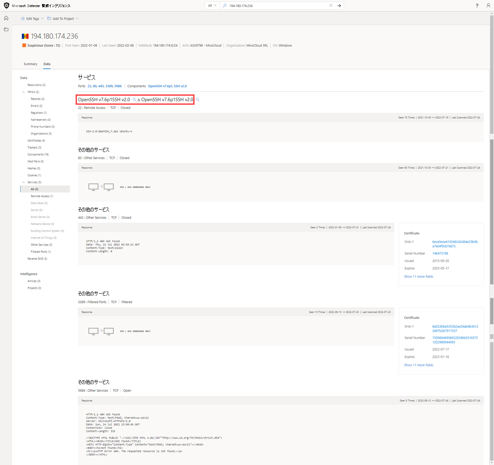

- どのバージョンのアプリケーションが使用されていますか?

    

- 特定のポートの開いている状態、フィルター処理された状態、または閉じた状態に最近の変更はありますか?

    

- 証明書は接続に関連付けられていたか。

    

- 特定の資産で脆弱なテクノロジまたは非推奨のテクノロジが使用されていますか?

    

    

- 情報は、悪意のある目的で使用できる実行中のサービスによって公開されますか?

- セキュリティのベスト プラクティスに従っていますか?

## DNS

Microsoft は長年にわたって DNS レコードを収集し、メール交換 (MX) レコード、ネームサーバー (NS) レコード、テキスト (TXT) レコード、権限の開始 (SOA) レコード、正規名 (CNAME) レコード、ポインター (PTR) レコードに関する分析情報をユーザーに提供してきました。 DNS レコードを確認すると、所有しているドメイン全体でアクターが使用する共有インフラストラクチャを特定するのに役立ちます。 たとえば、アクター グループは、同じネームサーバーを使用してインフラストラクチャをセグメント化したり、同じメール交換サーバーを使用してコマンドと制御を管理したりする傾向があります。

DNS データには、次のものが含まれます。

- **値:** ホストに関連付けられている DNS レコード。
- **最初に確認:** アーティファクトでこのレコードを最初に観察した日付を表示するタイムスタンプ。
- **[最後に表示]:** アーティファクトでこのレコードを最後に観察した日付を表示するタイムスタンプ。
- **型:** レコードに関連付けられているインフラストラクチャの種類。 潜在的なオプションには、メール サーバー (MX)、テキスト ファイル (TXT)、ネーム サーバー (NS)、CNAMES、および Authority の開始 (SOA) レコードが含まれます。
- **タグ:** Defender TI システムでこのアーティファクトに適用されたすべてのタグ。

![[データ] タブの DNS](media/dataTabDNS.png) 

**このデータ セットに関する質問は、次の回答に役立つ場合があります。**

- 検索しているインジケーターに直接関連するインフラストラクチャの他の部分は何ですか?
- インフラストラクチャは時間の経過と共にどのように変化しましたか?
- ドメイン所有者は、コンテンツ配信ネットワークまたはブランド保護サービスのサービスを採用していますか?
- 関連する組織がネットワーク内で採用しているその他のテクノロジは何ですか?

## DNS の逆引き

前方 DNS 参照は特定のホスト名の IP アドレスに対してクエリを実行しますが、逆引き DNS 参照は IP アドレスの特定のホスト名に対してクエリを実行します。 このデータセットには、DNS データセットと同様の結果が表示されます。 DNS レコードを確認すると、所有しているドメイン全体でアクターが使用する共有インフラストラクチャを特定するのに役立ちます。 たとえば、アクター グループは、同じネームサーバーを使用してインフラストラクチャをセグメント化したり、同じメール交換サーバーを使用してコマンドと制御を管理したりする傾向があります。

逆引き DNS データには、次のものが含まれます。

- **値:** 逆引き DNS レコードの値。
- **最初に確認:** アーティファクトでこのレコードを最初に観察した日付のタイムスタンプ。
- **最終表示:** アーティファクトでこのレコードを最初に観察した日付のタイムスタンプ。
- **型:** レコードに関連付けられているインフラストラクチャの種類。 潜在的なオプションには、メール サーバー (MX)、テキスト ファイル (TXT)、ネーム サーバー (NS)、CNAMES、および Authority の開始 (SOA) レコードが含まれます。
- **タグ:** Defender TI システムでこのアーティファクトに適用されたすべてのタグ。

![[データ] タブの逆引き DNS](media/dataTabReverseDNS.png)

**このデータ セットが回答に役立つ可能性がある質問:**

- このホストを観察した DNS レコードは何ですか?
- このホストを観察したインフラストラクチャは、時間の経過と共にどのように変化しましたか?

## 次の手順

詳細については、以下を参照してください。

- [検索とピボット](searching-and-pivoting.md)
- [データの並べ替え、フィルター処理、ダウンロード](sorting-filtering-and-downloading-data.md)
- [インフラストラクチャ チェーン](infrastructure-chaining.md)
- [チュートリアル: 脅威インテリジェンスとインフラストラクチャチェーンの収集](gathering-threat-intelligence-and-infrastructure-chaining.md)