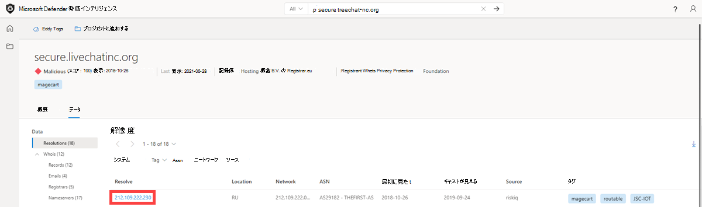

# チュートリアル: 脅威インテリジェンスとインフラストラクチャチェーンの収集

このチュートリアルでは、次の方法について説明します。
- いくつかの種類のインジケーター検索を実行し、脅威と敵対的インテリジェンスを収集する

  

## 前提条件

- Azure Active Directory または個人用 Microsoft アカウント。 [アカウントにログインまたは作成する](https://signup.microsoft.com/)
- Microsoft Defender 脅威インテリジェンス (Defender TI) Premium ライセンス。

    > [!NOTE]
    > Defender TI Premium ライセンスを持たないユーザーは、Defender 脅威インテリジェンス ポータルにログインし、無料の Defender TI オファリングにアクセスできます。

## 免責事項

Microsoft Defender 脅威インテリジェンス (Defender TI) には、悪意のあるインフラストラクチャや敵対的脅威ツールを含む、ライブ、リアルタイムの観察、脅威インジケーターが含まれる場合があります。 Defender TI プラットフォーム内のすべての IP およびドメイン検索は、安全に検索できます。

Microsoft は、明確で現在の危険を引き起す実際の脅威と見なすべきオンライン リソース (IP アドレス、ドメイン名など) を共有します。

以下のチュートリアルを実行する場合、ユーザーは最善の判断を使用し、悪意のあるシステムと対話しながら不要なリスクを最小限に抑えるようお願いします。 Microsoft は、悪意のある IP アドレス、ホスト、ドメインを取り除き、リスクを最小限に抑えるために取り組んでいる点に注意してください。

## 開始する前に
上記の免責事項の状態として、疑わしいインジケーターと悪意のあるインジケーターは、安全性のために取り消されています。 Defender TI で検索する場合は、IP、ドメイン、ホストから角かっこを削除してください。 ブラウザーでこれらのインジケーターを直接検索しないでください。

## いくつかの種類のインジケーター検索を実行し、脅威と敵対的インテリジェンスを収集する

このチュートリアルでは、Magecart 侵害に関連する侵害のインジケーター (IOC) を [インフラストラクチャチェーン](infrastructure-chaining.md) にまとめ、その過程で脅威と敵対的インテリジェンスを収集する一連の手順を実行します。 インフラストラクチャ チェーンは、インターネットの高度に接続された性質を利用して、重複する詳細や共有特性に基づいて、1 つの IOC を多数に拡張します。 インフラストラクチャ チェーンを構築すると、脅威の捜索者やインシデントレスポンダーは敵対者のデジタル プレゼンスをプロファイリングでき、これらのデータ セットを迅速にピボットしてインシデントまたは調査に関するコンテキストを作成できるため、組織内のインシデントに対するアラートとアクションのより効果的なトリアージが可能になります。

**関連ペルソナ:** 脅威インテリジェンス アナリスト、Threat Hunter、Incident Responder、Security Operations Analyst

### Magecart Breach

Microsoft は、侵害された e コマース サイトにデジタル スキャマーを配置することで、オンライン小売プラットフォームの数百の侵害の背後にある犯罪サイバーグループのシンジケートである Magecart の活動をプロファイリングし、フォローしてきました。

これを行うには、消費者が e コマース Web サイトのオンライン支払いフォームに直接入力する機密データを盗むために設計されたスクリプトを挿入するか、侵害されたサード パーティのサプライヤーを通じて、Web サイトを機能させるために Web サイトが依存している可能性があります。

2018 年 10 月に、MyPillow のオンライン Web サイト (mypillow.com) に侵入し、skimmer を含む typo-squat ドメインでホストされていたスクリプトを Web ストアに挿入して支払い情報を盗んだ mypiltow.com。

MyPillow 侵害は 2 段階の攻撃であり、最初のスミマーは不正と特定されて削除されるまでの短時間だけアクティブでしたが、攻撃者はまだ MyPillow のネットワークにアクセスでき、2018 年 10 月 26 日、Microsoft は新しいドメイン livechatinc を登録したことを観察しました。組織

Magecart アクターは通常、ドメイン侵害を登録して正当なドメインと可能な限り類似しているように見えるようにします。そのため、JavaScript コードを見ている場合は、慎重に見ない限り、クレジット カードの支払い情報をキャプチャして独自のインフラストラクチャにプッシュする独自のスクリプトが挿入されていることに気付かない可能性があります。 本質的に非表示にする方法として。
しかし、仮想ユーザーが DOM をキャプチャし、バックエンドのクロールから JavaScript によって行われたすべての動的リンクと変更を見つけるため、そのアクティビティを検出し、挿入されたスクリプトをホストしていた偽のドメインを MyPillow Webstore に特定することができました。

1. [Defender Threat Intelligence ポータル](https://ti.defender.microsoft.com/)にアクセスします。
2. ポータルにアクセスするための Microsoft 認証を完了します。
3. Defender TI の脅威インテリジェンス のホーム ページで "mypillow.com" を検索します。
    a. このドメインに関連付けられている記事は何ですか?
    - コンシューマーは、これら 2 つの Magecart 違反でスリープ状態を失う可能性があります

      

4. [コンシューマーは、これら 2 つの Magecart 侵害に対してスリープを失う可能性があります] 記事を選択します。
    a. この関連するキャンペーンに関する情報は何ですか?
      - この記事は 2019 年 3 月 20 日に公開され、2018 年 10 月に MyPillow が Magecart 脅威アクター グループによって侵害された方法に関する分析情報を提供します。 この記事では、攻撃がどのように実行されたかについて詳しく説明します。
5. [パブリック インジケーター] タブを選択します。a. このキャンペーンに関連する IOC は何ですか?
      - amerisleep.github>イオ
      - cmytuok]ページのトップへ
      - livechatinc]組織
      - mypiltow(com
6. 検索バーのドロップダウンで [すべて] を選択し、"mypillow.com" にクエリを実行します。 次に、[データ] タブに移動します。a. スクリプトインジェクションの証拠を見つけるのに役立つデータ セットは何ですか?
     - ホスト ペアを使用すると、従来のデータ ソース間の接続が表面化しない (pDNS、Whois) ことが明らかにされ、リソースが使用されている場所とその逆を確認できます。
7. [ホスト ペア データ] ブレードを選択し、最初に見た順に並べ替え、script.src で原因としてフィルター処理します。 2018 年 10 月に行われたホスト ペアリレーションシップが見つかるまでページオーバーします。
    a. 任意の typosquat mypillow ドメインに気付きましたか?
      - mypillow に注目してください。com は、スクリプト挿入違反の証拠として、mypiltow.com (10 月 3 日から 5 日) の入力入力からスクリプトを介してコンテンツをプルしています

          
8. 'mypiltow' のピボットcom'.
    a. 一見すると、mypillow.com のドメインと比べると、このドメインの違いは何ですか?
      - 評判: 悪意があります。mypillow.comの評判は不明です

        

        
9. [データ] タブに移動し、[解像度] の結果から、mypiltow の IP アドレスをピボットオフします。com は 2018 年 10 月中に解決されます。 mypillow.com についてもこの手順を繰り返します。
    a. mypillow.com と mypiltow の間の IP アドレスの違いについて、何が分かっていますか。2018 年 10 月中に com?
      - IP アドレス、195.161.41>65, mypiltow]com が解決した、ロシアでホストされています。
      - 使用される異なる ASN。

          

          
10. [アーティクル] セクションまでスクロールします。
    a. mypiltow.com に関連する他の記事は何ですか?
    - RiskIQ: Magecart で挿入された URL と C2 ドメイン(2022 年 6 月 3 日から 14 日)
    - RiskIQ: Magecart によって挿入された URL と C2 ドメイン(2022 年 5 月 20 日から 27 日)
    - 2022 年第 1 四半期のコモディティ スライディング & Magecart の傾向
    - RiskIQ: Magecart Group 8 アクティビティ (2022 年初頭)
    - Magecart Group 8 Real Estate: Skimming Group に関連付けられたホスティング パターン
    - Homoglyph 攻撃で使用されるインター スライディング キット
    - Magecart Group 8 が NutriBullet.com にブレンドされ、拡大する被害者リストに追加される

     
11. 手順 9 のその他の各記事を確認します。
    a. Magecart 脅威アクター グループに関する追加情報は何ですか? (ターゲット、TMP、追加の IOC など)
12. [データ] タブに移動し、[Whois Data] ブレードを選択し、[mypillow.com] と [mypiltow] の間で Whois 情報を比較します。com' a. Whois の値が異なるのは何ですか?
      - mypillow.com
        1. 2011 年 10 月から Whois レコードを選択した場合、ドメインは My 私の生気社によって明確に所有されていることがわかります。

            
        2. mypiltow(com
        3. 2018 年 10 月から Whois レコードを選択すると、mypiltow が表示されます。com は中国の香港に登録されており、ドメイン ID シールド サービス CO によってプライバシーが保護されています。
        4. mypiltow(com のレジストラーは OnlineNIC, Inc. です。

            

    b. mypiltow に関してこれまでに疑わしいと思われるもの。com は、分析した A レコードと Whois の詳細を指定しましたか?
      - mypiltow かどうかを評価する場合は、com は正当な会社のインフラストラクチャである可能性があります。アナリストは、ロシアの IP が主に米国に拠点を置く会社の中国のプライバシー サービスによって保護されているという奇妙な点に気づくはずです。
13. 'livechatinc' を検索します。defender TI の脅威インテリジェンス のホーム ページの org' を参照してください。
    a. パート 1 で mypillow.com を検索したときに表示されなかったこのドメインに関連付けられている新しい記事は何ですか?
      - Magecart Group 8 が NutriBullet.com にブレンドされ、拡大する被害者リストに追加される
14. [Magecart Group 8 Blends to NutriBullet.com Victims の成長リストに追加する] 記事を選択します。
    a. この関連するキャンペーンに関する情報は何ですか?
      - 2020 年 3 月 18 日に「Magecart Group 8 Blends to NutriBullet.com Adding to the Growing List of Victims」の記事が公開されました。 この記事では、Nutribullet、Amerisleep、ABS-CBN も Magecart 脅威アクター グループの被害にあったことを確認します。
15. [パブリック インジケーター] タブを選択します。a. このキャンペーンに関連する IOC は何ですか?
      - URL
        1. hxxps://coffemokko]com/tr/, hxxps://freshdepor>com/tr/, hxxps://prodealscenter]com/tr/, hxxps://scriptoscript>com/tr/, hxxps://swappastore>com/tr/
        2. ドメイン
            - 3 リフト(org, abtasty>net, adaptivecss(org, adorebeauty]org, all-about-sandboxs(org, amerisleep.github]io, ar500arnor(com, authorizecdn(com, bannerbuzz(info, battery-force(org, batterynart(com, blackriverimaging(org, braincdn>org, btosports]net, cdnassels(com, cdnmage>com, chicksaddlery]net, childsplay日出し(org, christohperward]org, citywlnery]org, スインストロンドン(org, cmytuok>top, coffemokko(com,coffetea(org, configsysrc>info,  dahlie(org, davidsfootwear(org, dobell(su, elegmultiplayer(com, energycoffe(org, energytea(org, e tradesupply]org, exrpesso]org, foodandcot>com, freshchat(info, freshdepor(com, greatfurnituretradingco]org, info-js>link, jewsondirect(com, js-cloud(com, 膻莱(net, kikvape(org, labbe]biz、lamoodbighats、net, link js(link, livechatinc]org, londontea(net, mage-checkout(org, magejavascripts]com、magescripts、pw, magesecuritys]com, majsurplus(com, map-js>link, mcloudjs(com、mechat、info, melbounestorm(com, misshaus:org, mylrendyphone]com, mypiltow]com, nililotan(org, oakandfort(org, ottocap>org, パーク]su, paypaypay(org, pmtonline]su, prodealscenter]com, replacemyremote(org, sagecdn>org, scriptoscript>com, security-payment(su, shop-rnib(org, slickjs>org, slickmin(com、 smart-js、link, swappastore(com,teacoffe(net, top5value>com, track-js(link, ukcoffe(com, verywellfitnesse]com、ウォレットギア、org, webanalyzer>net, zapaljs(com、 zoplm、com

16. Defender TI の脅威インテリジェンス ホーム ページで mypillow.com を検索し、[データ] タブを選択します。[ホスト ペア データ] ブレードを選択します。 最初に見た順に並べ替え、2018 年 10 月に発生したホスト ペアのリレーションシップを見つけます。

    a. mypillow.com と secure.livechatinc の間で同様のスクリプト関係があることに気付きましたか?mypiltow と mypillow.com 同じ関係を反映する組織。com?
      - secure.livechatinc に手を差し伸べ、最初に www.mypillow.com がどのように観察されたかに注目してください。スクリプト GET 要求が www.mypillow.com から secure.livechatinc に対して観察されたため、組織。このリレーションシップは 2018 年 11 月 19 日まで続いた。

            ii. さらに、secure.livechatinc(org は www.mypillow.com のサーバー (xmlhttprequest) にアクセスするために www.mypillow.com に手を差し伸べた。
17. mypillow.comのホスト ペアのリレーションシップをさらに確認します。
    a. secure.livechatinc と同様のドメイン名を持つホスト ペアリレーションシップ mypillow.com 持ちますか。組織。
      - はい。 ホストが次のドメイン mypillow.com 持っていた観察されるリレーションシップには、複数の種類があります。
        1. cdn.livechatinc(com, secure.livechatinc]com、 api.livechatinc、com
     - リレーションシップの原因は次のとおりです。
        1. script.src
        2. iframe.src
        3. 不明
        4. topLevelRedirect
        5. img.src
        6. xmlhttprequest
      - Livechat は、オンライン小売業者が Web サイトに追加できるライブ サポート チャット サービスであるため、サードパーティのリソースであり、MyPillow を含む多くの e コマース プラットフォームで使用されています。 この偽のドメインは、公式サイトが実際に livechatinc.com されているため、もう少し興味深いものです。 そのため、この場合、最上位ドメインのタイプミスクワットを使用して、MyPillow Web サイトに 2 つ目のスミマーを配置したという事実を隠しました。
18. 'secure.livechatinc' とのホスト ペア関係を戻るして見つけます。org' を選択し、そのホスト名をピボットオフします。
    a. このホストは、2018 年 10 月にどの IP アドレスに解決しましたか?
      - 212.109.222[.]230

        
      - この IP アドレスがロシアでもホストされており、ASN 組織が JSC IOT である方法に注目してください。

        
19. 'secure.livechatinc' を検索します。org' を Defender TI の脅威インテリジェンス のホーム ページで選択し、[データ] タブを選択し、[Whois] ブレードをクリックします。 2018 年 12 月 25 日からレコードを選択します。
    a. このレコードに使用されたレジストラーは何ですか?
      - OnlineNIC Inc.
            1. これは、mypiltow の登録に使用されたのと同じレジストラーです。同じキャンペーン中に com。
                2. 2018 年 12 月 25 日からレコードを選択した場合、ドメインで同じ中国のプライバシー保護サービスである Domain ID Shield Service、mypiltow も使用されていたことがわかります。com も使用していました。
    b. このレコードに使用されたネーム サーバーは何ですか?
      - ns1.jino.ru
      - ns2.jino.ru
      - ns3.jino.ru
      - ns4.jino.ru
        1. これらは、mypiltow の 10/01/2018 レコードで使用されたのと同じネームサーバーでした。com. 多くの場合、敵対者は同じネームサーバーを使用してインフラストラクチャをセグメント化します。

            

            
20. [ホスト ペア データ] ブレードを選択します。
    a. 2018 年 10 月と 11 月からはどのようなホスト ペアリレーションシップが表示されますか?
      - secure.livechatinc:org は、2022 年 11 月 19 日にユーザーを secure.livechatinc.com にリダイレクトしました。 これは、検出を回避するための難読化手法である可能性が高くなります。
      - www.mypillow.com secure.livechatinc でホストされているスクリプトをプルしていました。org (偽の LiveChat サイト) (2018 年 10 月 26 日から 2022 年 11 月 19 日まで)。 この期間中、www.mypillow.comのユーザーの購入が侵害された可能性があります。
      - secure.livechatinc:組織は、2018 年 10 月 27 日から 2018 年 10 月 29 日までの間に、実際の MyPillow Web サイト (xmlhttprequest) をホストしているサーバー www.mypillow.com からデータを要求していました。

           b. これらの関係は何を意味すると思いますか?

## リソースをクリーンアップする
このセクションでは、クリーンアップするリソースはありません。

## 次の手順
このチュートリアルでは、脅威インテリジェンスとインフラストラクチャ チェーンを組み合わせて侵害のインジケーターを収集する方法について説明しました。