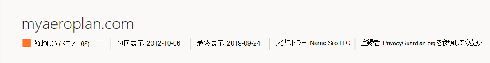

# チュートリアル: 脆弱性インテリジェンスの収集

## このチュートリアルでは、次の方法について説明します。

- Microsoft Defender 脅威インテリジェンス (Defender TI) の脅威インテリジェンス のホーム ページ機能について説明します
- 脆弱性インテリジェンスを収集するために、いくつかの種類のインジケーター検索を実行する

## 前提条件

- Azure Active Directory または個人用 Microsoft アカウント。 [アカウントにログインまたは作成する](https://signup.microsoft.com/)
- Microsoft Defender 脅威インテリジェンス (Defender TI) Premium ライセンス。

    > [!NOTE]
    > Defender TI Premium ライセンスを持たないユーザーは、Defender 脅威インテリジェンス ポータルにログインし、無料の Defender TI オファリングにアクセスできます。

## 免責事項

Microsoft Defender 脅威インテリジェンス (Defender TI) には、悪意のあるインフラストラクチャや敵対的脅威ツールを含む、ライブ、リアルタイムの観察、脅威インジケーターが含まれる場合があります。 Defender TI プラットフォーム内のすべての IP およびドメイン検索は、安全に検索できます。
Microsoft は、明確で現在の危険を引き起す実際の脅威と見なすべきオンライン リソース (IP アドレス、ドメイン名など) を共有します。
以下のチュートリアルを実行する場合、ユーザーは最善の判断を使用し、悪意のあるシステムと対話しながら不要なリスクを最小限に抑えるようお願いします。 Microsoft は、悪意のある IP アドレス、ホスト、ドメインを取り除き、リスクを最小限に抑えるために取り組んでいる点に注意してください。

## 開始する前に

上記の免責事項の状態として、疑わしいインジケーターと悪意のあるインジケーターは、安全性のために取り消されています。 Defender TI で検索する場合は、IP、ドメイン、ホストから角かっこを削除してください。 ブラウザーでこれらのインジケーターを直接検索しないでください。

## Defender TI の脅威インテリジェンス のホーム ページを開く

- [Defender 脅威インテリジェンス ポータル](https://ti.defender.microsoft.com/)にアクセスします。
- ポータルにアクセスするための Microsoft 認証を完了します。

## Defender TI の脅威インテリジェンスのホーム ページ機能について学習する

1. 検索バーのオプションを確認するには、検索バーを選択し、[すべて] ドロップダウン オプションをクリックします。

    

2. 脅威インテリジェンスのホーム ページで注目の記事と記事を確認します。

    

## 脆弱性インテリジェンスを収集するために、いくつかの種類のインジケーター検索を実行する

1. 'CVE-2020-1472' を検索し、関連する脆弱性に関する記事「CVE-2020-1472」と「FireEye の侵害の開示と対策に関連するコンポーネントとインジケーターへの RiskIQ の検出」を確認します。

    

2. 「FireEye の侵害の開示と対策に関連するコンポーネントとインジケーターへの RiskIQ 検出」の記事の公開インジケーターを確認します。

    

3. 検索 '173.234.155)脅威インテリジェンス検索バーの 208' IP アドレス。

      

4. 評価、アナリスト分析情報、記事、サービス、解決策、証明書、プロジェクト、ハッシュなど、返される [概要] タブの結果を確認します。

      ![チュートリアルの脆弱性 Intel Ip の [概要] タブ](media/tutorialVulnerabilityIntelIpSummaryTab.png)

5. [データ] タブに移動し、解像度、Whois、証明書、トラッカー、コンポーネント、Cookie、サービス、DNS、記事のデータとインテリジェンス データ セットを確認します。

    

    

6. [解像度] データ ブレードに戻り、'myaeroplan' でピボットします。com'.

    

7. [データ] タブに移動し、解像度、Whois、証明書、サブドメイン、トラッカー、コンポーネント、ハッシュ、Cookie、DNS、および逆引き DNS データ セットを確認します。

    

8. 手順 5 と手順 7 から、次の成果物をメモしておきます。

    |&nbsp;|&nbsp;|
    | --- | --- |
    | Whois Address | 1928 E. 高地 Ave. Ste F104 PMB# 255 |
    | Whois City | フェニックス |
    | Whois State | az |
    | Whois 郵便番号 | 85016 |
    | Whois Country | 米国 |
    | Whois Phone | 13478717726 |
    | Whois Nameserver | ns0.1984[.]is |
    | Whois Nameserver | ns1.1984]は |
    | Whois Nameserver | ns2.1984[.]is |
    | Whois Nameserver | ns1.1984hosting(Com |
    | Whois Nameserver | ns2.1984hosting(Com |
    | 証明書 Sha1 | [ead5b033ed4fd342261f389f0930aa7de1fba33d](https://ti.defender.microsoft.com/search/certificates?query=ead5b033ed4fd342261f389f0930aa7de1fba33d&field=sha1) |
    | 証明書のシリアル番号 | 236976486488328334603103229327145294996 |
    | 証明書発行者の共通名 | COMODO RSA ドメイン検証セキュリティで保護されたサーバー CA |
    | 証明書サブジェクトの共通名 | myaeroplan(Com |
    | 証明書サブジェクトの別名 | [myaeroplan(Com](https://ti.defender.microsoft.com/search/trackers/hosts?query=www.aeroplan.com&field=MarkOfTheWebSourceHost) |
    | 証明書サブジェクトの別名 | www.myaeroplan(Com |
    | トラッカーの種類 | MarkOfTheWebSourceHost |
    | トラッカーの値 | [www.aeroplan.com](https://ti.defender.microsoft.com/search/trackers/hosts?field=MarkOfTheWebSourceHost&query=www.aeroplan.com) |
    | コンポーネント名 + バージョン | [Apache (v2.4.29)](https://ti.defender.microsoft.com/search/components/hosts?category=Server&query=Apache&version=2.4.29) |
    | Cookie 名 | [PHPSESSID](https://ti.defender.microsoft.com/search/cookies/hosts?query=PHPSESSID&field=name) |
    | Cookie ドメイン | [myaeroplan(Com](https://ti.defender.microsoft.com/search/cookies/hosts?query=myaeroplan.com&field=domain) |
    | 脅威に関する記事 | [Points 人:Eroplan Frequent Flyer Program Credential Harvesting Campaign](https://ti.defender.microsoft.com/articles/99527909)|

9. 手順 8. のそれぞれの成果物検索を実行します。 注: Defender TI の脅威インテリジェンスのホーム ページ機能の詳細セクションで学習した検索オプションを参照する必要があります。

## リソースをクリーンアップする

このセクションでは、クリーンアップするリソースはありません。
