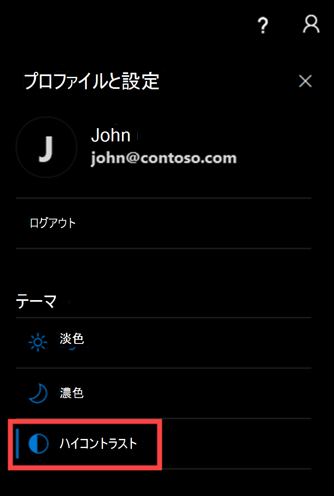

# クイック スタート: ポータルでMicrosoft Defender 脅威インテリジェンスにアクセスしてカスタマイズする方法について説明します

Microsoft Defender 脅威インテリジェンス (Defender TI) のポータルでテーマを調整する方法を理解すると、プラットフォームを使用するときに目が楽になります。 さらに、このガイドでは、強化のためのソースを有効にする方法について説明します。これにより、プラットフォームで検索を実行するときにより多くの結果を確認できます。 また、Defender TI のログインとログアウトに成功する方法についても説明します。

## 前提条件

- Azure Active Directory または個人用 Microsoft アカウント。 [アカウントにログインまたは作成する](https://signup.microsoft.com/)
- Microsoft Defender 脅威インテリジェンス (Defender TI) Premium ライセンス。

    > [!NOTE]
    > Defender TI Premium ライセンスを持たないユーザーは、Defender 脅威インテリジェンス ポータルにログインし、無料の Defender TI オファリングにアクセスできます。

## Defender TI の脅威インテリジェンス のホーム ページを開く

- [Defender 脅威インテリジェンス ポータル](https://ti.defender.microsoft.com/)にアクセスします。
- ポータルにアクセスするための Microsoft 認証を完了します。

## Defender TI の "プロファイルと設定" にアクセスしてテーマを調整する

1. Defender Threat Intelligence Portal の右上隅にある [プロファイルと設定] アイコンをクリックします。

    

2. [ダーク] テーマを選択します。 'Light' が既定のテーマである方法に注目してください。

    

3. 手順 1 を繰り返し、[ハイ コントラスト] テーマを選択します。

    

4. 手順 1 を繰り返し、[Light] テーマを選択します。

    

## Defender TI の [ヘルプ] アイコンにアクセスして、Defender TI Microsoft サポート リソースについて確認します

1. [プロファイルと設定] アイコンの左側にある右上隅にある [ヘルプ] アイコンをクリックします。

    

2. Defender TI Microsoft サポート リソースを確認します。

      - ここでは、Defender TI のサポートメール アドレスと、プライバシーに関する声明へのリンクを示します。

## Defender 脅威インテリジェンス ポータルのログアウトに Defender TI の "プロファイルと設定" にアクセスする

1. Defender Threat Intelligence Portal の右上隅にある [プロファイルと設定] アイコンをクリックします。

2. [ログアウト] を選択します。

    

## リソースをクリーンアップする
このセクションでは、クリーンアップするリソースはありません。

## 次の手順

詳細については、以下を参照してください。

['Microsoft Defender 脅威インテリジェンスとは (Defender TI)'](index.md)
