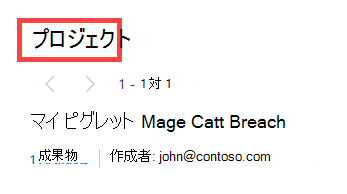

# 検索とピボット

Microsoft Defender 脅威インテリジェンス (Defender TI) には、調査プロセスを効率化するための堅牢で柔軟な検索エンジンが用意されています。 このプラットフォームは、ユーザーがさまざまなデータ ソースからさまざまなインジケーターをピボットできるように設計されており、異なるインフラストラクチャ間の関係をこれまで以上に簡単に検出できます。 この記事は、ユーザーが異なるデータ セット間で検索とピボットを実行して、異なるアーティファクト間のリレーションシップを検出する方法を理解するのに役立ちます。

## 前提条件

- Azure Active Directory または個人用 Microsoft アカウント。 [アカウントにログインまたは作成する](https://signup.microsoft.com/)
- Microsoft Defender 脅威インテリジェンス (Defender TI) Premium ライセンス。
    > [!Note]
    > Defender TI Premium ライセンスを持たないユーザーは、Defender 脅威インテリジェンス ポータルにログインし、無料の Defender TI オファリングにアクセスできます。

## Defender TI の脅威インテリジェンス のホーム ページを開く

1. [Defender 脅威インテリジェンス ポータル](https://defender.microsoft.com/)にアクセスします。
2. ポータルにアクセスするための Microsoft 認証を完了します。

## 脅威インテリジェンスの検索とピボットの実行

Defender TI の脅威インテリジェンス検索は、シンプルで強力な両方で、ユーザーがこれらの分析情報を構成するデータセットと直接対話できる一方で、すぐに重要な分析情報を表示するように設計されています。 検索バーでは、さまざまな入力がサポートされています。ユーザーは、アーティクル名またはプロジェクト名だけでなく、特定の成果物も検索できます。

### 成果物の種類を検索する
1. **IP address:** Search ‘195.161.141[.]65’ in the Threat Intelligence Search bar. このアクションにより、IP アドレスの検索が行われます。

    

2. **ドメイン：** 脅威インテリジェンス検索 `fabrikam.com` バーで検索します。 このアクションにより、ドメイン検索が実行されます。

    

3. **ホスト：** 脅威インテリジェンス検索 `canary.fabrikam.com` バーで検索します。 このアクションにより、ホスト検索が実行されます。

    

4. **キーワード：** 脅威インテリジェンス検索バーで 'apt29' を検索します。 このアクションにより、キーワード検索が実行されます。 キーワード検索には、用語、電子メール アドレスなど、あらゆる種類のキーワードが含まれます。キーワード検索では、アーティクル、プロジェクト、およびデータ セットとの関連付けが行われます。

    

5. **CVE-ID:** 脅威インテリジェンス検索バーで 'CVE-2021-40444' を検索します。 このアクションにより、CVE-ID キーワード検索が実行されます。

6. **記事：** 脅威インテリジェンス検索バーで、'2022 年第 1 四半期の Magecart の傾向&商品のスライディング' を検索します。 このアクションにより、アーティクル検索が実行されます。

    

7. **タグ：** [脅威インテリジェンス検索] ドロップダウンから [タグ] を選択し、脅威インテリジェンス検索バーの 「magecart」と入力します。 Enter キーを押すか、右矢印を選択して検索を実行します。 このアクションにより、タグ検索が実行されます。

    > [!NOTE]
    > これにより、そのタグ値を共有するアーティクルは返されません。

    

8. **コンポーネント：** [脅威インテリジェンス検索] ドロップダウンから [コンポーネント] を選択し、脅威インテリジェンス検索バーに「Cobalt strike」と入力します。 Enter キーを押すか、右矢印を選択して検索を実行します。 このアクションにより、コンポーネント検索が実行されます。

    

9. **追跡者：** 脅威インテリジェンス検索ドロップダウンから [トラッカー] を選択し、脅威インテリジェンス検索バーの [07d14d16d21d21d00042d41d0041d47e4e0ae17960b2a5b4fd6107fbb0926] と入力します。 Enter キーを押すか、右矢印を選択して検索を実行します。 このアクションにより、トラッカー検索が実行されます。 注: この例では、これは JarmHash Tracker 型でした。

    > [!NOTE]
    > この例では、これは JarmHash Tracker 型でした。

    

10. **WHOIS Email:** [脅威インテリジェンス検索] ドロップダウンから [WHOIS] > [Email] を選択し、脅威インテリジェンス検索バーの domains@microsoft.com を入力します。 Enter キーを押すか、右矢印を選択して検索を実行します。 このアクションにより、WHOIS Email検索が実行されます。

    

11. **WHOIS 名:** [脅威インテリジェンス検索] ドロップダウンから [WHOIS] > [名前] を選択し、脅威インテリジェンス検索バーで 「MSN Hostmaster」と入力します。 Enter キーを押すか、右矢印を選択して検索を実行します。 このアクションにより、WHOIS 名の検索が行われます。

    

12. **WHOIS 組織:** [脅威インテリジェンス検索] ドロップダウンから [WHOIS] > [組織] を選択し、脅威インテリジェンス検索バーの [Microsoft Corporation] に「Microsoft Corporation」と入力します。 Enter キーを押すか、右矢印を選択して検索を実行します。 このアクションにより、WHOIS 組織が検索されます。

    

13. **WHOIS アドレス:** [脅威インテリジェンス検索] ドロップダウンから [WHOIS] > [アドレス] を選択し、脅威インテリジェンス検索バーの [One Microsoft Way] に「One Microsoft Way」と入力します。 Enter キーを押すか、右矢印を選択して検索を実行します。 このアクションにより、WHOIS アドレス検索が実行されます。

    

14. **WHOIS City:** [脅威インテリジェンス検索] ドロップダウンから [WHOIS] > [City] を選択し、脅威インテリジェンス検索バーの [Redmond] に「Redmond」と入力します。 Enter キーを押すか、右矢印を選択して検索を実行します。 このアクションにより、WHOIS City 検索が実行されます。

    

15. **WHOIS 州:** [脅威インテリジェンス検索] ドロップダウンから [WHOIS] > [状態] を選択し、脅威インテリジェンス検索バーで 「WA」と入力します。 Enter キーを押すか、右矢印を選択して検索を実行します。 このアクションにより、WHOIS 状態検索が実行されます。

    

16. **WHOIS 郵便番号:** [脅威インテリジェンス検索] ドロップダウンから [WHOIS] > [郵便番号] を選択し、脅威インテリジェンス検索バーに「98052」と入力します。 Enter キーを押すか、右矢印を選択して検索を実行します。 このアクションにより、WHOIS 郵便番号の検索が行われます。

    

17. **WHOIS 国:** [脅威インテリジェンス検索] ドロップダウンから [WHOIS] > [国] を選択し、脅威インテリジェンス検索バーに「米国」と入力します。 Enter キーを押すか、右矢印を選択して検索を実行します。 このアクションにより、WHOIS 国の検索が行われます。

    

18. **WHOIS Phone:** [脅威インテリジェンス検索] ドロップダウンから [WHOIS] > [Phone] を選択し、脅威インテリジェンス検索バーの [+1.4258828080] に「+1.4258828080」と入力します。 Enter キーを押すか、右矢印を選択して検索を実行します。 このアクションにより、WHOIS Phone 検索が実行されます。

    

19. **WHOIS ネームサーバー:** [脅威インテリジェンス検索] ドロップダウンから [WHOIS] > [ネームサーバー] を選択し、脅威インテリジェンス検索バーに `ns1-03.azure-dns.com` 入力します。 Enter キーを押すか、右矢印を選択して検索を実行します。 このアクションにより、WHOIS ネームサーバー検索が実行されます。

    

20. **証明書 SHA-1:** [脅威インテリジェンス検索] ドロップダウンから [証明書] > [SHA-1] を選択し、脅威インテリジェンス検索バーの [35cd04a03ef86664623581cbd56e45ed07729678] と入力します。 Enter キーを押すか、右矢印を選択して検索を実行します。 このアクションにより、証明書 SHA-1 検索が実行されます。

    

21. **証明書のシリアル番号:** [脅威インテリジェンス検索] ドロップダウンから [証明書] > [シリアル番号] を選択し、脅威インテリジェンス検索バーの [1137354899731266880939192213383415094395905558] に「1137354899731266880939192213383415094395905558」と入力します。 Enter キーを押すか、右矢印を選択して検索を実行します。 このアクションにより、証明書シリアル番号の検索が行われます。

    

22. **証明書発行者の共通名:** [脅威インテリジェンス検索] ドロップダウンから [発行者の共通名] > [証明書] を選択し、脅威インテリジェンス検索バーの [Microsoft Azure TLS Issuing CA 05] に「Microsoft Azure TLS Issuing CA 05」と入力します。 Enter キーを押すか、右矢印を選択して検索を実行します。 このアクションにより、証明書発行者共通名の検索が行われます。

    

23. **証明書発行者の別名:** [脅威インテリジェンス検索] ドロップダウンから [発行者の別名] > [証明書] を選択し、脅威インテリジェンス検索バーに証明書発行者の別名を入力します。 Enter キーを押すか、右矢印を選択して検索を実行します。 このアクションにより、証明書発行者の別名検索が実行されます。

24. **証明書サブジェクトの共通名:** [脅威インテリジェンス検索] ドロップダウンから [証明書] > [サブジェクト共通名] を選択し、脅威インテリジェンス検索バーに `*.oneroute.microsoft.com` 入力します。 Enter キーを押すか、右矢印を選択して検索を実行します。 このアクションにより、証明書サブジェクト共通名の検索が行われます。

    

25. **証明書サブジェクトの別名:** [脅威インテリジェンス検索] ドロップダウンから [証明書] > [サブジェクトの別名] を選択し、脅威インテリジェンス検索バーに `oneroute.microsoft.com` 入力します。 Enter キーを押すか、右矢印を選択して検索を実行します。 このアクションにより、証明書サブジェクトの別名検索が実行されます。

    

26. **Cookie 名:** [脅威インテリジェンス検索] ドロップダウンから [Cookie] > [名前] を選択し、脅威インテリジェンス検索バーに「ARRAffinity」と入力します。 Enter キーを押すか、右矢印を選択して検索を実行します。 このアクションにより、Cookie 名の検索が行われます。

    

27. **Cookie ドメイン:** [脅威インテリジェンス検索] ドロップダウンから [Cookie] > [ドメイン] を選択し、脅威インテリジェンス検索バーに入力 `portal.fabrikam.com` します。 Enter キーを押すか、右矢印を選択して検索を実行します。 このアクションにより、Cookie ドメインの検索が行われます。

    

28. **ピボット：** 上記の手順で実行した検索には、ハイパーリンクを含むアーティファクトがあり、これらのインジケーターに関連付けられたさらに強化された結果を検出するためにピボットできます。 これを自分で自由に試してみてください。

## 検索結果

### 主な分析情報

ページの上部にあるプラットフォームは、成果物に関するいくつかの基本的な情報を提供します。 この情報には、成果物の種類に応じて、次の情報を含めることができます。  

- **国:** IP アドレスの横にあるフラグは、アーティファクトの配信元の国を示します。これは、評判やセキュリティ体制を判断するのに役立ちます。 この IP アドレスは、米国内のインフラストラクチャでホストされます。
- **評判:** この例では、IP アドレスに "悪意のある" タグが付けられます。これは、プラットフォームがこのアーティファクトと既知のアドバイザリ インフラストラクチャの間の接続を検出したことを示します。 アーティファクトには、"Suspicious"、"Neutral"、または "Unknown" というタグを付けることもできます。
- **最初に確認:** このタイムスタンプは、プラットフォームの検出システムによってアーティファクトが最初に観察されたタイミングを示します。 アーティファクトの有効期間を理解すると、その評判を判断するのに役立ちます。
- **最後に表示される:** このタイムスタンプは、プラットフォームの検出システムによってアーティファクトが最後に観察された日時を示します。 これは、アーティファクトがまだアクティブに使用されているかどうかを判断するのに役立ちます。
- **IP ブロック:** クエリ対象の IP アドレスアーティファクトを含む IP ブロック。
- **レジストラー:** クエリ対象のドメイン アーティファクトの WHOIS レコードに関連付けられているレジストラー。
- **Registrant:** アーティファクトの WHOIS データ内の登録者の名前。
- **ASN:** アーティファクトに関連付けられた ASN。
- **OS:** 成果物に関連付けられているオペレーティング システム。
- **ホスト:** 成果物のホスティング プロバイダー。 一部のホスティング プロバイダーは他のホスティング プロバイダーよりも評判が良いので、この値は成果物の有効性を示すのに役立ちます。

このセクションでは、成果物またはそれを含むプロジェクトに適用されるすべてのタグも示します。 ユーザーは、タグを追加したり、成果物をプロジェクトに追加したりすることもできます。

## [概要] タブ

### 概要

脅威インテリジェンス検索の結果は、[概要] と [データ] の 2 つのタブにグループ化されます。 [概要] タブには、プラットフォームが広範なデータセットから派生したアーティファクトに関する重要な分析情報が表示されます。 このセクションは、調査を開始するのに役立つ重要な結果を表示するように設計されています。

### 評価

Defender TI は、任意のホスト、ドメイン、または IP アドレスに対して独自の評判スコアを提供します。 既知のエンティティまたは不明なエンティティの評判を検証する場合でも、このスコアは、検出された悪意のあるインフラストラクチャや疑わしいインフラストラクチャとの関係をすばやく理解するのに役立ちます。 評判スコアは、0 ~ 100 の範囲の数値スコアとして表示されます。 スコアが "0" のエンティティには、疑わしいアクティビティや侵害の既知のインジケーターに対する既知の関連付けはありません。スコア "100" は、エンティティが悪意のあることを示します。 このプラットフォームでは、説明と重大度の評価を含むルールの一覧が提供されます。 次の例では、このドメインに適用できる 4 つの "重大度の高い" ルールが表示されます。

詳細については、「 [評判スコアリング」を](reputation-scoring.md)参照してください。

![[概要] タブの評価](media/summaryTabReputation.png)

### アナリストの分析情報

Analyst Insights セクションでは、調査の次の手順を決定するのに役立つ可能性があるアーティファクトに関する簡単な分析情報を提供します。 このセクションでは、アーティファクトに適用されるすべての分析情報と、追加の可視性に適用されない分析情報を一覧表示します。 次の例では、IP アドレスがルーティング可能であり、Web サーバーをホストし、過去 5 日以内にポートが開いていたことを迅速に判断できます。 さらに、システムにはトリガーされなかったルールが表示されます。これは、調査を開始するときに同様に役立ちます。

詳細については、「 [アナリスト分析情報」を](analyst-insights.md)参照してください。

### 記事

[アーティクル] セクションには、影響を受けるアーティファクトを最適に調査し、最終的に武装解除する方法に関する分析情報を提供する可能性がある記事が表示されます。 これらの記事は、既知の脅威アクターとそのインフラストラクチャの動作を調査し、他のユーザーが組織に対するリスクを軽減するのに役立つ重要な結果を示す研究者によって書かれています。 この例では、検索された IP アドレスは、記事内の結果に関連する IOC として識別されています。

詳細については、「[Microsoft Defender 脅威インテリジェンスとは (Defender TI)」](index.md)を参照してください。

![[概要] タブの記事](media/summaryTabArticles.png)

### サービス

このセクションでは、IP アドレスアーティファクトで実行されている検出されたサービスの一覧を示します。 これは、エンティティの意図した使用方法を理解しようとする場合に役立ちます。 悪意のあるインフラストラクチャを調査する場合、この情報はアーティファクトの機能を判断するのに役立ち、ユーザーはこの情報に基づいて組織を積極的に防御できます。

![[概要] タブ サービス](media/summaryTabServices.png)

### 解決策

解決策は、世界中に分散されたパッシブ センサーを使用してキャプチャされた個々の DNS レコードです。 これらの値は、ドメインまたは IP アドレスが時間の経過と共にインフラストラクチャを変更する方法の履歴を明らかにします。 これらは、追加のインフラストラクチャを検出し、接続のレベルに基づいてリスクを測定するために使用できます。 解決ごとに、解像度のライフサイクルを示す "最初に見た" タイムスタンプと "最後に見た" タイムスタンプが提供されます。

![[概要] タブの Re ソリューション](media/summaryTabResolutions.png)

### 証明書

SSL 証明書は、データのセキュリティ保護以外にも、ユーザーが異なるネットワーク インフラストラクチャに接続するための素晴らしい方法です。 SSL 証明書は、パッシブ DNS または WHOIS データが見逃す可能性がある接続を作成できます。 これは、潜在的な悪意のあるインフラストラクチャを関連付け、アクターの潜在的な運用セキュリティ障害を特定するより多くの方法を意味します。 SSL 証明書ごとに、証明書名、有効期限、サブジェクト共通名、サブジェクト組織名を指定します。

![[概要] タブの証明書](media/summaryTabCertificates.png)

### Projects

Defender TI プラットフォームを使用すると、ユーザーは調査から関心または侵害のインジケーターを整理するためのプロジェクトを作成できます。 また、可視性を向上させるために、接続アーティファクトを監視するプロジェクトも作成されます。 プロジェクトには、関連するすべての成果物の一覧と、名前、説明、コラボレーター、および監視プロファイルを保持する詳細な履歴が含まれています。

ユーザーが IP アドレス、ドメイン、またはホストを検索するときに、そのインジケーターがユーザーがアクセスできるプロジェクト内に一覧表示されている場合、ユーザーは [プロジェクト] タブを選択し、他のデータ セットを確認する前に、インジケーターに関する詳細なコンテキストをプロジェクトの詳細に移動して詳細を確認できます。

詳細については、「プロジェクトの [使用](using-projects.md)」を参照してください。

![[概要] タブ プロジェクト](media/summaryTabProjects.png)

### Hashes

Microsoft は、マルウェア データの商用およびオープンソースの複数のリポジトリと提携し、ハッシュ データ セットを設定するためのクエリインフラストラクチャと組み合わせています。 現在のマルウェア リポジトリには、Proofpoint の新たな脅威、ハイブリッド分析、VirusTotal が含まれています。 このデータは、ユーザーが攻撃者のアクターの機能、意図、および動機を理解するのに役立ち、同時にインフラストラクチャを相互に接続するのに役立ちます。 各結果には一意のハッシュが含まれています。 ハッシュ データには、検出ソース、サンプル、および収集日が含まれます。

![[概要] タブ ハッシュ](media/summaryTabHashes.png)

## [データ] タブ

### 概要

[データ] タブは、Defender TI プラットフォームによって観察される有形の接続についてユーザーが詳しく調べるのに役立ちます。 [概要] タブには重要な結果が表示され、成果物に関する即時のコンテキストが提供されますが、[データ] タブを使用すると、アナリストはこれらの接続をより細かく調査できます。 ユーザーは、返された任意の値をクリックして、関連するすべてのメタデータをピボットできます。

### データ型

Defender TI では、次のデータセットを使用できます。

- 解決策
- WHOIS
- 証明書
- トラッカー
- サブドメイン
- コンポーネント
- ホスト ペア
- Hashes
- Cookie
- サービス
- DNS
- DNS の逆引き

これらの個別のデータセットは、検索を送信した後、個別のタブに表示されます。 結果はクリック可能であり、ユーザーは関連するインフラストラクチャを迅速にピボットして、従来の調査方法で見逃された可能性のある分析情報を明らかにすることができます。

### 解決策

パッシブ DNS は、特定の場所、レコード、および時間枠の DNS 解決データを格納するレコードのシステムです。 この履歴解決データ セットを使用すると、IP アドレスに解決されたドメインとその逆をユーザーが表示できます。 このデータ セットを使用すると、ドメインまたは IP の重複に基づく時間ベースの関連付けができます。

PDNS を使用すると、以前に不明な、または新しく立ち上がった脅威アクター インフラストラクチャを識別できます。 ブロックリストにインジケーターをプロアクティブに追加すると、キャンペーンが行われる前に通信パスを遮断できます。 [解像度] データ セット タブ内にレコード解決データが表示され、[DNS データ セット] タブにさらに種類の DNS レコードが表示されます。

PDNS 解決データには、次のものが含まれます。
- **解決:** 解決するエンティティの名前 (IP アドレスまたはドメイン)
- **場所:** IP アドレスがホストされている場所。
- **ネットワーク:** IP アドレスに関連付けられているネットブロックまたはサブネット。
- **ASN:** 自律システム番号と組織名
- **最初に確認:** この解決を最初に観察した日付を表示するタイムスタンプ。
- **最終表示:** この解決を最後に観察した日付を表示するタイムスタンプ。
- **ソース:** リレーションシップの検出を有効にしたソース。
- **タグ:** Defender TI システムでこのアーティファクトに適用されたすべてのタグ。

### WHOIS

WHOIS は、だれでもドメイン、IP アドレス、またはサブネットの所有権に関する情報を照会できるプロトコルです。 脅威インフラストラクチャの研究における WHOIS の最も一般的な機能の 1 つは、WHOIS レコード内で共有される一意のデータに基づいて、異なるエンティティを識別または接続することです。

各 WHOIS レコードには複数の異なるセクションがあり、すべて異なる情報を含めることができる場合があります。 一般的に見られるセクションには、"レジストラー"、"登録者"、"管理者"、"技術" が含まれており、それぞれがレコードの異なる連絡先に対応している可能性があります。 多くの場合、このデータはセクション間で重複しますが、場合によっては、特にアクターが間違いを犯した場合、わずかな不一致が発生する可能性があります。 Defender TI 内で WHOIS 情報を表示すると、データを重複除去し、データのどの部分から取得したかを示す要約されたレコードが表示されます。

ユーザーは、過去の WHOIS レコードを表示して、登録データが時間の経過と共にどのように変化したかを理解することもできます。

WHOIS データには、次のものが含まれます。

- **更新されたレコード:** WHOIS レコードが最後に更新された日を示すタイムスタンプ。
- **最終スキャン:** Defender TI システムがレコードを最後にスキャンした日付。
- **有効期限:** 登録の有効期限 (使用可能な場合)。
- **作成済み:** 現在の WHOIS レコードの年齢。
- **WHOIS Server:** サーバーは ICANN 認定レジストラーによって設定され、その中に登録されているドメインに関する最新の情報を取得します。
- **レジストラー:** アーティファクトの登録に使用されるレジストラー サービス。
- **ドメインの状態:** ドメインの現在の状態。 "アクティブ" ドメインはインターネット上に存在します。
- **Email:** WHOIS レコードに含まれるすべての電子メール アドレスと、それぞれの連絡先の種類が関連付けられている (管理者、技術など)。
- **名前:** レコード内の連絡先の名前と、それぞれの連絡先の種類が関連付けられます。
- **組織:** レコード内の任意の組織の名前と、それぞれの連絡先の種類が関連付けられます。
- **番地:** レコードに関連付けられている任意の住所と、関連付けられている連絡先の種類。
- **市区町村:** レコードに関連付けられている住所に記載されているすべての都市と、関連付けられている連絡先の種類。
- **状態:** レコードに関連付けられているアドレスに一覧表示されているすべての状態と、関連付けられている連絡先の種類。
- **郵便番号:** レコードに関連付けられている住所に記載されているすべての郵便番号と、関連付けられている連絡先の種類。
- **国:** レコードに関連付けられている住所に記載されているすべての国、および関連付けられている連絡先の種類。
- **電話番号:** レコードに一覧表示されている電話番号と、関連付けられている連絡先の種類。
- **ネーム サーバー:** 登録済みエンティティに関連付けられているすべてのネーム サーバー。

### 証明書

SSL 証明書は、データのセキュリティ保護以外にも、ユーザーが異なるネットワーク インフラストラクチャに接続するための素晴らしい方法です。 最新のスキャン手法を使用すると、インターネット上のすべてのノードに対して数時間でデータ要求を実行できます。つまり、証明書を定期的にホストしている IP アドレスに簡単に関連付けることができます。

WHOIS レコードと同様に、SSL 証明書では、最終的な製品を生成するためにユーザーから情報を提供する必要があります。 ドメインとは別に、SSL 証明書は (自己署名がない限り) 作成されます。追加情報は、ユーザーが作成できます。 ユーザーが SSL 証明書から最も価値を得られるのは、証明書の生成時に誰かが使用できる一意のデータではなく、ホストされている場所であるとは限りません。

SSL 証明書の価値を高めるのは、パッシブ DNS または WHOIS データが見逃す可能性がある接続を作成できるということです。 これは、潜在的な悪意のあるインフラストラクチャを関連付け、アクターの潜在的な運用セキュリティ障害を特定するより多くの方法を意味します。 Microsoft は、2013 年から現在までの 3,000 万件を超える証明書を収集し、証明書の内容と履歴を関連付けるツールをユーザーに提供しています。

証明書データには、次のものが含まれます。

- **Sha1:** SSL 証明書資産の SHA1 アルゴリズム ハッシュ。
- **最初に確認:** アーティファクトでこの証明書を最初に観察した日付を表示するタイムスタンプ。
- **最終表示:** アーティファクトでこの証明書を最後に観察した日付を表示するタイムスタンプ。
- **インフラストラクチャ:** 証明書に関連付けられているすべての関連インフラストラクチャ。

![[データ] タブの証明書の一覧](media/dataTabCertificatesList.png)

ユーザーが Sha1 ハッシュをクリックすると、ユーザーは右側のウィンドウに証明書に関する詳細を表示できます。これには次のものが含まれます。

- **シリアル番号:** SSL 証明書に関連付けられているシリアル番号。
- **発行：** 証明書が発行された日付。
- **有効 期限：** 証明書の有効期限が切れる日付。
- **サブジェクト共通名:** 関連付けられている SSL 証明書のサブジェクト共通名。
- **発行者共通名:** 関連付けられている SSL 証明書の発行者共通名。
- **サブジェクトの別名:** SSL 証明書の代替共通名。
- **発行者の別名:** 発行者の追加名。
- **サブジェクト組織名:** SSL 証明書の登録にリンクされている組織。
- **発行者組織名:** 証明書の問題を調整した組織の名前。
- **SSL バージョン:** 証明書が登録された SSL のバージョン。
- **サブジェクト組織単位:** 証明書を担当する組織内の部署を示す省略可能なメタデータ。
- **発行者組織単位:** 証明書を発行する組織に関する追加情報。
- **件名住所:** 組織が配置されている住所。
- **発行者の住所:** 発行者組織が配置されている住所。
- **サブジェクトのロケール:** 組織が配置されている都市。
- **発行者のロケール:** 発行者組織が配置されている都市。
- **サブジェクトの州/州:** 組織が配置されている州または都道府県。
- **発行者の州/州:** 発行者組織が配置されている州または都道府県。
- **サブジェクトの国:** 組織が配置されている国。
- **発行者の国:** 発行者組織が存在する国。
- **関連インフラストラクチャ:** 証明書に関連付けられているすべての関連インフラストラクチャ。

![[データ] タブの証明書の詳細](media/dataTabCertificateDetails.png)

### サブドメイン

サブドメインは、プライマリ ドメインの一部であるインターネット ドメインです。 サブドメインは"ホスト" とも呼ばれます。 例として、. `docs.microsoft.com` `microsoft.com` サブドメインごとに、ドメインの解決先となる新しい IP アドレスのセットが存在する可能性があります。これは、関連するインフラストラクチャを検索するための優れたデータ ソースになる可能性があります。

サブドメイン データには、次のものが含まれます。

- **ホスト名:** 検索されたドメインに関連付けられているサブドメイン。
- **タグ:** Defender TI システムでこのアーティファクトに適用されたすべてのタグ。

![[データ] タブのサブドメイン](media/dataTabSubdomains.png)

### トラッカー

トラッカーは、Web ページ内で見つかった一意のコードまたは値であり、多くの場合、ユーザーの操作を追跡するために使用されます。 これらのコードは、異なる Web サイト のグループを中央エンティティに関連付けるために使用できます。 多くの場合、アクターは、フィッシング キャンペーンの偽装を探している被害者の Web サイトのソース コードをコピーします。 ユーザーが Trackers データ セットを使用してこれらの不正なサイトを識別できるこれらの ID を削除する時間を取ることはめったにありません。

Microsoft の Tracker データ セットには、Google、Yandex、Mixpanel、New Relic、Clicky などのプロバイダーからの ID が含まれており、定期的に増加し続けています。

トラッカー データには、次のものが含まれます。

- **ホスト名:** トラッカーが検出されたインフラストラクチャをホストするホスト名。
- **最初に確認:** アーティファクトでこのトラッカーを最初に観察した日付を表示するタイムスタンプ。
- **最後に見た:** アーティファクトでこのトラッカーを最後に観察した日付を表示するタイムスタンプ。
- **型:** 検出されたトラッカーの種類 (GoogleAnalyticsID、JarmHash など)。
- **値:** トラッカーの識別値。
- **タグ:** Defender TI システムでこのアーティファクトに適用されたすべてのタグ。

### コンポーネント

Web コンポーネントは、Web クロールまたはスキャンを実行する Microsoft から収集された Web ページまたはサーバー インフラストラクチャを説明する詳細です。 これらのコンポーネントを使用すると、ユーザーは Web ページの構成、または特定のインフラストラクチャを推進するテクノロジとサービスを理解できます。

一意のコンポーネントをピボットすると、侵害されたアクターのインフラストラクチャやその他のサイトを見つけることができます。 ユーザーは、Web サイトが実行されているテクノロジに基づいて、特定の攻撃や侵害に対して脆弱である可能性があるかどうかを理解することもできます。

コンポーネント データには、次のものが含まれます。

- **ホスト名:** コンポーネントが検出されたインフラストラクチャをホストするホスト名。
- **最初に見た:** アーティファクトでこのコンポーネントを最初に観察した日付のタイムスタンプ。
- **最後に見た:** アーティファクトでこのコンポーネントを最後に観察した日付のタイムスタンプ。
- **カテゴリ:** 検出されたコンポーネントの種類 (オペレーティング システム、Framework、リモート アクセス、サーバーなど)。
- **名前とバージョン:** コンポーネント名と成果物で実行されているバージョン (Microsoft IIS (v8.5 など)。
- **タグ:** Defender TI システムでこのアーティファクトに適用されたすべてのタグ。

![[データ] タブコンポーネント](media/dataTabComponents.png)

### ホストペア

ホスト ペアは、Microsoft の仮想ユーザーの Web クロールから観察された接続を共有する 2 つのインフラストラクチャ (親と子) です。 接続の範囲は、最上位レベルのリダイレクト (HTTP 302) から、iframe やスクリプト ソース参照などのより複雑なものまでです。

ホスト ペア データには、次のものが含まれます。

- **親ホスト名:** リダイレクトまたはその他の方法で子ホスト名に接続するホスト名。
- **子ホスト名:** 親ホスト名に接続するホスト名。 この値は、リダイレクトまたはその他のより複雑な接続の結果です。
- **最初に見た:** アーティファクトに対するこのホスト ペア関係を最初に観察した日付。
- **最後に表示** された日付: アーティファクトに対するこのホスト ペア関係を最後に観察した日付。
- **原因:** 親ホスト名と子ホスト名の間の接続の種類。 潜在的な原因としては、リダイレクト、img.src、css.import、script.src 接続などがあります。
- **タグ:** Defender TI システムでこのアーティファクトに適用されたすべてのタグ。

### Hashes

Microsoft は、マルウェア データの商用およびオープンソースの複数のリポジトリと提携し、ハッシュ データ セットを設定するためのクエリインフラストラクチャと組み合わせています。 現在のマルウェア リポジトリには、Proofpoint の新たな脅威、ハイブリッド分析、VirusTotal が含まれています。 このデータは、ユーザーが攻撃者のアクターの機能、意図、および動機を理解するのに役立ち、同時にインフラストラクチャを相互に接続するのに役立ちます。 各結果には一意のハッシュが含まれています。

ハッシュ データには、次のものが含まれます。

1. **ソース:** ハッシュの検出に使用されるソース。
2. **サンプル:** 検出されたハッシュの一意の識別コード。
3. **収集日:** 指定されたソースによってハッシュ サンプルが収集された日。

### Cookie

Cookie は、ユーザーがインターネットを閲覧すると、サーバーからクライアントに送信される小さなデータです。 これらの値には、アプリケーションまたは追跡データのビット数の状態が含まれる場合があります。 Web サイトのクロール時に観察された Cookie 名を強調表示してインデックスを作成し、ユーザーがクロールとデータ収集全体でシステムが特定の Cookie 名を観察したあらゆる場所を掘り下げることができるようにします。

Cookie データには、次のものが含まれます。

- **ホスト名:** Cookie に関連付けられているホスト インフラストラクチャ。
- **最初に見た:** アーティファクトでこの Cookie を最初に観察した日付のタイムスタンプ。
- **最後に見た:** アーティファクトでこの Cookie を最後に観察した日付のタイムスタンプ。
- **名前:** Cookie の名前 (JSESSIONID、SEARCH_NAMESITEなど)。
- **ドメイン:** Cookie に関連付けられているドメイン。
- **タグ:** Defender TI システムでこのアーティファクトに適用されたすべてのタグ。

### サービス
サービス名とポート番号は、TCP、UDP、DCCP、SCTP などのトランスポート プロトコルで実行されるさまざまなサービスを区別するために使用されます。 ポート番号は、特定のポートで実行されているアプリケーションの種類を示すことができます。 ただし、アプリケーションまたはサービスを変更して、別のポートを使用して、IP アドレス上のサービスまたはアプリケーションを難読化または非表示にすることができます。 ポートとヘッダー/バナーの情報を知ることで、実際のアプリケーション/サービスと、使用されているポートの組み合わせを識別できます。 Defender TI は、[サービス] タブ内に 14 日間の履歴を表示し、観察されたポートに関連付けられた最後のバナー応答を表示します。

Microsoft のサービス データには、次のものが含まれます。

- 監視されるポートを開く
- ポート番号
- コンポーネント
- サービスが観察された回数
- ポートが最後にスキャンされたとき
- プロトコル接続
- ポートの状態
   - 開く
   - Filtered
   - クローズ
- バナーの応答

### DNS

Microsoft は長年にわたって DNS レコードを収集し、メール交換 (MX) レコード、ネームサーバー (NS) レコード、テキスト (TXT) レコード、権限の開始 (SOA) レコード、正規名 (CNAME) レコード、ポインター (PTR) レコードに関する分析情報をユーザーに提供してきました。 DNS レコードを確認すると、所有しているドメイン全体でアクターが使用する共有インフラストラクチャを特定するのに役立ちます。 たとえば、アクター グループは、同じネームサーバーを使用してインフラストラクチャをセグメント化したり、同じメール交換サーバーを使用してコマンドと制御を管理したりする傾向があります。 

DNS データには、次のものが含まれます。

- **値:** DNS レコードの値。
- **最初に確認:** アーティファクトでこのレコードを最初に観察した日付のタイムスタンプ。
- **[最後に表示]:** アーティファクトでこのレコードを最後に観察した日付のタイムスタンプ。
- **型:** レコードに関連付けられているインフラストラクチャの種類。 潜在的なオプションには、メール サーバー (MX)、テキスト ファイル (TXT)、ネーム サーバー (NS)、CNAMES、および Authority の開始 (SOA) レコードが含まれます。
- **タグ:** Defender TI システムでこのアーティファクトに適用されたすべてのタグ。

![[データ] タブの DNS](media/dataTabDNS.png)

### DNS の逆引き

前方 DNS 参照は特定のホスト名の IP アドレスに対してクエリを実行しますが、逆引き DNS 参照は IP アドレスの特定のホスト名に対してクエリを実行します。 このデータセットは、同等の結果を DNS データセットとして表示します。 DNS レコードを確認すると、所有しているドメイン全体でアクターが使用する共有インフラストラクチャを特定するのに役立ちます。 たとえば、アクター グループは、同じネームサーバーを使用してインフラストラクチャをセグメント化したり、同じメール交換サーバーを使用してコマンドと制御を管理したりする傾向があります。

逆引き DNS データには、次のものが含まれます。

- **値:** 逆引き DNS レコードの値。
- **最初に確認:** アーティファクトでこのレコードを最初に観察した日付のタイムスタンプ。
- **[最後に表示]:** アーティファクトでこのレコードを最後に観察した日付のタイムスタンプ。
- **型:** レコードに関連付けられているインフラストラクチャの種類。 潜在的なオプションには、メール サーバー (MX)、テキスト ファイル (TXT)、ネーム サーバー (NS)、CNAMES、および Authority の開始 (SOA) レコードが含まれます。
- **タグ:** Defender TI システムでこのアーティファクトに適用されたすべてのタグ。

![[データ] タブの逆引き DNS](media/dataTabReverseDNS.png)

### インテリジェンス

インテリジェンス セクションでは、記事を通じてリサーチ チームから派生した場合でも、プロジェクトを介して独自のチームから派生した場合でも、Defender TI プラットフォームでキュレーションされた分析情報が強調表示されます。 [インテリジェンス] セクションは、ユーザーがクエリされたアーティファクトの背後にある重要な追加コンテキストを理解するのに役立ちます。アナリストは、大規模なセキュリティ コミュニティの調査の取り組みから学び、独自の分析を開始できます。

### 記事

[アーティクル] セクションには、影響を受けるアーティファクトを最適に調査し、最終的に武装解除する方法に関する分析情報を提供する可能性がある記事が表示されます。 これらの記事は、既知の脅威アクターとそのインフラストラクチャの動作を調査し、他のユーザーが組織に対するリスクを軽減するのに役立つ重要な結果を示す研究者によって書かれています。 この例では、検索された IP アドレスは、記事内の結果に関連する IOC として識別されています。

詳細については、「[Microsoft Defender 脅威インテリジェンスとは (Defender TI)」](index.md)を参照してください。

### Projects

インフラストラクチャ分析の主要な副産物の 1 つは、ほとんどの場合、脅威アクターまたはアクターのグループに結び付ける一連のインジケーターです。 これらのインジケーターは、攻撃キャンペーンを開始するときに脅威のアクターを識別する方法として機能します。 脅威アクターの動作に関する敵対者の戦術、手法、および手順 (TMP) に関する分析情報を開発する。 プロジェクトは、TTP によって敵対者を識別し、敵対者のインフラストラクチャが時間の経過と共にどのように変化しているかを追跡する方法を提供します。

ユーザーが Defender TI で IP アドレス、ドメイン、またはホストを検索するときに、そのインジケーターがユーザーがアクセス権を持つプロジェクト内に表示されている場合、ユーザーはインテリジェンス セクション内の [プロジェクト] ブレードを選択し、他のデータ セットを確認する前に、インジケーターに関するより詳細なコンテキストを得るためにプロジェクトの詳細に移動できます。

プロジェクトの詳細にアクセスすると、関連するすべての成果物の一覧と、上記のすべてのコンテキストを保持する詳細な履歴が表示されます。 同じ組織内のユーザーは、通信に時間を費やす必要がなくなりました。 脅威アクター プロファイルは Defender TI 内に構築でき、"生きた" インジケーター セットとして機能します。 新しい情報が検出または検出されると、そのプロジェクトに追加できます。

Defender TI プラットフォームを使用すると、ユーザーは、関心のあるインジケーターと調査からの侵害のインジケーターを整理するための複数のプロジェクトの種類を開発できます。

詳細については、「プロジェクトの [使用](using-projects.md)」を参照してください。

## 次の手順

詳細については、以下を参照してください。

- [データの並べ替え、フィルター処理、ダウンロード](sorting-filtering-and-downloading-data.md)
- [データ セット](data-sets.md)
- [評判スコアリング](reputation-scoring.md)
- [アナリストの分析情報](analyst-insights.md)
- [Microsoft Defender 脅威インテリジェンス (Defender TI) とは?](index.md)
- [プロジェクトの使用](using-projects.md)
