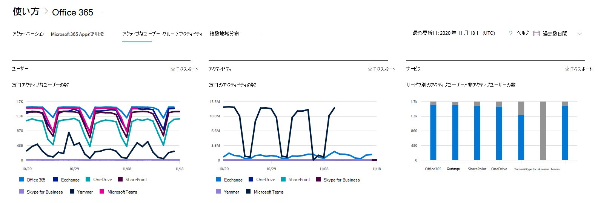

# アクティブ ユーザー レポートMicrosoft 365評価する

Microsoft 365 の [レポート] ダッシュボードには、組織内での製品全体に関するアクティビティが表示されます。 これにより、個別の製品レベルのレポートを詳細に確認して、各製品内のアクティビティについてより詳しく知ることができます。 [レポートの概要に関するトピック](activity-reports.md)を参照してください。
  
たとえば、[ **アクティブなユーザー**] レポートを使用すれば、組織の個人が使用する製品のライセンス数を調べたり、どのユーザーがどのライセンスを使用しているかに関する情報を確認したりできます。このレポートは、監理者が十分に活用されていない製品や追加のトレーニングまたは情報を必要としているユーザーを特定するのに役立ちます。 

## [アクティブなユーザー] レポートにアクセスする方法

1. 管理センターで、[**レポート**] \> [<a href="https://go.microsoft.com/fwlink/p/?linkid=2074756" target="_blank">使用状況</a>] ページの順に移動します。 
2. ダッシュボードのホームページで、[アクティブ なユーザー] - [**サービス] カード** の [Microsoft 365] ボタンをクリックします。

## [アクティブなユーザー] レポートの解釈

[アクティブユーザー] タブを選択すると、Office 365レポートでアクティブな **ユーザーを表示** できます。 

- [ アクティブなユーザー] レポートでは、過去 7 日間、30 日間、90 日間、または 180 日間の傾向を確認できます。 ただし、レポートで特定の日を表示すると、現在の日付から最大 28 日間のデータが表示されます (レポートが生成された日付ではありません)。

- 各レポートのデータは、通常、過去 24 - 48 時間まで表示されます。

- [ユーザー] グラフには、製品で区切られたレポート期間の毎日のアクティブ ユーザーが表示されます。
[アクティビティ] グラフには、製品で区切られたレポート期間の毎日のアクティビティ数が表示されます。
[ サービス] グラフには、アクティビティの種類とサービス別にユーザー数が表示されます。

- [ユーザー] グラフでは、x 軸に選択したレポート期間が表示され、y 軸にはライセンスの種類別に区切られた日次アクティブ ユーザーと色分けが表示されます。
[アクティビティ] グラフでは、x 軸に選択したレポート期間が表示され、y 軸には、ライセンスの種類別に区切られた日次アクティビティ数と色分けが表示されます。
[ サービス] アクティビティ グラフでは、x 軸にユーザーが特定の期間使用できる個々のサービスが表示されます。y 軸は、アクティビティの状態別のユーザー数です。アクティビティの状態に基づいて色分けされています。    

- 凡例の項目を選択して、グラフに表示する系列をフィルター処理できます。 この選択を変更しても、グリッド テーブルの情報は変更されません。

- [エクスポート] リンクを選択して、レポート データをExcel .csvファイルにエクスポートできます。 これにより、すべてのユーザーのデータがエクスポートされ、単純な並べ替えとフィルター処理を行ってさらに分析することができます。 ユーザー数が 2000 未満である場合は、レポート自体のテーブル内で並べ替えとフィルター処理を行うことができます。 ユーザー数が 2000 を超える場合は、フィルター処理と並べ替えを行うために、データをエクスポートする必要があります。

- 列のコントロールでグリッド テーブルに表示される情報を変更できます。
サブスクリプションが 21Vianet によって運用されている場合は、サブスクリプションが表示Yammer。

組織のポリシーにより、ユーザー情報を特定できるレポートを表示できない場合は、これらすべてのレポートのプライバシー設定を変更できます。 [アクティビティ レポート **] の** [ユーザー レベルの詳細を非表示にする方法] セクション [をMicrosoft 365 管理センター](activity-reports.md)。  
