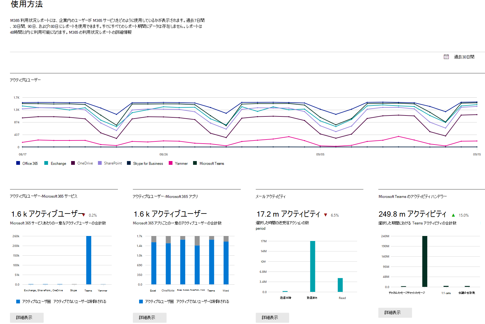

# 管理センターの Microsoft 365 レポート

ユーザーが仕事でどのように Microsoft 365 サービスを使用しているかを簡単に確認できます。たとえば、サービスをかなり使用しているためにクォータに近づいているユーザーや、Microsoft 365 ライセンスをまったく必要としない可能性があるユーザーを、特定することができます。永続的ライセンス モデルがレポートに含まれます。 
  
過去 7 日、30 日、90 日、180 日間のレポートを利用できます。すべてのレポート期間のデータが最初から存在するわけではありません。レポートは、48 時間以内に使用できるようになります。
  
## 動画: Office 365 の使用状況レポートでの操作
  
> [!VIDEO https://www.microsoft.com/videoplayer/embed/fb726f8e-aead-43b2-ba0f-53ba5b886bf7?autoplay=false]
  
## レポート ダッシュボードに移動する方法

::: moniker range="o365-worldwide"

1. 管理センターで、[**レポート**] \> [<a href="https://go.microsoft.com/fwlink/p/?linkid=2074756" target="_blank">使用状況</a>] ページの順に移動します。

::: moniker-end

::: moniker range="o365-germany"

1. <a href="https://go.microsoft.com/fwlink/p/?linkid=848041" target="_blank">管理センター</a>で、[**レポート**] \> [**使用状況**] ページの順に移動します。

::: moniker-end

::: moniker range="o365-21vianet"

1. <a href="https://go.microsoft.com/fwlink/p/?linkid=850627" target="_blank">管理センター</a>で、[**レポート**] \> [**使用状況**] ページの順に移動します。

::: moniker-end

2. レポートの詳細ページを表示するには、サービス (メール、OneDrive など) の概要アクティビティ カードから [**その他を表示**] ボタンをクリックします。 サービスに関するさまざまなレポートがタブに表示されます。   

## レポートを閲覧できるユーザー

次の権限を持っているユーザー:
  
- グローバル管理者: このロールを持つのは、社内の少数のユーザーのみにすることをお勧めします。それにより業務上のリスクが軽減されます。
    
- Exchange の管理者
    
- SharePoint の管理者
    
- Skype for Business の管理者

- グローバル閲覧者
    
- レポート閲覧者

- Teams サービス管理者

- Teams 通信管理者
    
詳しくは、「[管理者ロールについて](../add-users/about-admin-roles.md)」および「[管理者ロールを割り当てる](../add-users/assign-admin-roles.md)」をご覧ください。
  
## 管理センターで利用可能なアクティビティ レポート

サブスクリプションに応じて、以下のレポートを利用できます。

- [Microsoft ブラウザーの使用法](browser-usage-report.md) 
  
- [メール アクティビティ](email-activity-ww.md)
    
- [メールボックス使用状況](mailbox-usage.md)
    
- [Office ライセンス認証数](microsoft-office-activations-ww.md)

- [アクティブなユーザー](active-users-ww.md)
  
- [メール アプリの利用状況](email-apps-usage-ww.md)

- [フォームのアクティビティ](forms-activity-ww.md)

- [Dynamics 365 顧客音声アクティビティ](forms-pro-activity-ww.md)

- [Microsoft 365 グループ](office-365-groups-ww.md)
  
- [OneDrive for Business のユーザー アクティビティ](onedrive-for-business-activity-ww.md)

- [OneDrive for Business の利用状況](onedrive-for-business-usage-ww.md)

- [Microsoft 365 Apps の使用法](microsoft365-apps-usage-ww.md)
  
- [SharePoint サイトの利用状況](sharepoint-site-usage-ww.md)
  
- [SharePoint のアクティビティ](sharepoint-activity-ww.md)
  
- [Skype for Business Online のアクティビティ](/SkypeForBusiness/skype-for-business-online-reporting/activity-report)
  
- [Skype for Business Online の電話会議開催者のアクティビティ](/SkypeForBusiness/skype-for-business-online-reporting/conference-organizer-activity-report)
  
- [Skype for Business Online の電話会議参加者のアクティビティ](/SkypeForBusiness/skype-for-business-online-reporting/conference-participant-activity-report)
  
- [Skype for Business Online のピアツーピア アクティビティ](/SkypeForBusiness/skype-for-business-online-reporting/peer-to-peer-activity-report)

- [Yammer アクティビティ](yammer-activity-report-ww.md)

- [Yammer デバイスの使用状況](yammer-device-usage-report-ww.md)

- [Yammer のグループ アクティビティ レポート](yammer-groups-activity-report-ww.md)

- [Microsoft Teams ユーザー アクティビティ](microsoft-teams-user-activity-preview.md)

- [Microsoft Teams デバイスの利用状況](microsoft-teams-device-usage-preview.md)

## ライセンス情報を表示する方法

- 割り当て済みおよび未割り当てのライセンスの数を表示するには、管理センターで、[**課金**] \> [<a href="https://go.microsoft.com/fwlink/p/?linkid=842264" target="_blank">ライセンス</a>] の順に移動します。 
    
- ライセンスのあるユーザー、ライセンスのないユーザー、またはゲストを表示するには、管理センターで、[**ユーザー**] \> [<a href="https://go.microsoft.com/fwlink/p/?linkid=834822" target="_blank">アクティブなユーザー</a>] の順に選択します。 
  
## 特定のユーザーの使用状況の情報を表示する方法

特定のユーザーがどの程度サービスを使用しているかを調べるには、サービス レポートを使います。たとえば、特定のユーザーが使っているメールボックス記憶域の量を確認するには、メールボックスの利用状況レポートを開き、ユーザーを名前で並べ替えます。ユーザーが何千人もいる場合は、レポートを Excel にエクスポートすると、一覧をすばやくフィルター処理できます。
  
ユーザーのアカウントを入力してから、ユーザーが使っているサービスとその使用量の一覧を取得すると、レポートを生成できません。

時には新しいユーザーが **不明** と表示される場合もあります。 これは、通常、ユーザー プロファイルの作成がときどき遅延するためです。  
  
## レポートでユーザーの詳細を非表示にする

レポートを生成するときに、ユーザー レベルの情報を非表示にする場合は、管理センターで簡単に変更することができます。
  
1. 管理センターで、 [**設定**] \> [<a href="https://go.microsoft.com/fwlink/p/?linkid=2053743" target="_blank">サービス&amp;アドイン</a>] ページの順に移動します。

2. [**レポート**] を選択します。 
  
3. [**レポート**] ウィンドウで、必要なオプションを選択し、変更を保存します。
  
ユーザー リストは次のように表示されます。
  

  
レポート ダッシュボードのレポートで変更が有効になるまで数分かかります。この設定は、レポートの API にも適用されます。
  
## ユーザー アカウントが削除されたとき、使用状況データはどうなりますか?

ユーザーのアカウントを削除すると、そのユーザーの使用状況データは 30 日以内に削除されます。 そのユーザーは、有効だった期間の [アクティビティ] グラフの合計 (番号 1 を参照) に含まれますが、ユーザーの詳細テーブル (番号 2 を参照) には表示されません。
  
ただし、現在の日付から最大 28 日間の特定の日 (番号 3 を参照) を選択すると、その日のユーザーの使用状況が [ユーザーの詳細] テーブル (番号 2を参照) に表示されます。
  
## 関連コンテンツ

[セキュリティ &amp;コンプライアンス センターのレポート](../../compliance/reports-in-security-and-compliance.md) (記事)\
[Microsoft 365 利用状況分析](../usage-analytics/usage-analytics.md) (記事)
[Microsoft 365 利用状況分析をカスタマイズする](../usage-analytics/customize-reports.md) (記事)
