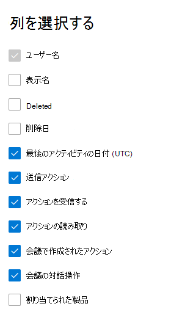

# Microsoft 365管理センターの [レポート] - メール アクティビティ

Microsoft 365 の [レポート] ダッシュボードには、組織内での製品全体に関するアクティビティが表示されます。 これにより、個別の製品レベルのレポートを詳細に確認して、各製品内のアクティビティについてより詳しく知ることができます。 [レポートの概要に関するトピック](activity-reports.md)を参照してください。
  
たとえば、[レポート] ページで組織内のメール トラフィックの概要ビューを表示し、そこから [メール アクティビティ] ウィジェットに移って組織内のメール アクティビティの傾向とユーザーごとの詳細を把握できます。

## メール アクティビティ レポートを表示する方法

1. 管理センターで、[**レポート**] \> [<a href="https://go.microsoft.com/fwlink/p/?linkid=2074756" target="_blank">使用状況</a>] ページの順に移動します。
2. [メール **アクティビティ] で [詳細** を表示 **] を選択します**。 
3. [電子メール **アクティビティ] ドロップダウン** リストから、[**メール アクティビティExchange** \> **選択します**。
  
## メール アクティビティ レポートの内容を理解する

[ **アクティビティ**] と [ **ユーザー**] のグラフを見ると、ユーザーのメール アクティビティを把握できます。 
  

  
|アイテム|説明|
|:-----|:-----|
|1.    |[ **メール アクティビティ**] レポートでは、過去 7 日間、30 日間、90 日間、または 180 日間の傾向を確認できます。 ただし、レポートで特定の日を選択すると、現在の日付から最大 28 日間のデータが表示されます (レポートが生成された日付ではありません)。    |
|2.    |各レポートのデータは、通常、過去 24 - 48 時間まで表示されます。    |
|3.    |[ **アクティビティ**] グラフを使用すると、組織で発生しているメール アクティビティの量の傾向がわかります。 電子メール送信、電子メールの読み取り、受信した電子メール、会議の作成、または会議の対話的なアクティビティの分割を理解できます。    |
|4.    |[ **ユーザー**] グラフでは、メール アクティビティを生成している一意のユーザーの数の傾向がわかります。 電子メールの送信、電子メールの読み取り、電子メールの受信、会議の作成、または会議の対話活動を実行しているユーザーの傾向を確認できます。    |
|5.    | [アクティビティ **] グラフの** Y 軸は、電子メールの種類、受信した電子メール、電子メールの読み取り、会議の作成、および会議の操作のアクティビティの数です。     [ **ユーザー] アクティビティ** グラフの Y 軸は、ユーザーが送信した種類の電子メール、受信した電子メール、電子メールの読み取り、会議の作成、または会議の操作の実行アクティビティです。     どちらのグラフも、X 軸はこの特定のレポートで選択した日付範囲です。    |
|6.    |凡例の項目を選択して、グラフに表示する系列をフィルター処理できます。    |
|7.    | テーブルには、ユーザー レベルでのメール アクティビティの内訳が表示されます。 Exchange 製品が割り当てられているすべてのユーザーとそのメール アクティビティが表示されます。     [ **ユーザー名**] はユーザーのメール アドレスです。    **表示名は** 、ユーザーの場合は完全な名前です。    [ **削除済み**] は、現在は削除済み状態ですが、レポート期間の一部ではアクティブであったユーザーを示します。    [ **削除日**] は、ユーザーが削除された日付です。    [ **最終アクティビティ日**] は、ユーザーが閲覧または送信メール アクティビティを最後に実行した日付です。    **送信アクション** は、ユーザーに対してメールの送信アクションが記録された回数です。    **受信アクション** は、ユーザーに対してメールの受信アクションが記録された回数です。    **読み取りアクション** は、ユーザーに対してメールの読み取りアクションが記録された回数です。    **会議で作成されたアクション** は、ユーザーに対して会議出席依頼送信アクションが記録された回数です。    **会議操作アクションとは** 、会議出席依頼がユーザーに対して承諾、暫定的、辞退、または取り消しアクションを記録した回数です。    **割り当てられた** 製品は、このユーザーに割り当てられている製品です。     組織のポリシーにより、ユーザー情報を特定できるレポートを表示できない場合は、これらすべてのレポートのプライバシー設定を変更できます。 「**Microsoft 365 管理センターのアクティビティ レポート**」の「[ユーザー レベルの詳細を非表示にする方法](activity-reports.md)」セクションを参照してください。    |
|8.    |[列 **の選択]** を選択して、レポートの列を追加または削除します。    |
|9.    |[エクスポート] リンクを選択して、Excel .csvファイルにレポート データを **エクスポート** できます。 これにより、すべてのユーザーのデータがエクスポートされ、単純な並べ替えとフィルター処理を行ってさらに分析することができます。 ユーザー数が 2000 未満である場合は、レポート自体のテーブル内で並べ替えとフィルター処理を行うことができます。 ユーザー数が 2000 を超える場合は、フィルター処理と並べ替えを行うために、データをエクスポートする必要があります。    |
|||
   
> [!NOTE]
> 電子メール アクティビティ レポートは、ライセンスを持つユーザーに関連付けられているメールボックスでのみ使用できます。
