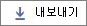

# 管理センターの Microsoft 365 レポート-電子メールアクティビティMicrosoft 365 Reports in the admin center - Email activity

Microsoft 365 **Reports** dashboard には、組織内の製品全体にわたるアクティビティの概要が表示されます。The Microsoft 365 **Reports** dashboard shows you the activity overview across the products in your organization. これにより、個別の製品レベルのレポートを詳細に確認して、各製品内のアクティビティについてより詳しく知ることができます。It enables you to drill in to individual product level reports to give you more granular insight about the activities within each product. [レポートの概要に関するトピック](activity-reports.md)を参照してください。Check out [the Reports overview topic](activity-reports.md).
  
たとえば、[レポート] ページで組織内のメール トラフィックの概要ビューを表示し、そこから [メール アクティビティ] ウィジェットに移って組織内のメール アクティビティの傾向とユーザーごとの詳細を把握できます。For example, you can get a high level view of email traffic within your organization from the Reports page, and then you can drill into the Email activity widget to understand the trends and per user level details of the email activity within your organization.
  
> [!NOTE]
> レポートを表示するには、Microsoft 365 または Exchange、SharePoint、または Skype for Business 管理者のグローバル管理者、グローバルリーダー、またはレポート閲覧者である必要があります。You must be a global administrator, global reader or reports reader in Microsoft 365 or an Exchange, SharePoint, or Skype for Business administrator to see reports. 

## メール アクティビティ レポートを表示する方法How to get to the email activity report

1. 管理センターで、[**レポート**] \> [<a href="https://go.microsoft.com/fwlink/p/?linkid=2074756" target="_blank">使用状況</a>] ページの順に移動します。In the admin center, go to the **Reports** \> <a href="https://go.microsoft.com/fwlink/p/?linkid=2074756" target="_blank">Usage</a> page.

    
2. **[レポートの選択**] ドロップダウンから、[ **Exchange** \> **電子メールアクティビティ**] を選択します。From the **Select a report** drop-down, select **Exchange** \> **Email activity**.
  
## メール アクティビティ レポートの内容を理解するInterpret the email activity report

[ **アクティビティ**] と [ **ユーザー**] のグラフを見ると、ユーザーのメール アクティビティを把握できます。You can get a view into your user's email activity by looking at the **Activity** and **Users** charts. 
  

  
|||
|:-----|:-----|
|1.1.    |[ **メール アクティビティ**] レポートでは、過去 7 日間、30 日間、90 日間、または 180 日間の傾向を確認できます。The **Email activity** report can be viewed for trends over the last 7 days, 30 days, 90 days, or 180 days. ただし、レポートで特定の日を選択すると、表 (7) には、(レポートが生成された日付ではなく) 現在の日付から最大 28 日間のデータが表示されます。However, if you select a particular day in the report, the table (7) will show data for up to 28 days from the current date (not the date the report was generated).    |
|2.2.    |各レポートのデータは、通常、過去 24 - 48 時間まで表示されます。The data in each report usually covers up to the last 24 to 48 hours.    |
|3.3.    |[ **アクティビティ**] グラフを使用すると、組織で発生しているメール アクティビティの量の傾向がわかります。メールの送信、閲覧、受信アクティビティの比率を把握できます。  The **Activity** chart enables you to understand the trend of the amount of email activity going on in your organization. You can understand the split of email send or read or received activities.    |
|4.4.    |[ **ユーザー**] グラフでは、メール アクティビティを生成している一意のユーザーの数の傾向がわかります。送信、閲覧、受信メール アクティビティを実行しているユーザーの傾向を見ることができます。  The **User** chart enables you to understand the trend of the amount of unique users who are generating the email activities. You can look at the trend of users performing send, reading or receiving email activities.    |
|5.5.    | [ **アクティビティ**] グラフの Y 軸は、その種類のメール送信、メール受信、メール閲覧のアクティビティの数です。On the **Activity** chart, the Y axis is the count of activity of the type email sent, email received and email read.     [ **ユーザー**] アクティビティ グラフの Y 軸は、メール送信、メール受信、メール閲覧のアクティビティを実行しているユーザーの数です。On the **Users** activity chart, the Y axis is the user's performing activity of the type email sent, email received and email read.     どちらのグラフも、X 軸はこの特定のレポートで選択した日付範囲です。The X axis on both charts is the selected date range for this specific report.    |
|6.6.    |凡例の項目を選択して、グラフに表示する系列をフィルター処理できます。You can filter the series you see on the chart by selecting an item in the legend. たとえば、[**アクティビティ**] グラフで、特定の関連データ](../../media/a3a9cb3d-b8b1-4c6a-9f6f-18aebf74c3a0.png)について送信、**受信**、または**読み取り**  to see only the info related to each one. この選択を変更しても、グリッド テーブルの情報は変更されません。Changing this selection doesn't change the info in the grid table.    |
|7.7.    | テーブルには、ユーザー レベルでのメール アクティビティの内訳が表示されます。The table shows you a breakdown of the email activities at the per-user level. Exchange 製品が割り当てられているすべてのユーザーとそのメール アクティビティが表示されます。This shows all users that have an Exchange product assigned to them and their email activities.     [ **ユーザー名**] はユーザーのメール アドレスです。**Username** is the email address of the user.    **表示名**は、ユーザーの場合は完全な名前です。**Display name** is the full name if the user.    [ **削除済み**] は、現在は削除済み状態ですが、レポート期間の一部ではアクティブであったユーザーを示します。**Deleted** refers to the user whose current state is deleted, but was active during some part of the reporting period of the report.    [ **削除日**] は、ユーザーが削除された日付です。**Deleted date** is the date the user was deleted.    [ **最終アクティビティ日**] は、ユーザーが閲覧または送信メール アクティビティを最後に実行した日付です。**Last activity date** refers to the last time the user performed a read or send email activity.    **送信アクション**は、ユーザーに対してメールの送信アクションが記録された回数です。**Send actions** is the number of times an email send action was recorded for the user.    **受信アクション**は、ユーザーに対してメールの受信アクションが記録された回数です。**Receive actions** is the number of times an email received action was recorded for the user.    **読み取りアクション**は、ユーザーに対してメールの読み取りアクションが記録された回数です。**Read actions** is the number of times an email read action was recorded for the user.    [**割り当てら**れた製品とは、このユーザーに割り当てられている製品のことです。**Product assigned** is the products that are assigned to this user.     組織のポリシーにより、ユーザー情報を特定できるレポートを表示できない場合は、これらすべてのレポートのプライバシー設定を変更できます。If your organization's policies prevents you from viewing reports where user information is identifiable, you can change the privacy setting for all these reports. 「**Microsoft 365 管理センターのアクティビティ レポート**」の「[ユーザー レベルの詳細を非表示にする方法](activity-reports.md)」セクションを参照してください。Check out the **How do I hide user level details?** section in the [Activity Reports in the Microsoft 365 admin center](activity-reports.md).    |
|8.8.    |[**エクスポートエクスポート] ボタン** のリンクを選択して、レポートデータを Excel の .csv ファイルにエクスポートすることもできます。You can also export the report data into an Excel .csv file, by selecting the **Export**  link. これにより、すべてのユーザーのデータがエクスポートされ、単純な並べ替えとフィルター処理を行ってさらに分析することができます。This exports data of all users and enables you to do simple sorting and filtering for further analysis. ユーザー数が 2000 未満である場合は、レポート自体のテーブル内で並べ替えとフィルター処理を行うことができます。If you have less than 2000 users, you can sort and filter within the table in the report itself. ユーザー数が 2000 を超える場合は、フィルター処理と並べ替えを行うために、データをエクスポートする必要があります。If you have more than 2000 users, in order to filter and sort, you will need to export the data.    |
|||
   
注: 電子メールアクティビティレポートは、ライセンスを持っているユーザーに関連付けられているメールボックスに対してのみ使用できます。Note: The Email activity report is only available for mailboxes that are associated with users who have licenses.
