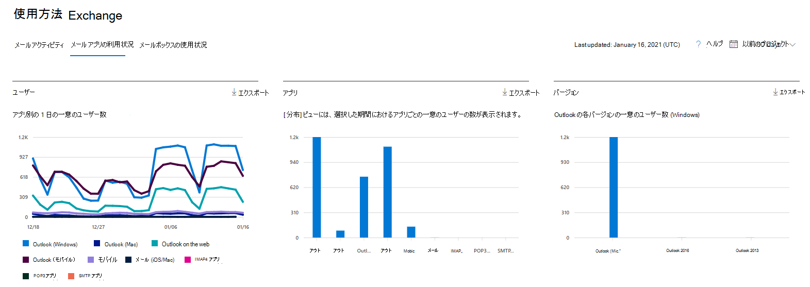

# 管理センターの Microsoft 365 レポート - 電子メール アプリの使用状況

Microsoft 365 の [レポート] ダッシュボードには、組織内での製品全体に関するアクティビティが表示されます。 これにより、個別の製品レベルのレポートを詳細に確認して、各製品内のアクティビティについてより詳しく知ることができます。 [レポートの概要に関するトピック](activity-reports.md)を参照してください。 電子メール アプリの使用状況レポートでは、Exchange Onlineに接続しているメール アプリの数を確認できます。 それにより、サポートされていないバージョンを使用しているユーザーを、サポートされているバージョンの Outlook をインストールするようにフォローアップできます。
  
## 電子メール アプリ レポートにアクセスする方法

1. 管理センターで、[**レポート**] \> [<a href="https://go.microsoft.com/fwlink/p/?linkid=2074756" target="_blank">使用状況</a>] ページの順に移動します。
2. **[電子メール アクティビティ**] で **[その他の表示**] を選択します。 
3. **[電子メール アクティビティ**] ドロップダウン リストから、[**Exchange** \> **メール アプリの使用状況**] を選択します。
  
## 電子メール アプリ レポートを解釈する

**[ユーザー**] グラフと [**クライアント**] グラフを見ると、電子メール アプリアクティビティのビューを取得できます。 
  

**電子メール アプリの使用状況** レポートでは、過去 7 日間、30 日間、90 日間、または 180 日間の傾向を確認できます。 ただし、レポートで特定の日を選択した場合、テーブルには現在の日付から最大 28 日間のデータが表示されます (レポートが生成された日付ではありません)。 各レポートのデータは、通常、過去 24 - 48 時間まで表示されます。

[ **ユーザー**] ビューでは、何らかのメール アプリを使用して Exchange Online に接続した個別ユーザーの数が示されます。 

[ **アプリ**] ビューには、選択した期間におけるアプリごとの一意のユーザーの数が表示されます。 

**[バージョン]** ビューには、Windows の Outlook のバージョンごとに一意のユーザーの数が表示されます。 

[ ユーザー] グラフの Y 軸は、レポート期間の特定の日にあるアプリに接続した一意のユーザーの合計数です。 また、X 軸は、そのレポート期間にアプリを使用した一意のユーザーの数です。 

[ アプリ] グラフの Y 軸は、レポート期間に特定のアプリを使用した一意のユーザーの合計数です。 また、X 軸は組織内のアプリの一覧です。 

[ バージョン] グラフの Y 軸は、特定のバージョンの Outlook デスクトップを使用している個別ユーザーの総数です。 レポートで Outlook のバージョン番号を解決できない場合、数量は **未確定** として表示されます。 また、X 軸は組織内のアプリの一覧です。

凡例の項目を選択して、グラフに表示する系列をフィルター処理できます。 次の一覧のすべての項目は、追加するまで列に表示されないことがあります。
 
|アイテム|説明|
|:-----|:-----|
|Username | 電子メール アプリの所有者の名前。 |
|最終アクティビティの日付 | ユーザーが電子メール メッセージを読んだり送信したりした最新の日付。 |
|Mac メール、Mac Outlook、Outlook、Outlook モバイル、Outlook on the web | 組織内で使用できる電子メール アプリの例。 |
   
組織のポリシーにより、ユーザー情報を特定できるレポートを表示できない場合は、これらすべてのレポートのプライバシー設定を変更できます。 「**Microsoft 365 管理センターのアクティビティ レポート**」の「[ユーザー レベルの詳細を非表示にする方法](activity-reports.md)」セクションを参照してください。 

[ **列の選択] を選択** して、レポートに列を追加または削除します。  

[エクスポート] リンクを選択して、レポート データを Excel .csv ファイルに **エクスポート** することもできます。 これにより、すべてのユーザーのデータがエクスポートされ、単純な並べ替えとフィルター処理を行ってさらに分析することができます。 