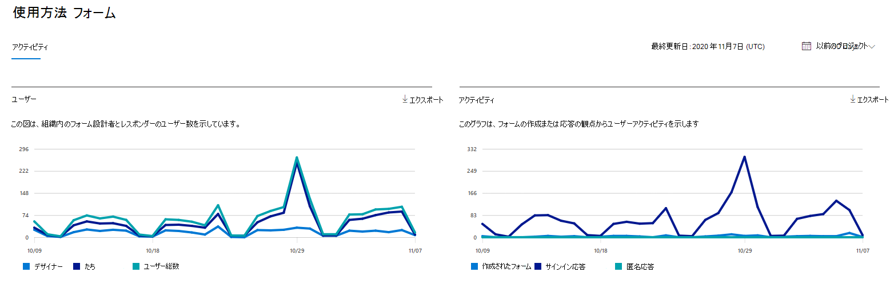

# 管理センターの Microsoft 365 レポート - フォーム アクティビティ

Microsoft 365 の [レポート] ダッシュボードには、組織内での製品全体に関するアクティビティが表示されます。 これにより、個別の製品レベルのレポートを詳細に確認して、各製品内のアクティビティについてより詳しく知ることができます。 [レポートの概要トピック](activity-reports.md)を参照してください。
  
たとえば、フォームとの対話を見て、Microsoft Formsを使用するライセンスを持つすべてのユーザーのアクティビティを理解できます。 また、作成されたフォームとユーザーが応答したフォームの数を調べて、コラボレーションのレベルを理解するのにも役立ちます。
  
## フォーム アクティビティ レポートにアクセスする方法

1. 管理センターで、 **レポート** に移動し、[ **使用状況**] を選択します。 
2. ダッシュボードのホームページで、フォーム カードの **[その他の表示** ] ボタンをクリックします。
  
## フォーム アクティビティ レポートを解釈する

[アクティビティ] タブを選択すると、フォーム レポートで **アクティビティ** を表示できます。

[ **列の選択] を選択** して、レポートに列を追加または削除します。 

また、[**エクスポート**] リンクを選択して、レポート データを Excel の .csv ファイルにエクスポートすることもできます。 これにより、すべてのユーザーのデータがエクスポートされ、単純な並べ替えとフィルター処理を行ってさらに分析することができます。 

**フォーム アクティビティ** レポートは、過去 7 日間、30 日間、90 日間、または 180 日間の傾向を表示できます。 ただし、レポートで特定の日を選択した場合、テーブルには現在の日付から最大 28 日間のデータが表示されます (レポートが生成された日付ではありません)。
  
|アイテム|説明|
|:-----|:-----|
|測定基準|定義|
|Username   |Microsoft Formsでアクティビティを実行したユーザーの電子メール アドレス。   |
|最終アクティビティ日 (UTC)   |選択した日付範囲に対してユーザーがフォーム アクティビティを実行した最新の日付。 特定の日付に発生したアクティビティを表示するには、直接グラフ内の日付を選択します。  これによりテーブルがフィルター処理され、特定の日にアクティビティを実行したユーザーに対してのみファイル アクティビティ データが表示されます。   |
|作成されたフォームの数   |ユーザーが作成したフォームの数。    |
|応答されたフォームの数  |ユーザーが返信を送信したフォームの数。|

