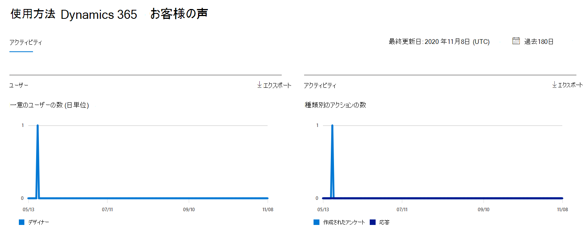
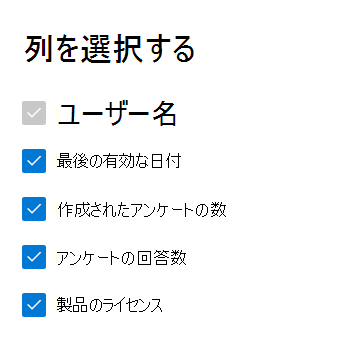

# Microsoft 365管理センターのレポート - Dynamics 365 Customer Voice アクティビティ

Microsoft 365 の [**レポート**] ダッシュボードには、組織内での製品全体に関するアクティビティが表示されます。 これにより、個別の製品レベルのレポートを詳細に確認して、各製品内のアクティビティについてより詳しく知ることができます。 [レポートの概要トピック](activity-reports.md)を参照してください。
  
たとえば、Dynamics 365 Customer Voice との対話を見て、Microsoft Dynamics 365 Customer Voice を使用するライセンスを持つすべてのユーザーのアクティビティを理解できます。 また、作成された Pro サーベイの数と、ユーザーが回答した Pro アンケートの数を確認することで、共同作業のレベルを理解するのにも役立ちます。 
  
> [!NOTE]
> レポートを表示するには、Microsoft 365 のグローバル管理者、グローバル閲覧者、レポート閲覧者、または Exchange、SharePoint、Skype for Business の管理者である必要があります。  
 
## Dynamics 365 Customer Voice アクティビティ レポートにアクセスする方法

1. 管理センターで、[**レポート**] \> [<a href="https://go.microsoft.com/fwlink/p/?linkid=2074756" target="_blank">使用状況</a>] ページの順に移動します。 
2. ダッシュボードのホームページで、Dynamics  365 Customer Voice カードの [その他の表示] ボタンをクリックします。
  
## Dynamics 365 Customer Voice アクティビティ レポートの解釈

[アクティビティ] タブを選択すると、Dynamics 365 Customer Voice レポートでアクティビティを **表示** できます。 

[列 **の選択]** を選択して、レポートの列を追加または削除します。    

また、[**エクスポート**] リンクを選択して、レポート データを Excel の .csv ファイルにエクスポートすることもできます。 これにより、すべてのユーザーのデータがエクスポートされ、単純な並べ替えとフィルター処理を行ってさらに分析することができます。 ユーザー数が 2000 未満である場合は、レポート自体のテーブル内で並べ替えとフィルター処理を行うことができます。 ユーザー数が 2000 を超える場合は、フィルター処理と並べ替えを行うために、データをエクスポートする必要があります。 
  
|アイテム|説明|
|:-----|:-----|
|**測定基準**|**定義**|
|Username    |Microsoft Forms でアクティビティを実行したユーザーの電子メール アドレス。    |
|最終アクティビティ日 (UTC)    |選択した日付範囲に対してユーザーがフォーム アクティビティを実行した最新の日付。 特定の日付に発生したアクティビティを表示するには、直接グラフ内の日付を選択します。 これにより、テーブルをフィルター処理して、その特定の日にアクティビティを実行したユーザーのファイル アクティビティ データのみを表示します。    |
|作成されたアンケートの数    |ユーザーが作成したアンケートの数。     |
|アンケート回答数    |アンケートの配布先である応答者からの回答の数。|
|||