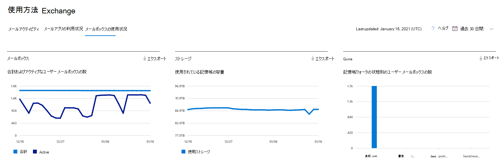
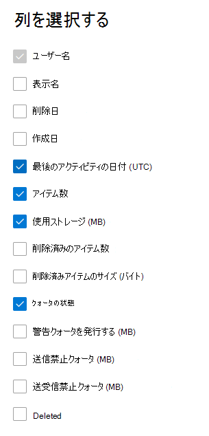

# Microsoft 365管理センターのレポート - メールボックスの使用状況

メールボックス **使用状況** レポートは、電子メールの送信、読み取り、予定の作成、会議の送信、会議の受け入れ、会議の辞退、会議のキャンセルのアクティビティに基づいて、ユーザー メールボックスを持つユーザーに関する情報と各アクティビティのレベルを提供します。 また、各ユーザーのメールボックスが使用している記憶域の容量と、憶域のクォータに近づいているメールボックスの数についても表示されます。 
  
> [!NOTE]
> レポートを表示するには、Microsoft 365 のグローバル管理者、グローバル閲覧者、レポート閲覧者、または Exchange、SharePoint、Skype for Business の管理者である必要があります。 
 
## メールボックスの使用状況レポートを取得する方法

1. 管理センターで、[**レポート**] \> [<a href="https://go.microsoft.com/fwlink/p/?linkid=2074756" target="_blank">使用状況</a>] ページの順に移動します。
2. [メール **アクティビティ] で [詳細を** 表示 **] を選択します**。 
3. [メール **アクティビティ] ドロップダウン** リストから、[メールボックスの使用状況] **Exchange** \> **を選択します**。

## メールボックスの使用状況レポートを解釈する

組織の [ **メールボックスの使用状況**] を表示するには、[ **メールボックス**]、[ **記憶域**]、[ **クォータ**] グラフを確認します。 
  

|アイテム|説明|
|:-----|:-----|
|1.    |[ **メールボックスの使用状況**] レポートでは、過去 7 日間、30 日間、90 日間、または 180 日間の傾向を確認できます。 ただし、レポートで特定の日を選択すると、現在の日付から最大 28 日間のデータが表示されます (レポートが生成された日付ではありません)。    |
|2.    |各レポートのデータは、通常、過去 24 - 48 時間まで表示されます。    |
|3.    |[メールボックス] グラフには、組織内のユーザー メールボックスの合計数、レポート期間の特定の日にアクティブだった合計数が表示されます。 ユーザー メールボックスは、電子メールの送信、読み取り、予定の作成、会議の送信、会議の承諾、会議の辞退、会議の取り消しを行った場合にアクティブと見なされます。    |
|4.    |[ **記憶域**] グラフには、組織内で使用されている記憶域の容量が表示されます。 Storageグラフにはアーカイブ メールボックスは含めされません。 自動拡張アーカイブの詳細については、「無制限アーカイブの概要」を参照[Microsoft 365。](../../compliance/unlimited-archiving.md)  |
|5.    | [ **クォータ**] グラフには、各クォータ カテゴリのユーザー メールボックス数が表示されます。クォータには 4 つのカテゴリがあります。     良い - 使用済み記憶域が警告のクォータの発行を下回るユーザー数。     警告 - 使用済み記憶域が警告の発行以上であり、送信禁止クォータを下回るユーザー数     送信できません - 使用済み記憶域が送信禁止クォータ以上であり、送受信禁止クォータを下回るユーザー数     送受信できません - 使用済み記憶域が送受信禁止クォータであるユーザー数    |
|6.    | [ **メールボックス**] グラフの Y 軸は、ユーザー メールボックス数です。     [ **記憶域**] グラフの Y 軸は、組織内のユーザー メールボックスに使用されている記憶域の容量です。     [ **クォータ**] グラフの Y 軸は、各記憶域クォータのユーザー メールボックス数です。     [メールボックス] グラフと [記憶域] グラフの X 軸は、このレポートで選ばれた日付範囲です。     [クォータ] グラフの X 軸は、クォータのカテゴリです。    |
|7.    |凡例でアイテムを選択すると、表示されるグラフをフィルター処理できます。    |
|8.    | テーブルには、ユーザー レベルでのメールボックスの使用状況の内訳が表示されます。テーブルには列を追加することができます。    [ **ユーザー名**] はユーザーのメール アドレスです。    [ **表示名**] はユーザーの氏名です。    [ **削除済み**] は、現在は削除済状態ですが、レポート期間の一部ではアクティブであったメールボックスを示します。    [ **削除日**] は、メールボックスが削除された日付です。    [ **作成日**] は、メールボックスが作成された日付です。    [ **最終処理日**] は、メールボックスにメールの送信または閲覧アクティビティがあった日付です。    [ **アイテム数**] は、メールボックス内の合計アイテム数です。    [ **使用済み記憶域サイズ (MB)**] は、使用済み記憶域の合計サイズです。    **[削除済みアイテム数** ] は、メールボックス内の削除済みアイテムの総数を示します。   **削除済みアイテム サイズ (MB)** は、メールボックス内のすべての削除済みアイテムの合計サイズを参照します。   [ **警告のクォータの発行 (MB)**] は、記憶域クォータに達しそうになったときに、メールボックス所有者が警告を受信する記憶域の上限です。    [ **送信禁止クォータ (MB)**] は、メールボックスからメールを送信できなくなる記憶域の上限です。    [ **送受信禁止クォータ (MB)**] は、メールボックスからメールを送受信できなくなる記憶域の上限です。     組織のポリシーにより、ユーザー情報を特定できるレポートを表示できない場合は、これらすべてのレポートのプライバシー設定を変更できます。 [レポート]**の [アクティビティ レポート]** の [レポートでユーザーの詳細を非表示 [にする] セクションをMicrosoft 365 管理センター。](activity-reports.md)    |
|9.    |[列 **の選択]** を選択して、レポートの列を追加または削除します。    |
|10.    |[エクスポート] リンクを選択して、レポート データExcel .csvファイルに **エクスポート** できます。    |
|||
