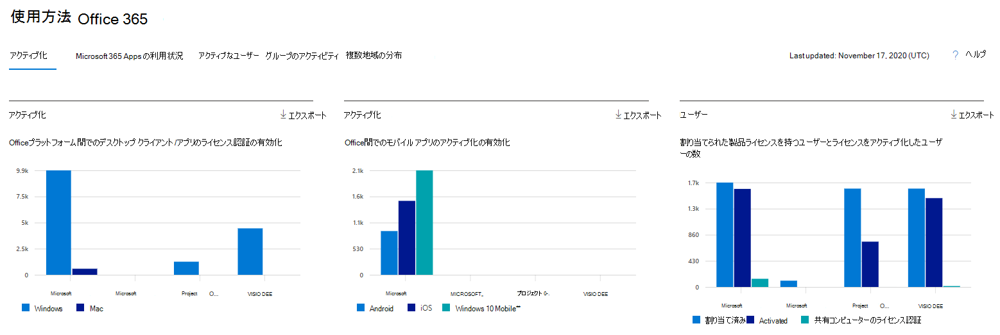
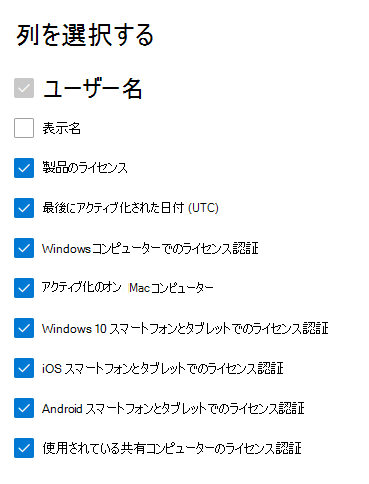

# 管理センターでレポートをMicrosoft 365する - ライセンス認証をMicrosoft Officeする

Microsoft 365 の [レポート] ダッシュボードには、組織内での製品全体に関するアクティビティが表示されます。 これにより、個別の製品レベルのレポートを詳細に確認して、各製品内のアクティビティについてより詳しく知ることができます。 [レポートの概要に関するトピック](activity-reports.md)を参照してください。
  
[Office ライセンス認証] レポートでは、Office サブスクリプションのライセンス認証を行ったユーザーを少なくとも 1 台のデバイスで確認できます。 Microsoft 365 Apps for enterprise、Project、Visio Pro for Office 365サブスクリプションのライセンス認証の内訳と、デスクトップとデバイス間のアクティブ化の内訳が提供されます。 このレポートは、Office サブスクリプションのライセンス認証について、追加のヘルプやサポートが必要なユーザーを特定するときにも役立ちます。
  
## Office ライセンス認証レポートにアクセスする方法

1. 管理センターで、[**レポート**] \> [<a href="https://go.microsoft.com/fwlink/p/?linkid=2074756" target="_blank">使用状況</a>] ページの順に移動します。 
2. ダッシュボードのホームページで、Officeライセンス認証カードの [**その他の表示**] ボタンをクリックします。
  
## Office ライセンス認証レポートを解釈する
  
[アクティブ化] タブを選択すると、Office 365 レポートで **アクティブ化** を表示できます。 

[ **列の選択] を選択** して、レポートに列を追加または削除します。    

また、[**エクスポート**] リンクを選択して、レポート データを Excel の .csv ファイルにエクスポートすることもできます。 これにより、すべてのユーザーのデータがエクスポートされ、単純な並べ替えとフィルター処理を行ってさらに分析することができます。 ユーザー数が 2000 未満である場合は、レポート自体のテーブル内で並べ替えとフィルター処理を行うことができます。 ユーザー数が 2000 を超える場合は、フィルター処理と並べ替えを行うために、データをエクスポートする必要があります。 

|アイテム|説明|
|:-----|:-----|
|**測定基準**|**定義**|
|Username    |ユーザーの電子メール アドレス。    |
|表示名    |ユーザーの完全な名前。    |
|製品のライセンス    |このユーザーに割り当てられている製品。    |
|最後にアクティブ化された日付 (UTC)    |ユーザーがデスクトップまたはデバイスでOfficeアクティブ化した日付。    |
|Windows コンピューターでのアクティブ化    |ユーザーがアクティブ化Office Windows デスクトップの数。    |
|Mac コンピューターでのアクティブ化   |ユーザーがアクティブ化した Mac デスクトップの数Office。|
|Windows 10スマートフォンとタブレットでのアクティブ化    |ユーザーがアクティブ化したモバイル デバイスのWindows 10数Office。    |
|iOS スマートフォンとタブレットでのアクティブ化    |ユーザーがアクティブ化した iOS デバイスの数Office。|
|Android スマートフォンとタブレットでのアクティブ化    |ユーザーがアクティブ化した Android デバイスの数Office。    |
|共有コンピューターのライセンス認証を使用しました |これは、ユーザーが共有コンピューターのライセンス認証を通じてOfficeを使用した場合に当てはまります。|
|||
   