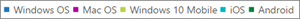

# 管理センターの microsoft 365 レポート-Microsoft Office のライセンス認証

Microsoft 365 **Reports** dashboard には、組織内の製品全体にわたるアクティビティの概要が表示されます。 これにより、個別の製品レベルのレポートを詳細に確認して、各製品内のアクティビティについてより詳しく知ることができます。 [レポートの概要に関するトピック](activity-reports.md)を参照してください。
  
[Office ライセンス認証] レポートでは、Office サブスクリプションのライセンス認証を行ったユーザーを少なくとも 1 台のデバイスで確認できます。Office 365 ProPlus、Project for、Visio Pro for Office 365 サブスクリプションのライセンス認証の内訳だけではなく、デスクトップとデバイス全体のライセンス認証の内訳も表示されます。このレポートは、Office サブスクリプションのライセンス認証について、追加のヘルプやサポートが必要なユーザーを特定するときにも役立ちます。
  
> [!NOTE]
> レポートを表示するには、Microsoft 365 のグローバル管理者、または Exchange、SharePoint、Skype for Business の管理者、またはレポート閲覧者である必要があります。 
  
## Office ライセンス認証レポートにアクセスする方法

1. 管理センターで、[**レポート**] \> [<a href="https://go.microsoft.com/fwlink/p/?linkid=2074756" target="_blank">使用状況</a>] ページの順に移動します。

    
2. **[レポートの選択**] ドロップダウンから、[ **Office 365** \>の**ライセンス認証**] を選択します。 
  
## Office ライセンス認証レポートを解釈する

組織の Office のライセンス認証状況を確認するには、[ **ライセンス認証**] と [ **ユーザー**] に注目します。 
  

  
|||
|:-----|:-----|
|1-d    |Office のライセンス認証状況のレポートには、Office ライセンス認証データの現在の状態が表示されます [グラフ右上に表示されたレポートの日付以降]。    |
|pbm-2    |各レポートのデータは、通常、過去 24 - 48 時間まで表示されます。    |
|1/3    |[ **ライセンス認証**] グラフには、デスクトップとデバイスの Office ライセンスの認証数が表示されます。    |
|2/4    |[ **ユーザー**] グラフには、有効なユーザー数と、デスクトップまたはデバイスで Office サブスクリプションのライセンス認証を行ったユーザー数が表示されます。    |
|5    | [ **ライセンス認証**] グラフの Y 軸は、Office ライセンス認証数です。     [ **ユーザー**] グラフの Y 軸は、ユーザーが Office のライセンス認証を行った操作です。     どちらのグラフも、X 軸はこの特定のレポートで選択した日付範囲です。    |
|シックス    |凡例の項目を選択すると、表示されるグラフにフィルターを適用することができます。 たとえば、[**ライセンス認証**] グラフで、 **windows OS**、 **Mac OS**、 **windows 10 mobile**、 **iOS** 、 **Android**のいずれかを選択すると、それぞれに関連する情報のみが表示されます。 この選択を変更しても、グリッド テーブルの情報は変更されません。       |
|7    | 表には、ユーザー レベルの Office ライセンス認証の内訳が表示されます。これは、Office 製品が割り当てられたすべてのユーザーの一覧です。表には列を追加することができます。      [ **ユーザー名**] はユーザーのメール アドレスです。    **表示名**は、ユーザーの場合は完全な名前です。    **製品ライセンス**とは、このユーザーに割り当てられている製品のことです。    [ **最終ライセンス認証日**] は、ユーザーがデスクトップまたはデバイスで Office のライセンス認証を行った日付です。    ユーザーが共有コンピューターのライセンス認証を使用して Office を使用した場合、**共有コンピューターのライセンス認証を使用**します。   **Windows**は、ユーザーが Office のライセンス認証を行った windows デスクトップの数を参照します。    **Mac**は、ユーザーが Office のライセンス認証を行った mac デスクトップの数を示します。    **Windows 10 mobile**は、ユーザーが Office をライセンス認証した windows 10 モバイルデバイスの数を表します。    **ios**は、ユーザーが Office のライセンス認証を行った iOS デバイスの数を表します。    **Android**は、ユーザーが Office のライセンス認証を行った Android デバイスの数を表します。     組織のポリシーにより、ユーザー情報を特定できるレポートを表示できない場合は、これらすべてのレポートのプライバシー設定を変更できます。 「 [Microsoft 365 管理センターのアクティビティレポート](activity-reports.md)」の [レポート] セクションで、[**ユーザーの詳細を非表示**にする] を確認してください。    |
|||
   

