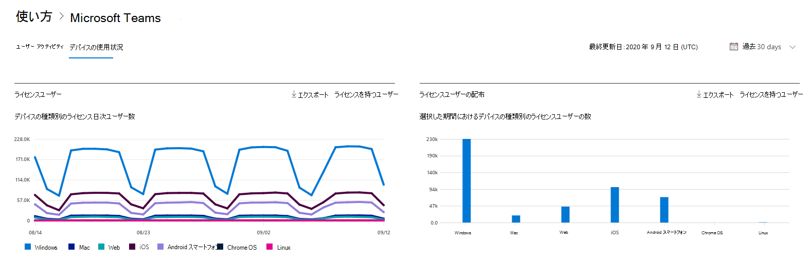
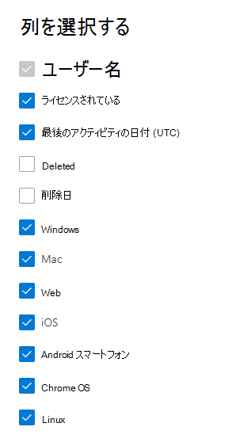

# Microsoft 365管理センターのレポート - デバイスMicrosoft Teams使用

Microsoft 365 の [レポート] ダッシュボードには、組織内での製品全体に関するアクティビティが表示されます。 これにより、個別の製品レベルのレポートを詳細に確認して、各製品内のアクティビティについてより詳しく知ることができます。 [レポートの概要に関するトピック](activity-reports.md)を参照してください。 [アプリMicrosoft Teamsレポートでは、組織で使用Microsoft Teamsアプリに関する分析情報を取得できます。
  
## Microsoft Teams アプリの使用状況レポートを取得する手順

1. 管理センターで、[**レポート**] \> [<a href="https://go.microsoft.com/fwlink/p/?linkid=2074756" target="_blank">使用状況</a>] ページの順に移動します。 
2. ダッシュボードのホームページで、アクティビティ **カードの [** その他の表示] Microsoft Teamsクリックします。
  
## Microsoft Teams アプリの使用状況レポートを解釈する

[デバイスの使用状況] タブを選択すると、Teamsレポートでデバイスの使用状況 **を表示** できます。 

[列 **の選択]** を選択して、レポートの列を追加または削除します。    

また、[**エクスポート**] リンクを選択して、レポート データを Excel の .csv ファイルにエクスポートすることもできます。 これにより、すべてのユーザーのデータがエクスポートされ、単純な並べ替えとフィルター処理を行ってさらに分析することができます。 ユーザー数が 2000 未満である場合は、レポート自体のテーブル内で並べ替えとフィルター処理を行うことができます。 ユーザー数が 2000 を超える場合は、フィルター処理と並べ替えを行うために、データをエクスポートする必要があります。 

[ **Microsoft Teams デバイスの使用状況**] レポートでは、過去 7 日間、30 日間、90 日間、または 180 日間の傾向を確認できます。 ただし、レポートで特定の日を選択すると、現在の日付から最大 28 日間のデータが表示されます (レポートが生成された日付ではありません)。
  
|アイテム|内容|
|:-----|:-----|
|**測定基準**|**定義**|
|ユーザー名    |ユーザーの表示名。    |
|Windows    |ユーザーがコンピューター ベースのコンピューター上のデスクトップ TeamsでアクティブWindows選択されます。    |
|Mac    |ユーザーが macOS コンピューター上のデスクトップ Teamsでアクティブだった場合に選択されます。    |
|iOS    |iOS のモバイル クライアントでユーザーがアクティブTeams選択されます。    |
|Android スマートフォン    | Android のモバイル クライアントでユーザーがアクティブTeams選択されます。    |
|Chrome OS    |ユーザーが ChromeOS コンピューター上のデスクトップ Teamsでアクティブだった場合に選択されます。|
|Linux    | ユーザーが Linux コンピューター上のデスクトップ Teamsでアクティブだった場合に選択されます。    |
|Web    |ユーザーがデバイス上の Web クライアントでアクティブTeams選択されます。|
|最終アクティビティ日 (UTC)    |ユーザーがアクティビティに参加した最後の日付 (UTC) Teamsです。    |
|ライセンスが必要です|ユーザーにライセンスが割り当てTeams。|
|||