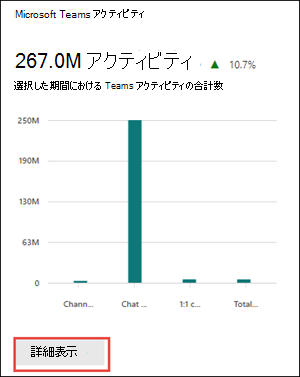
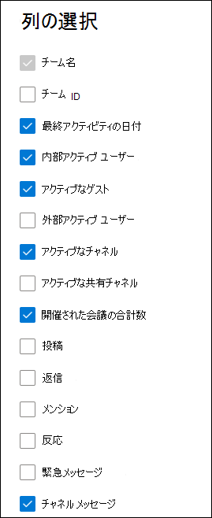

# 管理センターの Microsoft 365 レポート - Microsoft Teams の利用状況

Microsoft 365 の [レポート] ダッシュボードには、組織内での製品全体に関するアクティビティが表示されます。 これにより、個別の製品レベルのレポートを詳細に確認して、各製品内のアクティビティについてより詳しく知ることができます。 [レポートの概要に関するトピック](activity-reports.md)を参照してください。

新しい **Teams 使用状況レポート** では、Teams の使用状況アクティビティの概要が表示されます。アクティブなユーザー数、チャネル数、メッセージ数など、組織全体で Teams を使用してコミュニケーションや共同作業を行っているユーザーの数をすばやく確認できます。  また、アクティブなゲストの数、会議、メッセージなど、他の Teams 固有のアクティビティも含まれます。

## Microsoft Teams の使用状況アクティビティ レポートにアクセスする方法

1. 管理センターで、 **レポート** に移動し、[ **使用状況**] を選択します。
2. ダッシュボードのホームページで、**Microsoft Teams アクティビティ** カードの **[その他の表示**] ボタンをクリックします。

    

3. **Microsoft Teams** レポート ページで、[**Teams の使用状況**] タブを選択します。

## Microsoft Teams の使用状況アクティビティ レポートを解釈する

[Teams **の使用状況** ] タブを選択すると、Teams レポートでユーザー アクティビティを表示できます。次のグラフが表示されます。

- **チャネルの使用状況**: 時間の経過と共に、アクティビティの種類別に使用されるチャネルの数を追跡します。

  

- **チームの使用状況**: 時間の経過と共に、種類とアクティビティ別にチームの数を追跡します。

  

さらに、グラフには、最後のアクティビティの日付、アクティブなユーザー、アクティブなチャネル、その他のデータなど、個々のチームの使用状況の詳細が含まれています。

テーブルで、レポートの **列** を追加または削除する列の選択を選択します。

また、[**エクスポート**] リンクを選択して、レポート データを Excel の .csv ファイルにエクスポートすることもできます。 これにより、すべてのユーザーのデータがエクスポートされ、単純な並べ替えとフィルター処理を行ってさらに分析することができます。  **エクスポートされたオーディオ時間**、**ビデオ時間**、**および画面共有時間** の形式は、ISO8601 期間形式に従います。

**Microsoft Teams の使用状況アクティビティ** レポートは、過去 7 日間、30 日間、90 日間、または 180 日間の傾向を確認できます。 ただし、レポートで特定の日を選択した場合、テーブルには現在の日付から最大 28 日間のデータが表示されます (レポートが生成された日付ではありません)。

データ品質を確保するために、過去 3 日間の毎日のデータ検証チェックを実行し、検出されたギャップを埋めます。 プロセス中に履歴データの違いに気付く場合があります。

> [!Important]
> 特定の日のデータは 48 時間以内に表示されます。 たとえば、1 月 10 日のデータは、1 月 12 日までにレポートに表示されます。

### チャネル使用状況メトリック

チャネル使用状況グラフには、次のメトリックに関するデータが表示されます。

|アイテム|説明|
|:-----|:-----|
|**測定基準**|**定義**|
|アクティブ チャネル ユーザー|これは、内部アクティブ ユーザー、アクティブなゲスト、および外部アクティブ ユーザーの合計です。     **内部アクティブ ユーザー** - 指定した期間内に少なくとも 1 つのパネル アクションを持つユーザー。 これはゲストを除く。     **アクティブなゲスト** - 指定した期間内に少なくとも 1 つのパネル アクションを持つゲスト。 ゲストとは、自分のディレクトリ内のゲスト アカウントにサインインして共有リソースにアクセスする組織外のユーザーです。    **外部アクティブ ユーザー** - 指定した期間内に少なくとも 1 つのパネル アクションを持つ外部参加者。 外部参加者とは、組織外のユーザーであり、共有チャネルなどのリソースに参加しているユーザーで、ディレクトリ内のゲスト アカウントではなく、独自の ID を使用します。|
|アクティブ チャネル|指定した期間内に少なくとも 1 人のアクティブなユーザーを持つアクティブなチームの有効なチャネル。 これには、パブリック チャネル、プライベート チャネル、または共有チャネルが含まれます。|
|チャネル メッセージ|指定した期間中にユーザーがプライベート チャットに投稿した一意のメッセージの数。|

### チームの使用状況メトリック

Teams 使用状況グラフには、次のメトリックに関するデータが表示されます。

|アイテム|説明|
|:-----|:-----|
|**測定基準**|**定義**|
|プライベート チーム|アクティブまたは非アクティブのプライベート チーム。|
|パブリック チーム|アクティブまたは非アクティブのパブリック チーム。|
|アクティブなプライベート チーム|プライベートでアクティブなチーム。|
|アクティブなパブリック チーム|パブリックでアクティブなチーム。|

### Teams の詳細

次のメトリックのデータは、個々のチームで使用できます。

|アイテム|説明|
|:-----|:-----|
|**測定基準**|**定義**|
|チーム ID|チーム識別子|
|内部アクティブ ユーザー|指定した期間内に少なくとも 1 つのパネル アクションを持つユーザー (ゲストを含む)。     同じテナントに存在する内部ユーザーとゲスト。 内部ユーザーはゲストを除外します。|
|アクティブなゲスト|指定した期間内に少なくとも 1 つのパネル アクションを持つゲスト。     ゲストは、自分のディレクトリ内のゲスト アカウントにサインインして共有リソースにアクセスする組織外のユーザーとして定義されます。|
|外部アクティブ ユーザー|指定した期間内に少なくとも 1 つのパネル アクションを持つ外部参加者。   外部参加者は、ディレクトリ内のゲスト アカウントではなく、独自の ID を使用してリソース (共有チャネルなど) に参加している組織外のユーザーとして定義されます。|
|アクティブ チャネル|指定した期間内に少なくとも 1 人のアクティブなユーザーを持つアクティブなチームの有効なチャネル。 これには、パブリック チャネル、プライベート チャネル、または共有チャネルが含まれます。|
|アクティブな共有チャネル|指定した時間内に少なくとも 1 人のアクティブなユーザーを持つアクティブなチームの有効な共有チャネル。    共有チャネルは、チーム外のユーザーと共有できる Teams チャネルとして定義されます。 これらのユーザーは、組織内でも、他の Azure AD 組織からでもかまいません。|
|開催された会議の合計数|指定された期間中にユーザーが開催した、スケジュールされた、定期的、アドホック、および未分類の 1 回限りの会議の合計。|
|Posts|指定した期間内のチャネル内のすべての投稿メッセージの数。|
|Replies|指定した期間内のチャネル内のすべての応答メッセージの数。|
|メンション|指定した期間内に行われたすべてのメンションの数。|
|リアクション|アクティブなユーザーが指定した期間内に行ったリアクションの数。|
|緊急メッセージ|指定した期間内の緊急メッセージの数。|
|チャネル メッセージ|指定した期間中にユーザーがチーム チャットに投稿した一意のメッセージの数。|
|最終アクティビティの日付|チームのメンバーがアクションをコミットした最新の日付。|

## ユーザー固有のデータを匿名にする

Teams ユーザー アクティビティ レポートのデータを匿名にするには、グローバル管理者である必要があります。 これにより、レポート内の表示名、電子メール、Azure Active Directory オブジェクト ID、エクスポートなどの識別可能な情報 (MD5 ハッシュを使用) が非表示になります。

1. Microsoft 365 管理センターで、[設定 **組織の設定]** >  に移動し、[**サービス**] タブで [レポート] を選択 **します**。

2. [ **レポート**] を選択し、[ **匿名識別子の表示**] を選択します。 この設定は、Microsoft 365 管理センター管理センターと Teams 管理センターの使用状況レポートの両方に適用されます。

3. **[変更の保存]** を選択します。

## 関連項目

[Microsoft Teams のデバイス使用状況レポート](../activity-reports/microsoft-teams-device-usage-preview.md)

[Microsoft Teams ユーザー アクティビティ レポート](../activity-reports/microsoft-teams-user-activity-preview.md)
