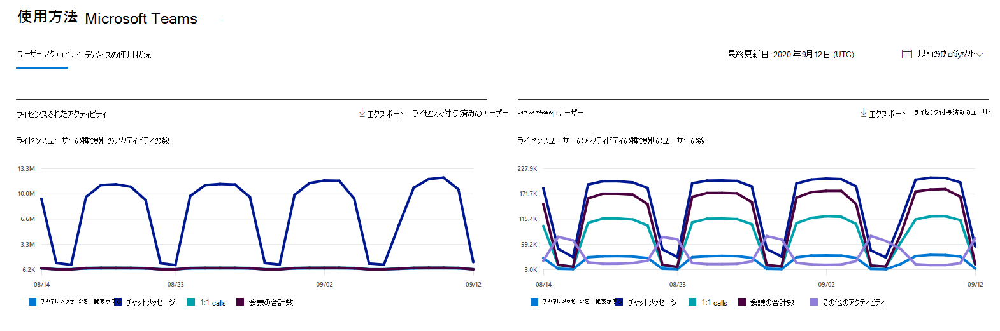
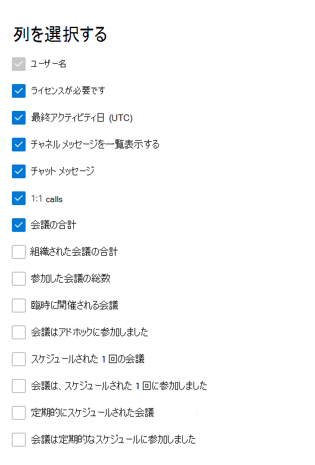

# 管理センターの Microsoft 365 レポート - Microsoft Teams ユーザー アクティビティ

Microsoft 365 の [**レポート**] ダッシュボードには、組織内での製品全体に関するアクティビティが表示されます。 これにより、個別の製品レベルのレポートを詳細に確認して、各製品内のアクティビティについてより詳しく知ることができます。 [レポートの概要に関するトピック](activity-reports.md)を参照してください。 Microsoft Teams ユーザー アクティビティ レポートで、組織内の Microsoft Teams アクティビティに関する分析情報を取得します。
  
> [!NOTE]
> レポートを表示するには、Microsoft 365 のグローバル管理者、グローバル閲覧者、レポート閲覧者、または Exchange、SharePoint、Skype for Business の管理者である必要があります。  
 
## Microsoft Teams ユーザー アクティビティ レポートを取得する手順

1. 管理センターで、[**レポート**] \> [<a href="https://go.microsoft.com/fwlink/p/?linkid=2074756" target="_blank">使用状況</a>] ページの順に移動します。
2. ダッシュボードのホームページで、アクティビティ カード **の**[その他の表示] Microsoft Teamsクリックします。

## Microsoft Teams ユーザー アクティビティ レポートを解釈する

[ユーザー アクティビティ] タブを選択すると、Teamsレポートでユーザー アクティビティ **を表示** できます。  

[列 **の選択]** を選択して、レポートの列を追加または削除します。    

また、[**エクスポート**] リンクを選択して、レポート データを Excel の .csv ファイルにエクスポートすることもできます。 これにより、すべてのユーザーのデータがエクスポートされ、単純な並べ替えとフィルター処理を行ってさらに分析することができます。 ユーザー数が 2000 未満である場合は、レポート自体のテーブル内で並べ替えとフィルター処理を行うことができます。 ユーザー数が 2000 を超える場合は、フィルター処理と並べ替えを行うために、データをエクスポートする必要があります。 オーディオ時間、ビデオ **時間、** 画面 **共有** 時間のエクスポート形式は、ISO8601 継続時間形式に従います。

[ **Microsoft Teams ユーザー アクティビティ**] レポートでは、過去 7 日間、30 日間、90 日間、または 180 日間の傾向を確認できます。 ただし、レポートで特定の日を選択すると、表 (7) には、(レポートが生成された日付ではなく) 現在の日付から最大 28 日間のデータが表示されます。

データ品質を確保するために、過去 3 日間の毎日のデータ検証チェックを実行し、検出されたギャップを埋めます。 プロセス中に履歴データに違いがある場合があります。

|アイテム|説明|
|:-----|:-----|
|**測定基準**|**定義**|
|ユーザー名    |ユーザーの電子メール アドレス。 実際のメール アドレスを表示することも、このフィールドを匿名にすることもできます。     |
|チャネル メッセージ     |ユーザーが指定した期間中にチーム チャットに投稿した一意のメッセージの数。    |
|チャットのメッセージ     |ユーザーが指定した期間中にプライベート チャットに投稿した一意のメッセージの数。    |
|会議の合計     |指定した期間中にユーザーが参加したオンライン会議の数。    |
|1:1 通話     | 指定した期間中にユーザーが参加した 1:1 呼び出しの数。    |
|最終アクティビティ日 (UTC)    |ユーザーがアクティビティに参加した最後のMicrosoft Teams日付。  |
|会議はアドホックに参加しました     | 指定した期間中にユーザーが参加した臨時会議の数。    |
|臨時に開催される会議   |指定した期間中にユーザーが組織した臨時会議の数。  |
|組織された会議の合計    |指定した期間中にユーザーが組織した 1 回限りのスケジュール済み、定期的、アドホック、および未分類の会議の合計。    |
|参加した会議の総数    |ユーザーが指定した期間中に参加した、スケジュールされた、定期的、アドホック、および未分類の 1 回限りの会議の合計。    |
|スケジュールされた 1 回の会議    |指定した期間中にユーザーが組織した 1 回のスケジュールされた会議の数。    |
|定期的にスケジュールされた会議    |指定した期間中にユーザーが組織した定期的な会議の数。    |
|会議は、スケジュールされた 1 回に参加しました    |指定した期間中にユーザーが参加した 1 回のスケジュールされた会議の数。    |
|会議は定期的なスケジュールに参加しました    |指定した期間中にユーザーが参加した定期的な会議の数。    |
|ライセンスが必要です    |ユーザーにライセンスが割り当てTeams。  |
|その他のアクティビティ   |ユーザーはアクティブですが、レポートで提供される公開されたアクションの種類以外のアクティビティを実行しています (チャネル メッセージとチャット メッセージの送信または返信、スケジュール設定、または 1:1 の通話と会議への参加)。 アクションの例は、ユーザーがメッセージの状態またはTeams状態Teamsを変更するか、チャネル メッセージの投稿を開いたが返信しない場合です。   |
|未分類の会議  |スケジュールまたは定期的または臨時として分類できないもの。 これらは数が短く、テレメトリ情報が改ざんされたため、ほとんどを特定できない。 |
|||