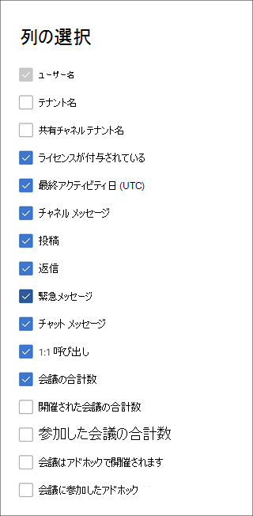

# 管理センターの Microsoft 365 レポート - Microsoft Teams ユーザー アクティビティ

Microsoft 365 の [レポート] ダッシュボードには、組織内での製品全体に関するアクティビティが表示されます。 これにより、個別の製品レベルのレポートを詳細に確認して、各製品内のアクティビティについてより詳しく知ることができます。 [レポートの概要に関するトピック](activity-reports.md)を参照してください。 Microsoft Teams ユーザー アクティビティ レポートで、組織内の Microsoft Teams アクティビティに関する分析情報を取得します。
 
## Microsoft Teams ユーザー アクティビティ レポートを取得する手順

1. 管理センターで、 **レポート** に移動し、[ **使用状況**] を選択します。

2. ダッシュボードのホームページで、Microsoft Teams アクティビティ カードの **[その他の表示** ] ボタンをクリックします。

## Microsoft Teams ユーザー アクティビティ レポートを解釈する

[ユーザー アクティビティ] タブを選択すると、Teams レポートで **ユーザー アクティビティ** を表示できます。  

[ **列の選択] を選択** して、レポートに列を追加または削除します。  

また、[**エクスポート**] リンクを選択して、レポート データを Excel の .csv ファイルにエクスポートすることもできます。 これにより、すべてのユーザーのデータがエクスポートされ、単純な並べ替えとフィルター処理を行ってさらに分析することができます。 **エクスポートされたオーディオ時間**、**ビデオ時間**、**および画面共有時間** の形式は、ISO8601 期間形式に従います。

[ **Microsoft Teams ユーザー アクティビティ**] レポートでは、過去 7 日間、30 日間、90 日間、または 180 日間の傾向を確認できます。 ただし、レポートで特定の日を選択した場合、テーブルには現在の日付から最大 28 日間のデータが表示されます (レポートが生成された日付ではありません)。

データ品質を確保するために、過去 3 日間の毎日のデータ検証チェックを実行し、検出されたギャップを埋めます。 プロセス中に履歴データの違いに気付く場合があります。

|アイテム|説明|
|:-----|:-----|
|**測定基準**|**定義**|
|ユーザー名    |ユーザーの電子メール アドレス。 実際のメール アドレスを表示することも、このフィールドを匿名にすることもできます。     |
|テナント名    |ユーザーが属する内部テナントまたは外部テナントの名前。       ユーザーが外部テナントに属している場合、対応するデータ メトリック (メッセージの投稿、応答メッセージなど) は、管理者のテナントの共有チャネルでの対話に基づいて計算されます。 (特定のテナントの共有チャネルの外部で) 自分のテナントでユーザーが行った対話は、特定のテナントの管理者使用状況レポートには考慮されません。  |
|共有チャネル テナント名     |ユーザーが参加した共有チャネルの内部テナントまたは外部テナントの名前。     |
|チャネル メッセージ     |指定した期間中にユーザーがチーム チャットに投稿した一意のメッセージの数。 これには、元の投稿と返信が含まれます。     |
|Posts     |指定した期間内のすべてのチャネル内の投稿メッセージの数。 投稿は、チーム チャットの元のメッセージです。  |
|Replies     |指定した期間中に、すべてのチャネルで返信されたメッセージの数。   |
|緊急メッセージ      |指定された期間中の緊急メッセージの数。   |
|チャットのメッセージ     |指定した期間中にユーザーがプライベート チャットに投稿した一意のメッセージの数。    |
|会議の合計数     |指定した期間中にユーザーが参加したオンライン会議の数。    |
|1:1 の呼び出し     | 指定した期間中にユーザーが参加した 1 対 1 の呼び出しの数。    |
|最終アクティビティ日 (UTC)    |ユーザーが Microsoft Teams アクティビティに参加した最後の日付。  |
|会議に参加したアドホック     | 指定された期間中にユーザーが参加したアドホック会議の数。    |
|会議はアドホックで開催されます   |指定された期間中にユーザーが開催したアドホック会議の数。  |
|開催された会議の合計数    |指定された期間中にユーザーが組織した、スケジュールされた 1 回限りの定期的な会議、アドホック会議、および未分類の会議の合計。    |
|参加した会議の合計数    |指定された期間中にユーザーが参加した 1 回限りのスケジュール済み、定期的、アドホック、および未分類の会議の合計。    |
|スケジュールされた 1 回限りの会議    |指定した期間中にユーザーが開催した 1 回限りのスケジュールされた会議の数。    |
|スケジュールされた定期的な会議    |指定された期間中にユーザーが開催した定期的な会議の数。    |
|会議がスケジュールされた 1 回限りの会議に参加しました    |指定した期間中にユーザーが参加した 1 回限りのスケジュールされた会議の数。    |
|会議に参加したスケジュールされた定期的な会議    |指定した期間中にユーザーが参加した定期的な会議の数。    |
|ライセンスが付与されている    |ユーザーが Teams を使用するライセンスを持つ場合に選択されます。  |
|その他のアクティビティ   |ユーザーはアクティブですが、レポートで提供される公開されたアクションの種類以外のアクティビティを実行しています (チャネル メッセージとチャット メッセージの送信または返信、1 対 1 の通話と会議のスケジュール設定または参加)。 アクションの例は、ユーザーが Teams の状態または Teams の状態メッセージを変更したり、チャネル メッセージの投稿を開いたりしても返信しない場合です。   |

## ユーザー固有のデータを匿名にする

Teams ユーザー アクティビティ レポートのデータを匿名にするには、グローバル管理者である必要があります。 これにより、レポート内の表示名、電子メール、Azure Active Directory オブジェクト ID、エクスポートなどの識別可能な情報 (MD5 ハッシュを使用) が非表示になります。

1. Microsoft 365 管理センターで、[設定 **組織の設定]** >  に移動し、[**サービス**] タブで [レポート] を選択 **します**。

2. [ **レポート**] を選択し、[ **匿名識別子の表示**] を選択します。 この設定は、Microsoft 365 管理センター管理センターと Teams 管理センターの使用状況レポートの両方に適用されます。

3. **[変更の保存]** を選択します。

## 関連コンテンツ

[Microsoft Teams のデバイス使用状況レポート](../activity-reports/microsoft-teams-device-usage-preview.md)

[Microsoft Teams の使用状況アクティビティ レポート](../activity-reports/microsoft-teams-usage-activity.md) 
