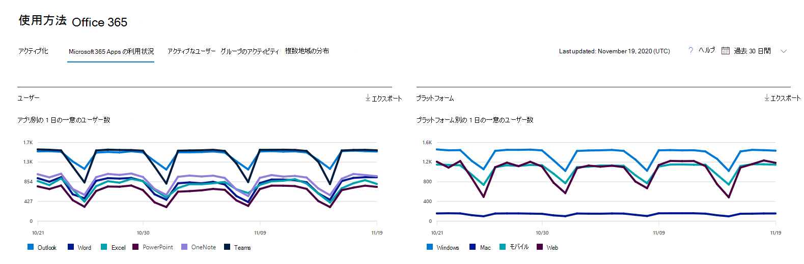

# Microsoft 365管理センターのレポート - Microsoft 365 Apps使用状況

Microsoft 365 の [**レポート**] ダッシュボードには、組織内での製品全体に関するアクティビティが表示されます。 これにより、個別の製品レベルのレポートを詳細に確認して、各製品内のアクティビティについてより詳しく知ることができます。 [レポートの概要に関するトピック](activity-reports.md)を参照してください。

 たとえば、Microsoft 365 Apps アプリを使用するライセンスを持つ各ユーザーのアクティビティを理解するには、アプリ全体でのアクティビティと、プラットフォーム間での利用方法を確認します。

 > [!NOTE]
 > レポートを表示するには、Microsoft 365 または Exchange、SharePoint、または Skype for Business 管理者のグローバル管理者、グローバル リーダー、またはレポート リーダーである必要があります。 共有コンピューターのライセンス認証は、このレポートには含まれません。

## 使用状況レポートにアクセスMicrosoft 365 Apps方法

1. 管理センターで、[**レポート**] \> [<a href="https://go.microsoft.com/fwlink/p/?linkid=2074756" target="_blank">使用状況</a>] ページの順に移動します。 
2. ダッシュボードのホームページで、[アクティブなユーザー] - [その他のユーザー]**カードの**[Microsoft 365 Appsクリックします。

## 使用状況レポートMicrosoft 365 Apps解釈する

ユーザーとプラットフォームのグラフを見Microsoft 365 Apps、ユーザーのアクティビティ **を****確認** できます。

> [!div class="mx-imgBorder"]
> 

|アイテム|説明|
 |:-----|:-----|
 |1.   |**[Microsoft 365 Apps利用状況** レポートは、過去 7 日間、30 日間、90 日間、または 180 日間の傾向を確認できます。 ただし、レポートで特定の日を選択すると、表 (7) には、(レポートが生成された日付ではなく) 現在の日付から最大 28 日間のデータが表示されます。   |
 |2.   |各レポートのデータは、通常、過去 2 日間までカバーされます。 6 日ごとに、データの品質を確保するために、マイナーな更新プログラムを使用してレポートを更新します。   |
 |3。   |[**ユーザー]** ビューには、アプリ (Outlook、Word、Excel、PowerPoint、OneNote、および Teams のアクティブ ユーザー数の傾向が表示されます。 "アクティブ ユーザー" は、これらのアプリ内で意図的なアクションを実行するユーザーです。   |
 |4.   |[**プラットフォーム] ビュー** には、各プラットフォームのすべてのアプリ (Windows、Mac、Web、およびモバイル) のアクティブ ユーザーの傾向が表示されます。   |
 |5. |[ユーザー **] グラフ** の Y 軸は、それぞれのアプリの一意のアクティブ ユーザーの数です。 [プラットフォーム **] グラフ**   の Y 軸は、それぞれのプラットフォームの一意のユーザー数です。 両方のグラフの X 軸は、特定のプラットフォームでアプリが使用された日付です。 |
 6. |凡例の項目を選択して、グラフに表示する系列をフィルター処理できます。 たとえば、[ユーザー]グラフで、[Outlook]、Word、Excel、PowerPoint、OneDrive、Teams、Teams のいずれかを選択して、各グラフに関連する情報のみを表示します。 この選択を変更しても、下のグリッド テーブルの情報は変更されません。|
 |7. |テーブルには、ユーザー レベルでのデータの内訳が表示されます。テーブルの列は追加または削除できます。    **ユーザー** 名は、ユーザー設定でアクティビティを実行したユーザーの電子メール Microsoft Apps。  **最後のライセンス認証日 (UTC)** は、ユーザーがコンピューターまたは共有コンピューターで Microsoft 365 Apps サブスクリプションをアクティブ化し、自分のアカウントでアプリを起動する最新の日付です。   **最後のアクティビティ日付 (UTC)** は、ユーザーが意図的なアクティビティを実行した最新の日付です。 特定の日付に発生したアクティビティを表示するには、直接グラフ内の日付を選択します。  他の列は、ユーザーが選択した期間に (Microsoft 365 Apps 内の) そのアプリのプラットフォームでアクティブだった場合を識別します。 |
 |8. |[列の **選択] アイコン** を選択して、レポートの列を追加または削除します。|
 |9. |また、[**エクスポート**] リンクを選択して、レポート データを Excel の .csv ファイルにエクスポートすることもできます。 これにより、すべてのユーザーのデータがエクスポートされ、簡単な集計、並べ替え、およびフィルター処理を実行して、さらに分析できます。 ユーザー数が 100 人未満の場合は、レポート自体のテーブル内で並べ替えとフィルター処理を行えます。 ユーザーが 100 人を超える場合は、フィルター処理と並べ替えを行う場合は、データをエクスポートする必要があります。|
