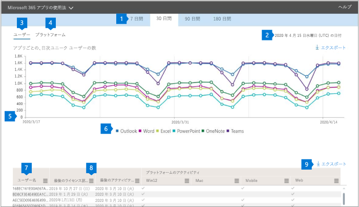

# 管理センターでの Microsoft 365 レポート-ProPlus の使用

Microsoft 365 **Reports** dashboard には、組織内の製品全体にわたるアクティビティの概要が表示されます。 これにより、個別の製品レベルのレポートを詳細に確認して、各製品内のアクティビティについてより詳しく知ることができます。 [レポートの概要に関するトピック](activity-reports.md)を参照してください。
  
たとえば、ProPlus アプリを使用するためにライセンスを付与された各ユーザーのアクティビティと、それらのアプリがプラットフォーム間でどのように利用されるかを知ることができます。  
  
> [!NOTE]
> レポートを表示するには、Microsoft 365 または Exchange、SharePoint、または Skype for Business 管理者のグローバル管理者、グローバルリーダー、またはレポート閲覧者である必要があります。 

## ProPlus 使用状況レポートを取得する方法

1. 管理センターで、[**レポート**] \> [<a href="https://go.microsoft.com/fwlink/p/?linkid=2074756" target="_blank">使用状況</a>] ページの順に移動します。

    
2. **[レポートの選択**] ドロップダウンから、[ **Office 365** \> **ProPlus usage** ] を選択します。

## ProPlus usage レポートを解釈する

**ユーザーおよび****プラットフォーム**のグラフを見ることで、ユーザーの ProPlus アクティビティのビューを取得できます。 

|||
|:-----|:-----|
|1.    |**ProPlus usage**レポートでは、過去7日間、30日間、90日間、または180日の傾向を確認できます。 ただし、レポートで特定の日を選択すると、表 (7) には、(レポートが生成された日付ではなく) 現在の日付から最大 28 日間のデータが表示されます。    |
|2.    |各レポートのデータは、通常、過去 24 - 48 時間まで表示されます。    |
|3.    |**ユーザー**ビュー iew には、各アプリ (Outlook、Word、Excel、PowerPoint、OneNote、Teams) のアクティブユーザー数の傾向が表示されます。 "アクティブユーザー" とは、これらのアプリ内で意図的なアクションを実行するユーザーのことです。    |
|4.    |[**プラットフォーム**] ビューには、各プラットフォーム (Windows、Mac、Web、モバイル) について、すべてのアプリにわたってアクティブなユーザーの傾向が表示されます。   |
|5. |[**ユーザー** ] グラフの Y 軸は、それぞれのアプリに対してアクティブな一意のユーザーの数です。 [ **プラットフォーム** ] グラフの Y 軸は、それぞれのプラットフォームの一意のユーザー数です。 両方のグラフの X 軸は、特定のプラットフォームでアプリが使用された日付です。 |
|6. |凡例の項目を選択して、グラフに表示する系列をフィルター処理できます。 たとえば、[**ユーザー** ] グラフでは、Outlook、Word、Excel、PowerPoint、OneDrive、または Teams を選択すると、それぞれに関連する情報のみが表示されます。 この選択を変更しても、その下のグリッドテーブルの情報は変更されません。|
|7. |テーブルには、ユーザー レベルでのデータの内訳が表示されます。 テーブルの列は追加または削除できます。   **Username**は、Microsoft アプリのアクティビティを実行したユーザーの電子メールアドレスです。  [**最終アクティブ化日 (UTC)** ] は、ユーザーが ProPlus サブスクリプションをアクティブ化した最新の日付です。  [**最後のアクティビティの日付 (UTC)** ] は、ユーザーによって意図的なアクティビティが実行された最新の日付です。 特定の日付に発生したアクティビティを表示するには、直接グラフ内の日付を選択します。  選択した期間内にユーザーがそのアプリでアクティブだったかどうかを識別する各アプリに対応する次の列。   **Outlook**  **Word**  **Excel** **PowerPoint**  **OneNote**   選択されている期間内にユーザーが (ProPlus 内の) 任意のアプリに対してアクティブであったかどうかを示す、各プラットフォームに対応する次の列。  **Outlook (Windows)** **Outlook (Mac)** **Outlook (Web)**  **Outlook (モバイル)**  **Word (Windows)**  **Word (Mac)**  **Word (Web)**  **Word (Mobile)**  **Excel (Windows)**  **Excel (Mac)**  **Excel (Web)**  **Excel (Mobile)**  **PowerPoint (Windows)**  **PowerPoint (Mac)** **PowerPoint (Web)**  **PowerPoint (Mobile)**  **OneNote (Windows)**  **OneNote (Mac)**  **OneNote (Web)** **OneNote (モバイル)**  **Teams (Windows)**  **Teams (Mac)**  **Teams (Web)** **Teams (モバイル)** |
|8. |レポートの列を追加または削除するには、[**列の管理**] アイコンを選択します。|
|9. |また、[**エクスポート**] リンクを選択して、レポート データを Excel の .csv ファイルにエクスポートすることもできます。 これにより、すべてのユーザーのデータがエクスポートされ、単純な集計、並べ替え、およびフィルター処理を行ってさらに分析することができます。 ユーザー数が100未満の場合は、レポート自体のテーブル内で並べ替えとフィルター処理を行うことができます。 100を超えるユーザーがいる場合は、フィルター処理と並べ替えを行うために、データをエクスポートする必要があります。|