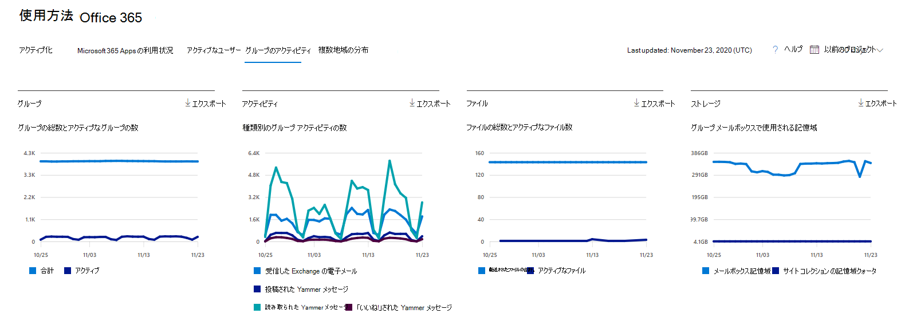
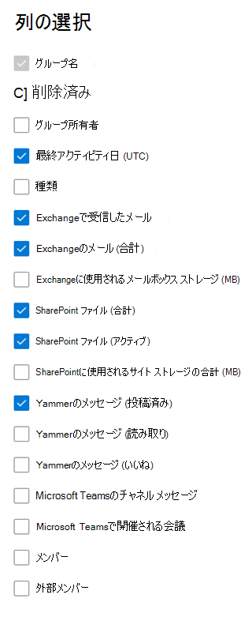

# 管理センターでの Microsoft 365 レポート - Microsoft 365 グループ

Microsoft 365 の [**レポート**] ダッシュボードには、組織内での製品全体に関するアクティビティが表示されます。 これにより、個別の製品レベルのレポートを詳細に確認して、各製品内のアクティビティについてより詳しく知ることができます。 [レポートの概要に関するトピック](activity-reports.md)を参照してください。 Microsoft 365 グループレポートでは、組織内のグループのアクティビティに関する詳細を分析したり、作成中および使用中のグループの数を確認したりすることができます。
  
> [!NOTE]
> レポートを表示するには、Microsoft 365 のグローバル管理者、グローバル閲覧者、レポート閲覧者、または Exchange、SharePoint、Skype for Business の管理者である必要があります。  
  
## グループ レポートを作成する方法

1. 管理センターで、[**レポート**] \> [<a href="https://go.microsoft.com/fwlink/p/?linkid=2074756" target="_blank">使用状況</a>] ページの順に移動します。 
2. ダッシュボードのホームページで、[アクティブ なユーザー] ( Microsoft 365 Apps または [アクティブ ユーザー - Microsoft 365 サービス] カードの [その他の表示] ボタンをクリックして、[Office 365 レポート] ページに移動します。
  
## グループ レポートを解釈する

[グループ] アクティビティ タブを選択すると、Office 365レポートでライセンス認証 **を表示** できます。 

[列 **の選択]** を選択して、レポートの列を追加または削除します。    

また、[**エクスポート**] リンクを選択して、レポート データを Excel の .csv ファイルにエクスポートすることもできます。 これにより、すべてのユーザーのデータがエクスポートされ、単純な並べ替えとフィルター処理を行ってさらに分析することができます。 ユーザー数が 2000 未満である場合は、レポート自体のテーブル内で並べ替えとフィルター処理を行うことができます。 ユーザー数が 2000 を超える場合は、フィルター処理と並べ替えを行うために、データをエクスポートする必要があります。 

|項目|説明|
|:-----|:-----|
|**測定基準**|**定義**|
|グループ名    |グループの名前を指定します。    |
|Deleted    |削除されたグループの数。 削除されたがレポート期間中にアクティビティがあるグループは、グリッドでこのフラグが true に設定されることで示されます。    |
|グループ所有者    |グループ所有者の名前。    |
|最終アクティビティ日 (UTC)    |グループがメッセージを受信した最新の日付。 これはメールの会話、Yammer またはサイトでアクティビティが発生した最後の日付です。    |
|型    |グループの種類。 これにはプライベート グループとパブリック グループがあります。    |
|受信したメールは、Exchange    |グループによって受信されたメッセージの数。|
|[メール] Exchange (合計)    |グループのメールボックス内のアイテムの総数。    |
|メールボックス ストレージは、Exchange (MB) に使用されます。    |グループのメールボックスで使用される記憶域。  |
|SharePointファイル (合計)    |グループ サイトに保存SharePoint数。    |
|SharePointファイル (アクティブ)    |レポート期間中に実行された SharePoint グループ サイト内のファイルの数 (表示または変更、同期、内部または外部共有)。    |
|ユーザーに使用されるサイト ストレージSharePoint (MB)    |レポート期間中に使用される MB 単位の記憶域の量。    |
|[メッセージ] Yammer (投稿)    |レポート期間中に、Yammerグループに投稿されたメッセージの数。    |
|[メッセージ] Yammer (読み取り)    |レポート期間中にグループで読み取Yammer会話の数。    |
|[メッセージ] Yammer (お気に入り)    |レポート期間中に、Yammerグループで気に入ったメッセージの数。    |
|メンバー    |グループ内のメンバーの数。    |
|外部メンバー |グループ内の外部ユーザーの数。|
|||

## 関連コンテンツ

[Microsoft 365管理センターのレポート](activity-reports.md)(記事)\
[セキュリティ コンプライアンス センター&レポート](../../compliance/reports-in-security-and-compliance.md) (記事)\
[Microsoft 365管理センターの [レポート] - アクティブ ユーザー](../../admin/activity-reports/active-users-ww.md) (記事)

