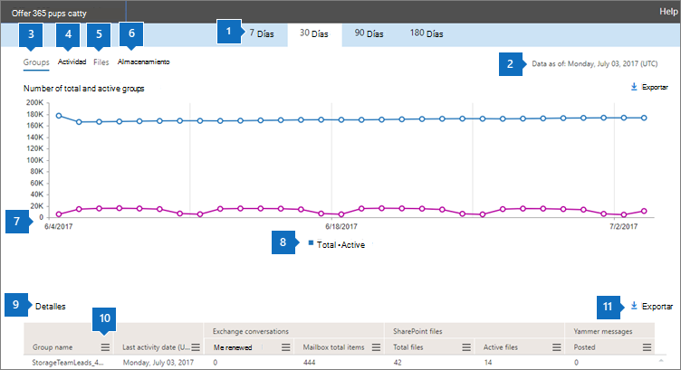

# 管理センターでの Microsoft 365 レポート - Microsoft 365 グループ

Microsoft 365 の [**レポート**] ダッシュボードには、組織内での製品全体に関するアクティビティが表示されます。 これにより、個別の製品レベルのレポートを詳細に確認して、各製品内のアクティビティについてより詳しく知ることができます。 [レポートの概要に関するトピック](activity-reports.md)を参照してください。 Microsoft 365 グループレポートでは、組織内のグループのアクティビティに関する詳細を分析したり、作成中および使用中のグループの数を確認したりすることができます。
  
> [!NOTE]
> レポートを表示するには、Microsoft 365 のグローバル管理者、グローバル閲覧者、レポート閲覧者、または Exchange、SharePoint、Skype for Business の管理者である必要があります。  
  
## グループ レポートを作成する方法

1. 管理センターで、[**レポート**] \> [<a href="https://go.microsoft.com/fwlink/p/?linkid=2074756" target="_blank">使用状況</a>] ページの順に移動します。

2. オプションから、[**アクティブなユーザー - Microsoft 365 サービス**] の下の [**詳細を表示する**] を選択します。
3. [**レポートの選択**] ドロップダウンから、[**Office 365**] \> [**グループのアクティビティ**] の順に選択します。
  
## グループ レポートを解釈する

[**グループ**]、[**アクティビティ**]、[**ファイル**]、[**記憶域**] のグラフを見ることで、グループのアクティビティの概要がわかります。 
  

  
|アイテム|説明|
|:-----|:-----|
|1.    |[**Microsoft 365 グループ**] レポートでは、過去 7 日間、30 日間、90 日間、または 180 日間の傾向を確認できます。 ただし、レポートで特定の日を選択すると、表 (7) には、(レポートが生成された日付ではなく) 現在の日付から最大 28 日間のデータが表示されます。    |
|2.    |各レポートのデータは、通常、過去 24 - 48 時間まで表示されます。    |
|3.    |[**グループ**] ビューには、指定された日に存在するグループの合計数、メールの会話、Yammer への投稿、SharePoint ファイルのアクティビティ、表示された SharePoint のページに基づいて、その日のアクティブなグループが表示されます。    |
|4.    |[**アクティビティ**] ビューには、グループ ワークロード全体のグループ アクティビティの数が表示されます。 レポート期間中の任意の日に、すべてのグループのグループ メールボックスで受信された Exchange メールを表示することもできます。 また、グループに関連付けられている Yammer グループ全体で、投稿、閲覧、およびいいね! が付けられたメッセージを表示することもできます。   |
|5.    |[**ファイル**] ビューには、グループと関連付けられているすべてのグループ サイトのファイルの合計数とアクティブなファイル数が表示されます。    |
|6.    |[**記憶域**] ビューには、すべてのグループ メールボックスとグループ サイトが使用した記憶域の合計が表示されます。    |
|7.    | [**グループ**] グラフの Y 軸は、(合計とアクティブが対比して表示される) グループの数です。     [**アクティビティ**] グラフの Y 軸は、アクティビティがグループで実行された回数です。     [**ファイル**] グラフの Y 軸は、ファイルの合計数またはアクティブなファイル数です。     [**記憶域**] グラフの Y 軸は、グループ メールボックスまたはサイトによって使用された記憶域の合計です。     3 つのグラフの X 軸はすべて、特定のレポートに対して選択した日付範囲です。    |
|8.    |凡例の項目を選択して、グラフに表示する系列をフィルター処理できます。 たとえば、[**グループ**] グラフで [**合計**] または [**アクティブ**] を選択すると、それぞれに関連した情報のみが表示されます。 この選択を変更しても、グリッド テーブルの情報は変更されません。    |
|9.    | 表示されるグループのリストは、最も長い (180 日) レポート期間にわたって存在した (削除されなかった) すべてのグループのセットによって決まります。アクティビティ数 (メールの会話、Yammer への投稿、および SharePoint ファイルのアクティビティ) は、日付の選択によって異なります。    注: 次の一覧のすべての項目は、追加するまで列に表示されないことがあります。 [**グループ名**] は、グループの名前です。    [**削除済み**] は、削除されたグループの数です。削除されたがレポート期間中にアクティビティがあるグループは、グリッドでこのフラグが true に設定されることで示されます。    [**グループ所有者**] は、グループの所有者の名前です。    [**最終処理日**] は、グループが最後にメッセージを受信した日付です。 これはメールの会話、Yammer またはサイトでアクティビティが発生した最後の日付です。    [**種類**] は、グループの種類です。これにはプライベート グループとパブリック グループがあります。    [**メンバー**] は、グループのメンバーの数です。    [ **外部メンバー** ] は、グループ内の外部ユーザーの数です。    **Exchange**   [**受信された電子メール**] は、グループが受信したメッセージの数です。    [**メールボックス アイテムの合計数**] は、グループのメールボックス内にあるアイテムの合計数です。    [**使用済みのメールボックス記憶域**] は、グループのメールボックスによって使用された記憶域です。    **SharePoint ファイル**   [**ファイルの総数**] は、SharePoint グループ サイトに保存されているファイルの数です。    [**アクティブなファイル**] は、レポート期間中に SharePoint グループ サイト内で操作が行われた (内部的または外部的に、表示、変更、同期、または共有された) ファイルの数です。    [ **使用済みのサイト記憶域 (MB)** ] は、レポート期間中に使用された記憶域の量 (MB) です。    **Yammer のメッセージ**   [**投稿**] はレポート期間中に Yammer グループに投稿されたメッセージの数です。    [**閲覧**] は、レポート期間中に Yammer グループで閲覧された会話の数です。    [**いいね!**] はレポート期間中に Yammer グループでいいね! が付けられたメッセージの数です。     組織のポリシーにより、ユーザー情報を特定できるレポートを表示できない場合は、これらすべてのレポートのプライバシー設定を変更できます。 「**Microsoft 365 管理センターのアクティビティ レポート**」の「[ユーザー レベルの詳細を非表示にする方法](activity-reports.md)」セクションを参照してください。    |
|10.    |列の見出しの横にある [**その他のアクション**] ボタン ![モバイル OWA の [その他のアクション]](../../media/80044eef-2368-4c7e-8d31-7155b029e0cf.png) を選択またはタップして、レポートに列を追加またはレポートから列を削除します。    |
|11.    |また、[**エクスポート**] リンクを選択して、レポート データを Excel の .csv ファイルにエクスポートすることもできます。 これにより、すべてのユーザーのデータがエクスポートされ、単純な並べ替えとフィルター処理を行ってさらに分析することができます。 ユーザー数が 2000 未満である場合は、レポート自体のテーブル内で並べ替えとフィルター処理を行うことができます。 ユーザー数が 2000 を超える場合は、フィルター処理と並べ替えを行うために、データをエクスポートする必要があります。    |
|||
   
