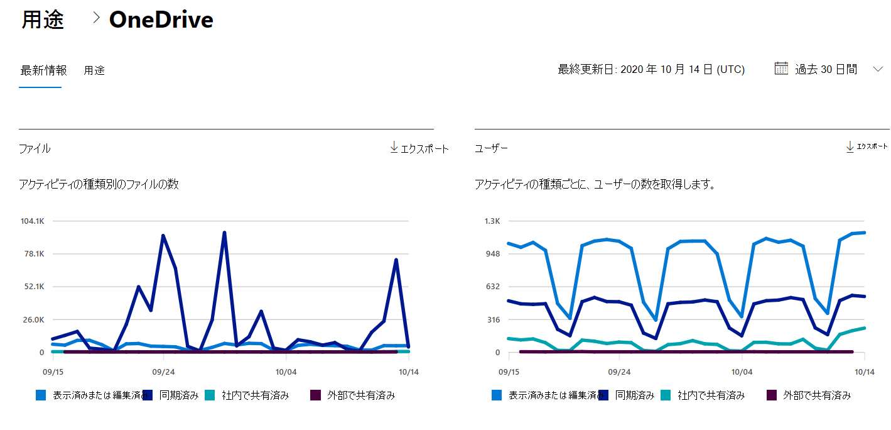

# Microsoft 365管理センターの [レポート] - OneDrive for Businessアクティビティ

Microsoft 365 の [レポート] ダッシュボードには、組織内での製品全体に関するアクティビティが表示されます。 これにより、個別の製品レベルのレポートを詳細に確認して、各製品内のアクティビティについてより詳しく知ることができます。 [レポートの概要トピック](activity-reports.md)を参照してください。
  
たとえば、OneDrive でのファイルの操作を調べることで、OneDrive を使用するライセンスを持つすべてのユーザーのアクティビティを把握できます。また、共有されているファイルの数を調べると、行われているコラボレーションのレベルを把握できます。

## OneDrive アクティビティ レポートの作成方法

1. 管理センターで、[**レポート**] \> [<a href="https://go.microsoft.com/fwlink/p/?linkid=2074756" target="_blank">使用状況</a>] ページの順に移動します。 
2. ダッシュボードのホームページで、カードの [その他の表示] OneDriveクリックします。
  
## OneDrive for Business アクティビティ レポートの解釈

[アクティビティ] タブを選択すると、OneDriveレポートでアクティビティ **を表示** できます。 

[列 **の選択]** を選択して、レポートの列を追加または削除します。    

また、[**エクスポート**] リンクを選択して、レポート データを Excel の .csv ファイルにエクスポートすることもできます。 これにより、すべてのユーザーのデータがエクスポートされ、単純な並べ替えとフィルター処理を行ってさらに分析することができます。 ユーザー数が 2000 未満である場合は、レポート自体のテーブル内で並べ替えとフィルター処理を行うことができます。 ユーザー数が 2000 を超える場合は、フィルター処理と並べ替えを行うために、データをエクスポートする必要があります。

**OneDrive for Business アクティビティ** レポートでは、過去 7 日間、30 日間、90 日間、または 180 日間の傾向を確認できます。 ただし、レポートで特定の日を選択すると、現在の日付から最大 28 日間のデータが表示されます (レポートが生成された日付ではありません)。
  
|アイテム|内容|
|:-----|:-----|
|**測定基準**|**定義**|
|Username    |ユーザー アカウントの所有者のユーザー OneDriveします。    |
|最終アクティビティ日 (UTC)    |選択した日付範囲のユーザー アカウントでOneDriveアクティビティが実行された最新の日付。 . 特定の日付に発生したアクティビティを表示するには、直接グラフ内の日付を選択します。    |
|表示または編集されたファイル    |ユーザーがアップロード、ダウンロード、変更、または表示したファイルの数。     |
|同期されたファイル    |ユーザーのローカル デバイスからユーザー アカウントに同期されたファイルOneDriveします。   |
|内部で共有されるファイル    | 組織内のユーザー、またはグループ内のユーザーと共有されているファイルの数 (外部ユーザーを含む場合があります)。    |
|外部で共有されるファイル    |組織外のユーザーと共有されているファイルの数。  |
|削除済み    | これは、ユーザーのライセンスが削除されたかどうかを示します。    注: 削除されたユーザーのアクティビティは、選択した期間中にライセンスを取得された場合でも、レポートに表示されます。 [ **削除済み** ] 列は、アクティブではない状態になったユーザーが引き続きレポート内のデータに影響している可能性に注意するのに役立ちます。    |
|削除日    |ユーザーのライセンスが削除された日付。  |
|割り当てられた製品    |ユーザー Microsoft 365ライセンスされている製品の一覧です。|
|||