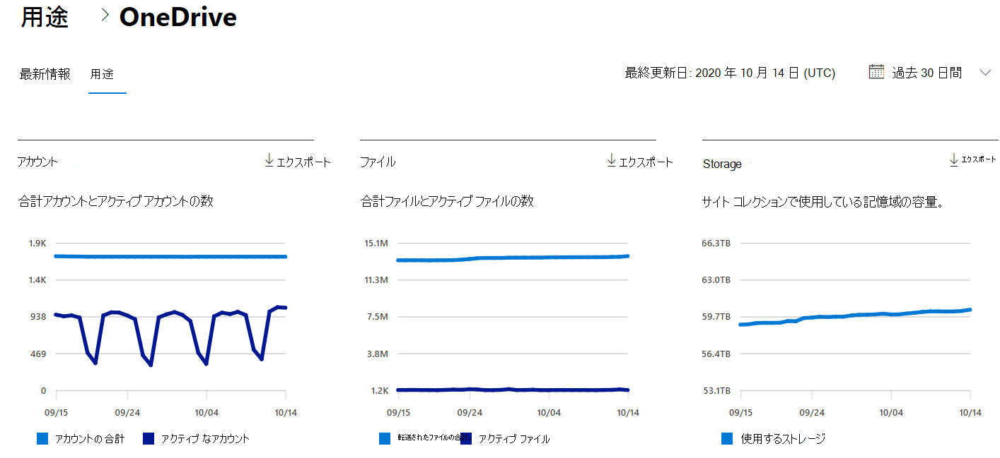

# Microsoft 365管理センターのレポート - OneDrive for Business使用状況

Microsoft 365 の [**レポート**] ダッシュボードには、組織内での製品全体に関するアクティビティが表示されます。 これにより、個別の製品レベルのレポートを詳細に確認して、各製品内のアクティビティについてより詳しく知ることができます。 [レポートの概要に関するトピック](activity-reports.md)を参照してください。
  
たとえば、ダッシュボードの OneDrive カードには、組織内で使用されているファイルの総数とストレージについて OneDrive for Business から得た値の概要が表示されます。これを詳細に調べて、アクティブな OneDrive アカウントの傾向や、ユーザーが操作しているファイル数と使用しているストレージの傾向を把握できます。このレポートには、各ユーザーの OneDrive ごとの詳細も表示されます。
  
> [!NOTE]
> レポートを表示するには、Microsoft 365 のグローバル管理者、グローバル閲覧者、レポート閲覧者、または Exchange、SharePoint、Skype for Business の管理者である必要があります。  
 
## OneDrive アクティビティ レポートの作成方法

1. 管理センターで、[**レポート**] \> [<a href="https://go.microsoft.com/fwlink/p/?linkid=2074756" target="_blank">使用状況</a>] ページの順に移動します。 
2. ダッシュボードのホームページで、カードの[その他の表示] OneDriveクリックします。
  
## OneDrive の利用状況レポートの解釈

[使用状況] タブを選択すると、OneDriveレポートで使用状況を **表示** できます。 

[列 **の選択]** を選択して、レポートの列を追加または削除します。    

また、[**エクスポート**] リンクを選択して、レポート データを Excel の .csv ファイルにエクスポートすることもできます。 これにより、すべてのユーザーのデータがエクスポートされ、単純な並べ替えとフィルター処理を行ってさらに分析することができます。 ユーザー数が 2000 未満である場合は、レポート自体のテーブル内で並べ替えとフィルター処理を行うことができます。 ユーザー数が 2000 を超える場合は、フィルター処理と並べ替えを行うために、データをエクスポートする必要があります。 
  
|アイテム|説明|
|:-----|:-----|
|**測定基準**|**定義**|
|URL    |ユーザーのアカウントの web OneDrive。   |
|Deleted    |ファイルの削除OneDrive。 アカウントを削除済みとしてマークするには、少なくとも 7 日かかります。    |
|所有者    |管理者のプライマリ管理者のOneDrive。     |
|所有者プリンシパル名    |ユーザーの所有者の電子メール OneDrive。   |
|最終アクティビティ日 (UTC)    | ファイル アクティビティがレポート で実行された最新のOneDrive。 OneDrive にファイル アクティビティがなかった場合、値は空白になります。    |
|ファイル    |ファイル内のファイルのOneDrive。  |
|アクティブ ファイル    | 期間内のアクティブ ファイルの数。  注: レポートの指定した期間中にファイルが削除された場合、レポートに表示されるアクティブ なファイルの数は、OneDrive の現在のファイル数よりも多い場合があります。 >  削除されたユーザーはレポートに 180 日間表示され続けます。    |
|Storage使用 (MB)    |ユーザーが使用するストレージOneDrive MB 単位で指定します。 |
|||