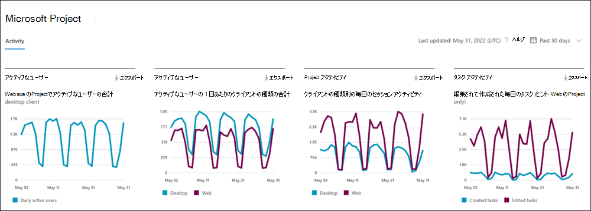

# 管理センターでレポートをMicrosoft 365する - Project アクティビティ

Microsoft 365 の [レポート] ダッシュボードには、組織内での製品全体に関するアクティビティが表示されます。 これにより、個別の製品レベルのレポートを詳細に確認して、各製品内のアクティビティについてより詳しく知ることができます。 [レポートの概要に関するトピック](activity-reports.md)を参照してください。 

**Project アクティビティ レポート** では、Projectとの対話を見て、Microsoft Projectを使用するライセンスを持つすべてのユーザーのアクティビティを理解できます。 また、アクセスしたプロジェクトの数と作成または編集されたタスクを調べて、コラボレーションのレベルを把握するのにも役立ちます。 
 
## Project アクティビティ レポートにアクセスする方法

1. 管理センターで、[**レポート**] \> [<a href="https://go.microsoft.com/fwlink/p/?linkid=2074756" target="_blank">使用状況</a>] ページの順に移動します。
2. ダッシュボードのホームページで、Project カードの **[その他の表示**] ボタンをクリックします。

## Project アクティビティ レポートを解釈する

このレポートを使用して、環境内のProjectのアクティビティと使用状況を確認できます。 このレポートには、次の 4 つの概要グラフが表示されます。   

- **アクティブなユーザー** - 毎日のアクティブなユーザーを時間の経過と共に表示します。 現時点では、これには、Web クライアントとProject Online デスクトップ クライアントのProjectのみが含まれています。
- **アクティブ ユーザー (クライアント別)** - クライアント (Web とデスクトップ クライアントのProject) によって分割された、毎日のアクティブなユーザーを毎日表示します Project Online。
- **Project アクティビティ** - 時間の経過に伴うProjectの 1 日のセッション数を各クライアント (Web およびProject Online デスクトップ クライアントのProject) ごとに表示します。
- **タスク アクティビティ** - Web のProjectで時間の経過と共に作成または編集されたタスクの 1 日の数を表示します 

また、このレポートには、環境内の各プロジェクト ユーザーのアクティビティを示すテーブルもあります。

テーブルに列を追加または削除する列の **選択を選択** します。    

また、[**エクスポート**] リンクを選択して、レポート データを Excel の .csv ファイルにエクスポートすることもできます。 これにより、すべてのユーザーのデータがエクスポートされ、単純な並べ替えとフィルター処理を行ってさらに分析することができます。 

**Projectアクティビティ** レポートは、過去 7 日間、30 日間、90 日間、または 180 日間の傾向を確認できます。 レポートで特定の日を選択すると、その日のユーザーの使用状況が表示されるように、ユーザーごとのデータ テーブルが更新されます。 ただし、この機能は最新の 28 日間のみ機能します。

### プライバシー設定がダッシュボードに与える影響

ユーザーまたは管理者のプライバシー設定が **どちらも** 設定されていない場合、Project Online デスクトップ クライアントの **Projectアクティビティ** チャートの正確なメトリックはありません。 表示される数値は過不足になります。 プライバシー設定の詳細については、「[ポリシー設定を使用して、Microsoft 365 Apps for enterpriseのプライバシー制御を管理する」を](/deployoffice/privacy/manage-privacy-controls.md)参照してください。

## ユーザー アクティビティ テーブル
ユーザー アクティビティ テーブルの各メトリックの定義を次に示します。 

|アイテム|説明|
|:-----|:-----|
|**測定基準**|**定義**|
|ユーザー名    |ユーザーのプリンシパル名。     |
|表示名     |ユーザーの完全な名前。    |
|最終アクティビティの日付     |その行のユーザーがProjectでアクティビティを行った最新の日付 (概要レポートのアクティビティを含む)。     |
|アクセスしたプロジェクト (デスクトップ)     |ページの右上で選択された時間範囲の間に、Project Online デスクトップ クライアントでユーザーが開いたプロジェクトの数。      |
|アクセスしたプロジェクト (Web)     | ページの右上で選択された時間範囲の間に、Web のProjectのユーザーによって作成されたタスクの数。     |
|作成されたタスク (Web)     |ページの右上で選択された時間範囲の間に、Web のProjectのユーザーによって作成されたタスクの数。   |
|編集されたタスク (Web)      |ページの右上で選択された時間範囲の間に、Web のProjectでユーザーが編集したタスクの数。    |
|その他   |この値は、ユーザーがProject Onlineデスクトップ クライアントで、またはページの右上で選択された時間範囲の Web のProject (他の列でカバーされていない) でアクティビティを実行した場合に当てはまります。 ユーザーが持っていない場合、この値は false です。  |
|||

