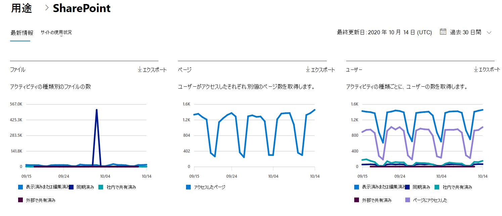

# Microsoft 365管理センターのレポート - SharePointアクティビティ

管理者としてMicrosoft 365レポート ダッシュボードには、組織内のさまざまな製品のアクティビティの概要が表示されます。 これにより、各製品に固有のアクティビティについてより詳しく知ることができます。 [アクティビティ][の [アクティビティ レポート] をMicrosoft 365 管理センター。](activity-reports.md)
  
たとえば、ファイルの操作を調べることで、SharePoint を使用するライセンスを持つすべてのユーザーのアクティビティを把握できます。また、共有されているファイルの数を調べると、行われているコラボレーションのレベルを把握できます。
  
> [!NOTE]
> レポートを表示するには、Microsoft 365 のグローバル管理者、グローバル閲覧者、レポート閲覧者、または Exchange、SharePoint、Skype for Business の管理者である必要があります。 
 
## SharePoint アクティビティ レポートにアクセスする方法

1. 管理センターで、[**レポート**] \> [<a href="https://go.microsoft.com/fwlink/p/?linkid=2074756" target="_blank">使用状況</a>] ページの順に移動します。 
2. ダッシュボードのホームページで、カードの [その **他の表示**] SharePointクリックします。
  
## アクティビティ レポートSharePoint解釈する

[アクティビティ] タブを選択すると、SharePointレポートでアクティビティ **を表示** できます。 

[列 **の選択]** を選択して、レポートの列を追加または削除します。    

また、[**エクスポート**] リンクを選択して、レポート データを Excel の .csv ファイルにエクスポートすることもできます。 これにより、すべてのユーザーのデータがエクスポートされ、単純な並べ替えとフィルター処理を行ってさらに分析することができます。 ユーザー数が 2000 未満である場合は、レポート自体のテーブル内で並べ替えとフィルター処理を行うことができます。 ユーザー数が 2000 を超える場合は、フィルター処理と並べ替えを行うために、データをエクスポートする必要があります。 
  
|アイテム|説明|
|:-----|:-----|
|**測定基準**|**定義**|
|Username    |サイトでアクティビティを実行したユーザーの電子メール SharePointです。    |
|最終アクティビティ日 (UTC)    |ファイル アクティビティが実行された最新の日付、または選択した日付範囲のページが表示された日付。 特定の日付に発生したアクティビティを表示するには、直接グラフ内の日付を選択します。    |
|表示または編集されたファイル    |ユーザーがアップロード、ダウンロード、変更、または表示したファイルの数。     |
|同期されたファイル    |ユーザーのローカル デバイスから別のサイトに同期されたファイルSharePointします。   |
|内部で共有されるファイル    | 組織内のユーザー、またはグループ内のユーザーと共有されたファイルの数 (外部ユーザーを含む場合があります)。    |
|外部で共有されるファイル    |組織外のユーザーと共有されているファイルの数。  |
|アクセスしたページ    |ユーザーによる一意のページへのアクセス。  |
|Deleted    | これは、ユーザーのライセンスが削除されたかどうかを示します。     **注:** 削除されたユーザーのアクティビティは、選択した期間中にライセンスを取得した場合でも、レポートに表示されます。 [削除済みの列] は、アクティブではないユーザーに気づく際に役立ちますが、レポート内のデータには反映されます。    |
|削除日    |ユーザーのライセンスが削除された日付。  |
|割り当てられた製品    |ユーザー Microsoft 365ライセンスされている製品の一覧です。|
|||