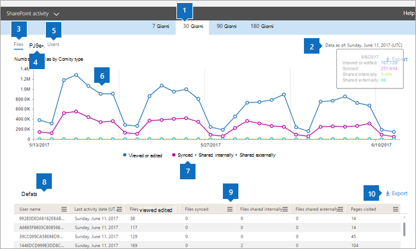

# 管理センターの Microsoft 365 レポート-SharePoint アクティビティMicrosoft 365 Reports in the admin center - SharePoint activity

Microsoft 365 管理者としての **レポート** ダッシュボードには、組織内のさまざまな製品におけるアクティビティの概要が表示されます。As an Microsoft 365 admin, the **Reports** dashboard shows you the activity overview across various products in your organization. これにより、各製品に固有のアクティビティについてより詳しく知ることができます。It enables you to drill in to get more granular insight about the activities specific to each product. [Microsoft 365 管理センターのアクティビティレポート](activity-reports.md)を確認してください。Check out the [activity reports in the Microsoft 365 admin center](activity-reports.md).
  
たとえば、ファイルの操作を調べることで、SharePoint を使用するライセンスを持つすべてのユーザーのアクティビティを把握できます。また、共有されているファイルの数を調べると、行われているコラボレーションのレベルを把握できます。For example, you can understand the activity of every user licensed to use SharePoint by looking at their interaction with files. It also helps you to understand the level of collaboration going on by looking at the number of files shared.
  
> [!NOTE]
> 一部の機能は徐々に導入されます。つまり、この機能はまだ表示されない場合があります。または、このヘルプ記事で説明されている機能とは異なって見える場合があります。ただし、ご心配はいりません。今は表示されなくても、まもなくご利用になれます。Some functionality is introduced gradually. This means that you may not yet see this feature or it may look different than what is described in the help articles. But don't worry - if you don't see it yet, it's coming soon! 
  
各 SharePoint サイトに対するアクティビティの量と記憶域の使用率を把握する場合は、[SharePoint サイトの利用状況レポート](sharepoint-site-usage.md)を使用します。If you want to understand the amount of activity happening against each SharePoint site and the storage utilization, view the [SharePoint site usage report](sharepoint-site-usage.md).
  
> [!NOTE]
> レポートを表示するには、Microsoft 365 または Exchange、SharePoint、Teams サービス、Teams 通信、または Skype for Business 管理者のグローバル管理者、グローバル閲覧者またはレポート閲覧者である必要があります。You must be a global administrator, global reader or reports reader in Microsoft 365 or an Exchange, SharePoint, Teams Service, Teams Communications, or Skype for Business administrator to see reports.  
 
## SharePoint アクティビティ レポートにアクセスする方法How do I get to the to the SharePoint activity report?

1. 管理センターで、[**レポート**] \> [<a href="https://go.microsoft.com/fwlink/p/?linkid=2074756" target="_blank">使用状況</a>] ページの順に移動します。In the admin center, go to the **Reports** \> <a href="https://go.microsoft.com/fwlink/p/?linkid=2074756" target="_blank">Usage</a> page.

    
2. **[レポートの選択**] ドロップダウンから、[ **SharePoint**アクティビティ] を選択し \> **Activity**ます。From the **Select a report** drop-down, select **SharePoint** \> **Activity**.
  
## SharePoint アクティビティ レポートの解釈Interpreting the SharePoint activity report

SharePoint のアクティビティは、[ **ファイル**] ビューと [ **ユーザー**] ビューを見るとわかります。You can get a view into SharePoint activity by looking at the **Files** and **Users** views.  
  
|アイテムItem|説明Description|
|:-----|:-----|
|1.1.    |[ **SharePoint アクティビティ レポート**] では、過去 7 日間、30 日間、90 日間、または 180 日間の傾向を確認できます。The **SharePoint activity report** can be viewed for trends over the last 7 days, 30 days, 90 days, or 180 days. ただし、レポートで特定の日を選択すると、表 (7) には、(レポートが生成された日付ではなく) 現在の日付から最大 28 日間のデータが表示されます。However, if you select a particular day in the report, the table (7) will show data for up to 28 days from the current date (not the date the report was generated).    |
|2.2.    |各レポートのデータは、通常、過去 24 - 48 時間まで表示されます。The data in each report usually covers up to the last 24 to 48 hours.    |
|3.3.    |[ **ファイル**] ビューを見ると、SharePoint サイトに保存されているファイルを操作しているライセンス ユーザーの数がわかります。The **Files** view helps you understand the unique numbers of licensed users that perform file interactions with files stored on SharePoint sites.    |
|4.4.    |[ **ページ** ] ビューには、ユーザーがアクセスした個別のページ数が表示されます。The **Pages** view shows you the number of unique pages visited by users.    |
|5.5.    |[ **ユーザー**] ビューを見ると、アクティブなユーザーの数の傾向がわかります。アクティブなユーザーとは、特定の期間内にファイル アクティビティ (保存、同期、変更、共有) を実行したか、ページにアクセスしたユーザーです。  The **Users** view helps you to understand the trend in the number of active users. A user is considered active if he or she has executed a file activity (save, sync, modify, or share) or visited a page within the specific time period.    注: ファイルアクティビティは1つのファイルに対して複数回発生することがありますが、1つのアクティブなファイルとしてカウントされます。NOTE: A file activity can occur multiple times for a single file, but will count only as one active file. たとえば、一定の期間に複数回、同じファイルを保存して同期することができますが、データには単独のアクティブなファイルと、単独の同期されたファイルとしてカウントされます。For example, you can save and sync the same file multiple times over a specified time period, but it will count only as one single active file and one single synced file in the data           |
|6.6.    | [ **ファイル**] グラフの Y 軸は、ユーザーが保存、同期、変更、または共有した個別のファイルの数です。On the **Files** chart, the Y axis is the count of unique files that a user either saved, synced, modified, or shared.     [ **ユーザー**] グラフの Y 軸は、サイトでファイルの操作 (保存、同期、変更、共有) を実行した個別のユーザーの数です。On the **Users** chart, the Y axis is the number of unique users that either performed a file interaction (save, sync, modify, or share) on a site.     [ **ページ**] グラフの X 軸は、ユーザーがアクセスした個別のページ数です。On the **Pages** chart, the X axis is the count of unique pages the users visited.     すべてのグラフで、X 軸はこの特定のレポートに対して選択した日付範囲です。The X axis on all charts is the selected date range for this specific report.    |
|7.7.    |凡例の項目を選択して、グラフに表示する系列をフィルター処理できます。You can filter the series you see on the chart by selecting an item in the legend. たとえば、[ **ファイル** ] グラフで、[ **表示または編集**、 **同期**済み]、[ **内部共有**]、または [ **外部共有** ] を選択すると、それぞれに関連する情報のみが表示されます。For example, on the **Files** chart, select **Viewed or edited**, **Synced**, **Shared internally**, or **Shared externally** to see only the info related to each one. この選択を変更しても、グリッド テーブルの情報は変更されません。Changing this selection doesn't change the info in the grid table.    |
|8.8.    | テーブルには、サイト レベルでのアクティビティの内訳が表示されます。The table shows you a breakdown of the activities at the per-site level.       **Username** は、SharePoint サイトでアクティビティを実行したユーザーの電子メールアドレスです。**Username** is the email address of the user who performed the activity on the SharePoint Site.    [ **最後のアクティビティの日付 (UTC)**] は、選択された期限内でファイル アクティビティが最後に実行された日付か、ページにアクセスされた日付です。特定の日付に発生したアクティビティを表示するには、直接グラフ内の日付を選択します。  **Last activity date (UTC)** is the latest date a file activity was performed or a page was visited for the selected date range. To see activity that occurred on a specific date, select the date directly in the chart.       これにより、特定の日にアクティビティを実行したユーザーのファイルアクティビティデータのみを表示するようにテーブルがフィルター処理されます。This will filter the table to display file activity data only for users who performed the activity on that specific day.     [ **表示または編集されたファイル** ] は、ユーザーがアップロード、ダウンロード、変更、または表示したファイルの数です。**Files viewed or edited** is the number of files that the user uploaded, downloaded, modified, or viewed.     "**同期ファイル**" は、ユーザーのローカルデバイスから SharePoint サイトに同期されたファイルの数です。**Files synced** is the number of files that have been synced from a user's local device to the SharePoint site.     [**内部共有ファイル**] は、組織内のユーザーと共有されているファイル、またはグループ内のユーザー (外部ユーザーが含まれる可能性があります) によって共有されているファイルの数です。**Files shared internally** is the count of files that have been shared with users within the organization, or with users within groups (that might include external users).     [ **外部共有ファイル**] は、組織外のユーザーとの間で共有されているファイルの数です。**Files shared externally** is the number of files that have been shared with users outside of the organization.     **訪問** されたページは、ユーザーが一意のページにアクセスすることを示します。**Pages visited** are the visits to unique pages by the user.     [ **削除済み**] は、ユーザーのライセンスが削除されたことを示します。**Deleted** indicates that the user's license was removed.     **注:** 削除されたユーザーのアクティビティは、選択した期間中にライセンスされていた場合に限りレポートに表示されます。**NOTE:** Activity for a deleted user will still display in the report as long as he or she was licensed at some time during the selected time period. [削除済みの列] は、アクティブではないユーザーに気づく際に役立ちますが、レポート内のデータには反映されます。The Deleted column helps you to note that the user may no longer be active, but contributed to the data in the report.    [ **削除済みの日付**] は、ユーザーのライセンスが削除された日付です。**Deleted date** is the date on which the user's license was removed.     [**割り当てら**れた製品は、ユーザーにライセンスされている Microsoft 365 製品です。**Product assigned** is the Microsoft 365 products that are licensed to the user.    |
|9.9.    |[列の **管理** ] アイコンを選択して、  レポートの列を追加または削除します。Select the **Manage columns** icon  to add or remove columns from the report.    |
|10.10.    |また、[**エクスポート**] リンクを選択して、レポート データを Excel の .csv ファイルにエクスポートすることもできます。You can also export the report data into an Excel .csv file by selecting the **Export** link. これにより、すべてのユーザーのデータがエクスポートされ、単純な並べ替えとフィルター処理を行ってさらに分析することができます。This exports data for all users and enables you to do simple sorting and filtering for further analysis. ユーザー数が 2000 未満である場合は、レポート自体のテーブル内で並べ替えとフィルター処理を行うことができます。If you have less than 2000 users, you can sort and filter within the table in the report itself. ユーザー数が 2000 を超える場合は、フィルター処理と並べ替えを行うために、データをエクスポートする必要があります。If you have more than 2000 users, in order to filter and sort, you will need to export the data.    |
|||
   

