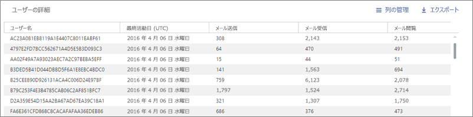

# Microsoft 365管理センターのレポート - SharePoint使用状況

管理者としてMicrosoft 365レポート **ダッシュボードには**、組織内のさまざまな製品のアクティビティの概要が表示されます。 これにより、各製品に固有のアクティビティについてより詳しく知ることができます。 たとえば、SharePoint サイトにユーザーが保存するファイルの総数、アクティブに使用されているファイルの数、およびこれらすべてのサイトで使用されるストレージに関して、SharePoint から取得する値の高レベルのビューを取得できます。 その後、[SharePoint サイトの利用状況] レポートを詳細に確認して、すべてのサイトの傾向およびサイトごとのレベル詳細を把握できます。 
  
> [!NOTE]
> レポートを表示するには、Microsoft 365 のグローバル管理者、グローバル閲覧者、レポート閲覧者、または Exchange、SharePoint、Skype for Business の管理者である必要があります。
Microsoft 365管理センターのレポートは、High テナントと DoD テナントGCCサポートされていません。
 
## [SharePoint サイトの利用状況] レポートにアクセスする方法

1. 管理センターで、[**レポート**] \> [<a href="https://go.microsoft.com/fwlink/p/?linkid=2074756" target="_blank">使用状況</a>] ページの順に移動します。 
2. ダッシュボードのホームページで、カードの [その **他の表示**] SharePointクリックします。

## レポートでユーザーの詳細を表示する

レポートで組織の使用状況データに関する情報を入力します。 既定では、レポートにユーザー、グループ、およびサイトの識別可能な名前を持つ情報が表示されます。 2021 年 9 月 1 日より、企業が地域のプライバシー法をサポートするのに役立つ継続的な取り組みの一環として、既定ですべてのレポートのユーザー情報を非表示にしています。
  
ユーザー リストは次のように表示されます。
  

  
グローバル管理者は、組織のプライバシー方針で許可されている場合は、テナント用のこの変更を元に戻し、特定可能なユーザー情報を表示することができます。 これは、Microsoft 365 管理センターで以下の手順に従うことで設定できます。
  
1. 管理センターで、**[設定]** \> **[組織の設定]** \> **[サービス]** のページの順に移動します。

2. [**レポート**] を選択します。 
  
3. ステートメントのチェックを外します **すべてのレポートで、ユーザー、グループ、およびサイトの識別されていない名前を表示し**、変更を保存します。 
  
## サイト利用状況SharePointレポートを解釈する

[サイトの使用状況] タブを選択すると、SharePointレポートでサイトの使用状況 **を表示** できます。

:::image type="content" alt-text="Microsoft 365レポート - Microsoft SharePoint利用状況レポート。" source="../../media/d1cb6200-e81c-460b-9d05-53f4bd7cf5ee.png" lightbox="../../media/d1cb6200-e81c-460b-9d05-53f4bd7cf5ee.png":::

[列 **の選択]** を選択して、レポートの列を追加または削除します。

:::image type="content" alt-text="SharePoint利用状況レポート - 列を選択します。" source="../../media/71ac3195-c494-40c1-9346-a858125ef6df.png":::

また、[**エクスポート**] リンクを選択して、レポート データを Excel の .csv ファイルにエクスポートすることもできます。 これにより、すべてのユーザーのデータがエクスポートされ、単純な並べ替えとフィルター処理を行ってさらに分析することができます。 ユーザー数が 2000 未満である場合は、レポート自体のテーブル内で並べ替えとフィルター処理を行うことができます。 ユーザー数が 2000 を超える場合は、フィルター処理と並べ替えを行うために、データをエクスポートする必要があります。 
  
|測定基準|内容|
|:-----|:-----|
|サイトの URL  |サイトの完全な URL。 |
|削除済み  |サイトの削除状態。 サイトを削除済みとしてマークするには、少なくとも 7 日かかります。  |
|サイト所有者  |サイトのプライマリ所有者のユーザー名。   |
|サイト所有者プリンシパル名  |サイトの所有者の電子メール アドレス。 |
|最終アクティビティ日 (UTC)  | ファイルアクティビティが最後に検出された日付、またはサイトでページが表示された日付。  |
|サイトの感度ラベル ID  | サイトの感度ラベル。  |
|外部共有  | サイトの外部のsharable設定。  |
|管理されていないデバイス ポリシー  | 管理されていないデバイスのサイト アクセス ポリシー。  |
|地域の場所  | サイトの地理的な場所。  |
|ファイル  |サイト上のファイルの数。 |
|アクティブ ファイル  | サイト上のアクティブ なファイルの数。  注: レポートの指定された期間中にファイルが削除された場合、レポートに表示されるアクティブ なファイルの数は、サイト上の現在のファイル数よりも多い場合があります。  |
|Storage使用 (MB)  |サイトで現在使用されている記憶域の量。  |
|Storage済み (MB)  |サイトに割り当てられた記憶域の最大量。  |
|ページ ビュー  |サイトでページが表示された回数。  |
|アクセスしたページ  |サイトにアクセスした一意のページの数。  |
|匿名リンク数  |サイト上の [リンクを持つすべてのユーザー] を使用してドキュメントまたはフォルダーを共有する回数。  |
|会社のリンク数  |サイト上の "リンクを持つ組織のユーザー" を使用してドキュメントまたはフォルダーを共有する回数。  |
|ゲスト数のセキュリティで保護されたリンク  |サイト上の "特定のユーザー" を使用してドキュメントまたはフォルダーを共有する回数。  |
|メンバー数のセキュリティで保護されたリンク  |サイト上の "特定のユーザー" を使用してドキュメントまたはフォルダーを共有する回数。  |
|ルート Web テンプレート  |サイトの作成に使用するテンプレート。    注: 異なるサイトの種類でデータをフィルター処理する場合は、データをエクスポートし、[ルート Web テンプレート] 列を使用します。 |

