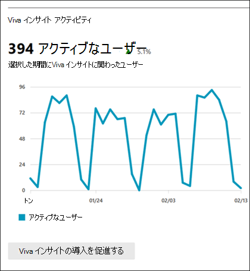

# Microsoft 365管理センターの [レポート] - [ビバ] インサイトアクティビティ

管理者としてMicrosoft 365レポート ダッシュボードには、組織内のさまざまな製品のアクティビティの概要が表示されます。 これにより、各製品に固有のアクティビティについてより詳しく知ることができます。 [アクティビティ] の [アクティビティ レポート] をMicrosoft 365 管理センター。 

たとえば、アクティブなユーザーを見て、ビバ インサイトの採用を理解できます。 また、組織での導入をさらに促進する展開ガイドも参照できます。

## アクティビティ レポートにアクセスするにはインサイト方法を示します。

1. 管理センターで、[**レポート**] \> [<a href="https://go.microsoft.com/fwlink/p/?linkid=2074756" target="_blank">使用状況</a>] ページの順に移動します。 
2. **[ビバ] インサイトアクティビティを検索します**。

## 使用状況レポートMicrosoft 365 Apps解釈する 

ユーザーのビバ のアクティビティを表示するには、インサイトグラフ **を参照します**。 アクティブなインサイトビバ グラフは、過去 7 日間、30 日間、90 日間、または 180 日間の傾向を確認できます。  

> [!div class="mx-imgBorder"]
> 

**アクティブ ユーザー** は、その日に少なくとも 1 つのビバ インサイトユーザーです。 これには、任意のV viva Insight メールに 20 秒間以上住む、インサイト のサーフィンでアクションをクリックまたは実行する、Teams、Outlook アドイン、または Web ダッシュボードでビバ インサイト アプリにアクセスする操作が含まれます。 

## ビバ の展開ガイドインサイトする
[ビバ の **導入を後押しする]** をインサイト [、ビバ の展開ガイドインサイト表示できます](/viva/insights/personal/setup/deployment-guide)。

