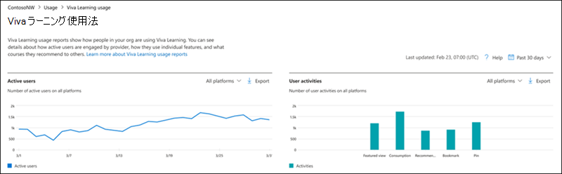

# 管理センターでレポートをMicrosoft 365する - Viva ラーニング アクティビティ

Microsoft 365管理者として、レポート ダッシュボードには、組織内のさまざまな製品にわたるアクティビティの概要が表示されます。 これにより、各製品に固有のアクティビティについてより詳しく知ることができます。 Microsoft 365 管理センターのアクティビティ レポートを確認してください。 

たとえば、ライセンスを持つViva ラーニングユーザーの操作を確認することで、ユーザーのアクティビティを把握できます。 また、ラーニング アプリ内で使用されている機能の種類を理解するのにも役立ちます。

## Viva ラーニング アクティビティ レポートにアクセス操作方法?  

1. 管理センターで、**レポート** > **使用状況** ページの順に移動します。 
2. ダッシュボードのホームページで、Viva ラーニング カードの **[その他の表示**] ボタンを選択します。 

## Microsoft 365 Apps使用状況レポートを解釈する

**アクティブ** なユーザーとユーザー アクティビティのグラフを見ると、ユーザーのViva ラーニング **アクティビティ** を確認できます。

- アクティブなユーザー – 時間の経過と共にアクティブなユーザーの数を表示します。 たとえば、それを使用して、過去 30 日間の特定の日に組織内のアクティブなユーザーの数を検索できます。
- ユーザー アクティビティ – すべてのプラットフォームに対するユーザー アクティビティの数を示します。 たとえば、それを使用して、組織内の過去 30 日間にコースをブックマークしたユーザーの数を検索できます。
 
