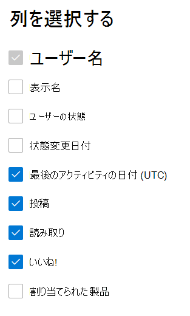

# Microsoft 365管理センターのレポート - Yammerレポート

管理者Microsoft 365レポート **ダッシュボードには**、組織内の製品の使用状況に関するデータが表示されます。 管理センター [でアクティビティ レポートを確認します](activity-reports.md)。 **Yammer アクティビティ レポート** では、Yammer を使用してメッセージの投稿、「いいね!」の評価、または閲覧を行った一意のユーザー数や、組織全体で生成されたアクティビティの量を確認することで、Yammer に対する組織の関与レベルを把握することができます。 
  
> [!NOTE]
> レポートを表示するには、Microsoft 365 のグローバル管理者、グローバル閲覧者、レポート閲覧者、または Exchange、SharePoint、Skype for Business の管理者である必要があります。  
 
## アクティビティ レポートにアクセスYammer方法

1. 管理センターで、[**レポート**] \> [<a href="https://go.microsoft.com/fwlink/p/?linkid=2074756" target="_blank">使用状況</a>] ページの順に移動します。 
2. ダッシュボードのホームページで、カードの **[その他** の表示] Yammerクリックします。

  
## Yammer のアクティビティ レポートの内容を理解する

[アクティビティ] タブを選択すると、Yammerレポートでアクティビティ **を表示** できます。 

[列 **の選択]** を選択して、レポートの列を追加または削除します。    

また、[**エクスポート**] リンクを選択して、レポート データを Excel の .csv ファイルにエクスポートすることもできます。 これにより、すべてのユーザーのデータがエクスポートされ、単純な並べ替えとフィルター処理を行ってさらに分析することができます。 ユーザー数が 2000 未満である場合は、レポート自体のテーブル内で並べ替えとフィルター処理を行うことができます。 ユーザー数が 2000 を超える場合は、フィルター処理と並べ替えを行うために、データをエクスポートする必要があります。 
  
|アイテム|説明|
|:-----|:-----|
|**測定基準**|**定義**|
|Username    |ユーザーの電子メール アドレス。 実際のメール アドレスを表示することも、このフィールドを匿名にすることもできます。 このグリッドには、YammerアカウントMicrosoft 365シングル サインオンを使用してネットワークにログインしたユーザーが表示されます。   |
|表示名    |ユーザーの完全な名前。 実際のメール アドレスを表示することも、このフィールドを匿名にすることもできます。    |
|ユーザーの状態    |アクティブ化、削除、または中断の 3 つの値のいずれかを指定します。 これらのレポートには、アクティブ、中断、削除されたユーザーのデータが表示されます。 保留中のユーザーはメッセージを投稿、読み取り、または同様に行えないので、保留中のユーザーは反映されません。    |
|状態の変更日 (UTC)    |ユーザーの状態が変更された日付は、Yammer。    |
|最終アクティビティ日 (UTC)    | ユーザーがメッセージを投稿、読み取り、または気に入った最後の日付。    |
|投稿    |指定した期間中にユーザーが投稿したメッセージの数。  |
|読み取り    |指定した期間中にユーザーが読み取った会話の数。    |
|いいね!    |指定した期間中にユーザーが気に入ったメッセージの数。   |
|割り当てられた製品    |このユーザーに割り当てられている製品。|
|||