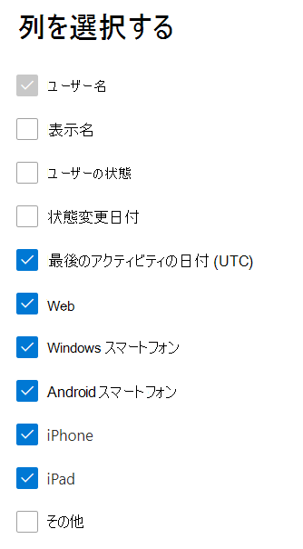

# Microsoft 365管理センターのレポート - デバイスYammerレポート

Microsoft 365 の [**レポート**] ダッシュボードには、組織内での製品全体に関するアクティビティが表示されます。 これにより、個別の製品レベルのレポートを詳細に確認して、各製品内のアクティビティについてより詳しく知ることができます。 [レポートの概要に関するトピック](activity-reports.md)を参照してください。
  
Yammer デバイスの使用状況レポートでは、ユーザーが Yammer を使用しているデバイスについての情報を示します。デバイスの種類別に毎日使用するユーザー数を表示したり、デバイスの種類別にユーザー数を表示したりします。どちらも選択した期間で表示できます。また、ユーザーごとの詳細を表示することもできます。
  
> [!NOTE]
> レポートを表示するには、Microsoft 365 のグローバル管理者、グローバル閲覧者、レポート閲覧者、または Exchange、SharePoint、Skype for Business の管理者である必要があります。  
 
## Yammer デバイスの使用状況レポートの作成方法

1. 管理センターで、[**レポート**] \> [<a href="https://go.microsoft.com/fwlink/p/?linkid=2074756" target="_blank">使用状況</a>] ページの順に移動します。 
2. ダッシュボードのホームページで、カードの **[その他** の表示] Yammerクリックします。
  
## デバイス使用状況Yammerレポートを解釈する

[デバイスの使用状況] タブを選択OneDriveレポートで使用状況 **を表示** できます。 

[列 **の選択]** を選択して、レポートの列を追加または削除します。    

また、[**エクスポート**] リンクを選択して、レポート データを Excel の .csv ファイルにエクスポートすることもできます。 これにより、すべてのユーザーのデータがエクスポートされ、単純な並べ替えとフィルター処理を行ってさらに分析することができます。 ユーザー数が 2000 未満である場合は、レポート自体のテーブル内で並べ替えとフィルター処理を行うことができます。 ユーザー数が 2000 を超える場合は、フィルター処理と並べ替えを行うために、データをエクスポートする必要があります。 
  
|アイテム|説明|
|:-----|:-----|
|**測定基準**|**定義**|
|Username    |ユーザーの電子メール アドレス。 実際のメール アドレスを表示することも、このフィールドを匿名にすることもできます。 このグリッドには、YammerアカウントMicrosoft 365シングル サインオンを使用してネットワークにログインしたユーザーが表示されます。   |
|表示名    |ユーザーの完全な名前。 実際のメール アドレスを表示することも、このフィールドを匿名にすることもできます。    |
|ユーザーの状態    |アクティブ、削除、または中断の 3 つの値のいずれかを指定します。 これらのレポートには、アクティブ、中断、削除されたユーザーのデータが表示されます。 保留中のユーザーはメッセージを投稿、読み取り、または同様に行えないので、保留中のユーザーは反映されません。     |
|状態の変更日 (UTC)    |ユーザーの状態が変更された日付は、Yammer。    |
|最終アクティビティ日 (UTC)    |ユーザーがアクティビティに参加した最後の日付 (UTC) Yammerです。    |
|Web    |ユーザーが web 上でYammerを使用したかどうかを示します。    |
|Windows電話    | ユーザーが電話でユーザーがYammerしたかどうかをWindowsします。    |
|Android スマートフォン    |ユーザーが Android スマートフォンでユーザーがYammerを使用したかどうかを示します。  |
|iphone   | ユーザーがユーザーがユーザーに対してYammerを使用iPhone。    |
|ipad    |ユーザーがユーザーがユーザーに対してYammerを使用iPad。  |
|その他    |ユーザーが以前にリストされていない別Yammerデバイスで使用したかどうかを示します。  |
|||