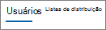
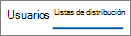

# 管理センターの Microsoft 365 レポート - Yammer使用状況レポートMicrosoft 365 Reports in the admin center - Yammer device usage report

Microsoft 365 の [**レポート**] ダッシュボードには、組織内での製品全体に関するアクティビティが表示されます。The Microsoft 365 **Reports** dashboard shows you the activity overview across the products in your organization. これにより、個別の製品レベルのレポートを詳細に確認して、各製品内のアクティビティについてより詳しく知ることができます。It enables you to drill in to individual product level reports to give you more granular insight about the activities within each product. [レポートの概要に関するトピック](activity-reports.md)を参照してください。Check out [the Reports overview topic](activity-reports.md).
  
Yammer デバイスの使用状況レポートでは、ユーザーが Yammer を使用しているデバイスについての情報を示します。デバイスの種類別に毎日使用するユーザー数を表示したり、デバイスの種類別にユーザー数を表示したりします。どちらも選択した期間で表示できます。また、ユーザーごとの詳細を表示することもできます。The Yammer device usage reports give you information about which devices your users are using Yammer on. You can view the number of daily users by device type, and number of users by device type. You can view both over a selected time period. You can also view details per user.
  
> [!NOTE]
> レポートを表示するには、Microsoft 365 のグローバル管理者、グローバル閲覧者、レポート閲覧者、または Exchange、SharePoint、Skype for Business の管理者である必要があります。You must be a global administrator, global reader or reports reader in Microsoft 365 or an Exchange, SharePoint, Teams Service, Teams Communications, or Skype for Business administrator to see reports. 
  
## Yammer デバイスの使用状況レポートの作成方法How do I get to the Yammer device usage report?

1. 管理センターで、[**レポート**] \> [<a href="https://go.microsoft.com/fwlink/p/?linkid=2074756" target="_blank">使用状況</a>] ページの順に移動します。In the admin center, go to the **Reports** \> <a href="https://go.microsoft.com/fwlink/p/?linkid=2074756" target="_blank">Usage</a> page.

    
2. [レポート **の選択] ドロップダウンから** 、[デバイスの使用状況] **Yammer** \> **を選択します**。From the **Select a report** drop-down, select **Yammer** \> **Device usage**.
  
## Yammer のアクティビティ レポートの内容を理解するInterpret the Yammer activity report

ユーザーの Yammer デバイスの使用状況を詳しく見るには、[ **ユーザー**] グラフと [ **分布**] グラフを確認します。You can get a view into your users' Yammer device usage by looking at the **Users** and **Distribution** charts. 
  
デバイスの使用状況レポートには、次の情報が含まれます。The device usage report contains the following information.
  
- [日] タブを使用して、過去 7 日間 **Yammer** 30 日、90 日、または 180 日間のデバイス使用状況レポートの傾向を表示します。Use the day tabs to view the **Yammer device usage** activity report trends over the last 7 days, 30 days, 90 days, or 180 days. ただし、レポートで特定の日を選択すると、現在の日付から最大 28 日間のデータが表示されます (レポートが生成された日付ではありません)。However, if you select a particular day in the report, the table will show data for up to 28 days from the current date (not the date the report was generated). 
    
- 各レポートには、このレポートが生成された日付が表示されます。通常、レポートはアクティビティの時刻から 24 から 48 時間の遅延を反映します。Each report has a date for when the report was generated. The reports usually reflect a 24 to 48 hour latency from time of activity.
    
- [ **ユーザー**] グラフでは、デバイスの種類別に毎日使用するユーザー数が表示されます。You can view the **Users** chart to see the number of daily users by device type.  
  
- [ **分布**] グラフでは、デバイスの種類別にユーザー数が表示されます。You can view the **Distribution** chart to see the number of users by device type.  
  
- グラフの下の [ **詳細**] 表には、Yammer デバイスの使用状況の内訳がユーザー レベルごとに表示されます。The **Details** table under the graph shows you a breakdown of the Yammer device usage at the per-user level. 
    
    列を追加および削除することもできます。使用可能な列は次のとおりです。You can also add and remove columns. The available columns are:
    
  - [ **ユーザー名**] はユーザーのメール アドレスです。**Username** is the email address of the user. 実際のメール アドレスを表示することも、このフィールドを匿名にすることもできます。You can display the actual email address or make this field anonymous. 
    
    このグリッドには、Microsoft 365 アカウントYammerシングル サインオンを使用してネットワークにログインしたユーザーが表示されます。This grid shows users who logged into Yammer using the Microsoft 365 account or who logged into the network using single sign-on.
    
  - [ **表示名**] はユーザーの氏名です。実際のメール アドレスを表示することも、このフィールドを匿名にすることもできます。**Display name** is the full name of the user. You can display the actual email address or make this field anonymous. 
    
  - [ **ユーザー状態**] は、アクティブ、削除済み、または中断の 3 つの値で示されます。**User state** is one of three values: Active, Deleted, or Suspended. 
    
    このレポートには、アクティブ、中断、および削除済みのユーザーのデータが表示されます。保留中のユーザーは反映されません。このようなユーザーはメッセージの投稿、閲覧、または「いいね!」ができないためです。These reports show data for active, suspended, and deleted users. They do not reflect pending users, because pending users cannot post, read, or like a message.
    
  - [ **Web**] では、ユーザーが Web で Yammer を使用したかどうかが示されます。**Web** indicates if the user has used Yammer on the web. 
    
  - [ **Windows Phone**] では、ユーザーが Windows Phone で Yammer を使用したかどうかが示されます。**Windows phone** indicates if the user has used Yammer on a Windows phone 
    
  - [ **Android スマートフォン**] では、ユーザーが Android スマートフォンで Yammer を使用したかどうかが示されます。**Android phone** indicates if the user has used Yammer on an Android phone. 
    
  - [ **iPhone**] では、ユーザーが iPhone で Yammer を使用したかどうかが示されます。**iPhone** indicates if the user has used Yammer on an iPhone. 
    
  - [ **iPad**] では、ユーザーが iPad で Yammer を使用したかどうかが示されます。**iPad** indicates if the user has used Yammer on an iPad. 
    
  - [ **その他**] では、ユーザーがそれ以外のデバイスで Yammer を使用したかどうかが示されます。**Other** indicates if the user has used Yammer on another device, not listed previously. 
    
    組織のポリシーにより、ユーザー情報を特定できるレポートを表示できない場合は、これらすべてのレポートのプライバシー設定を変更できます。If your organization's policies prevents you from viewing reports where user information is identifiable, you can change the privacy setting for all these reports. 「**Microsoft 365 管理センターのアクティビティ レポート**」の「[ユーザー レベルの詳細を非表示にする方法](activity-reports.md)」セクションを参照してください。Check out the **How do I hide user level details?** section in the [Activity Reports in the Microsoft 365 admin center](activity-reports.md).
    
- [エクスポート] リンクを選択して、レポート データを Excel .csv ファイルに **エクスポート** することもできます。You can also export the report data into an Excel .csv file, by selecting the **Export** link. これにより、すべてのユーザーのデータがエクスポートされ、単純な並べ替えとフィルター処理を行ってさらに分析することができます。This exports data of all users and enables you to do simple sorting and filtering for further analysis. ユーザー数が 2000 未満である場合は、レポート自体のテーブル内で並べ替えとフィルター処理を行うことができます。If you have less than 2000 users, you can sort and filter within the table in the report itself. ユーザー数が 2000 を超える場合は、フィルター処理と並べ替えを行うために、データをエクスポートする必要があります。If you have more than 2000 users, in order to filter and sort, you will need to export the data. 
    

