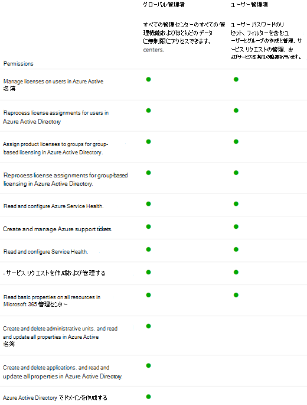

# Microsoft 365管理者ロール ページでの概要

[ロール] ページでは、管理者センターでタスクを実行するためのアクセス許可をユーザーに付与できます。 これにより、組織が適切なユーザーにタスクを分散し、データをセキュリティで保護するのに役立ちます。

> [!TIP]
> 役割の詳細な説明をお探しですか ? [Azure AD の組み込みロール](/azure/active-directory/roles/permissions-reference)と[管理者ロールについてを](/microsoft-365/admin/add-users/about-admin-roles)確認してください。

## [管理者ロール] ページについて

管理者リストをエクスポートしたり、ロールで検索したりフィルター処理したりできます。

- 管理者リストのエクスポートを使用して、組織内のすべての管理者ユーザーの完全な一覧を取得します。 リストはExcel .csv ファイルに格納されます。

- 検索を使用して管理者ロールを検索し、そのロールに割り当てられているユーザーを確認します。

- フィルターを使用して、表示される管理者ロールのビューを変更します。

## ロールを最大限に活用する

以下のコンテンツを参照して、さまざまな管理者ロールと、ロールが組織内で実行できるタスクについて説明します。

> [!NOTE]
これは、これらのロールが持つすべてのアクセス許可の完全な一覧ではありません。 各ロールの詳細については、[ **詳細情報** ] リンクを選択します。

### Exchange 管理者

ユーザーのメール メールボックス、Microsoft 365 グループ、Exchange Onlineを表示および管理する必要があるユーザーに、Exchange管理者ロールを割り当てます。 また、Microsoft サポートに対するサポート要求を開いて管理することもできます。 [詳細情報](/microsoft-365/admin/add-users/about-exchange-online-admin-role)

### グローバル管理者

Microsoft オンライン サービス全体のほとんどの管理機能とデータへのグローバル アクセスが必要なユーザーにグローバル管理者ロールを割り当てます。 グローバルなアクセスを多くのユーザーに許可することはセキュリティ上のリスクであるため、2 〜 4 人のグローバル管理者を配置することをお勧めします。 グローバル管理者のみがすべてのユーザーのパスワードをリセットし、ドメインを追加および管理できます。 また、Microsoft サポートに対するサポート要求を開いて管理することもできます。 Microsoft オンライン サービスにサインアップしたユーザーが自動的にグローバル管理者になります。[詳細については、こちらを参照してください](/microsoft-365/admin/add-users/about-admin-roles#roles-available-in-the-microsoft-365-admin-center)。

### グローバル閲覧者

グローバル管理者が表示できるすべての管理センターで管理者機能と設定を表示する必要があるユーザーに、グローバル リーダー管理者ロールを割り当てます。 グローバル リーダー管理者ロールは、設定を編集できません。 [詳細情報](/microsoft-365/admin/add-users/about-admin-roles#roles-available-in-the-microsoft-365-admin-center)

### ヘルプデスク管理者

パスワードをリセットするユーザーにヘルプデスク管理者ロールを割り当て、セキュリティの問題に対して強制的にサインアウトします。 また、Microsoft サポートに対するサポート要求を開いて管理することもできます。 ヘルプデスク管理者は、管理者以外のユーザーと、ディレクトリ リーダー、ゲスト招待者、ヘルプデスク管理者、メッセージ センター リーダー、レポート リーダーの各ロールを割り当てたユーザーのみを支援できます。 [詳細情報](/microsoft-365/admin/add-users/about-admin-roles#roles-available-in-the-microsoft-365-admin-center)

### サービス管理者

Azure、Microsoft 365、Office 365 サービスのサポート要求を作成する必要があるユーザーにサービス管理者ロールを割り当てます。 [詳細情報](/microsoft-365/admin/add-users/about-admin-roles#roles-available-in-the-microsoft-365-admin-center)

### SharePoint 管理者

Microsoft 365 サブスクリプションを購入すると、チーム サイトが自動的に作成され、グローバル管理者がプライマリ サイト コレクション管理者として設定されます。 SharePoint管理センターにアクセスするユーザーに<a href="https://go.microsoft.com/fwlink/?linkid=2185219" target="_blank">、SharePoint管理者</a>ロールを割り当てます。 SharePoint管理者ロールを持つユーザーは、サイト コレクションの作成と管理、サイト コレクション管理者の指定、ユーザー プロファイルの管理を行うことができます。 SharePoint管理者ロールを持つユーザーは、Microsoft 365 グループを管理し、Microsoft サポートを通じてサポート要求を開くこともできます。 [詳細情報](/sharepoint/sharepoint-admin-role)

### Teams のサービス管理者

Teams & Skype管理センターにアクセスして管理するユーザーに、Teams管理者ロールを割り当てます。 Teams管理者ロールを持つユーザーは、Microsoft 365 グループを管理し、Microsoft サポートを通じてサポート要求を開くこともできます。 [詳細情報](/MicrosoftTeams/using-admin-roles)

### ユーザー管理者

ユーザーパスワードリセットにアクセスして管理し、ユーザーとグループを管理するユーザーにユーザー管理者ロールを割り当てます。 また、Microsoft サポートに対するサポート要求を開いて管理することもできます。 [詳細情報](/microsoft-365/admin/add-users/about-admin-roles#roles-available-in-the-microsoft-365-admin-center)

## ロールを比較する

一度に最大 3 つのロールのアクセス許可を比較して、割り当てる最小許容ロールを見つけることができます。

管理センターで次の手順を実行します。

- 最大 3 つのロールを選択し、[ **ロールの比較** ] を選択して、各ロールが持つアクセス許可を確認します。

## 関連コンテンツ

[Microsoft 365 管理者ロールについて](about-admin-roles.md) (記事)\
[管理者の役割を割り当てる](assign-admin-roles.md) (記事)
