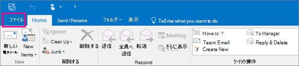

# 手順 4 - 別の従業員にデータとOneDriveアクセスOutlookする

従業員が組織を離れる場合は、OneDrive および Outlook データにアクセスし、バックアップし、別の従業員に渡すかどうかを選択します。
  
## 元のユーザーの OneDrive ドキュメントにアクセスする

ユーザーのライセンスを削除し、アカウントを削除しない場合、ユーザーの OneDrive のコンテンツへのアクセス権を自分に与えることができます。 ユーザーのアカウントを削除すると、既定で 30 日間、以前のユーザーのデータにアクセスOneDriveがあります。 [削除されたユーザーに OneDrive の保持を設定する方法を学習します](/onedrive/set-retention)。 この時間内に[ユーザー アカウントを復元](/office365/admin/add-users/restore-user)しない場合、OneDrive コンテンツは削除されます。

元のユーザーの OneDrive ファイルを保存するには、まず自分の OneDrive にアクセスしてから、保持するファイルを移動します。

1. 管理センターで、**[ユーザー]** \> <a href="https://go.microsoft.com/fwlink/p/?linkid=834822" target="_blank">[アクティブなユーザー]</a> ページの順に移動します。  

2. ユーザーを選択します。

3. 右側のウィンドウで、[**OneDrive**] を選択します。 [**ファイルへのアクセス**] で、[**ファイルへのリンクの作成**] を選択します。

4. リンクを選択してファイルの場所を開きます。 ファイルをコンピューターにダウンロードするか、[**移動先**] または [**指定の場所にコピー**] を選択して、自分の OneDrive または共有ライブラリに移動またはコピーします。

> [!NOTE]
> 一度に最大 500 MB のファイルとフォルダーを移動またはコピーできます。 
> バージョン履歴のあるドキュメントを移動またはコピーすると、最新バージョンのみ移動されます。  

また、別のユーザーにアクセス権を付与して、元従業員のアカウントにアクセスOneDrive。

1. グローバル管理者または<a href="https://go.microsoft.com/fwlink/p/?linkid=2024339" target="_blank">管理者として</a>管理センターにサインインSharePointします。

    管理者センターにアクセスする権限がないというメッセージが表示される場合は、組織には管理者権限がありません。

2. 左側のウィンドウで、[**管理センター**] \> [**SharePoint**] の順に選択します。 (場合によっては、管理センターのリストを表示するために **[すべて表示]** を選択する必要があります。)

3. 従来の管理センター SharePoint表示される場合は、ページの上部にある [今すぐ開く] を選択して、管理センター SharePoint開きます。

4. ウィンドウの左側で [**その他の機能**] を選択します。

5. [**ユーザー プロファイル**] で、[**開く**] を選択します。

6. [**人**] の [**ユーザー プロファイルの管理**] を選択します。

7. 元従業員の名前を入力し、[検索] を **選択します**。

8. ユーザーを右クリックし、[**サイト コレクションの所有者の管理**] を選択します。

9. サイト コレクション管理者にユーザー **を追加し、[OK]** を **選択します**。

10. これで、ユーザーは元の従業員のアカウントにアクセスし、OneDrive URL をOneDriveできます。 

### ユーザーのアカウントへの管理者アクセスを取り消OneDrive

ユーザーのサイト内のコンテンツへのアクセス権をユーザーに与OneDrive、不要になったときにアクセス権を削除することもできます。

1. グローバル管理者または<a href="https://go.microsoft.com/fwlink/p/?linkid=2024339" target="_blank">管理者として</a>管理センターにサインインSharePointします。

    管理者センターにアクセスする権限がないというメッセージが表示される場合は、組織には管理者権限がありません。

2. 左側のウィンドウで、[**管理センター**] \> [**SharePoint**] の順に選択します。 (場合によっては、管理センターのリストを表示するために **[すべて表示]** を選択する必要があります。)

3. 従来の管理センター SharePoint表示される場合は、ページの上部にある [今すぐ開く] を選択して、管理センター SharePoint開きます。

4. ウィンドウの左側で [**その他の機能**] を選択します。

5. [**ユーザー プロファイル**] で、[**開く**] を選択します。

6. [**人**] の [**ユーザー プロファイルの管理**] を選択します。

7. ユーザーの名前を入力し、[**検索**] を選択します。

8. ユーザーを右クリックし、[**サイト コレクションの所有者の管理**] を選択します。

9. ユーザーのデータへのアクセスが不要になったユーザーを削除し、[**O**] を選択します。

## 元のユーザーの Outlook データにアクセスする

元従業員のメール メッセージ、予定表、タスク、連絡先を保存するには、情報を Outlook データ ファイル (.pst) にエクスポートします。
  
1. Outlook に [元従業員のメールを追加](https://support.microsoft.com/office/6e27792a-9267-4aa4-8bb6-c84ef146101b)します ([ユーザーのパスワードの再設定](reset-passwords.md)を行えば、自分しか知らないパスワードに設定し直すことができます)。

2. Outlook で、[**ファイル**] を選択します。

    
  
3. [**開く&amp;エクスポート**]\>[**インポート/エクスポート**] の順に選択します。

    
  
4. [**ファイルのエクスポート]** を選んで、[**次へ**] をクリックします。

    ![インポートおよびエクスポート ウィザードの [ファイルにエクスポート] オプションを使用します。](../../media/458466a0-366b-4fbf-a2db-1919412c6527.jpg)
  
5. [**Outlook データ ファイル (.pst)**] を選択して、[**次へ**] を選択します。

6. Mailbox-Anne Weiler または anne@contoso.com などの名前またはメール アドレスを選択して、エクスポートするアカウントを選択します。 アカウントのすべての内容 (メール、予定表、連絡先、タスク、メモなど) をエクスポートする場合、[ **サブフォルダーを含む**] チェック ボックスがオンになっていることを確認します。

    > [!NOTE]
    > 一度にエクスポートできるアカウントは 1 つだけです。複数のアカウントをエクスポートする場合は、アカウントがエクスポートされるたびに、上の手順を繰り返します。
  
    ![[Outlook] を選択し、[サブフォルダーを含める] がオンの状態で [データ ファイル] ダイアログ ボックスをエクスポートします。](../../media/ce36616f-d76d-4ce2-b517-8ac4874e0971.jpg)
  
7. [**次へ**] を選択します。

8. [**参照**] を選択して、Outlook データ ファイル (.pst) の保存場所を選択します。 *ファイル名* を入力して [**OK**] を選択し、続行します。

    > [!NOTE]
    > 以前にエクスポートしたことがある場合は、そのときのフォルダーの場所とファイル名が表示されます。 *別のファイル名* を入力し、[**OK**] を選択します。
  
9. 既存の Outlook データ ファイル (.pst) にエクスポートする場合は、[**オプション**] で、ファイルに既に存在しているアイテムをエクスポートするときの処理を指定します。

10. [**完了**] を選択します。

Outlook により、エクスポートがすぐに開始されます。ただし、新しい Outlook データ ファイル (.pst) を作成するか、パスワードで保護されたファイルを使う場合を除きます。
  
- If you're creating an Outlook Data File (.pst), an optional password can help protect the file. [**Outlook データ ファイルの作成**] ダイアログ ボックスが表示されたら、[**パスワード**] ボックスと [**パスワードの確認**] ボックスに *パスワード* を入力し、[**OK**] を選択します。 [**Outlook データ ファイルのパスワード**] ダイアログ ボックスで *パスワード* を入力し、[**OK**] を選択します。

- パスワードで保護された既存の Outlook データ ファイル (.pst) にエクスポートする場合は、[**Outlook データ ファイルのパスワード**] ダイアログボックスで、*パスワード* を入力して [**OK**] を選択します。

Outlook 2010で「[メール、連絡先、予定表を Outlook の .pst ファイルにエクスポートまたはバックアップする](https://support.microsoft.com/office/14252b52-3075-4e9b-be4e-ff9ef1068f91)」方法を参照してください。

  > [!NOTE]
  > 既定では、メールは 12 か月間オフラインで利用できます。 必要に応じて、オフラインで利用可能なデータ [を増やす方法を参照してください](/outlook/troubleshoot/mailboxes/only-subset-items-synchronized)。

### 元のユーザーのメールへのアクセス権を別のユーザーに付与する

元従業員のメール メッセージ、予定表、タスク、連絡先に他の従業員がアクセスできるようにするには、情報を他の従業員の Outlook 受信トレイにインポートします。

> [!NOTE]
> [元のユーザーのメールボックスを共有メールボックスに変換](/office365/admin/email/convert-user-mailbox-to-shared-mailbox)、または[前の従業員のメールを別の従業員に転送](/office365/admin/add-users/remove-former-employee#forward-a-former-employees-email-to-another-employee-or-convert-to-a-shared-mailbox)することもできます。

1. Outlook で [**ファイル**]\>[**開く&amp;エクスポート**]\>[**インポート/エクスポート**] の順に選びます。

    これにより、インポート/エクスポート ウィザードが開始されます。

2. [**他のプログラムまたはファイルからのインポート**] を選択し、[**次へ**] を選択します。

    
  
3. [**Outlook データ ファイル (.pst)**] を選んで、[**次へ**] をクリックします。

4. インポートする .pst ファイルを探して選びます。

5. [**オプション**] で、重複するアイテムの処理方法を選びます。

6. [**次へ**] を選択します。

7. Outlook データ ファイル (.pst) にパスワードが割り当てられていた場合は、パスワードを入力し、[**OK**] を選択します。

8. アイテムのインポートに関するオプションを設定します。通常、既定の設定を変更する必要はありません。

9. **[完了]** を選択します。

> [!NOTE]
> 既存のユーザーのデータと電子メール データにアクセスする場合OneDrive手順は変わりません。

> [!TIP]
> Outlook データ ファイル (.pst) からいくつかのアイテムのみをインポートまたは復元する場合は、Outlook データ ファイルを開くことができます。 次に、ナビゲーション ウィンドウで、Outlook データ ファイル フォルダーから既存の Outlook フォルダーにアイテムをドラッグします。

## 関連コンテンツ

[ユーザー アカウントで管理者を追加およびOneDriveする](/sharepoint/manage-user-profiles#add-and-remove-admins-for-a-users-onedrive)(記事)

[削除済みファイルのOneDrive](/onedrive/restore-deleted-onedrive)する (記事)

[OneDrive保持と削除 (](/onedrive/retention-and-deletion)記事)

[OneDrive のファイルとフォルダーを共有する](https://support.microsoft.com/office/share-onedrive-files-and-folders-9fcc2f7d-de0c-4cec-93b0-a82024800c07)
