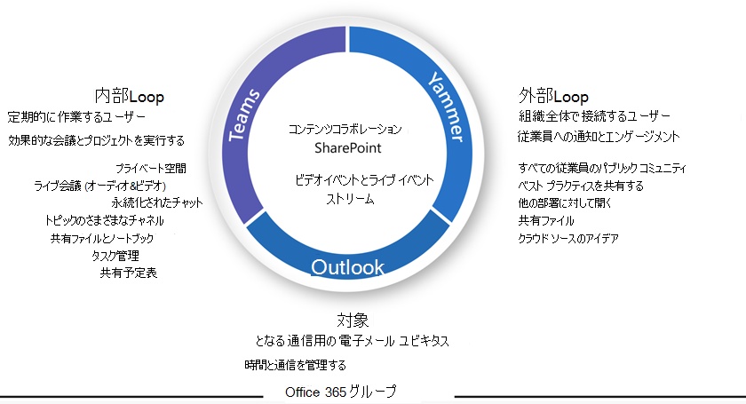

# ユーザー Microsoft 365グループの説明

Microsoft 365グループを使用すると、共有メールボックスと予定表、SharePoint ノートブックを持つ OneNote SharePoint サイト、Microsoft Planner など、共有するリソースのコレクションを設定できます。 Microsoft Teamsを作成するときに、または後で追加することもできます。 アクセス許可グループリソースは、グループを介して管理されます。

グループは、共有リソースを作成することで作成できます。 グループをチーム サイトOutlook作成すると、グループに接続されたチーム サイトまたは Planner のSharePoint作成と同じ結果が得られます。 ユーザーがグループを初Microsoft 365場合、ユーザーはこれを認識しない可能性があります。 これにより、ユーザーが混乱し、重複するリソースが作成される可能性があります。 (たとえば、ドキュメントの共同作業用に SharePoint サイトを作成し、後で Planner の別のインスタンスを作成する場合があります。Planner がグループの一部として既に利用できるとは気付いていません)。

グループはいくつかの方法で作成できますので、組織に最適な方法を使用するユーザーをトレーニングすることをお勧めします。

- 組織が電子メールを使用してほとんどの通信を行う場合は、ユーザーにグループを作成するように指示Outlook。
- 組織が多くのSharePointを使用している場合、または SharePoint オンプレミスから移行する場合は、ユーザーに共同作業用にSharePointチーム サイトを作成するように指示します。
- 組織がグループを展開Teams、共同作業スペースが必要なときにチームを作成するようにユーザーに指示します。

ユーザーが他のユーザーと共同作業するためのスペースが必要なときに、作業方法に最も合ったグループ作成方法を常に使用するトレーニングを行う場合は、リソースの混乱や重複を避けることができます。 ユーザーの経験が高くなると、グループに関連するサービスのコレクションが向上し、異なる作成方法が同じ結果につながることを理解できます。

ビジネス ユーザー向け[Microsoft 365グループ -](https://www.microsoft.com/download/details.aspx?id=102396) PowerPointテンプレートを、ユーザーのトレーニング プレゼンテーションの開始点として使用できます。

## 関連トピック

[Microsoft 365 グループについて](https://support.microsoft.com/office/b565caa1-5c40-40ef-9915-60fdb2d97fa2)
