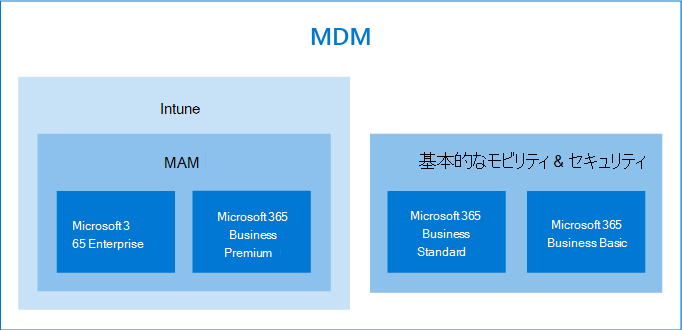

# デバイスとアプリデータを保護するためのオプション

Microsoft 365 for business および enterprise を使用して、組織のデバイスとデータをセキュリティで保護するには、いくつかの方法があります。 次のスタンドアロンプランを使用できます。

- Intune (Microsoft エンドポイント管理の一部)
- Azure Active Directory Premium プラン。
- 基本的なモビリティとセキュリティ (ほとんどの Microsoft 365 に含まれているビジネスプランおよびエンタープライズプラン)、または以前のスタンドアロンプランを含むサブスクリプションを使用します。

- Microsoft 365 Business Premium サブスクリプション。これには、300ユーザーの小規模企業に対するセキュリティおよび脅威の保護が含まれます。
- Microsoft 365 Enterprise プランでは、高度なセキュリティと脅威保護を備えています。

## デバイス管理のオプション

- **基本的なモビリティとセキュリティ** は、ほとんどの microsoft 365 プランで提供されており、Microsoft 365 business Standard および Microsoft 365 business Basic に対して提供されている唯一の組み込みの選択肢です。 詳細については、「 [availability Of Basic Mobility And Security](../basic-mobility-security/choose-between-basic-mobility-and-security-and-intune.md#availability-of-basic-mobility-and-security-and-intune)」を参照してください。 

    Microsoft 365 Business Basic または Microsoft 365 Business Standard を使用している場合は、組織でより複雑なセキュリティニーズがある場合は、Intune を購入することもできます。
 
- **Microsoft Intune** は、一部の microsoft 365 for business または enterprise プランに含まれるスタンドアロンプランです。 Intune がスタンドアロンまたはサブスクリプションの一部として設定されている場合、デバイスとアプリデータの管理を微調整することができます。 Microsoft 365 での可用性の詳細については、「 [Intune の可用性](../basic-mobility-security/choose-between-basic-mobility-and-security-and-intune.md#availability-of-basic-mobility-and-security-and-intune)」を参照してください。

    Microsoft Intune は、モバイルデバイス管理 (MDM) とモバイルアプリケーション管理 (MAM) を中心とするクラウドベースのサービスです。 携帯電話、タブレット、ラップトップを含む、組織のデバイスの使用方法を制御します。 アプリケーションを制御する特定のポリシーを構成することもできます。 詳細については、「 [Microsoft Intune のドキュメント](https://docs.microsoft.com/mem/intune/)」を参照してください。

- **Azure Active Directory (AD) Premium** プランはスタンドアロンプランで、一部の Microsoft 365 はビジネスプランおよびエンタープライズプランにも付属しています。 詳細については、「 [AZURE AD の価格](https://azure.microsoft.com/pricing/details/active-directory/)」を参照してください。

     Azure AD Premium P1 と Azure AD Premium P2 を使用すると、条件付きアクセス機能、セルフサービスのパスワードのリセットなどを設定できます。プレミアムプランの機能の詳細については、「 [AZURE AD の価格設定](https://azure.microsoft.com/pricing/details/active-directory/) 」ページを参照してください。
- **Microsoft 365 Business premium** には、Intune および Azure Active Directory Premium P1 および Office 365 Advanced Threat Protection が含まれています。 
 
    Microsoft 365 Business Premium は、デバイスとアプリデータをセキュリティで保護するための一連のポリシーテンプレートを提供します。 この方法では、300ユーザーの下にあるほとんどの企業にとって優れたレベルのセキュリティと脅威の保護が提供されます。 詳細については、「 [セットアップウィザードで Microsoft 365 Business Premium を設定する](../../business/set-up.md)」、「 [Windows 10 コンピューターをセキュリティ保護](../../business/secure-win-10-pcs.md)する」、および「 [microsoft 365 Business premium security and 法令遵守機能](../../business/security-features.md)」を参照してください。

- **Microsoft 365 for enterprise サブスクリプションに** は、microsoft Intune および E5 に、Azure AD premium プラン1および2が含まれています。

    Microsoft 365 E5 は、すべての Microsoft 365 サブスクリプションの最高レベルのセキュリティと脅威保護を提供します。 詳細については、「 [Microsoft 365 for enterprise の概要](../../enterprise/microsoft-365-overview.md)」を参照してください。
