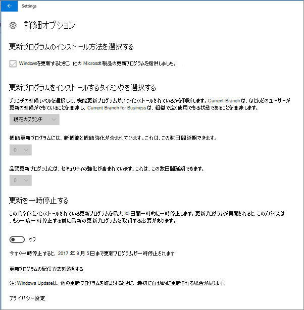
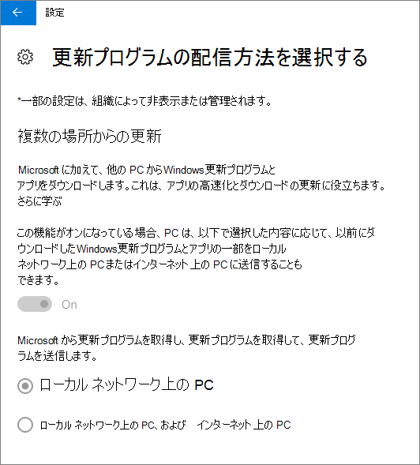

# Windows 10 PC のデバイス保護設定を検証する

> [!NOTE]
> Microsoft Defender for Businessは、2022 年 3 月 1 日以降、Microsoft 365 Business Premiumのお客様に展開されます。 このオファリングでは、デバイスの追加のセキュリティ機能が提供されます。 [Defender for Business の詳細については、こちらを参照してください](../../security/defender-business/mdb-overview.md)。

## Windows 10 デバイス ポリシーが設定されていることを確認する

[デバイス ポリシーを設定](../../business-premium/m365bp-protection-settings-for-windows-10-pcs.md)すると、ポリシーがユーザーのデバイスに反映されるまでに最大で数時間かかる場合があります。 ユーザーのデバイス上でさまざまな Windows の設定画面を表示して、ポリシーが反映されていることを確認できます。 ユーザーはWindows 10 デバイスのWindows UpdateとMicrosoft Defender ウイルス対策の設定を変更できないため、多くのオプションは淡色表示されます。
  
1. **[セキュリティ** \> Windows Update \> **再起動オプション** の **更新&amp;****設定**\>に移動し、すべての設定が淡色表示になっていることを確認します。

    ![[再起動] オプションはすべて淡色表示されます。](../../media/31308da9-18b0-47c5-bbf6-d5fa6747c376.png)
  
2. **[セキュリティ**\>設定 **更新Windows Update &amp;**  \> **詳細設定オプション] に** 移動し、すべての設定が淡色表示になっていることを確認します。\>

    
  
3. Go to **Settings** \> **Update &amp; security** \> **Windows Update** \> **Advanced options** \> **Choose how updates are delivered**.

    一部の設定が組織によって非表示または管理されており、すべてのオプションが淡色表示されていることを示すメッセージが赤で表示されることを確認します。

    
  
4. To open the Windows Defender Security Center, go to **Settings** \> **Update &amp; security** \> **Windows Defender** \> click **Open Windows Defender Security Center** \> **Virus &amp; thread protection** \> **Virus &amp; threat protection settings**.

5. すべてのオプションが淡色表示されていることを確認します。

    ![[ウイルスと脅威の保護] 設定は淡色表示されます。](../../media/9ca68d40-a5d9-49d7-92a4-c581688b5926.png)
  
## 関連コンテンツ

[ビジネス ドキュメントとリソースのMicrosoft 365](/admin)

[Windows 10 PCTop](../../business-premium/m365bp-protection-settings-for-windows-10-devices.md)
 [10 のデバイス構成を設定して、ビジネス プランのMicrosoft 365をセキュリティで保護する](../../admin/security-and-compliance/secure-your-business-data.md)
