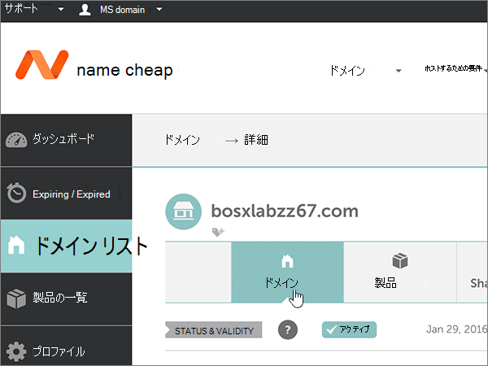
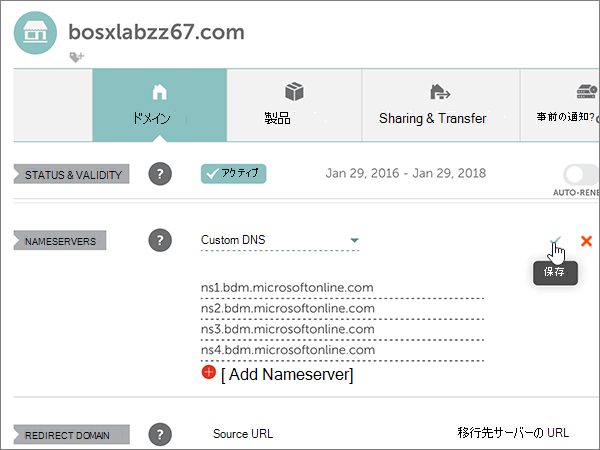
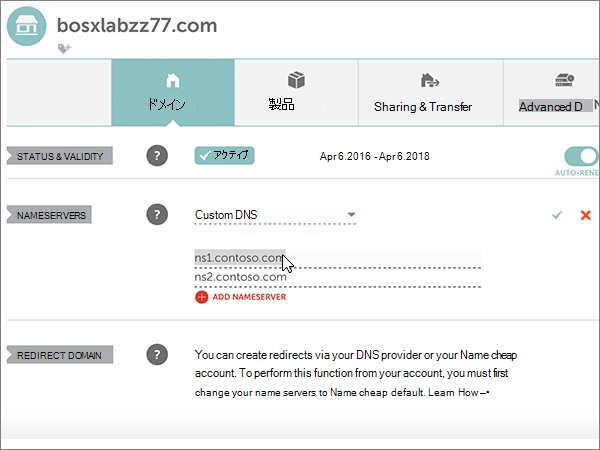

# Namecheap を使用して Microsoft をセットアップするためにネームサーバーを変更する

 探している内容が見つからない場合は、**[ドメインに関する FAQ を確認Q](../setup/domains-faq.md)** を参照してください。
  
Microsoft が DNS レコードを管理する場合は、次の手順に従ってください。 (必要に応じ[て、すべての MICROSOFT DNS レコードを Namecheap で管理](create-dns-records-at-namecheap.md)することができます)。
  
    
## 確認のための TXT レコードを追加する

1. まず、[このリンク](https://www.namecheap.com/myaccount/login.aspx?ReturnUrl=%2f)を使って Namecheap でドメイン ページにアクセスします。サインインして続行するように求められます。
    
    
  
2. **ランディング**ページの [**アカウント**] で、ドロップダウンリストから [**ドメインリスト**] を選択します。 
    
    
  
3. [**ドメインリスト**] ページで、編集するドメインの名前を見つけて、[**管理**] を選択します。
    
    
  
4. [ **ADVANCED DNS**] を選択します。
    
    
  
5. [**ホストレコード**] セクションで、[**新しいレコードの追加**] を選択します。
    
    
  
6. [ **Type**] ドロップダウンで、[ **TXT Record**] を選びます。
    
    > [!NOTE]
    > [**新しいレコードの追加**] を選択すると、[**種類**] ドロップダウンが自動的に表示されます。
  
    
  
7. 新規レコードのボックスに、次の表の値を入力するか、コピーして貼り付けます。
    
    (ドロップダウンリストから [ **TTL** ] の値を選びます。) 
    
|**Type**|**Host**|**Value**|**TTL**|
|:-----|:-----|:-----|:-----|
|TXT    |@    |MS=ms *XXXXXXXX*    **注**: これは例です。 この表では、特定の**宛先またはポイントを**使用して、ここにアドレスを指定します。           [確認する方法](../get-help-with-domains/information-for-dns-records.md)          |30 分    |
   
   
  
8. [**変更の保存**] (チェックマーク) コントロールを選択します。 
    
    
  
9. 数分待つと、続行できます。この間、作成したレコードがインターネット全体で更新されます。
    
これで、ドメインレジストラーのサイトでレコードが追加されました。 Microsoft に戻って、レコードの検索を要求します。
  
Microsoft が正しい TXT レコードを見つけると、ドメインが確認されます。
  
1. 管理センターで、**[設定]** \> <a href="https://go.microsoft.com/fwlink/p/?linkid=834818" target="_blank">[ドメイン]</a> ページの順に移動します。

    
2. **[ドメイン]** ページで、確認するドメインを選択します。 
    
    
  
3. **[セットアップ]** ページで、**[セットアップの開始]** を選択します。
    
    
  
4. **[ドメインの確認]** ページで、**[確認]** を選択します。
    
    
  
> [!NOTE]
>  通常、DNS の変更が有効になるのに 15 分ほどかかります。ただし、インターネットの DNS システム全体を更新する変更の場合、さらに長くかかることもあります。DNS レコードの追加でメール フローなどに問題が発生した場合は、「[ドメイン名または DNS レコードの変更後の問題に関するトラブルシューティング](../get-help-with-domains/find-and-fix-issues.md)」を参照してください。 
  
## ドメインのネーム サーバー (NS) レコードを変更する

Microsoft によるドメインの設定を完了するには、ドメインレジストラーでドメインの NS レコードを変更して、Microsoft プライマリネームサーバーとセカンダリネームサーバーをポイントするようにします。 これにより、ドメインの DNS レコードが更新されるように Microsoft が設定されます。 メール、Skype for Business Online、一般向け Web サイトをドメインで利用できるようにすべてのレコードを追加し、すべての設定を完了します。
  
> [!CAUTION]
> ドメインの NS レコードを変更して Microsoft ネームサーバーをポイントすると、現在ドメインに関連付けられているすべてのサービスが影響を受けます。 たとえば、ドメインに送信されるすべての電子メール (rob@ *your_domain*など) は、この変更を行った後に Microsoft に送られ始めます。 
  
> [!IMPORTANT]
>  When you have completed the steps in this section, the  *only*  nameservers that should be listed are these four: >  ns1.bdm.microsoftonline.com >  ns2.bdm.microsoftonline.com >  ns3.bdm.microsoftonline.com >  ns4.bdm.microsoftonline.com >  The following procedure will show you how to delete any other, unwanted nameservers from the list, and also how to add the  *correct*  nameservers if they are not already in the list. 
  
1. まず、[このリンク](https://www.namecheap.com/myaccount/login.aspx?ReturnUrl=%2f)を使って Namecheap でドメイン ページにアクセスします。サインインして続行するように求められます。
    
    
  
2. **ランディング**ページの [**アカウント**] で、ドロップダウンリストから [**ドメインリスト**] を選択します。 
    
    
  
3. [**ドメインリスト**] ページで、編集するドメインの名前を見つけて、[**管理**] を選択します。
    
    
  
4. [**ドメイン**] を選択します。
    
    
  
5. [ **NAMESERVERS**] セクションを探し、[ **Namecheap Default**] ドロップダウン リストから [ **Custom**] を選びます。 
    
    
  
6. 現在表示されているページに既にネームサーバーが表示されているかどうかに応じて、次の2つの手順のいずれかに進みます。
    
### 既に一覧表示されているネームサーバーがない場合

1. [ **ADD NAMESERVER** ] を2回選択して、2つの新しい行を追加します。
    
    
  
2. [ **Nameserver**] ボックスに、次の表の値を入力するか、コピーして貼り付けます。
    
|||
|:-----|:-----|
|**Nameserver 1**   |ns1.bdm.microsoftonline.com    |
|**Nameserver 2**   |ns2.bdm.microsoftonline.com    |
|**Nameserver 3**   |ns3.bdm.microsoftonline.com    |
|**Nameserver 4**   |ns4.bdm.microsoftonline.com    |
   
   
  
3. [**保存**] (チェックマーク) コントロールを選択します。 
    
    
  
> [!NOTE]
> ネーム サーバー レコードの更新がインターネットの DNS システム全体に反映されるまでに、最大で数時間かかる場合があります。 その後、自分のドメインで使用できるように、Microsoft メールとその他のサービスがすべて設定されます。 
  
### 既に一覧表示されているネームサーバーがある場合

> [!CAUTION]
> これらの手順は、前途した 4 件の *正しい*  ネームサーバー以外にも既存のネームサーバーがある場合に  *のみ*  行ってください (つまり、現在のネームサーバーのうち *ns1.bdm.microsoftonline.com* 、 *ns2.bdm.microsoftonline.com* 、 **ns3.bdm.microsoftonline.com** 、 **ns4.bdm.microsoftonline.com** のいずれでも  **ない**  もの  **だけ**  を削除します)。 
  
1. [ **Nameserver**] ボックスに他のネーム サーバーが表示されている場合は、各ネームサーバーを選び、キーボードの **Delete** キーを押して、ネーム サーバーを削除します。 
    
    
  
2. [ **ADD NAMESERVER** ] を2回選択して、2つの新しい行を追加します。 
    
    
  
3. [ **Nameserver**] ボックスに、次の表の値を入力するか、コピーして貼り付けます。
 
    
|||
|:-----|:-----|
|**Name Server 1**   |ns1.bdm.microsoftonline.com    |
|**Name Server 2**   |ns2.bdm.microsoftonline.com    |
|**Nameserver 3**   |ns3.bdm.microsoftonline.com    |
|**Nameserver 4**   |ns4.bdm.microsoftonline.com    |
   
   
  
4. [**保存**] (チェックマーク) コントロールを選択します。 
    
    
  
> [!NOTE]
> ネーム サーバー レコードの更新がインターネットの DNS システム全体に反映されるまでに、最大で数時間かかる場合があります。 その後、自分のドメインで使用できるように、Microsoft メールとその他のサービスがすべて設定されます。
