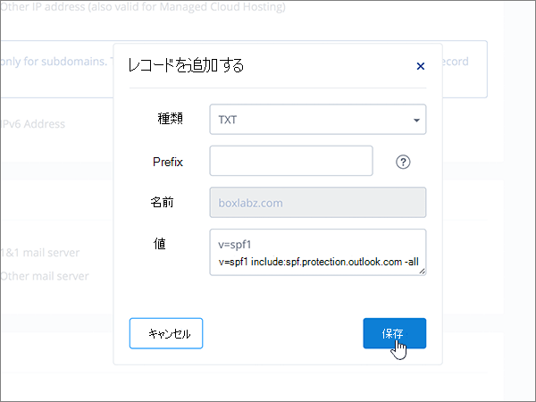
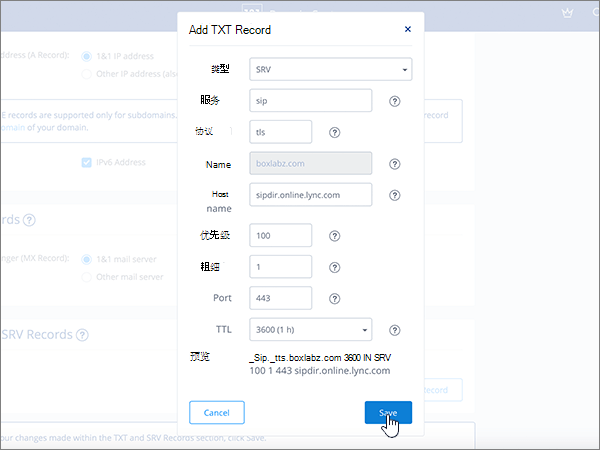

# Office 365 用の 1&1 IONOS で DNS レコードを作成する

 探している内容が見つからない場合は、**[ドメインに関する FAQ を確認Q](../setup/domains-faq.md)** を参照してください。 
  
> [!CAUTION]
> 1&1 IONOS では、ドメインは MX レコードとトップレベル自動検出 CNAME レコードの両方を持つことはできないことに注意してください。 これにより、Office 365 用に Exchange Online を構成する方法が制限されます。 回避策がありますが、1&1 IONOS でサブドメインを作成した経験がある場合に**のみ**、この方法を使用することをお勧めします。 > このサービスの[制限](https://support.office.com/article/7ae9a655-041d-4724-aa92-60392ee390c2.aspx)にかかわらず、1&1 IONOS で独自の OFFICE 365 DNS レコードを管理することを選択する場合は、この記事の手順に従って、ドメインを確認し、電子メール、Skype For business Online などの dns レコードを設定します。 
  
これらのレコードを 1&1 IONOS に追加すると、使用しているドメインが、Office 365 サービスで機能するように設定されます。
  
Office 365 での Web サイト向け Web ホスティングと DNS の詳細については、「[Office 365 でのパブリック Web サイトの使用](https://support.office.com/article/choose-a-public-website-3325d50e-d131-403c-a278-7f3296fe33a9)」を参照してください。
  
> [!NOTE]
> 通常、DNS の変更が反映されるまでの時間は約 15 分です。ただし、インターネットの DNS システム全体を更新する変更の場合、さらに長くかかることもあります。DNS レコードの追加後にメール フローなどに問題が発生した場合は、「[Office 365 でドメインまたは DNS レコードを追加後に問題を特定して解決する](../get-help-with-domains/find-and-fix-issues.md)」を参照してください。 
  
## 確認のための TXT レコードを追加する

Office 365 でドメインを使うには、ドメインを所有していることを確認する必要があります。自分のドメイン レジストラーで自分のアカウントにログインし、DNS レコードを作成することができれば、Office 365 に対してドメインを所有していることを確認することができます。
  
> [!NOTE]
> このレコードは、ドメインを所有していることを確認するためだけに使用されます。その他には影響しません。 必要に応じて、後で削除することができます。 
  
次の手順を実行するか、[ビデオ (0 分 42 秒から開始) をご覧ください](https://support.office.com/article/Video-Create-DNS-records-at-1-1-Internet-for-Office-365-543fb112-ecf5-47ae-b096-07f3f942a089?ui=en-US&amp;rs=en-US&amp;ad=US)。
  
1. まず、[このリンク](https://my.1and1.com/)を使用して 1&1 IONOS でドメインページにアクセスします。 You'll be prompted to log in.
    
2. [ **Manage domains**] を選びます。
    
3. [**ドメインセンター** ] ページで、更新するドメインを見つけて、そのドメインの [ **Panel** ( **v**)] コントロールを選択します。
    
4. [**ドメインの設定**] 領域で、[ **DNS 設定の編集**] を選択します。
    
5. [ **TXT および SRV Records** ] セクションで、[ **Add Record**] を選択します。
    
6. In the **Add Record** area, in the boxes for the new record, type or copy and paste the values from the following table. 
    
    (Choose the **Type** value from the drop-down list.) 
    
    ||||
    |:-----|:-----|:-----|
    |**Type**   |**Prefix**   |**Name Value**   |
    |TXT    |(このフィールドは空白のままにしておきます)    |MS=ms *XXXXXXXX*    注: これは例です。 Office 365 の表から [**宛先またはポイント先のアドレス**] の値を指定してください。 [確認する方法](../get-help-with-domains/information-for-dns-records.md)          |
   
7. [**保存**] を選択します。
    
8. [**保存**] をもう一度選択します。 
    
9. [ **EDIT DNS Settings** ] ダイアログボックスで、[**はい**] を選択します。
    
10. 数分待つと、続行できます。この間、作成したレコードがインターネット全体で更新されます。
    
これで、ドメイン レジストラーのサイトでレコードが追加されました。Office 365 に戻り、Office 365 にレコードの検索をリクエストします。
  
Office 365 で正しい TXT レコードが見つかった場合、ドメインは確認済みとなります。
  
1. 管理センターで、**[設定]** \> <a href="https://go.microsoft.com/fwlink/p/?linkid=834818" target="_blank">[ドメイン]</a> ページの順に移動します。

    
2. **[ドメイン]** ページで、確認するドメインを選択します。 
    
3. **[セットアップ]** ページで、**[セットアップの開始]** を選択します。
    
4. [**ドメインの確認**] ページで、[**確認**] を選択します。
    
> [!NOTE]
> 通常、DNS の変更が反映されるまでの時間は約 15 分です。ただし、インターネットの DNS システム全体を更新する変更の場合、さらに長くかかることもあります。DNS レコードの追加後にメール フローなどに問題が発生した場合は、「[Office 365 でドメインまたは DNS レコードを追加後に問題を特定して解決する](../get-help-with-domains/find-and-fix-issues.md)」を参照してください。 
  
## MX レコードを追加して、自分のドメインのメールが Office 365 に届くようにする

次の手順を実行するか、[ビデオ (3 分 22 秒から開始) を参照](https://support.office.com/article/Video-Create-DNS-records-at-1-1-Internet-for-Office-365-543fb112-ecf5-47ae-b096-07f3f942a089?ui=en-US&amp;rs=en-US&amp;ad=US)してください。
  
> [!NOTE]
> 1und1.de に登録した場合は、[ここにサインイン](https://go.microsoft.com/fwlink/?linkid=859152)してください。 
  
1. まず、[このリンク](https://my.1and1.com/)を使用して 1&1 IONOS でドメインページにアクセスします。 You'll be prompted to log in.
    
2. [ **Manage domains**] を選びます。
    
3. [**ドメインセンター** ] ページで、更新するドメインを見つけて、そのドメインの [ **Panel** ( **v**)] コントロールを選択します。
    
4. [**ドメインの設定**] 領域で、[ **DNS 設定の編集**] を選択します。
    
5. In the **MX Records** section, in the ** Mail Exchanger (MX Record) ** area, select **Other mail server**. (下へスクロールしなければならないことがあります。)   
  
6. 既に他の MX レコードがある場合は、それぞれのレコードを選び、キーボードの **Delete** キーを押して、レコードを削除します (登録されている MX レコードがない場合は、次の手順に進みます)。  
  
7. [ **MX 1**] レコードのボックスに、次の表の値を入力するか、コピーして貼り付けます。 
    
    |**MX 1**|**Priority**|
    |:-----|:-----|
    | *\<ドメインキー\>*  .mail.protection.outlook.com     注: Office 365 \<アカウントからドメイン\>キーを取得します。 [確認する方法](../get-help-with-domains/information-for-dns-records.md)          |10     優先度の詳細については、「[MX 優先度とは何か](https://support.office.com/article/2784cc4d-95be-443d-b5f7-bb5dd867ba83.aspx)」を参照してください。   | 
    
     
  
8. [**保存**] を選択します。 (You may have to scroll down.) 
  
9. [ **EDIT DNS Settings** ] ダイアログボックスで、[**はい**] を選択します。 ![[DNS 設定の編集] ダイアログボックスで [はい] を選択する](../../media/920cc95f-fedf-4da2-94a4-9cb41ed49bcf.png)
  
## Office 365 に必要な 6 つの CNAME レコードを追加する

1&1 IONOS には、Office 365 電子メールサービスに必要な CNAME レコードと共に MX レコードを使用できるようにするための回避策が必要です。 この回避策では、1&1 IONOS にサブドメインのセットを作成し、それらを CNAME レコードに割り当てる必要があります。
  
> [!IMPORTANT]
> この手順を開始する前に、利用可能なサブドメインが 2 つ以上あることを確認してください。 この解決策は、サブドメインの作成に IONOS 1&1 で既に経験している場合にのみお勧めします。 
  
### 基本的な CNAME レコード

次の手順を実行するか、[ビデオ (3 分 57 秒から開始) を参照](https://support.office.com/article/Video-Create-DNS-records-at-1-1-Internet-for-Office-365-543fb112-ecf5-47ae-b096-07f3f942a089?ui=en-US&amp;rs=en-US&amp;ad=US)してください。
  
> [!NOTE]
> 1und1.de に登録した場合は、[ここにサインイン](https://go.microsoft.com/fwlink/?linkid=859152)してください。 
  
1. まず、[このリンク](https://my.1and1.com/)を使用して 1&1 IONOS でドメインページにアクセスします。 You'll be prompted to log in.
    
2. [ **Manage domains**] を選びます。
    
3. [**ドメインセンター** ] ページで、更新するドメインを見つけ、[サブドメインの**管理**] を選択します。   次に、2 つのサブドメインを作成して、それぞれの [ **Alias**] 値を設定します (1&1 IONOS でサポートされる最上位の CNAME レコードは1つだけなので、このようにする必要がありますが、Office 365 にはいくつかの CNAME レコードが必要です。) 最初に、Autodiscover サブドメインを作成します。
    
4. [**サブドメインの概要**] セクションで、[**サブドメインの作成**] を選択します。
    
    
  
5. 新しいサブドメインの [ **Create Subdomain**] ボックスに、次の表の **Create Subdomain** 値のみを入力するか、コピーして貼り付けます ( **Alias** 値は後の手順で追加します)。

    |**Create Subdomain**|**Alias**|
    |:-----|:-----|
    |autodiscover    |autodiscover.outlook.com   | 

    
  
6. [**サブドメインの作成**] を選択します。 
  
7. [**サブドメインの概要**] セクションで、作成したばかりの**自動検出**サブドメインを見つけて、そのサブドメインの [ **Panel (v)** ] コントロールを選択します。  
  
8. [**サブドメインの設定**] 領域で、[ **DNS 設定の編集**] を選択します。  
  
9. [ **A/AAAA レコード (Ip アドレス)** ] セクションの [ **Ip アドレス (A レコード)** ] 領域で、[ **CNAME**] を選択します。 
  
10. [ **Alias**] ボックスに、次の表の **Alias** 値のみを入力するか、コピーして貼り付けます。  
    
    |**Create Subdomain**|**Alias**|
    |:-----|:-----|
    |autodiscover    |autodiscover.outlook.com   |

    
  
11. 免責事項の [ **I am aware**] チェック ボックスをオンにします。 
  
12. [**保存**] を選択します。 
  
  
### 追加の CNAME レコード

以降の手順に従って追加の CNAME レコードを作成すると、Skype for Business Online サービスが有効になります。 手順は、前に 2 つの CNAME レコードを作成したときの手順と同じです。
  
1. 3 つ目のサブドメイン (Lyncdiscover) を作成します。 [**サブドメインの概要**] セクションで、[**サブドメインの作成**] を選択します。
    
2. 新しいサブドメインの [ **Create Subdomain**] ボックスに、次の表の **Create Subdomain** 値のみを入力するか、コピーして貼り付けます ( **Alias** 値は後の手順で追加します)。  
    
    |**Create Subdomain**|**Alias**|
    |:-----|:-----|
    |lyncdiscover   |webdir.online.lync.com  |
   
3. [**サブドメインの作成**] を選択します。
    
4. [**ドメインセンター** ] ページで、[サブドメインの**管理**] を選択します。
    
5. [**サブドメインの概要**] セクションで、作成したばかりの**lyncdiscover**サブドメインを見つけて、そのサブドメインの [ **Panel (v)** ] コントロールを選択します。  [**サブドメインの設定**] 領域で、[ **DNS 設定の編集**] を選択します。
    
6. In the **A/AAAA Records (IP Addresses)** section, in the ** IP address (A Record) ** area, select **CNAME**.
    
7. [ **Alias**] ボックスに、次の表の **Alias** 値のみを入力するか、コピーして貼り付けます。  
    
    |**Create Subdomain**|**Alias**|
    |:-----|:-----|
    |lyncdiscover    |webdir.online.lync.com    |
   
8. [ **I am aware** ] 免責事項のチェックボックスをオンにして、[**保存**] を選択します。
    
9. [ **EDIT DNS Settings** ] ダイアログボックスで、[**はい**] を選択します。
    
10. 4 つ目のサブドメイン (SIP) を作成します。  [**サブドメインの概要**] セクションで、[**サブドメインの作成**] を選択します。
    
11. 新しいサブドメインの [ **Create Subdomain**] ボックスに、次の表の **Create Subdomain** 値のみを入力するか、コピーして貼り付けます ( **Alias** 値は後の手順で追加します)。 
    
    |**Create Subdomain**|**Alias**|
    |:-----|:-----|
    |sip    |sipdir.online.lync.com    |
   
12. [**サブドメインの作成**] を選択します。
    
13. [**ドメインセンター** ] ページで、[サブドメインの**管理**] を選択します。
    
14. [**サブドメインの概要**] セクションで、作成したばかりの**sip**サブドメインを見つけて、そのサブドメインの [ **Panel (v)** ] コントロールを選択します。  [**サブドメインの設定**] 領域で、[ **DNS 設定の編集**] を選択します。
    
15. In the **A/AAAA Records (IP Addresses)** section, in the ** IP address (A Record) ** area, select **CNAME**.
    
16. [ **Alias**] ボックスに、次の表の **Alias** 値のみを入力するか、コピーして貼り付けます。 
    
    |**Create Subdomain**|**Alias**|
    |:-----|:-----|
    |sip    |sipdir.online.lync.com    |
   
17. [ **I am aware** ] 免責事項のチェックボックスをオンにして、[**保存**] を選択します。
    
18. [ **EDIT DNS Settings** ] ダイアログボックスで、[**はい**] を選択します。
    
### MDM に必要な CNAME レコード

> [!IMPORTANT]
> 手順は、他の 4 個の CNAME レコードの場合と同じですが、次の表の値を入力します。 
  
|**Create Subdomain**|**Alias**|
|:-----|:-----|
|enterpriseregistration    |enterpriseregistration.windows.net    |
|enterpriseenrollment    |enterpriseenrollment-s.manage.microsoft.com    |
   
## 迷惑メールの防止に役立つ、SPF の TXT レコードを追加する

> [!IMPORTANT]
> 1 つのドメインで、SPF に複数の TXT レコードを設定することはできません。 1 つのドメインに複数の SPF レコードがあると、メール、配信の分類、迷惑メールの分類で問題が発生することがあります。 If you already have an SPF record for your domain, don't create a new one for Office 365. 代わりに、現在のレコードに Office 365 で必要になる値を追加して、元々の値と追加する値の組み合わせが  *1 つの*  SPF レコードになるようにします。 次に例を示します。 参考にしてください。 SPF レコードを検証するには、これらの[spf 検証ツール](../setup/domains-faq.md)のいずれかを使用できます。 
  
次の手順を実行するか、[ビデオ (5 分 9 秒から開始) を参照](https://support.office.com/article/Video-Create-DNS-records-at-1-1-Internet-for-Office-365-543fb112-ecf5-47ae-b096-07f3f942a089?ui=en-US&amp;rs=en-US&amp;ad=US)してください。
  
> [!NOTE]
> 1und1.de に登録した場合は、[ここにサインイン](https://go.microsoft.com/fwlink/?linkid=859152)してください。 
  
1. まず、[このリンク](https://my.1and1.com/)を使用して 1&1 IONOS でドメインページにアクセスします。 You'll be prompted to log in.
    
2. [ **Manage domains**] を選びます。
    
3. [**ドメインセンター** ] ページで、更新するドメインを見つけて、そのドメインの [ **Panel** (**v**)] コントロールを選択します。
    
4. [**ドメインの設定**] 領域で、[ **DNS 設定の編集**] を選択します。
    
5. [ **TXT および SRV Records** ] セクションで、[ **Add Record**] を選択します。  (You may have to scroll down.)
    
6. In the **Add Record** area, in the boxes for the new record, type or copy and paste the values from the following table.  (Choose the **Type** value from the drop-down list.)  
    
    |**種類**|**Prefix**|**Name Value**|
    |:-----|:-----|:-----|
    |TXT    |(Leave this field empty.)    |v=spf1 include:spf.protection.outlook.com -all    **注:** スペースも正しく入力されるように、この値をコピーして貼り付けることをお勧めします。           | 
    
    
  
7. [**保存**] を選択します。 
  
8. [**保存**] を選択します。 
  
9. [ **EDIT DNS Settings** ] ダイアログボックスで、[**はい**] を選択します。 ![[DNS 設定の編集] ダイアログボックスで [はい] を選択する](../../media/920cc95f-fedf-4da2-94a4-9cb41ed49bcf.png)
  
## Office 365 に必要な 2 つの SRV レコードを追加する

次の手順を実行するか、[ビデオ (5 分 51 秒から開始) を参照](https://support.office.com/article/Video-Create-DNS-records-at-1-1-Internet-for-Office-365-543fb112-ecf5-47ae-b096-07f3f942a089?ui=en-US&amp;rs=en-US&amp;ad=US)してください。
  
> [!NOTE]
> 1und1.de に登録した場合は、[ここにサインイン](https://go.microsoft.com/fwlink/?linkid=859152)してください。 
  
1. まず、[このリンク](https://my.1and1.com/)を使用して 1&1 IONOS でドメインページにアクセスします。 You'll be prompted to log in.
    
2. [ **Manage domains**] を選びます。
    
3. [**ドメインセンター** ] ページで、更新するドメインを見つけて、そのドメインの [ **Panel** ( **v**)] コントロールを選択します。
    
4. [**ドメインの設定**] 領域で、[ **DNS 設定の編集**] を選択します。
    
5. [ **TXT および SRV Records** ] セクションで、[ **Add Record**] を選択します。
    
6. 2 つの SRV レコードの最初のレコードを追加します。 [ **Add Record**] 領域にある新規レコードのボックスに、次の表の最初の行の値を入力するか、コピーして貼り付けます  (ドロップダウンリストから [ **Type** ] と [ **TTL** ] の値を選びます。) 
    
    |**Type**|**Service**|**Protocol**|**Name**|**Host**|**Priority**|**Weight**|**Port**|**TTL**|
    |:-----|:-----|:-----|:-----|:-----|:-----|:-----|:-----|:-----|
    |SRV    |sip    |tls    |(Leave this field empty.)    |sipdir.online.lync.com    |100    |1-d    |443    |3600 (1 h)    |
    |SRV    |sipfederationtls    |tcp    |(このフィールドは空のままにします。)    |sipfed.online.lync.com    |100    |1-d    |5061    |3600 (1 h)    |  
    
    
  
7. [**保存**] を選択します。  
  
8. [**保存**] を選択します。  
  
9. [ **EDIT DNS Settings** ] ダイアログボックスで、[**はい**] を選択します。  ![[DNS 設定の編集] ダイアログボックスで [はい] を選択する](../../media/920cc95f-fedf-4da2-94a4-9cb41ed49bcf.png)
  
10. 残りの SRV レコードを追加します。  [ **TXT および SRV Records** ] セクションで、[ **Add Record**] を選択します。  [ **Add Record** ] 領域で、表の他の行の値を使用してレコードを作成し、[**追加**]、[**保存**]、および **[はい]** を再度選択してレコードを完成させます。 
    
> [!NOTE]
> 通常、DNS の変更が反映されるまでの時間は約 15 分です。ただし、インターネットの DNS システム全体を更新する変更の場合、さらに長くかかることもあります。DNS レコードの追加後にメール フローなどに問題が発生した場合は、「[Office 365 でドメインまたは DNS レコードを追加後に問題を特定して解決する](../get-help-with-domains/find-and-fix-issues.md)」を参照してください。 
  
