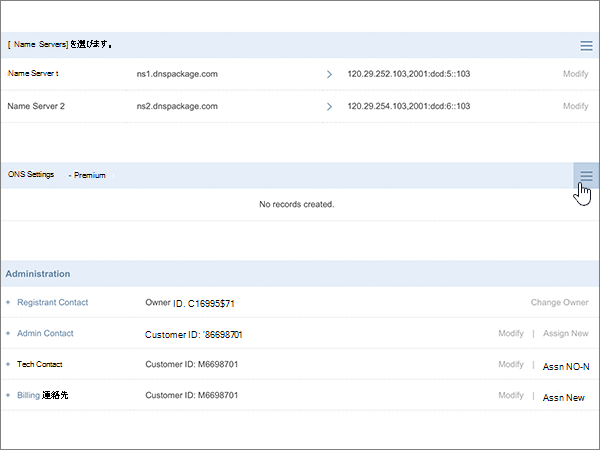
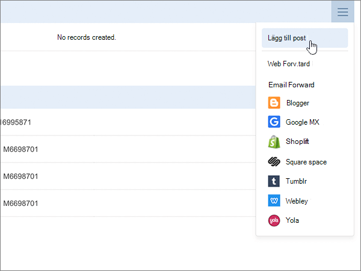
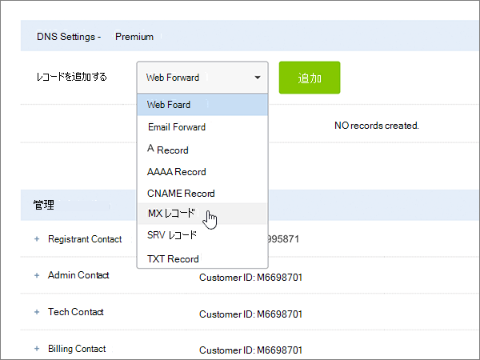
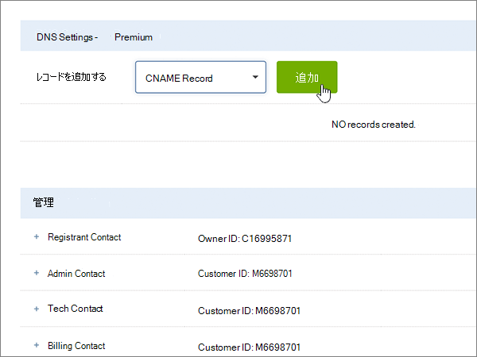
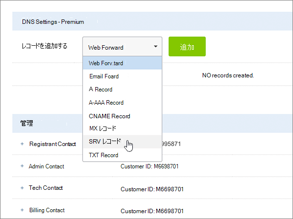

# Microsoft 用の変わったドメインで DNS レコードを作成する

 **探している内容が見つからない場合は、[ドメインに関する FAQ を確認](../setup/domains-faq.md)** してください。 
  
使用している DNS ホスティング プロバイダーが Crazy Domains の場合は、この記事に示す手順に従い、ドメインを確認して、メールや Skype for Business Online などの DNS レコードを設定します。
  
これらのレコードを、変わったドメインで追加すると、使用しているドメインが Microsoft サービスで機能するように設定されます。
  

  
> [!NOTE]
> 通常、DNS の変更が有効になるのに 15 分ほどかかります。ただし、インターネットの DNS システム全体を更新する変更の場合、さらに長くかかることもあります。DNS レコードの追加でメール フローなどに問題が発生した場合は、「[ドメイン名または DNS レコードの変更後の問題に関するトラブルシューティング](../get-help-with-domains/find-and-fix-issues.md)」を参照してください。 
  
## 確認のための TXT レコードを追加する

Microsoft のドメインを使うには、ドメインを所有していることを確認する必要があります。自分のドメイン レジストラーで自分のアカウントにログインし、DNS レコードを作成することができれば、Microsoft に対してドメインを所有していることを確認することができます。
  
> [!NOTE]
> このレコードは、ドメインを所有していることを確認するためだけに使用されます。その他には影響しません。 必要に応じて、後で削除することができます。 
  
1. まず、[このリンク](https://manage.crazydomains.com/members/domains/)を使って Crazy Domains でドメイン ページにアクセスします。最初にログインするように求められます。
    
    
  
2. **[マイアカウント**] セクションで、[ **Domains**] を選択します。
    
    
  
3. [ **ドメイン名** ] ページの [ **ドメイン** ] セクションで、更新するドメインの名前を選択します。 
    
    
  
4. [ **DNS 設定** ] セクションで、ドロップダウンリストアイコンを選択します。 
    
    
  
5. [ **Add Record** ] を選択します。
    
    
  
6. [ **Add Record**] ボックスの一覧から [ **TXT Record**] を選びます。 
    
    
  
7. **[追加]** を選択します。
    
    
  
8. 新規レコードのボックスに、次の表の値を入力するか、コピーして貼り付けます。
    
    |**サブドメイン**|**テキスト レコード**|
    |:-----|:-----|
    |(このフィールドは空のままにします。)    |MS=ms *XXXXXXXX*    **注:** これは例です。 この表から **[宛先またはポイント先のアドレス]** の値を指定してください。           [確認する方法](../get-help-with-domains/information-for-dns-records.md)          |
   
    
  
9. **[更新]** を選択します。
    
    
  
10. 数分待つと、続行できます。この間、作成したレコードがインターネット全体で更新されます。
    
これで、ドメイン レジストラーのサイトでレコードが追加されました。Microsoft に戻り、レコードをリクエストします。
  
Microsoft で正しい TXT レコードが見つかった場合、ドメインは確認済みとなります。
  
1. Microsoft 管理センターで、**[設定]** \> <a href="https://go.microsoft.com/fwlink/p/?linkid=834818" target="_blank">[ドメイン]</a> ページの順に移動します。

    
2. **[ドメイン]** ページで、確認するドメインを選択します。 
    
    
  
3. **[セットアップ]** ページで、**[セットアップの開始]** を選択します。
    
    
  
4. **[ドメインの確認]** ページで、**[確認]** を選択します。
    
    
  
> [!NOTE]
>  通常、DNS の変更が有効になるのに 15 分ほどかかります。ただし、インターネットの DNS システム全体を更新する変更の場合、さらに長くかかることもあります。DNS レコードの追加でメール フローなどに問題が発生した場合は、「[ドメイン名または DNS レコードの変更後の問題に関するトラブルシューティング](../get-help-with-domains/find-and-fix-issues.md)」を参照してください。 
  
## MX レコードを追加して、自分のドメインのメールが Microsoft に届くようにする

1. まず、[このリンク](https://manage.crazydomains.com/members/domains/)を使って Crazy Domains でドメイン ページにアクセスします。最初にログインするように求められます。
    
    
  
2. **[マイアカウント**] セクションで、[ **Domains**] を選択します。
    
    
  
3. [ **ドメイン名** ] ページの [ **ドメイン** ] セクションで、更新するドメインの名前を選択します。 
    
    
  
4. [ **DNS 設定** ] セクションで、ドロップダウンリストアイコンを選択します。 
    
    
  
5. [ **Add Record** ] を選択します。
    
    
  
6. [ **Add Record:**] ボックスの一覧から [ **MX Record**] を選びます。 
    
    
  
7. **[追加]** を選択します。
    
    
  
8. 新規レコードのボックスに、次の表の値を入力するか、コピーして貼り付けます。
    
    (ドロップダウンリストから **優先度** の値を選択します。) 
    
    |**メール送信先ゾーン**|**優先度**|**割り当て先サーバー**|
    |:-----|:-----|:-----|
    |(このフィールドは空のままにします。)    |1-d    優先度の詳細については、「[MX 優先度とは何ですか?](https://docs.microsoft.com/microsoft-365/admin/setup/domains-faq)」を参照してください。   | *\<domain-key\>*  .mail.protection.outlook.com    **注:***\<domain-key\>* Microsoft アカウントからを取得します。           [確認する方法](../get-help-with-domains/information-for-dns-records.md)          |
       
   
  
9. **[更新]** を選択します。
    
    
  
10. その他の MX レコードが [ **Mx Record** ] セクションに表示されている場合は、いずれかのレコードに対して [ **変更** ] を選択します。 
    
    
  
11. **[削除]** を選択します。
    
    
  
12. [ **更新** ] を選択して、削除を確認します。 
    
    
  
13. この手順の前半で追加した MX レコードだけを残し、同じ手順で、一覧に表示されているその他の MX レコードをすべて削除します。
    
## Microsoft に必要な6つの CNAME レコードを追加する

1. まず、[このリンク](https://manage.crazydomains.com/members/domains/)を使って Crazy Domains でドメイン ページにアクセスします。最初にログインするように求められます。
    
    
  
2. **[マイアカウント**] セクションで、[ **Domains**] を選択します。
    
    
  
3. [ **ドメイン名** ] ページの [ **ドメイン** ] セクションで、更新するドメインの名前を選択します。 
    
    
  
4. [ **DNS 設定** ] セクションで、ドロップダウンリストアイコンを選択します。 
    
    
  
5. [ **Add Record** ] を選択します。
    
    
  
6. Choose **CNAME Record** from the **Add Record:** drop-down list. 
    
    
  
7. **[追加]** を選択します。
    
    
  
8. 6 つの CNAME レコードの最初のレコードを追加します。
    
    新規レコードのボックスに、次の表の 1 行目の値を入力するか、コピーして貼り付けます。
    
    |**サブドメイン**|**エイリアス**|
    |:-----|:-----|
    |autodiscover    |autodiscover.outlook.com    |
    |sip    |sipdir.online.lync.com    |
    |lyncdiscover    |webdir.online.lync.com    |
    |enterpriseregistration    |enterpriseregistration.windows.net    |
    |enterpriseenrollment    |enterpriseenrollment-s.manage.microsoft.com    |
   
    
  
9. [ **ADD CNAME Record**] を選びます。
    
    
  
10. 2 番目の CNAME レコードを追加します。
    
    新規レコードのボックスに、表の次の行の値を使用し、[ **ADD CNAME record**] をもう一度選択します。
    
    6 つの CNAME レコードの作成がすべて完了するまで、このプロセスを繰り返します。
    
11. [ **更新** ] を選択して変更を保存します。 
    
    
  
## 迷惑メールの防止に役立つ、SPF の TXT レコードを追加する

> [!IMPORTANT]
> 1 つのドメインで、SPF に複数の TXT レコードを設定することはできません。 1 つのドメインに複数の SPF レコードがあると、メール、配信の分類、迷惑メールの分類で問題が発生することがあります。 使用しているドメインに既に SPF レコードがある場合は、Microsoft 用に新しいレコードを作成しないでください。 代わりに、値のセットを含む  *1 つ*  の SPF レコードがあるように、現在のレコードに必要な Microsoft の値を追加します。 
  
1. まず、[このリンク](https://manage.crazydomains.com/members/domains/)を使って Crazy Domains でドメイン ページにアクセスします。最初にログインするように求められます。
    
    
  
2. **[マイアカウント**] セクションで、[ **Domains**] を選択します。
    
    
  
3. [ **ドメイン名** ] ページの [ **ドメイン** ] セクションで、更新するドメインの名前を選択します。 
    
    
  
4. [ **DNS 設定** ] セクションで、ドロップダウンリストアイコンを選択します。 
    
    
  
5. [ **Add Record** ] を選択します。
    
    
  
6. [ **Add Record:**] ボックスの一覧から [ **TXT Record**] を選びます。 
    
    
  
7. **[追加]** を選択します。
    
    
  
8. 新規レコードのボックスに、次の表の値を入力するか貼り付けます。
    
    |**サブドメイン**|**テキスト レコード**|
    |:-----|:-----|
    |(このフィールドは空のままにします。)    |v=spf1 include:spf.protection.outlook.com -all    **注:** スペースも正しく入力されるように、この値をコピーして貼り付けることをお勧めします。           |
   
    
  
9. **[更新]** を選択します。
    
    
  
## Microsoft で必要な 2 つの SRV レコードを追加する

1. まず、[このリンク](https://manage.crazydomains.com/members/domains/)を使って Crazy Domains でドメイン ページにアクセスします。最初にログインするように求められます。
    
    
  
2. **[マイアカウント**] セクションで、[ **Domains**] を選択します。
    
    
  
3. [ **ドメイン名** ] ページの [ **ドメイン** ] セクションで、更新するドメインの名前を選択します。 
    
    
  
4. [ **DNS 設定** ] セクションで、ドロップダウンリストアイコンを選択します。 
    
    
  
5. [ **Add Record** ] を選択します。
    
    
  
6. [ **Add Record:**] ボックスの一覧から [ **SRV Record**] を選びます。 
    
    
  
7. **[追加]** を選択します。
    
    
  
8. 2 つの SRV レコードの最初のレコードを追加します。
    
    新規レコードのボックスに、次の表の 1 行目の値を入力するか、コピーして貼り付けます。
    
    |**レコードの種類**|**サブドメイン**|**Priority**|**Weight**|**Port**|**対象**|
    |:-----|:-----|:-----|:-----|:-----|:-----|
    |SRV レコード    |_sip._tls    |100    |1-d    |443    |sipdir.online.lync.com    |
    |SRV レコード    |_sipfederationtls._tcp    |100    |1-d    |5061    |sipfed.online.lync.com    |
   
    
  
9. [ **ADD SRV Record**] を選びます。
    
    
  
10. 残りの SRV レコードを追加します。
    
    新規レコードのボックスで、次の表の 2 行目の値を使用します。
    
11. [ **更新** ] を選択して変更を保存します。 
    
    
  
> [!NOTE]
> 通常、DNS の変更が有効になるのに 15 分ほどかかります。ただし、インターネットの DNS システム全体を更新する変更の場合、さらに長くかかることもあります。DNS レコードの追加でメール フローなどに問題が発生した場合は、「[ドメイン名または DNS レコードの変更後の問題に関するトラブルシューティング](../get-help-with-domains/find-and-fix-issues.md)」を参照してください。 
  
