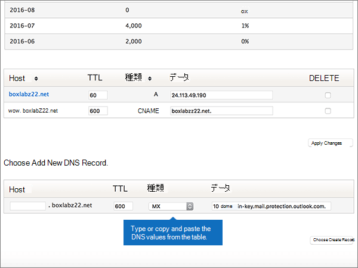

# Microsoft の Dyn.com で DNS レコードを作成する

 **探している内容が見つからない場合は、[ドメインに関する FAQ を確認](../setup/domains-faq.md)** してください。 
  
使用している DNS ホスティング プロバイダーが Dyn.com の場合は、この記事に記載された手順に従って、ドメインの確認とメールや Skype for Business Online などの DNS レコードのセットアップを行います。
 
Microsoft を使用した web サイトのホストと DNS の詳細については、「 [microsoft とのパブリック web サイトの使用](https://support.office.com/article/choose-a-public-website-3325d50e-d131-403c-a278-7f3296fe33a9)」を参照してください。
  
> [!NOTE]
>  通常、DNS の変更が有効になるのに 15 分ほどかかります。ただし、インターネットの DNS システム全体を更新する変更の場合、さらに長くかかることもあります。DNS レコードの追加でメール フローなどに問題が発生した場合は、「[ドメイン名または DNS レコードの変更後の問題に関するトラブルシューティング](../get-help-with-domains/find-and-fix-issues.md)」を参照してください。 
  
## 確認のための TXT レコードを追加する

1. まず、[このリンク](https://account.dyn.com/dns/)を使って Dyn.com でドメイン ページにアクセスします。最初にログインするように求められます。
    
    
  
2. [ **Zone Level Services** ] ページで、編集するドメインの [ **Dyn Standard DNS Service** ] を選択します。 
    
3. ドメインの [ **DNS** ] ページで、[**プレファレンス**] を選択します。
    
4. [**エキスパートインターフェイスを有効にする**] を選択します。
    
5. In the **Add DNS Record** section, in the boxes for the new record, type or copy and paste the values from the following table. 
    
    (Choose the **Type** value from the drop-down list.) 
    
    |**Host**|**TTL**|**Type**|**データ**|
    |:-----|:-----|:-----|:-----|
    |(Leave this field empty.)    |600    |TXT    |MS=ms *XXXXXXXX*    **注:** これは例です。 この表では、特定の**宛先またはポイントを**使用して、ここにアドレスを指定します。           [確認する方法](../get-help-with-domains/information-for-dns-records.md)          |
       
   
  
6. [ **Create Record**] を選びます。
    
    
  
7. 数分待つと、続行できます。この間、作成したレコードがインターネット全体で更新されます。
    
これで、ドメインレジストラーのサイトでレコードが追加されたので、Microsoft に戻ってレコードを要求します。
  
Microsoft が正しい TXT レコードを見つけると、ドメインが確認されます。
  
1. Microsoft 管理センターで、[<a href="https://go.microsoft.com/fwlink/p/?linkid=834818" target="_blank">ドメイン</a>の**設定** \> ] ページに移動します。

    
2. **[ドメイン]** ページで、確認するドメインを選択します。 
    
    
  
3. **[セットアップ]** ページで、**[セットアップの開始]** を選択します。
    
    
  
4. **[ドメインの確認]** ページで、**[確認]** を選択します。
    
    
  
> [!NOTE]
>  通常、DNS の変更が有効になるのに 15 分ほどかかります。ただし、インターネットの DNS システム全体を更新する変更の場合、さらに長くかかることもあります。DNS レコードの追加でメール フローなどに問題が発生した場合は、「[ドメイン名または DNS レコードの変更後の問題に関するトラブルシューティング](../get-help-with-domains/find-and-fix-issues.md)」を参照してください。 
  
## MX レコードを追加して、自分のドメインのメールが Microsoft に届くようにする

1. まず、[このリンク](https://account.dyn.com/dns/)を使って Dyn.com でドメイン ページにアクセスします。最初にログインするように求められます。
    
    
  
2. [ **Zone Level Services** ] ページで、編集するドメインの [ **Dyn Standard DNS Service** ] を選択します。 
    
3. ドメインの [DNS] ページで、[**プレファレンス**] を選択します。
    
4. [**エキスパートインターフェイスを有効にする**] を選択します。
    
5. In the **Add DNS Record** section, in the boxes for the new record, type or copy and paste the values from the following table. 
    
    (Choose the **Type** value from the drop-down list.) 
    
    |**Host**|**TTL**|**Type**|**データ**|
    |:-----|:-----|:-----|:-----|
    |(Leave this field empty.)    |600    |MX    |10  *\<ドメインキー\>*  .mail.protection.outlook.com.    **この値は、末尾がピリオド (.) でなければなりません**   **10** は MX 優先度の値です。 MX 値の先頭に追加して、スペースで値の残りの部分から区切ってください。    **注:** Microsoft アカウントから* \<ドメインキー\> *を取得します。           [確認する方法](../get-help-with-domains/information-for-dns-records.md)           優先度の詳細については、「[MX 優先度とは何ですか?](https://support.office.com/article/2784cc4d-95be-443d-b5f7-bb5dd867ba83.aspx)」を参照してください。   |
   
    
  
6. [ **Create Record**] を選びます。
    
    
  
7. 他の MX レコードがある場合は、[ **DELETE**] 列で各レコードのチェック ボックスをオンにして削除します。 
    
    
  
8. [**変更の適用**] を選択します。
    
    
  
## Microsoft に必要な6つの CNAME レコードを追加する

1. まず、[このリンク](https://account.dyn.com/dns/)を使って Dyn.com でドメイン ページにアクセスします。最初にログインするように求められます。
    
    
  
2. [ **Zone Level Services** ] ページで、編集するドメインの [ **Dyn Standard DNS Service** ] を選択します。 
    
3. ドメインの [ **DNS** ] ページで、[**プレファレンス**] を選択します。
    
4. [**エキスパートインターフェイスを有効にする**] を選択します。
    
5. 6 つの CNAME レコードの最初のレコードを追加します。
    
    [ **Add DNS Record**] セクションにある新規レコードのボックスに、次の表の 1 行目の値を入力するか、コピーして貼り付けます。 
    
    (ドロップダウン リストから [ **Type**] の値を選びます。) 
    
    |**Host**|**TTL**|**Type**|**Data**|
    |:-----|:-----|:-----|:-----|
    |autodiscover    |600    |CNAME    |autodiscover.outlook.com。    **This value MUST end with a period (.)**   |
    |sip    |600    |CNAME    |sipdir.online.lync.com。    **This value MUST end with a period (.)**   |
    |lyncdiscover    |600    |CNAME    |webdir.online.lync.com。    **This value MUST end with a period (.)**   |
    |enterpriseregistration    |600    |CNAME    |enterpriseregistration.windows.net。    **This value MUST end with a period (.)**   |
    |enterpriseenrollment    |600    |CNAME    |enterpriseenrollment-s.manage.microsoft.com。    **This value MUST end with a period (.)**   |
   
    
  
6. [ **Create Record**] を選びます。
    
    
  
7. 残りの 5 つの CNAME レコードを追加します。
    
    [ **ADD DNS record** ] セクションで、表の次の行の値を使用してレコードを作成し、もう一度 [ **create record** ] を選択してそのレコードを完成させます。 
    
    6 つの CNAME レコードの作成がすべて完了するまで、このプロセスを繰り返します。
    
## 迷惑メールの防止に役立つ、SPF の TXT レコードを追加する

> [!IMPORTANT]
> 1 つのドメインで、SPF に複数の TXT レコードを設定することはできません。 1 つのドメインに複数の SPF レコードがあると、メール、配信の分類、迷惑メールの分類で問題が発生することがあります。 ドメインに対して既に SPF レコードがある場合は、Microsoft 用に新しいを作成しないでください。 代わりに、値のセットを含む*1 つ*の SPF レコードがあるように、現在のレコードに必要な Microsoft の値を追加します。
  
1. まず、[このリンク](https://account.dyn.com/dns/)を使って Dyn.com でドメイン ページにアクセスします。最初にログインするように求められます。
    
    
  
2. [ **Zone Level Services** ] ページで、編集するドメインの [ **Dyn Standard DNS Service** ] を選択します。 
    
3. ドメインの [ **DNS** ] ページで、[**プレファレンス**] を選択します。
    
4. [**エキスパートインターフェイスを有効にする**] を選択します。
    
5. In the **Add DNS Record** section, in the boxes for the new record, type or copy and paste the values from the following table. 
    
    (Choose the **Type** value from the drop-down list.) 
    
    |**Host**|**TTL**|**Type**|**データ**|
    |:-----|:-----|:-----|:-----|
    |(Leave this field empty.)    |600    |TXT    |v=spf1 include:spf.protection.outlook.com -all    **注:** スペースも正しく入力されるように、この値をコピーして貼り付けることをお勧めします。           |
   
    
  
6. [ **Create Record**] を選びます。
    
    
  
## Microsoft に必要な2つの SRV レコードを追加する

1. まず、[このリンク](https://account.dyn.com/dns/)を使って Dyn.com でドメイン ページにアクセスします。 最初にログインするように求められます。 
    
    
  
2. [ **Zone Level Services** ] ページで、編集するドメインの [ **Dyn Standard DNS Service** ] を選択します。 
    
3. ドメインの [ **DNS** ] ページで、[**プレファレンス**] を選択します。
    
4. [**エキスパートインターフェイスを有効にする**] を選択します。
    
5. 2 つの SRV レコードの最初のレコードを追加します。
    
    [ **Add DNS Record**] セクションにある新規レコードのボックスに、次の表の 1 行目の値を入力するか、コピーして貼り付けます。 
    
    (ドロップダウン リストから [ **Type**] の値を選びます。) 
    
    |**Host**|**TTL**|**Type**|**Data**|
    |:-----|:-----|:-----|:-----|
    |_sip _tls|600|SRV|100 1 443 sipdir.online.lync.com. **This value MUST end with a period (.)** **注:** スペースも正しく入力されるように、この値をコピーして貼り付けることをお勧めします。           |
    |_sipfederationtls _tcp|600|SRV|100 1 5061 sipfed.online.lync.com. **この値は、末尾がピリオド (.) でなければなりません**  **注:** スペースも正しく入力されるように、この値をコピーして貼り付けることをお勧めします。           |
   
    
  
6. [ **Create Record**] を選びます。
    
    
  
7. 残りの SRV レコードを追加します。
    
    [ **ADD DNS record** ] セクションで、表の2行目の値を使用してレコードを作成し、もう一度 [ **create record** ] を選択してそのレコードを完成させます。 
    
> [!NOTE]
>  通常、DNS の変更が有効になるのに 15 分ほどかかります。ただし、インターネットの DNS システム全体を更新する変更の場合、さらに長くかかることもあります。DNS レコードの追加でメール フローなどに問題が発生した場合は、「[ドメイン名または DNS レコードの変更後の問題に関するトラブルシューティング](../get-help-with-domains/find-and-fix-issues.md)」を参照してください。 
  
