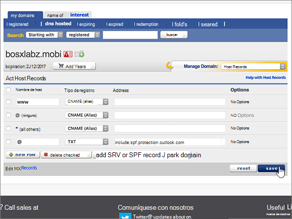

# Microsoft の eNomCentral で DNS レコードを作成する

 **探している内容が見つからない場合は、[ドメインに関する FAQ を確認](../setup/domains-faq.md)** してください。 
  
使用している DNS ホスティング プロバイダーが eNomCentral の場合は、この記事に示す手順に従い、ドメインを確認して、メールや Skype for Business Online などの DNS レコードを設定します。
  
これらのレコードを eNomCentral で追加すると、使用しているドメインが Microsoft サービスで機能するように設定されます。

  
> [!NOTE]
>  Typically it takes about 15 minutes for DNS changes to take effect. However, it can occasionally take longer for a change you've made to update across the Internet's DNS system. If you're having trouble with mail flow or other issues after adding DNS records, see [Troubleshoot issues after changing your domain name or DNS records](../get-help-with-domains/find-and-fix-issues.md). 
  
## 確認のための TXT レコードを追加する

Before you use your domain with Microsoft, we have to make sure that you own it. Your ability to log in to your account at your domain registrar and create the DNS record proves to Microsoft that you own the domain.
  
> [!NOTE]
> This record is used only to verify that you own your domain; it doesn't affect anything else. You can delete it later, if you like. 
  
次の手順を実行するか、[ビデオ (46 秒から開始) を参照](https://support.microsoft.com/office/3766a9e8-77dd-4a42-908d-89b076143e7d)してください。
  
1. To get started, go to your domains page at eNom Central by using [this link](https://www.enomcentral.com/domains/Domain-Manager.aspx?tab=registered). You'll be prompted to login.
    
    
  
2. [ **My domains**] の下で、編集するドメインの名前を選択します。
    
    
  
3. [ **Manage Domain**] ボックスの一覧で、[ **Host Records**] を選びます。
    
    
  
4. 新規レコードのボックスに、次の表の値を入力するか、コピーして貼り付けます。
    
    ドロップダウンリストから [ **Record Type** ] の値を選択します。
    
    ||||
    |:-----|:-----|:-----|
    |**Host Name**   |**Record Type**   |**Address**   |
    |@    |TXT    |MS=ms *XXXXXXXX*    **注:** これは例です。 この表から **[宛先またはポイント先のアドレス]** の値を指定してください。           [確認する方法](../get-help-with-domains/information-for-dns-records.md)          |
       
   
  
5. [**保存**] を選択します。
    
    
  
6. 数分待つと、続行できます。この間、作成したレコードがインターネット全体で更新されます。
    
これで、ドメイン レジストラーのサイトでレコードが追加されました。Microsoft 365 に戻り、Microsoft 365 にレコードの検索をリクエストします。
  
Microsoft で正しい TXT レコードが見つかった場合、ドメインは確認済みとなります。
  
1. Microsoft 管理センターで、**[設定]** \> <a href="https://go.microsoft.com/fwlink/p/?linkid=834818" target="_blank">[ドメイン]</a> ページの順に移動します。

    
2. **[ドメイン]** ページで、確認するドメインを選択します。 
    
    
  
3. **[セットアップ]** ページで、**[セットアップの開始]** を選択します。
    
    
  
4. **[ドメインの確認]** ページで、**[確認]** を選択します。
    
    
  
> [!NOTE]
>  Typically it takes about 15 minutes for DNS changes to take effect. However, it can occasionally take longer for a change you've made to update across the Internet's DNS system. If you're having trouble with mail flow or other issues after adding DNS records, see [Troubleshoot issues after changing your domain name or DNS records](../get-help-with-domains/find-and-fix-issues.md). 
  
## MX レコードを追加して、自分のドメインのメールが Microsoft に届くようにする

次の手順を実行するか、[ビデオ (3 分 40 秒から開始) を参照](https://support.microsoft.com/office/3766a9e8-77dd-4a42-908d-89b076143e7d)してください。
  
1. To get started, go to your domains page at eNom Central by using [this link](https://www.enomcentral.com/domains/Domain-Manager.aspx?tab=registered). You'll be prompted to login.
    
    
  
2. [ **My domains**] の下で、編集するドメインの名前を選択します。
    
    
  
3. [ **Manage Domain**] ボックスの一覧で、[ **Email Settings**] を選びます。
    
    
  
4. [ **Service Selection**] ボックスで、[ **User (MX)**] を選びます。
    
    
  
5. In the boxes for the new record, type or copy and paste the values from the following table.
    
    |**Host Name**|**Address**|**Pref**|
    |:-----|:-----|:-----|
    |@    | *\<domain-key\>*. mail.protection.outlook.com。    **This value MUST end with a period (.)**   **注:***\<domain-key\>* Microsoft アカウントからを取得します。           [確認する方法](../get-help-with-domains/information-for-dns-records.md)          |10      優先度の詳細については、「[MX 優先度とは何か](https://docs.microsoft.com/microsoft-365/admin/setup/domains-faq)」を参照してください。   |
       
   
  
6. [**保存**] を選択します。
    
    
  
7. 他の既存の MX レコードがある場合は、そのレコードのチェック ボックスをオンにして選びます。
    
    
  
8. [**削除] チェック**ボックスをオンにします。
    
    
  
## Microsoft に必要な CNAME レコードを追加する 

次の手順を実行するか、[ビデオ (4 分 24 秒から開始) を参照](https://support.microsoft.com/office/3766a9e8-77dd-4a42-908d-89b076143e7d)してください。
  
1. To get started, go to your domains page at eNom Central by using [this link](https://www.enomcentral.com/domains/Domain-Manager.aspx?tab=registered). You'll be prompted to login.
    
    
  
2. [ **My domains**] の下で、編集するドメインの名前を選択します。
    
    
  
3. [ **Manage Domain**] ボックスの一覧で、[ **Host Records**] を選びます。
    
    
  
4. [**新しい行**] を選択します。
    
    
  
5. 6 つの新規レコードのボックスに次の値を入力するか、コピーして貼り付けます。
    
ドロップダウンリストから [ **Record Type** ] の値を選択します。
        
    |**Host Name**|**Record Type**|**アドレス**|
    |:-----|:-----|:-----|
    |autodiscover    |CNAME (Alias)    |autodiscover.outlook.com。    **This value MUST end with a period (.)**   |
    |sip    |CNAME (Alias)    |sipdir.online.lync.com。    **This value MUST end with a period (.)**   |
    |lyncdiscover    |CNAME (Alias)    |webdir.online.lync.com。    **This value MUST end with a period (.)**   |
    |enterpriseregistration    |CNAME (Alias)    |enterpriseregistration.windows.net。    **この値は、末尾がピリオド (.) でなければなりません**   |
    |enterpriseenrollment    |CNAME (Alias)    |enterpriseenrollment-s.manage.microsoft.com。    **この値は、末尾がピリオド (.) でなければなりません**   |
   
    
  
6. [**保存**] を選択します。
    
    
  
## 迷惑メールの防止に役立つ、SPF の TXT レコードを追加する

> [!IMPORTANT]
> 1 つのドメインで、SPF に複数の TXT レコードを設定することはできません。 1 つのドメインに複数の SPF レコードがあると、メール、配信の分類、迷惑メールの分類で問題が発生することがあります。 使用しているドメインに既に SPF レコードがある場合は、Microsoft 用に新しいレコードを作成しないでください。 代わりに、値のセットを含む*1 つ*の SPF レコードがあるように、現在のレコードに必要な Microsoft の値を追加します。
  
次の手順を実行するか、[ビデオ (5 分 12 秒から開始) を参照](https://support.microsoft.com/office/3766a9e8-77dd-4a42-908d-89b076143e7d)してください。
  
1. To get started, go to your domains page at eNom Central by using [this link](https://www.enomcentral.com/domains/Domain-Manager.aspx?tab=registered). You'll be prompted to login.
    
    
  
2. [ **My domains**] の下で、編集するドメインの名前を選択します。
    
    
  
3. [ **Manage Domain**] ボックスの一覧で、[ **Host Records**] を選びます。
    
    
  
4. 新規レコードのボックスに、次の表の値を入力するか、コピーして貼り付けます。
    
ドロップダウンリストから [ **Record Type** ] の値を選択します。
    
    |**Host Name**|**Record Type**|**Address**|
    |:-----|:-----|:-----|
    |@    |TXT    |v=spf1 include:spf.protection.outlook.com -all   **注:** スペースも正しく入力されるように、この値をコピーして貼り付けることをお勧めします。           |
   
   
  
5. [**保存**] を選択します。
    
    
  
## Microsoft で必要な 2 つの SRV レコードを追加する

次の手順を実行するか、[ビデオ (5 分 50 秒から開始) を参照](https://support.microsoft.com/office/3766a9e8-77dd-4a42-908d-89b076143e7d)してください。
  
1. To get started, go to your domains page at eNom Central by using [this link](https://www.enomcentral.com/domains/Domain-Manager.aspx?tab=registered). You'll be prompted to login.
    
    
  
2. [ **My domains**] の下で、編集するドメインの名前を選択します。
    
    
  
3. [ **Manage Domain**] ボックスの一覧で、[ **Host Records**] を選びます。
    
    
  
4. **新しい行**の右側で、[ **SRV レコードまたは SPF レコードの追加**] を選択します。
    
    
  
5. 2 つの新規レコードのボックスに、次の表の値を入力するか、コピーして貼り付けます。
    
    |**Service**|**Protocol**|**Priority**|**Weight**|**Port**|**Target          (Hostname)**|
    |:-----|:-----|:-----|:-----|:-----|:-----|
    |_sip    |_tls    |100    |1     |443    |sipdir.online.lync.com。    **この値は、末尾がピリオド (.) でなければなりません**   |
    |_sipfederationtls    |_tcp    |100    |1     |5061    |sipfed.online.lync.com。    **この値は、末尾がピリオド (.) でなければなりません**   |
   
    
  
6. [**保存**] を選択します。
    
    
  
> [!NOTE]
>  Typically it takes about 15 minutes for DNS changes to take effect. However, it can occasionally take longer for a change you've made to update across the Internet's DNS system. If you're having trouble with mail flow or other issues after adding DNS records, see [Troubleshoot issues after changing your domain name or DNS records](../get-help-with-domains/find-and-fix-issues.md). 
  

