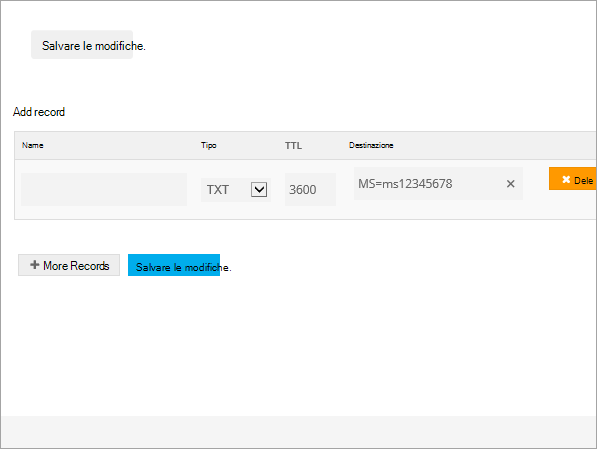
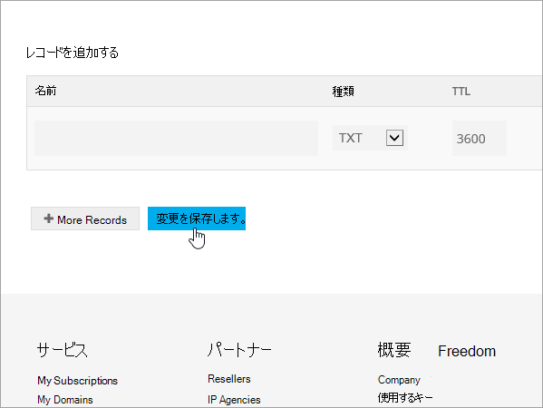
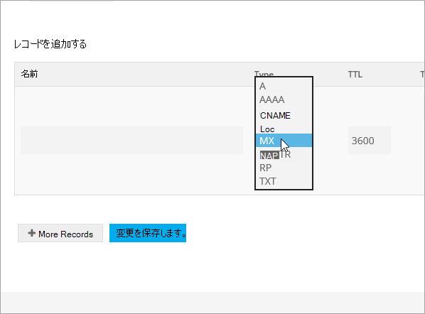
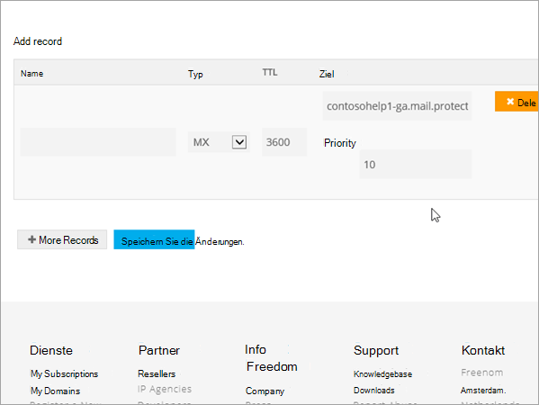
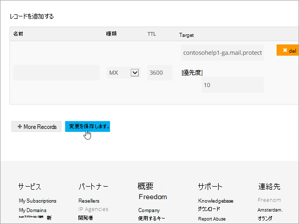
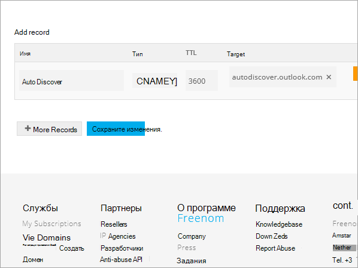
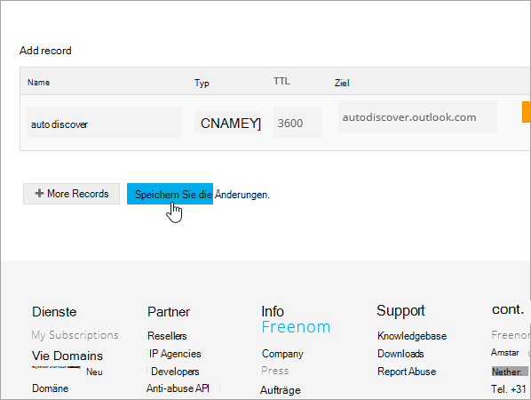
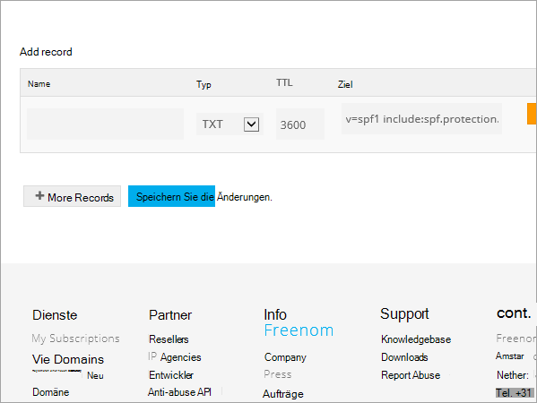

# Microsoft の Freenom で DNS レコードを作成するCreate DNS records at Freenom for Microsoft

探している内容が見つからない場合は、[ドメインに関する FAQ](../setup/domains-faq.md) を確認してください。[Check the Domains FAQ ](../setup/domains-faq.md) if you don't find what you're looking for. 
  
> [!CAUTION]
> Freenom web サイトは、SRV レコードをサポートしていません。つまり、いくつかの Skype for Business Online および Outlook Web App の機能が動作しないことを意味します。The Freenom website doesn't support SRV records, which means that several Skype for Business Online and Outlook Web App features won't work. どの Microsoft プランを使用する場合でも、サービスには重要な制限があり、別の DNS ホスティングプロバイダーに切り替えることが必要になる場合があります。No matter which Microsoft plan you use, there are significant service limitations, and you may want to switch to a different DNS hosting provider. 
  
サービスの制限にかかわらず、Microsoft DNS レコードを Freenom で管理することを選択した場合は、この記事の手順に従って、ドメインを確認し、電子メールやその他のサービスの DNS レコードを設定します。If despite the service limitations, you choose to manage your own Microsoft DNS records at Freenom, follow the steps in this article to verify your domain and set up DNS records for email and other services.
  
  
> [!NOTE]
> 通常、DNS の変更が有効になるのに 15 分ほどかかります。ただし、インターネットの DNS システム全体を更新する変更の場合、さらに長くかかることもあります。DNS レコードの追加でメール フローなどに問題が発生した場合は、「[ドメイン名または DNS レコードの変更後の問題に関するトラブルシューティング](../get-help-with-domains/find-and-fix-issues.md)」を参照してください。Typically it takes about 15 minutes for DNS changes to take effect. However, it can occasionally take longer for a change you've made to update across the Internet's DNS system. If you're having trouble with mail flow or other issues after adding DNS records, see [Troubleshoot issues after changing your domain name or DNS records](../get-help-with-domains/find-and-fix-issues.md). 
  
## 確認のための TXT レコードを追加するAdd a TXT record for verification

Microsoft のドメインを使うには、ドメインを所有していることを確認する必要があります。自分のドメイン レジストラーで自分のアカウントにログインし、DNS レコードを作成することができれば、Microsoft に対してドメインを所有していることを確認することができます。Before you use your domain with Microsoft, we have to make sure that you own it. Your ability to log in to your account at your domain registrar and create the DNS record proves to Microsoft that you own the domain.
  
> [!NOTE]
> このレコードは、ドメインを所有していることを確認するためだけに使用されます。その他には影響しません。 必要に応じて、後で削除することができます。This record is used only to verify that you own your domain; it doesn't affect anything else. You can delete it later, if you like. 
  
1. まず、[このリンク](https://my.freenom.com/)を使って Freenom のドメインページにアクセスします。To get started, go to your domains page in Freenom by using [this link](https://my.freenom.com/). ログインするように求められます。You'll be prompted to log in.
    
    
  
2. [**サービス**] を選択し、[**マイドメイン**] を選択します。Select **Services**, and then select **My Domains**.
    
    
  
3. 編集するドメインの場合は、[ドメインの**管理**] を選択します。For the domain that you want to edit, select **Manage Domain**.
    
    
  
4. [ **Manage Freenom DNS**] を選択します。Select **Manage Freenom DNS**.
    
    
  
5. [ **Add Record** ] の [ **Type** ] 列でメニューから [ **TXT** ] を選びます。Under **Add Record**, in the **Type** column, choose **TXT** from the menu. 
    
    
  
6. 新規レコードのボックスに、次の表の値を入力するか、コピーして貼り付けます。In the boxes for the new record, type or copy and paste the values from the following table. 
    
    |**名前****Name**|**Type****Type**|**TTL****TTL**|**Target****Target**|
    |:-----|:-----|:-----|:-----|
    |(空白のまま)(leave blank)    |TXTTXT    |3600 (秒)3600 (seconds)    |MS = msXXXXXXXXMS=msXXXXXXXX    **注:** これは例です。**Note:** This is an example. この表から **[宛先またはポイント先のアドレス]** の値を指定してください。Use your specific **Destination or Points to Address** value here, from the table.           [確認する方法How do I find this?](../get-help-with-domains/information-for-dns-records.md)          |
   
    
  
7. [ **Save Changes**] を選びます。Select **Save Changes**.
    
    
  
8. 数分待つと、続行できます。この間、作成したレコードがインターネット全体で更新されます。Wait a few minutes before you continue, so that the record you just created can update across the Internet.
    
これで、ドメイン レジストラーのサイトでレコードが追加されました。Microsoft に戻り、レコードをリクエストします。Now that you've added the record at your domain registrar's site, you'll go back to Microsoft and request the record.
  
Microsoft で正しい TXT レコードが見つかった場合、ドメインは確認済みとなります。When Microsoft finds the correct TXT record, your domain is verified.
  
1. Microsoft 管理センターで、**[設定]** \> <a href="https://go.microsoft.com/fwlink/p/?linkid=834818" target="_blank">[ドメイン]</a> ページの順に移動します。In the Microsoft admin center, go to the **Settings** \> <a href="https://go.microsoft.com/fwlink/p/?linkid=834818" target="_blank">Domains</a> page.

    
2. **[ドメイン]** ページで、確認するドメインを選択します。On the **Domains** page, select the domain that you are verifying. 
    
    
  
3. **[セットアップ]** ページで、**[セットアップの開始]** を選択します。On the **Setup** page, select **Start setup**.
    
    
  
4. **[ドメインの確認]** ページで、**[確認]** を選択します。On the **Verify domain** page, select **Verify**.
    
    
  
> [!NOTE]
>  通常、DNS の変更が有効になるのに 15 分ほどかかります。ただし、インターネットの DNS システム全体を更新する変更の場合、さらに長くかかることもあります。DNS レコードの追加でメール フローなどに問題が発生した場合は、「[ドメイン名または DNS レコードの変更後の問題に関するトラブルシューティング](../get-help-with-domains/find-and-fix-issues.md)」を参照してください。Typically it takes about 15 minutes for DNS changes to take effect. However, it can occasionally take longer for a change you've made to update across the Internet's DNS system. If you're having trouble with mail flow or other issues after adding DNS records, see [Troubleshoot issues after changing your domain name or DNS records](../get-help-with-domains/find-and-fix-issues.md). 
  
## MX レコードを追加して、自分のドメインのメールが Microsoft に届くようにするAdd an MX record so email for your domain will come to Microsoft

1. まず、[このリンク](https://my.freenom.com/)を使って Freenom のドメインページにアクセスします。To get started, go to your domains page in Freenom by using [this link](https://my.freenom.com/). ログインするように求められます。You'll be prompted to log in.
    
    
  
2. [**サービス**] を選択し、[**マイドメイン**] を選択します。Select **Services**, and then select **My Domains**.
    
    
  
3. 編集するドメインの場合は、[ドメインの**管理**] を選択します。For the domain that you want to edit, select **Manage Domain**.
    
    
  
4. ドメインの名前機能を既定の Freenom ネームサーバーに設定します。Set the name serves for your domain to the default Freenom name servers. [**管理ツール**] を選択し、[**ネーム**サーバー] を選択します。Select **Management Tools**, and then select **Nameservers**.
    
    
  
5. [既定のネームサーバーを**使用する**] が選択されていることを確認し、[ネームサーバーの**変更**] を選択しますMake sure **Use default nameservers** is selected, and then select **Change Nameservers**.
    
    
  
6. [ **Manage Freenom DNS**] を選択します。Select **Manage Freenom DNS**.
    
    
  
7. [ **Add Record** ] の [ **Type** ] 列でメニューから [ **MX** ] を選びます。Under **Add Record**, in the **Type** column, choose **MX** from the menu. 
    
    
  
8. 新規レコードのボックスに、次の表の 1 行目の値を入力するか、コピーして貼り付けます。In the boxes for the new record, type or copy and paste the values from the first row of the following table. 
    
    |**名前****Name**|**Type****Type**|**TTL****TTL**|**Target****Target**|**Priority****Priority**|
    |:-----|:-----|:-----|:-----|:-----|
    |(空白のまま)(leave blank)    |MX (Mail Exchanger)MX (Mail Exchanger)    |3600 (秒)3600 (seconds)    |\<domain-key\>. mail.protection.outlook.com\<domain-key\>.mail.protection.outlook.com    \**注:\*\*\*\<domain-key\>* Microsoft アカウントからを取得します。**Note:** Get your  *\<domain-key\>*  from your Microsoft account.   [確認する方法How do I find this?](../get-help-with-domains/information-for-dns-records.md)          |10  10    優先度の詳細については、「[What is MX priority?](https://docs.microsoft.com/microsoft-365/admin/setup/domains-faq)」を参照してください。For more information about priority, see [What is MX priority?](https://docs.microsoft.com/microsoft-365/admin/setup/domains-faq)   |
   
   
  
9. [ **Save Changes**] を選びます。Select **Save Changes**.
    
    
  
10. その他の MX レコードがある場合は、すべてを削除します。If there are any other MX records, delete them all. レコードごとに [**削除**] を選択します。For each record, select **Delete**. メッセージを**本当に削除したい場合は**、[ **OK**] を選択します。When the message **Do you really want to remove this entry?** appears, select **OK**.
    
## Microsoft に必要な CNAME レコードを追加するAdd the CNAME records that are required for Microsoft

1. まず、[このリンク](https://my.freenom.com/)を使って Freenom のドメインページにアクセスします。To get started, go to your domains page in Freenom by using [this link](https://my.freenom.com/). ログインするように求められます。You'll be prompted to log in.
    
    
  
2. [**サービス**] を選択し、[**マイドメイン**] を選択します。Select **Services**, and then select **My Domains**.
    
    
  
3. 編集するドメインの場合は、[ドメインの**管理**] を選択します。For the domain that you want to edit, select **Manage Domain**.
    
    
  
4. [ **Manage Freenom DNS**] を選択します。Select **Manage Freenom DNS**.
    
    
  
5. [ **Add Record** ] の [ **Type** ] 列でメニューから [ **CNAME** ] を選びます。Under **Add Record**, in the **Type** column, choose **CNAME** from the menu. 
    
    
  
6. 最初の CNAME レコードを作成します。新規レコードのボックスに、次の表の 1 行目の値を入力するか、コピーして貼り付けます。Create the first CNAME record. In the boxes for the new record, type or copy and paste the values from the first row of the following table. 
    
    |**Name****Name**|**Record type****Record type**|**TTL****TTL**|**Target****Target**|
    |:-----|:-----|:-----|:-----|
    |autodiscoverautodiscover    |CNAMECNAME    |3600 (秒)3600 (seconds)    |autodiscover.outlook.comautodiscover.outlook.com    |
    |sipsip    |CNAMECNAME    |3600 (秒)3600 (seconds)    |sipdir.online.lync.comsipdir.online.lync.com    |
    |lyncdiscoverlyncdiscover    |CNAMECNAME    |3600 (秒)3600 (seconds)    |webdir.online.lync.comwebdir.online.lync.com    |
    |enterpriseregistrationenterpriseregistration    |CNAMECNAME    |3600 (秒)3600 (seconds)    |enterpriseregistration.windows.netenterpriseregistration.windows.net    |
    |enterpriseenrollmententerpriseenrollment    |CNAMECNAME    |3600 (秒)3600 (seconds)    |enterpriseenrollment-s.manage.microsoft.comenterpriseenrollment-s.manage.microsoft.com    |
   
    
  
7. [ **Save Changes**] を選びます。Select **Save Changes**.
    
    
  
8. 前の手順を繰り返し、他の 5 つの CNAME レコードを作成します。Repeat the previous steps to create the other five CNAME records. 
    
    レコードごとに、上のテーブルの次の行の値をそのレコードのボックスに入力するか、コピーして貼り付けます。For each record, type or copy and paste the values from the next row of the table above into the boxes for that record.
    
## 迷惑メールの防止に役立つ、SPF の TXT レコードを追加するAdd a TXT record for SPF to help prevent email spam

> [!IMPORTANT]
> 1 つのドメインで、SPF に複数の TXT レコードを設定することはできません。You cannot have more than one TXT record for SPF for a domain. 1 つのドメインに複数の SPF レコードがあると、メール、配信の分類、迷惑メールの分類で問題が発生することがあります。If your domain has more than one SPF record, you'll get email errors, as well as delivery and spam classification issues. 使用しているドメインに既に SPF レコードがある場合は、Microsoft 用に新しいレコードを作成しないでください。If you already have an SPF record for your domain, don't create a new one for Microsoft. 代わりに、値のセットを含む*1 つ*の SPF レコードがあるように、現在のレコードに必要な Microsoft の値を追加します。Instead, add the required Microsoft values to the current record so that you have a  *single*  SPF record that includes both sets of values. 

1. まず、[このリンク](https://my.freenom.com/)を使って Freenom のドメインページにアクセスします。To get started, go to your domains page in Freenom by using [this link](https://my.freenom.com/). ログインするように求められます。You'll be prompted to log in.
    
    
  
2. [**サービス**] を選択し、[**マイドメイン**] を選択します。Select **Services**, and then select **My Domains**.
    
    
  
3. 編集するドメインの場合は、[ドメインの**管理**] を選択します。For the domain that you want to edit, select **Manage Domain**.
    
    
  
4. [ **Manage Freenom DNS**] を選択します。Select **Manage Freenom DNS**.
    
    
  
5. [ **Add Record** ] の [ **Type** ] 列でメニューから [ **TXT** ] を選びます。Under **Add Record**, in the **Type** column, choose **TXT** from the menu. 
    
    
  
6. 新規レコードのボックスに次の値を入力するか、コピーして貼り付けます。In the boxes for the new record, type or copy and paste the following values. 
    
    |**Name****Name**|**Record type****Record type**|**TTL****TTL**|**Target****Target**|
    |:-----|:-----|:-----|:-----|
    |(空白のまま)(leave blank)    |TXTTXT    |3600 (秒)3600 (seconds)    |v=spf1 include:spf.protection.outlook.com -allv=spf1 include:spf.protection.outlook.com -all   **注:** スペースも正しく入力されるように、この値をコピーして貼り付けることをお勧めします。**Note:** We recommend copying and pasting this entry, so that all of the spacing stays correct.           |
   
    
  
7. [ **Save Changes**] を選びます。Select **Save Changes**.
    
    
  

