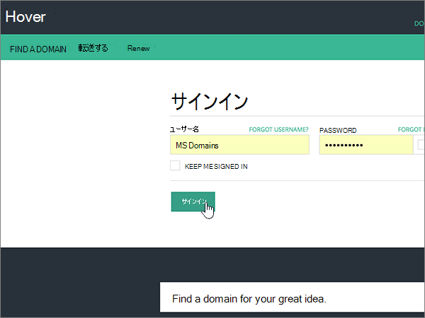

# Microsoft のホバー時に DNS レコードを作成するCreate DNS records at Hover for Microsoft

 **探している内容が見つからない場合は、[ドメインに関する FAQ を確認](../setup/domains-faq.md)** してください。**[Check the Domains FAQ](../setup/domains-faq.md)** if you don't find what you're looking for. 
  
使用している DNS ホスティング プロバイダーが Hover の場合は、この記事に示す手順に従って、ドメインの確認とメールや Skype for Business Online などの DNS レコードの設定を行います。If Hover is your DNS hosting provider, follow the steps in this article to verify your domain and set up DNS records for email, Skype for Business Online, and so on.
     
これらのレコードを Hover で追加すると、使用しているドメインが Microsoft サービスで機能するように設定されます。After you add these records at Hover, your domain will be set up to work with Microsoft services.
  

  
> [!NOTE]
>  通常、DNS の変更が有効になるのに 15 分ほどかかります。ただし、インターネットの DNS システム全体を更新する変更の場合、さらに長くかかることもあります。DNS レコードの追加でメール フローなどに問題が発生した場合は、「[ドメイン名または DNS レコードの変更後の問題に関するトラブルシューティング](../get-help-with-domains/find-and-fix-issues.md)」を参照してください。Typically it takes about 15 minutes for DNS changes to take effect. However, it can occasionally take longer for a change you've made to update across the Internet's DNS system. If you're having trouble with mail flow or other issues after adding DNS records, see [Troubleshoot issues after changing your domain name or DNS records](../get-help-with-domains/find-and-fix-issues.md). 
  
## 確認のための TXT レコードを追加するAdd a TXT record for verification

Microsoft のドメインを使うには、ドメインを所有していることを確認する必要があります。自分のドメイン レジストラーで自分のアカウントにログインし、DNS レコードを作成することができれば、Microsoft に対してドメインを所有していることを確認することができます。Before you use your domain with Microsoft, we have to make sure that you own it. Your ability to log in to your account at your domain registrar and create the DNS record proves to Microsoft that you own the domain.
  
> [!NOTE]
> このレコードは、ドメインを所有していることを確認するためだけに使用されます。その他には影響しません。 必要に応じて、後で削除することができます。This record is used only to verify that you own your domain; it doesn't affect anything else. You can delete it later, if you like. 
  
次の手順を実行するか、[ビデオを参照](https://support.office.com/article/Video-Create-DNS-records-at-Hover-for-Office-365-182bd58e-8fe4-4717-9233-3a3546b72ad2?ui=en-US&amp;rs=en-US&amp;ad=US)してください。Follow the steps below or [watch the video](https://support.office.com/article/Video-Create-DNS-records-at-Hover-for-Office-365-182bd58e-8fe4-4717-9233-3a3546b72ad2?ui=en-US&amp;rs=en-US&amp;ad=US).
  
1. まず、[このリンク](https://www.hover.com/domains)を使って Hover でドメイン ページにアクセスします。サインインするように求められます。To get started, go to your domains page at Hover by using [this link](https://www.hover.com/domains). You'll be prompted to sign in.
    
    
  
2. [**ドメインの管理**] で、編集するドメインの名前を選択します。Under **Manage Your Domains**, select the name of the domain that you want to edit.
    
    
  
3. [ **DNS** ] タブを選択します。Select the **DNS** tab. 
    
    ![[DNS] タブを選択します。](../../media/bd727fb4-0b06-426d-9387-42a160aead42.png)
  
4. [ **Add New**] を選択します。Select **Add New**.
    
    ![[Add New] を選択します。](../../media/66d6b2c9-741e-40e0-a096-6e7e204d655d.png)
  
5. In the boxes for the new record, select **TXT** for the **Record Type**, and then type or copy and paste the values from the following table.In the boxes for the new record, select **TXT** for the **Record Type**, and then type or copy and paste the values from the following table.
    
    ||||
    |:-----|:-----|:-----|
    |ホスト名Hostname    |レコードの種類Record Type    |値Value    |
    |@    |TXTTXT    |MS=ms *XXXXXXXX*MS=ms *XXXXXXXX*    **注:** これは例です。**Note:** This is an example. この表から **[宛先またはポイント先のアドレス]** の値を指定してください。Use your specific **Destination or Points to Address** value here, from the table.           [確認する方法How do I find this?](../get-help-with-domains/information-for-dns-records.md)          |
   
    
  
6. [**保存**] を選択します。Select **Save**.
    
    ![[保存] を選択します。](../../media/07dcf68e-34be-47dc-999e-0216de68cc9c.png)
  
7. 数分待つと、続行できます。この間、作成したレコードがインターネット全体で更新されます。Wait a few minutes before you continue, so that the record you just created can update across the Internet.
    
これで、ドメイン レジストラーのサイトでレコードが追加されました。Microsoft 365 に戻り、Microsoft 365 にレコードの検索をリクエストします。Now that you've added the record at your domain registrar's site, you'll go back to Microsoft 365 and request Microsoft 365 to look for the record.
  
Microsoft で正しい TXT レコードが見つかった場合、ドメインは確認済みとなります。When Microsoft finds the correct TXT record, your domain is verified.
  
1. Microsoft 管理センターで、**[設定]** \> <a href="https://go.microsoft.com/fwlink/p/?linkid=834818" target="_blank">[ドメイン]</a> ページの順に移動します。In the Microsoft admin center, go to the **Settings** \> <a href="https://go.microsoft.com/fwlink/p/?linkid=834818" target="_blank">Domains</a> page.
    
2. **[ドメイン]** ページで、確認するドメインを選択します。On the **Domains** page, select the domain that you are verifying. 
    
    
  
3. **[セットアップ]** ページで、**[セットアップの開始]** を選択します。On the **Setup** page, select **Start setup**.
    
    
  
4. **[ドメインの確認]** ページで、**[確認]** を選択します。On the **Verify domain** page, select **Verify**.
    
    
  
> [!NOTE]
>  通常、DNS の変更が有効になるのに 15 分ほどかかります。ただし、インターネットの DNS システム全体を更新する変更の場合、さらに長くかかることもあります。DNS レコードの追加でメール フローなどに問題が発生した場合は、「[ドメイン名または DNS レコードの変更後の問題に関するトラブルシューティング](../get-help-with-domains/find-and-fix-issues.md)」を参照してください。Typically it takes about 15 minutes for DNS changes to take effect. However, it can occasionally take longer for a change you've made to update across the Internet's DNS system. If you're having trouble with mail flow or other issues after adding DNS records, see [Troubleshoot issues after changing your domain name or DNS records](../get-help-with-domains/find-and-fix-issues.md). 
  
## MX レコードを追加して、自分のドメインのメールが Microsoft に届くようにするAdd an MX record so email for your domain will come to Microsoft

次の手順を実行するか、[ビデオを参照](https://support.office.com/article/Video-Create-DNS-records-at-Hover-for-Office-365-182bd58e-8fe4-4717-9233-3a3546b72ad2?ui=en-US&amp;rs=en-US&amp;ad=US)してください。Follow the steps below or [watch the video](https://support.office.com/article/Video-Create-DNS-records-at-Hover-for-Office-365-182bd58e-8fe4-4717-9233-3a3546b72ad2?ui=en-US&amp;rs=en-US&amp;ad=US).
  
1. まず、[このリンク](https://www.hover.com/domains)を使って Hover でドメイン ページにアクセスします。サインインするように求められます。To get started, go to your domains page at Hover by using [this link](https://www.hover.com/domains). You'll be prompted to sign in.
    
    
  
2. [**ドメインの管理**] で、編集するドメインの名前を選択します。Under **Manage Your Domains**, select the name of the domain that you want to edit.
    
    
  
3. [ **DNS** ] タブを選択します。Select the **DNS** tab. 
    
    ![[DNS] タブを選択します。](../../media/bd727fb4-0b06-426d-9387-42a160aead42.png)
  
4. [ **Add New**] を選択します。Select **Add New**.
    
    ![[Add New] を選択します。](../../media/66d6b2c9-741e-40e0-a096-6e7e204d655d.png)
  
5. 新しいレコードのボックスで、[ **Record Type**] に [ **MX**] を選び、次の表の値を入力するか、コピーして貼り付けます。In the boxes for the new record, select **MX** for the **Record Type**, and then type or copy and paste the values from the following table.
    
    |**Hostname****Hostname**|**レコードの種類****Record Type**|**優先度****Priority**|**ホスト名****Hostname**|
    |:-----|:-----|:-----|:-----|
    |@    |MXMX    |.00    優先度の詳細については、「[MX 優先度とは何か](https://support.office.com/article/2784cc4d-95be-443d-b5f7-bb5dd867ba83.aspx)」を参照してください。For more information about priority, see [What is MX priority?](https://support.office.com/article/2784cc4d-95be-443d-b5f7-bb5dd867ba83.aspx)   | *\<ドメインキー\>*  .mail.protection.outlook.com*\<domain-key\>*  .mail.protection.outlook.com    **注:** Microsoft アカウントから\* \<ドメインキー\> \*を取得します。**Note:** Get your  *\<domain-key\>*  from your Microsoft account.           [確認する方法How do I find this?](../get-help-with-domains/information-for-dns-records.md)          |
   
    
  
6. [**保存**] を選択します。Select **Save**.
    
    ![[保存] を選択します。](../../media/266c30a4-6703-48fb-a919-b510ed966193.png)
  
7. これ以外の MX レコードがある場合は、次の 2 段階のプロセスに従って、それぞれのレコードを削除します。If there are any other MX records, use the following two-step process to remove each of them:
    
    最初に、削除するレコードにマウスポインターて、[**削除**] を選択します。First, mousing over a record that you want to remove, select **Delete**.
    
    ![マウスをポイントし、[削除] を選択します。](../../media/2ddf4902-8cd2-4969-a418-2cb592741e86.png)
  
    次に、[**はい]** を選択して各削除を確認します。Second, select **Yes** to confirm each deletion. 
    
    ![[はい] を選択して削除を確認する](../../media/48756bd5-0205-4c4d-9803-9246795dbf4a.png)
  
    この手順の最初に追加した MX レコード以外の MX レコードをすべて削除するまで、このプロセスを繰り返します。Repeat this process until you have deleted all MX records except for the one that you added earlier in this procedure.
    
## Microsoft に必要な CNAME レコードを追加するAdd the CNAME records that are required for Microsoft

次の手順を実行するか、[ビデオを参照](https://support.office.com/article/Video-Create-DNS-records-at-Hover-for-Office-365-182bd58e-8fe4-4717-9233-3a3546b72ad2?ui=en-US&amp;rs=en-US&amp;ad=US)してください。Follow the steps below or [watch the video](https://support.office.com/article/Video-Create-DNS-records-at-Hover-for-Office-365-182bd58e-8fe4-4717-9233-3a3546b72ad2?ui=en-US&amp;rs=en-US&amp;ad=US).
  
1. まず、[このリンク](https://www.hover.com/domains)を使って Hover でドメイン ページにアクセスします。サインインするように求められます。To get started, go to your domains page at Hover by using [this link](https://www.hover.com/domains). You'll be prompted to sign in.
    
    
  
2. [**ドメインの管理**] で、編集するドメインの名前を選択します。Under **Manage Your Domains**, select the name of the domain that you want to edit.
    
    
  
3. [ **DNS** ] タブを選択します。Select the **DNS** tab. 
    
    ![[DNS] タブを選択します。](../../media/bd727fb4-0b06-426d-9387-42a160aead42.png)
  
4. 6 つの CNAME レコードの最初のレコードを追加します。Add the first of the six CNAME records.
    
    [ **Add New**] を選択します。Select **Add New**.
    
    ![[Add New] を選択します。](../../media/66d6b2c9-741e-40e0-a096-6e7e204d655d.png)
  
5. 新しいレコードの空のボックスで、[ **Record Type**] に [ **CNAME**] を選び、次の表の 1 行目の値を入力するか、コピーして貼り付けます。In the empty boxes for the new record, select **CNAME** for the **Record Type**, and then type or copy and paste the values from the first row in the following table.
    
    |**Hostname****Hostname**|**レコードの種類****Record Type**|**ターゲット ホスト****Target Host**|
    |:-----|:-----|:-----|
    |autodiscoverautodiscover    |CNAMECNAME    |autodiscover.outlook.comautodiscover.outlook.com    |
    |sipsip    |CNAMECNAME    |sipdir.online.lync.comsipdir.online.lync.com    |
    |lyncdiscoverlyncdiscover    |CNAMECNAME    |webdir.online.lync.comwebdir.online.lync.com    |
    |enterpriseregistrationenterpriseregistration    |CNAMECNAME    |enterpriseregistration.windows.netenterpriseregistration.windows.net    |
    |enterpriseenrollmententerpriseenrollment    |CNAMECNAME    |enterpriseenrollment-s.manage.microsoft.comenterpriseenrollment-s.manage.microsoft.com    |
   
    
  
6. [**保存**] を選択します。Select **Save**.
    
    ![[保存] を選択します。](../../media/69aa3546-32de-4c17-a2e2-8c0cd133efaa.png)
  
7. 上の 3 つの手順に従って、表の残りの 5 行の値を使って、残りの 5 つの CNAME レコードをそれぞれ追加します。Using the preceding three steps and the values from the other five rows in the table, add each of the other five CNAME records.
    
## 迷惑メールの防止に役立つ、SPF の TXT レコードを追加するAdd a TXT record for SPF to help prevent email spam

> [!IMPORTANT]
> 1 つのドメインで、SPF に複数の TXT レコードを設定することはできません。You cannot have more than one TXT record for SPF for a domain. 1 つのドメインに複数の SPF レコードがあると、メール、配信の分類、迷惑メールの分類で問題が発生することがあります。If your domain has more than one SPF record, you'll get email errors, as well as delivery and spam classification issues. 使用しているドメインに既に SPF レコードがある場合は、Microsoft 用に新しいレコードを作成しないでください。If you already have an SPF record for your domain, don't create a new one for Microsoft. 代わりに、値のセットを含む*1 つ*の SPF レコードがあるように、現在のレコードに必要な Microsoft の値を追加します。Instead, add the required Microsoft values to the current record so that you have a  *single*  SPF record that includes both sets of values. 
  
次の手順を実行するか、[ビデオを参照](https://support.office.com/article/Video-Create-DNS-records-at-Hover-for-Office-365-182bd58e-8fe4-4717-9233-3a3546b72ad2?ui=en-US&amp;rs=en-US&amp;ad=US)してください。Follow the steps below or [watch the video](https://support.office.com/article/Video-Create-DNS-records-at-Hover-for-Office-365-182bd58e-8fe4-4717-9233-3a3546b72ad2?ui=en-US&amp;rs=en-US&amp;ad=US).
  
1. まず、[このリンク](https://www.hover.com/domains)を使って Hover でドメイン ページにアクセスします。サインインするように求められます。To get started, go to your domains page at Hover by using [this link](https://www.hover.com/domains). You'll be prompted to sign in.
    
    
  
2. [**ドメインの管理**] で、編集するドメインの名前を選択します。Under **Manage Your Domains**, select the name of the domain that you want to edit.
    
    
  
3. [ **DNS** ] タブを選択します。Select the **DNS** tab. 
    
    ![[DNS] タブを選択します。](../../media/bd727fb4-0b06-426d-9387-42a160aead42.png)
  
4. [ **Add New**] を選択します。Select **Add New**.
    
    ![[Add New] を選択します。](../../media/66d6b2c9-741e-40e0-a096-6e7e204d655d.png)
  
5. In the boxes for the new record, select **TXT** for the **Record Type**, and then type or copy and paste the values from the following table.In the boxes for the new record, select **TXT** for the **Record Type**, and then type or copy and paste the values from the following table.
    
    |**Hostname****Hostname**|**レコードの種類****Record Type**|**値****Value**|
    |:-----|:-----|:-----|
    |@    |TXTTXT    |v=spf1 include:spf.protection.outlook.com -allv=spf1 include:spf.protection.outlook.com -all   **注:** スペースも正しく入力されるように、この値をコピーして貼り付けることをお勧めします。**Note:** We recommend copying and pasting this entry, so that all of the spacing stays correct.           |
   
    
  
6. [**保存**] を選択します。Select **Save**.
    
    ![[保存] を選択します。](../../media/13a395b9-e0e8-4393-b568-5f99b2da39da.png)
  
## Microsoft で必要な 2 つの SRV レコードを追加するAdd the two SRV records that are required for Microsoft

次の手順を実行するか、[ビデオを参照](https://support.office.com/article/Video-Create-DNS-records-at-Hover-for-Office-365-182bd58e-8fe4-4717-9233-3a3546b72ad2?ui=en-US&amp;rs=en-US&amp;ad=US)してください。Follow the steps below or [watch the video](https://support.office.com/article/Video-Create-DNS-records-at-Hover-for-Office-365-182bd58e-8fe4-4717-9233-3a3546b72ad2?ui=en-US&amp;rs=en-US&amp;ad=US).
  
1. まず、[このリンク](https://www.hover.com/domains)を使って Hover でドメイン ページにアクセスします。サインインするように求められます。To get started, go to your domains page at Hover by using [this link](https://www.hover.com/domains). You'll be prompted to sign in.
    
    
  
2. [**ドメインの管理**] で、編集するドメインの名前を選択します。Under **Manage Your Domains**, select the name of the domain that you want to edit.
    
    
  
3. [ **DNS** ] タブを選択します。Select the **DNS** tab. 
    
    ![[DNS] タブを選択します。](../../media/bd727fb4-0b06-426d-9387-42a160aead42.png)
  
4. 2 つの SRV レコードの最初のレコードを追加します。Add the first of the two SRV records.
    
    [ **Add New**] を選択します。Select **Add New**.
    
    ![[Add New] を選択します。](../../media/66d6b2c9-741e-40e0-a096-6e7e204d655d.png)
  
5. 新しいレコードの空のボックスで、[ **Record Type**] に [ **SRV**] を選び、次の表の 1 行目の値を入力するか、コピーして貼り付けます。In the empty boxes for the new record, select **SRV** for the **Record Type**, and then type or copy and paste the values from the first row in the following table.
    
    |**ホスト名****Hostname**|**レコードの種類****Record Type**|**Priority****Priority**|**Weight****Weight**|**Port****Port**|**対象****Target**|
    |:-----|:-----|:-----|:-----|:-----|:-----|
    |_sip _tls_sip._tls    |SRVSRV    |100100    |1-d1    |443443    |sipdir.online.lync.comsipdir.online.lync.com    |
    |_sipfederationtls _tcp_sipfederationtls._tcp    |SRVSRV    |100100    |1-d1    |50615061    |sipfed.online.lync.comsipfed.online.lync.com    |
   
    
  
6. [**保存**] を選択します。Select **Save**.
    
    ![[保存] を選択します。](../../media/0d7ec216-9277-4709-b637-e94c8662730f.png)
  
7. 上の 3 つの手順に従って、表の 2 行目の値を使って、別の SRV レコードを追加します。Using the preceding three steps and the values from the second row in the table, add the other SRV record.
    
> [!NOTE]
> 通常、DNS の変更が有効になるのに 15 分ほどかかります。ただし、インターネットの DNS システム全体を更新する変更の場合、さらに長くかかることもあります。DNS レコードの追加でメール フローなどに問題が発生した場合は、「[ドメイン名または DNS レコードの変更後の問題に関するトラブルシューティング](../get-help-with-domains/find-and-fix-issues.md)」を参照してください。Typically it takes about 15 minutes for DNS changes to take effect. However, it can occasionally take longer for a change you've made to update across the Internet's DNS system. If you're having trouble with mail flow or other issues after adding DNS records, see [Troubleshoot issues after changing your domain name or DNS records](../get-help-with-domains/find-and-fix-issues.md). 
  
