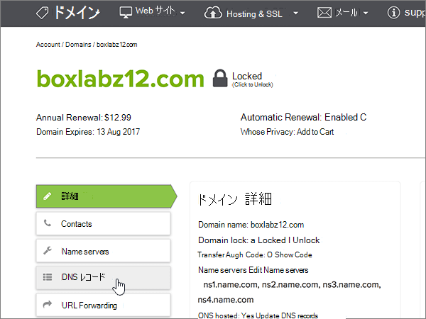

# Microsoft の name.com で DNS レコードを作成する

 **探している内容が見つからない場合は、[ドメインに関する FAQ を確認](../setup/domains-faq.md)** してください。 
  
使用している DNS ホスティング プロバイダーが name.com の場合は、この記事に記載された手順に従って、ドメインの確認とメールや Skype for Business Online などの DNS レコードのセットアップを行います。
  
これらのレコードを name.com で追加すると、使用しているドメインが、Microsoft サービスで機能するように設定されます。

  
> [!NOTE]
> 通常、DNS の変更が有効になるのに 15 分ほどかかります。ただし、インターネットの DNS システム全体を更新する変更の場合、さらに長くかかることもあります。DNS レコードの追加でメール フローなどに問題が発生した場合は、「[ドメイン名または DNS レコードの変更後の問題に関するトラブルシューティング](../get-help-with-domains/find-and-fix-issues.md)」を参照してください。 
  
## 確認のための TXT レコードを追加する

Microsoft のドメインを使うには、ドメインを所有していることを確認する必要があります。自分のドメイン レジストラーで自分のアカウントにログインし、DNS レコードを作成することができれば、Microsoft に対してドメインを所有していることを確認することができます。
  
> [!NOTE]
> このレコードは、ドメインを所有していることを確認するためだけに使用されます。その他には影響しません。 必要に応じて、後で削除することができます。 
  
1. まず、[このリンク](https://www.name.com/account/domain)を使って name.com でドメイン ページにアクセスします。最初にログインするように求められます。
    
    
  
2. [**マイドメイン**] の下で、変更するドメインの名前を選択します。
    
    
  
3. [**詳細**] 列で、[ **DNS レコード**] を選択します。 
    
    
  
4. 新規レコードのボックスに、次の表の値を入力するか、コピーして貼り付けます。
    
    (Choose the **Type** value from the drop-down list.) 
    
    |||||
    |:-----|:-----|:-----|:-----|
    |**型**   |**Host**   |**応答**   |**TTL**   |
    |TXT    |(Leave this field empty.)    |MS=ms *XXXXXXXX*    **注:** これは例です。 この表から **[宛先またはポイント先のアドレス]** の値を指定してください。           [確認する方法](../get-help-with-domains/information-for-dns-records.md)          |Use the default value (300).    |
   
    
  
5. [ **Add Record** ] を選択します。
    
    
  
6. 数分待つと、続行できます。この間、作成したレコードがインターネット全体で更新されます。
    
これで、ドメイン レジストラーのサイトでレコードが追加されました。Microsoft に戻り、レコードをリクエストします。
  
Microsoft で正しい TXT レコードが見つかった場合、ドメインは確認済みとなります。
  
1. 管理センターで、**[設定]** \> <a href="https://go.microsoft.com/fwlink/p/?linkid=834818" target="_blank">[ドメイン]</a> ページの順に移動します。
    
2. **[ドメイン]** ページで、確認するドメインを選択します。 
    
    
  
3. **[セットアップ]** ページで、**[セットアップの開始]** を選択します。
    
    
  
4. **[ドメインの確認]** ページで、**[確認]** を選択します。
    
    
  
> [!NOTE]
> 通常、DNS の変更が有効になるのに 15 分ほどかかります。ただし、インターネットの DNS システム全体を更新する変更の場合、さらに長くかかることもあります。DNS レコードの追加でメール フローなどに問題が発生した場合は、「[ドメイン名または DNS レコードの変更後の問題に関するトラブルシューティング](../get-help-with-domains/find-and-fix-issues.md)」を参照してください。 
  
## MX レコードを追加して、自分のドメインのメールが Microsoft に届くようにする

1. まず、[このリンク](https://www.name.com/account/domain)を使って name.com でドメイン ページにアクセスします。最初にログインするように求められます。
    
    
  
2. [**マイドメイン**] の下で、変更するドメインの名前を選択します。
    
    
  
3. [**詳細**] 列で、[ **DNS レコード**] を選択します。 
    
    
  
4. 新規レコードのボックスに、次の表の値を入力するか、コピーして貼り付けます。
    
    (Choose the **Type** value from the drop-down list.) 
    
    |**型**|**Host**|**応答**|**TTL**|**優先度**|
    |:-----|:-----|:-----|:-----|:-----|
    |MX    |(このフィールドは空のままにします。)    | *\<ドメインキー\>*  .mail.protection.outlook.com    **注:** Microsoft アカウントから* \<ドメインキー\> *を取得します。           [確認する方法](../get-help-with-domains/information-for-dns-records.md)          |Use the default value (300).    |.0    優先度の詳細については、「[MX 優先度とは何か](https://docs.microsoft.com/microsoft-365/admin/setup/domains-faq)」を参照してください。   |
   
   
  
5. [ **Add Record** ] を選択します。
    
    
  
6. MX レコードがほかにも存在する場合は、次の 2 段階のステップを実行して 1 つずつ削除してください。
    
    その他の MX レコードごとに、[**操作**] 列の [**削除**] を選択します。 
    
    
  
    各削除を確認するには、再度 [**操作**] 列で [**削除**] を選択します。 
    
    
  
    ほかの MX レコードがすべて削除されるまで、上記の 2 段階ステップを繰り返します。
    
## Microsoft に必要な CNAME レコードを追加する

1. まず、[このリンク](https://www.name.com/account/domain)を使って name.com でドメイン ページにアクセスします。最初にログインするように求められます。
    
    
  
2. [**マイドメイン**] の下で、変更するドメインの名前を選択します。
    
    
  
3. [**詳細**] 列で、[ **DNS レコード**] を選択します。 
    
    
  
4. 1 番目の CNAME レコードを追加します。
    
    新規レコードのボックスに、次の表の 1 行目の値を入力するか、コピーして貼り付けます。
    
    (ドロップダウン リストから [ **Type**] の値を選びます。) 
    
    |**型**|**Host**|**応答**|**TTL**|
    |:-----|:-----|:-----|:-----|
    |CNAME    |autodiscover    |autodiscover.outlook.com    |既定値 (300) を使用します。    |
    |CNAME    |sip    |sipdir.online.lync.com    |既定値 (300) を使用します。    |
    |CNAME    |lyncdiscover    |webdir.online.lync.com    |既定値 (300) を使用します。    |
    |CNAME    |enterpriseregistration    |enterpriseregistration.windows.net    |既定値 (300) を使用します。    |
    |CNAME    |enterpriseenrollment    |enterpriseenrollment-s.manage.microsoft.com    |既定値 (300) を使用します。    |
   
   
  
5. [ **Add record** ] を選択して、最初のレコードを追加します。 
    
    
  
6. 2 番目の CNAME レコードを追加します。
    
    上の表の2行目の値を使用し、[ **Add record** ] を選択して2番目のレコードを追加します。 
    
    同様に、表の 3 行目、4 行目、5 行目、6 行目の値を使用して、残りのレコードを追加します。
    
## 迷惑メールの防止に役立つ、SPF の TXT レコードを追加する

> [!IMPORTANT]
> 1 つのドメインで、SPF に複数の TXT レコードを設定することはできません。 1 つのドメインに複数の SPF レコードがあると、メール、配信の分類、迷惑メールの分類で問題が発生することがあります。 使用しているドメインに既に SPF レコードがある場合は、Microsoft 用に新しいレコードを作成しないでください。 代わりに、値のセットを含む*1 つ*の SPF レコードがあるように、現在のレコードに必要な Microsoft の値を追加します。 
  
1. まず、[このリンク](https://www.name.com/account/domain)を使って name.com でドメイン ページにアクセスします。最初にログインするように求められます。
    
    
  
2. [**マイドメイン**] の下で、変更するドメインの名前を選択します。

    
  
3. [**詳細**] 列で、[ **DNS レコード**] を選択します。 
    
    
  
4. 新規レコードのボックスに、次の表の値を入力するか、コピーして貼り付けます。
    
    (Choose the **Type** value from the drop-down list.) 
    
    |**型**|**Host**|**応答**|**TTL**|
    |:-----|:-----|:-----|:-----|
    |TXT    |(Leave this field empty.)    |v=spf1 include:spf.protection.outlook.com -all    **注:** スペースも正しく入力されるように、この値をコピーして貼り付けることをお勧めします。           |Use the default value (300).    |
   
   
  
5. [ **Add Record** ] を選択します。
    
    
  
## Microsoft で必要な 2 つの SRV レコードを追加する

1. まず、[このリンク](https://www.name.com/account/domain)を使って name.com でドメイン ページにアクセスします。最初にログインするように求められます。
    
    
  
2. [**マイドメイン**] の下で、変更するドメインの名前を選択します。
    
    
  
3. [**詳細**] 列で、[ **DNS レコード +**] を選択します。 
    
    
  
4. 1 番目の SRV レコードを追加します。
    
    新規レコードのボックスに、次の表の 1 行目の値を入力するか、コピーして貼り付けます。
    
    (ドロップダウン リストから [ **Type**] の値を選びます。) 
    
    |**Type**|**サービス**|**加重**|**TTL**|**優先度**|**プロトコル**|**ポート**|**Target**|
    |:-----|:-----|:-----|:-----|:-----|:-----|:-----|:-----|
    |SRV|sip|1-d|既定値 (300) を使用します。|100|tls|443|sipdir.online.lync.com   **注:** スペースも正しく入力されるように、この値をコピーして貼り付けることをお勧めします。           |
    |SRV|sipfederationtls|1-d|既定値 (300) を使用します。|100|tcp|5061|sipfed.online.lync.com  **注:** スペースも正しく入力されるように、この値をコピーして貼り付けることをお勧めします。           |
   
   
  
5. [ **Add Record** ] を選択します。

    
  
6. 2 番目の SRV レコードを追加します。

上の表の次の行の値を使用し、[ **Add record** ] を選択して2番目のレコードを追加します。

>[!NOTE]
>通常、DNS の変更が有効になるのに 15 分ほどかかります。ただし、インターネットの DNS システム全体を更新する変更の場合、さらに長くかかることもあります。DNS レコードの追加でメール フローなどに問題が発生した場合は、「[ドメイン名または DNS レコードの変更後の問題に関するトラブルシューティング](../get-help-with-domains/find-and-fix-issues.md)」を参照してください。
