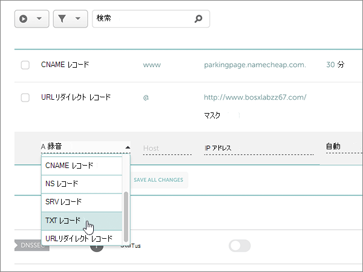
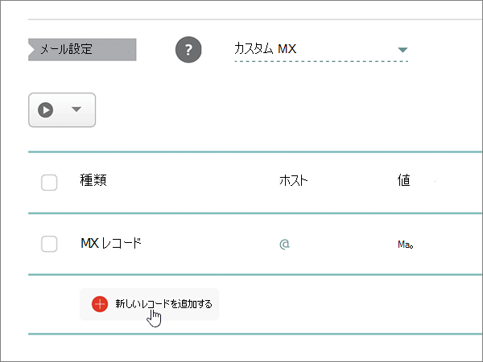
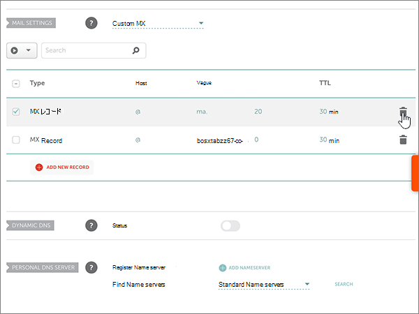
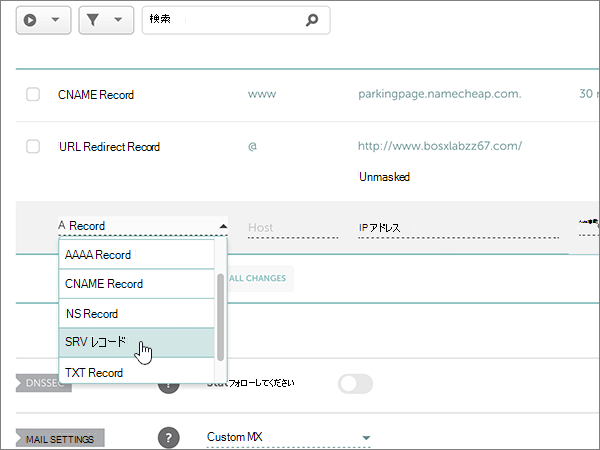
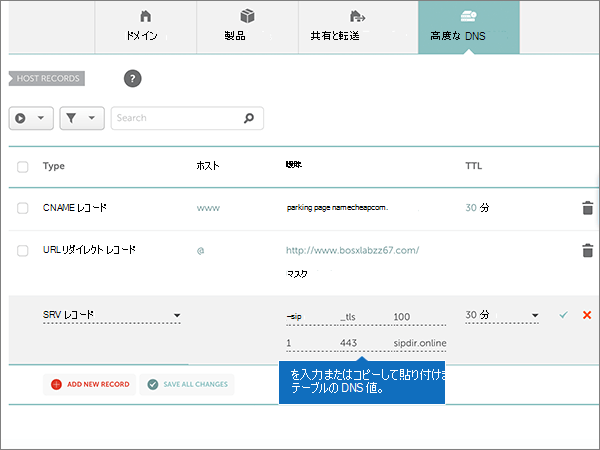
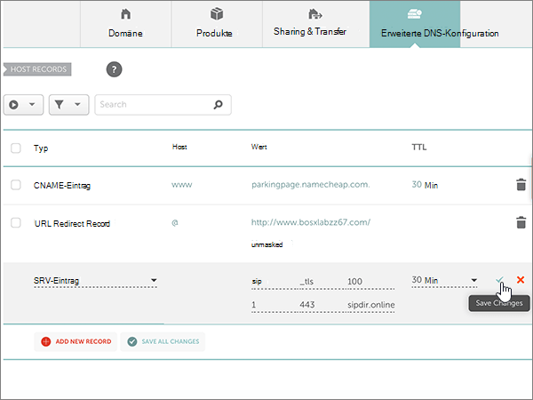

# Microsoft の Namecheap で DNS レコードを作成する

 探している内容が見つからない場合は、**[ドメインに関する FAQ を確認Q](../setup/domains-faq.md)** を参照してください。 
  
使用している DNS ホスティング プロバイダーが Namecheap の場合は、この記事に記載された手順に従って、ドメインの確認とメールや Skype for Business Online などの DNS レコードのセットアップを行います。
  
これらのレコードを Namecheap で追加すると、使用しているドメインが Microsoft サービスで機能するように設定されます。
  
> [!NOTE]
> 通常、DNS の変更が有効になるのに 15 分ほどかかります。ただし、インターネットの DNS システム全体を更新する変更の場合、さらに長くかかることもあります。DNS レコードの追加でメール フローなどに問題が発生した場合は、「[ドメイン名または DNS レコードの変更後の問題に関するトラブルシューティング](../get-help-with-domains/find-and-fix-issues.md)」を参照してください。 
  
## 確認のための TXT レコードを追加する

Microsoft のドメインを使うには、ドメインを所有していることを確認する必要があります。自分のドメイン レジストラーで自分のアカウントにログインし、DNS レコードを作成することができれば、Microsoft に対してドメインを所有していることを確認することができます。
  
> [!NOTE]
> このレコードは、ドメインを所有していることを確認するためだけに使用されます。その他には影響しません。 必要に応じて、後で削除することができます。 
  
以下の手順に従います。
  
1. まず、[このリンク](https://www.namecheap.com/myaccount/login.aspx?ReturnUrl=%2f)を使って Namecheap でドメイン ページにアクセスします。サインインして続行するように求められます。
    
    
  
2. **ランディング**ページの [**アカウント**] で、ドロップダウンリストから [**ドメインリスト**] を選択します。 
    
    
  
3. [ **ドメインリスト** ] ページで、編集するドメインの名前を見つけて、[ **管理**] を選択します。
    
    
  
4. [ **ADVANCED DNS**] を選択します。
    
    
  
5. [ **ホストレコード** ] セクションで、[ **新しいレコードの追加**] を選択します。
    
    
  
6. [ **Type**] ドロップダウンで、[ **TXT Record**] を選びます。
    
    > [!NOTE]
    > [**新しいレコードの追加**] を選択すると、[**種類**] ドロップダウンが自動的に表示されます。 
  
    
  
7. 新規レコードのボックスに、次の表の値を入力するか、コピーして貼り付けます。
    
    (ドロップダウンリストから [ **TTL** ] の値を選びます。) 
    
    |**Type**|**Host**|**Value**|**TTL**|
    |:-----|:-----|:-----|:-----|
    |TXT    |@    |MS=ms *XXXXXXXX*   **注:** これは例です。 この表から **[宛先またはポイント先のアドレス]** の値を指定してください。  [確認する方法](../get-help-with-domains/information-for-dns-records.md)          |30 分    |
       
    
  
8. [ **変更の保存** ] (チェックマーク) コントロールを選択します。 
    
    
  
9. 数分待つと、続行できます。この間、作成したレコードがインターネット全体で更新されます。
    
これで、ドメイン レジストラーのサイトでレコードが追加されました。Microsoft に戻り、レコードをリクエストします。
  
Microsoft で正しい TXT レコードが見つかった場合、ドメインは確認済みとなります。
  
1. 管理センターで、**[設定]** \> <a href="https://go.microsoft.com/fwlink/p/?linkid=834818" target="_blank">[ドメイン]</a> ページの順に移動します。
    
2. **[ドメイン]** ページで、確認するドメインを選択します。 
    
    
  
3. **[セットアップ]** ページで、**[セットアップの開始]** を選択します。
    
    
  
4. **[ドメインの確認]** ページで、**[確認]** を選択します。
    
    
  
> [!NOTE]
> 通常、DNS の変更が有効になるのに 15 分ほどかかります。ただし、インターネットの DNS システム全体を更新する変更の場合、さらに長くかかることもあります。DNS レコードの追加でメール フローなどに問題が発生した場合は、「[ドメイン名または DNS レコードの変更後の問題に関するトラブルシューティング](../get-help-with-domains/find-and-fix-issues.md)」を参照してください。 

  
## MX レコードを追加して、自分のドメインのメールが Microsoft に届くようにする

以下の手順に従います。
  
1. まず、[このリンク](https://www.namecheap.com/myaccount/login.aspx?ReturnUrl=%2f)を使って Namecheap でドメイン ページにアクセスします。サインインして続行するように求められます。
    
    
  
2. **ランディング**ページの [**アカウント**] で、ドロップダウンリストから [**ドメインリスト**] を選択します。 
    
    
  
3. [ **ドメインリスト** ] ページで、編集するドメインの名前を見つけて、[ **管理**] を選択します。
    
    
  
4. [ **ADVANCED DNS**] を選択します。
    
    
  
5. [ **MAIL SETTINGS**] セクションで、[ **Email Forwarding**] ドロップダウン リストから [ **Custom MX**] を選びます。 
    
    (下へスクロールしなければならないことがあります。)
    
    
  
6. [ **Add New Record**] を選択します。
    
    
  
7. 新規レコードのボックスに、次の表の値を入力するか、コピーして貼り付けます
    
    ([ **Priority**] ボックスは、[ **Value**] ボックスの右側にある名前のないボックスです。 ドロップダウンリストから [ **TTL** ] 値を選びます。) 
    
    |**Type**|**Host**|**Value**|**Priority**|**TTL**|
    |:-----|:-----|:-----|:-----|:-----|
    |MX レコード    |@    |\<*domain-key*\>. mail.protection.outlook.com。    **この値は、末尾がピリオド (.) でなければなりません**   **注:***\<domain-key\>* Microsoft アカウントからを取得します。  [確認する方法](../get-help-with-domains/information-for-dns-records.md)          |.0    優先度の詳細については、「[MX 優先度とは何ですか?](https://docs.microsoft.com/microsoft-365/admin/setup/domains-faq)」を参照してください。   |30 分    |
       
    
  
8. [ **変更の保存** ] (チェックマーク) コントロールを選択します。 
    
    
  
9. これ以外の MX レコードがある場合は、次の 2 段階のプロセスに従って、それぞれのレコードを削除します。
    
    最初に、削除するレコードの [ **削除] アイコン** (ごみ箱) を選択します。 
    
    
  
    次に、[ **はい]** を選択して削除を確認します。 
    
    
  
    この手順の最初に追加した MX レコード以外の MX レコードをすべて削除します。

  
## Microsoft に必要な6つの CNAME レコードを追加する

以下の手順に従います。
  
1. まず、[このリンク](https://www.namecheap.com/myaccount/login.aspx?ReturnUrl=%2f)を使って Namecheap でドメイン ページにアクセスします。サインインして続行するように求められます。
    
    
  
2. **ランディング**ページの [**アカウント**] で、ドロップダウンリストから [**ドメインリスト**] を選択します。 
    
    
  
3. [ **ドメインリスト** ] ページで、編集するドメインの名前を見つけて、[ **管理**] を選択します。
    
    
  
4. [ **ADVANCED DNS**] を選択します。
    
    
  
5. [ **ホストレコード** ] セクションで、[ **新しいレコードの追加**] を選択します。
    
    
  
6. [ **Type**] ドロップダウンで、[ **CNAME Record**] を選びます。
    
    > [!NOTE]
    > [**新しいレコードの追加**] を選択すると、[**種類**] ドロップダウンが自動的に表示されます。 
  
    
  
7. 新しいレコードの空のボックスで、[ **Record Type**] に [ **CNAME**] を選び、次の表の 1 行目の値を入力するか、コピーして貼り付けます。
    
    |**種類**|**Host**|**Value**|**TTL**|
    |:-----|:-----|:-----|:-----|
    |CNAME    |autodiscover    |autodiscover.outlook.com.    **この値は、末尾がピリオド (.) でなければなりません**   |3600    |
    |CNAME    |sip    |sipdir.online.lync.com    **この値は、末尾がピリオド (.) でなければなりません**   |3600    |
    |CNAME    |lyncdiscover    |webdir.online.lync.com.    **この値は、末尾がピリオド (.) でなければなりません**   |3600    |
    |CNAME    |enterpriseregistration    |enterpriseregistration.windows.net.    **この値は、末尾がピリオド (.) でなければなりません**   |3600    |
    |CNAME    |enterpriseenrollment    |enterpriseenrollment-s.manage.microsoft.com.    **この値は、末尾がピリオド (.) でなければなりません**   |3600    |
       
    
  
8. [ **変更の保存** ] (チェックマーク) コントロールを選択します。 
    
    
  
9. 上記の4つの手順と、表の他の5つの行の値を使用して、残りの5つの CNAME レコードをそれぞれ追加します。

  
## 迷惑メールの防止に役立つ、SPF の TXT レコードを追加する

> [!IMPORTANT]
> 1 つのドメインで、SPF に複数の TXT レコードを設定することはできません。 1 つのドメインに複数の SPF レコードがあると、メール、配信の分類、迷惑メールの分類で問題が発生することがあります。 使用しているドメインに既に SPF レコードがある場合は、Microsoft 用に新しいレコードを作成しないでください。 代わりに、値のセットを含む  *1 つ*  の SPF レコードがあるように、現在のレコードに必要な Microsoft の値を追加します。 

以下の手順に従います。
  
1. まず、[このリンク](https://www.namecheap.com/myaccount/login.aspx?ReturnUrl=%2f)を使って Namecheap でドメイン ページにアクセスします。サインインして続行するように求められます。
    
2. **ランディング**ページの [**アカウント**] で、ドロップダウンリストから [**ドメインリスト**] を選択します。 
    
    
  
3. [ **ドメインリスト** ] ページで、編集するドメインの名前を見つけて、[ **管理**] を選択します。
    
    
  
4. [ **ADVANCED DNS**] を選択します。
    
    
  
5. [ **ホストレコード** ] セクションで、[ **新しいレコードの追加**] を選択します。
    
    
  
6. [ **Type**] ドロップダウンで、[ **TXT Record**] を選びます。
    
    > [!NOTE]
    > [**新しいレコードの追加**] を選択すると、[**種類**] ドロップダウンが自動的に表示されます。 
  
    
  
7. 新規レコードのボックスに、次の値を入力するか、次の表から値をコピーして貼り付けます
    
    (ドロップダウンリストから [ **TTL** ] の値を選びます。) 
    
    |**Type**|**Host**|**Value**|**TTL**|
    |:-----|:-----|:-----|:-----|
    |TXT    |@    |v=spf1 include:spf.protection.outlook.com -all    **注:** スペースも正しく入力されるように、この値をコピーして貼り付けることをお勧めします。           |30 分    |
       
    
  
8. [ **変更の保存** ] (チェックマーク) コントロールを選択します。 
    
    
  
## Microsoft で必要な 2 つの SRV レコードを追加する

1. まず、[このリンク](https://www.namecheap.com/myaccount/login.aspx?ReturnUrl=%2f)を使って Namecheap でドメイン ページにアクセスします。サインインするように求められます。
    
    
  
2. **ランディング**ページの [**アカウント**] で、ドロップダウンリストから [**ドメインリスト**] を選択します。 
    
    
  
3. [ **ドメインリスト** ] ページで、編集するドメインの名前を見つけて、[ **管理**] を選択します。
    
    
  
4. [ **ADVANCED DNS**] を選択します。
    
    
  
5. [ **ホストレコード** ] セクションで、[ **新しいレコードの追加**] を選択します。
    
    
  
6. [ **Type**] ドロップダウンで、[ **SRV Record**] を選びます。
    
    > [!NOTE]
    > [**新しいレコードの追加**] を選択すると、[**種類**] ドロップダウンが自動的に表示されます。 
  
    
  
7. 新規レコードの空のボックスに、次の表の 1 行目の値を入力するか、コピーして貼り付けます。
    
    |**Service**|**Protocol**|**Priority**|**Weight**|**Port**|**対象**|**TTL**|
    |:-----|:-----|:-----|:-----|:-----|:-----|:-----|
    |_sip    |_tls    |100    |1-d    |443    |sipdir.online.lync.com    **この値は、末尾がピリオド (.) でなければなりません**   |30 分    |
    |_sipfederationtls    |_tcp    |100    |1-d    |5061    |sipfed.online.lync.com。    **この値は、末尾がピリオド (.) でなければなりません**   |30 分    |
       
    
  
8. [ **変更の保存** ] (チェックマーク) コントロールを選択します。 
    
    
  
9. 上の 4 つの手順に従って、表の 2 行目の値を使って、別の SRV レコードを追加します。
    
> [!NOTE]
> 通常、DNS の変更が有効になるのに 15 分ほどかかります。ただし、インターネットの DNS システム全体を更新する変更の場合、さらに長くかかることもあります。DNS レコードの追加でメール フローなどに問題が発生した場合は、「[ドメイン名または DNS レコードの変更後の問題に関するトラブルシューティング](../get-help-with-domains/find-and-fix-issues.md)」を参照してください。 
  

  
