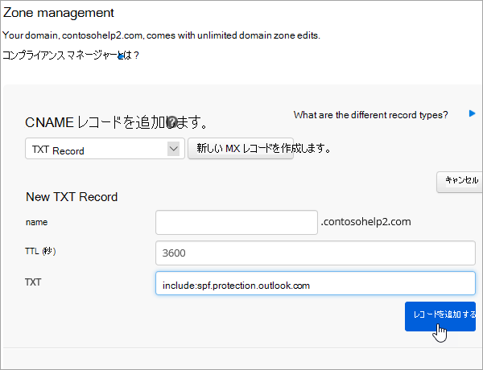

# Microsoft の Netregistry で DNS レコードを作成するCreate DNS records at Netregistry for Microsoft

探している内容が見つからない場合は、[ドメインに関する FAQ を確認](../setup/domains-faq.md)してください。[Check the Domains FAQ](../setup/domains-faq.md) if you don't find what you're looking for. 
  
使用している DNS ホスティング プロバイダーが Netregistry の場合は、この記事に記載された手順に従って、ドメインの確認とメールや Skype for Business Online などの DNS レコードのセットアップを行います。If Netregistry is your DNS hosting provider, follow the steps in this article to verify your domain and set up DNS records for email, Skype for Business Online, and so on.
  
追加する主なレコードは次のとおりです。These are the main records to add.
  
- [確認のための TXT レコードを追加するAdd a TXT record for verification](#add-a-txt-record-for-verification)
    
- [MX レコードを追加して、自分のドメインのメールが Microsoft に届くようにするAdd an MX record so email for your domain will come to Microsoft](#add-an-mx-record-so-email-for-your-domain-will-come-to-microsoft)

- [Microsoft に必要な CNAME レコードを追加するAdd the CNAME records that are required for Microsoft](#add-the-cname-records-that-are-required-for-microsoft)
    
- [迷惑メールの防止に役立つ、SPF の TXT レコードを追加するAdd a TXT record for SPF to help prevent email spam](#add-a-txt-record-for-spf-to-help-prevent-email-spam)
    
- [Microsoft で必要な 2 つの SRV レコードを追加するAdd the two SRV records that are required for Microsoft](#add-the-two-srv-records-that-are-required-for-microsoft)
    
これらのレコードを Netregistry で追加すると、使用しているドメインが Microsoft サービスで機能するように設定されます。After you add these records at Netregistry, your domain will be set up to work with Microsoft services.
  
  
> [!NOTE]
> 通常、DNS の変更が有効になるのに 15 分ほどかかります。ただし、インターネットの DNS システム全体を更新する変更の場合、さらに長くかかることもあります。DNS レコードの追加でメール フローなどに問題が発生した場合は、「[ドメイン名または DNS レコードの変更後の問題に関するトラブルシューティング](../get-help-with-domains/find-and-fix-issues.md)」を参照してください。Typically it takes about 15 minutes for DNS changes to take effect. However, it can occasionally take longer for a change you've made to update across the Internet's DNS system. If you're having trouble with mail flow or other issues after adding DNS records, see [Troubleshoot issues after changing your domain name or DNS records](../get-help-with-domains/find-and-fix-issues.md). 
  
## 確認のための TXT レコードを追加するAdd a TXT record for verification

Microsoft のドメインを使うには、ドメインを所有していることを確認する必要があります。自分のドメイン レジストラーで自分のアカウントにログインし、DNS レコードを作成することができれば、Microsoft に対してドメインを所有していることを確認することができます。Before you use your domain with Microsoft, we have to make sure that you own it. Your ability to log in to your account at your domain registrar and create the DNS record proves to Microsoft that you own the domain.
  
> [!NOTE]
> このレコードは、ドメインを所有していることを確認するためだけに使用されます。その他には影響しません。 必要に応じて、後で削除することができます。This record is used only to verify that you own your domain; it doesn't affect anything else. You can delete it later, if you like. 
  
1. まず、[こちらのリンク](https://theconsole.netregistry.com.au/)を使って、Netregistry のドメイン ページにアクセスします。ログインするように求められます。To get started, go to your domains page in Netregistry by using [this link](https://theconsole.netregistry.com.au/). You'll be prompted to log in.
    
    
  
2. 管理するドメインの横にある、[ **Manage** ] を選択します。Next to the domain you want to manage, select **Manage**.
    
    
  
3. [ **Zone Manager** ] を選択します。Select **Zone Manager**.
    
    
  
4. [ **Add a zone record**] の一覧から [ **TXT record** ] を選択し、[ **新しいレコードの作成**] を選択します。Under **Add a zone record**, choose **TXT Record** from the list, and then select **Create new record**.
    
    
  
    > [!NOTE]
    > TXT ボックスでは、エントリの前後に引用符を使用する必要があります。You must use quotation marks before and after the entry in the TXT box. 
  
    [ **New TXT Record** ] フォームに、次の表の値を入力するか、コピーして貼り付けます。In the **New TXT Record** form, type or copy and paste the values from the following table. 
    
    |**名前****Name**|**TTL (秒)****TTL (SEC)**|**TXT (ポイント先のアドレスまたは値)****TXT (Points to address or value)**|
    |:-----|:-----|:-----|
    |(空白のまま)(leave blank)    |3600 (秒)3600 (seconds)    |"MS = msXXXXXXXX""MS=msXXXXXXXX"    **注:** これは例です。**Note:** This is an example. この表から **[宛先またはポイント先のアドレス]** の値を指定してください。Use your specific **Destination or Points to Address** value here, from the table. [確認する方法How do I find this?](../get-help-with-domains/information-for-dns-records.md)  |
       
    
  
6. [ **Add record**] を選択します。Select **Add record**.
    
これで、ドメイン レジストラーのサイトでレコードが追加されました。Microsoft に戻り、レコードをリクエストします。Now that you've added the record at your domain registrar's site, you'll go back to Microsoft and request the record.
  
Microsoft で正しい TXT レコードが見つかった場合、ドメインは確認済みとなります。When Microsoft finds the correct TXT record, your domain is verified.
  
1. 管理センターで、**[設定]** \> <a href="https://go.microsoft.com/fwlink/p/?linkid=834818" target="_blank">[ドメイン]</a> ページの順に移動します。In the admin center, go to the **Settings** \> <a href="https://go.microsoft.com/fwlink/p/?linkid=834818" target="_blank">Domains</a> page.
    
2. **[ドメイン]** ページで、確認するドメインを選択します。On the **Domains** page, select the domain that you are verifying. 
    
    
  
3. **[セットアップ]** ページで、**[セットアップの開始]** を選択します。On the **Setup** page, select **Start setup**.
    
    
  
4. **[ドメインの確認]** ページで、**[確認]** を選択します。On the **Verify domain** page, select **Verify**.
    
    
  
> [!NOTE]
>  通常、DNS の変更が有効になるのに 15 分ほどかかります。ただし、インターネットの DNS システム全体を更新する変更の場合、さらに長くかかることもあります。DNS レコードの追加でメール フローなどに問題が発生した場合は、「[ドメイン名または DNS レコードの変更後の問題に関するトラブルシューティング](../get-help-with-domains/find-and-fix-issues.md)」を参照してください。Typically it takes about 15 minutes for DNS changes to take effect. However, it can occasionally take longer for a change you've made to update across the Internet's DNS system. If you're having trouble with mail flow or other issues after adding DNS records, see [Troubleshoot issues after changing your domain name or DNS records](../get-help-with-domains/find-and-fix-issues.md). 
  
## MX レコードを追加して、自分のドメインのメールが Microsoft に届くようにするAdd an MX record so email for your domain will come to Microsoft

1. まず、[こちらのリンク](https://theconsole.netregistry.com.au/)を使って、Netregistry のドメイン ページにアクセスします。ログインするように求められます。To get started, go to your domains page in Netregistry by using [this link](https://theconsole.netregistry.com.au/). You'll be prompted to log in.
    
    
  
2. 管理するドメインの横にある、[ **Manage** ] を選択します。Next to the domain you want to manage, select **Manage**.
    
    
  
3. [ **Zone Manager** ] を選択します。Select **Zone Manager**.
    
    
  
4. [ **現在のゾーンレコード**] で、リスト内の各 mx レコードの横にある [ **削除** ] を選択して、既定の mx レコードを削除します。Under **Current zone records**, remove the default MX records by selecting **Remove** next to each MX record in the list. 
    
    
  
5. [ **Add a zone record**] の一覧から [ **MX record** ] を選択し、[ **新しいレコードの作成**] を選択します。Under **Add a zone record**, choose **MX Record** from the list, and then select **Create new record**.
    
    
  
6. [ **新しい MX レコード** ] フォームで、次の表の値を入力するか、コピーして貼り付けます。In the **New MX Record** form, type or copy and paste the values from the following table. 
    
    |**名前****Name**|**TTL (秒)****TTL (SEC)**|**Exchange (ポイント先アドレスまたは値)****Exchange (Points to address or value)**|**ホストは完全に修飾されていますか?****Is host fully qualified?**|**優先順位 (優先度)****Preference (Priority)**|
    |:-----|:-----|:-----|:-----|:-----|
    |(空白のまま)(leave blank)    |3600 (秒)3600 (seconds)    | *\<domain-key\>*  .mail.protection.outlook.com*\<domain-key\>*  .mail.protection.outlook.com    \**注:\*\*\*\<domain-key\>* Microsoft アカウントからを取得します。**Note:** Get your  *\<domain-key\>*  from your Microsoft account.  [確認する方法How do I find this?](../get-help-with-domains/information-for-dns-records.md)      |(チェックボックスをオンにします)(select the checkbox)    |10  10    For more information about priority, see What is MX priority?For more information about priority, see What is MX priority?    |
       
    
  
7. [ **Add Record** ] を選択します。Select **Add Record**.
    
    
  
## Microsoft に必要な CNAME レコードを追加するAdd the CNAME records that are required for Microsoft

1. まず、[こちらのリンク](https://theconsole.netregistry.com.au/)を使って、Netregistry のドメイン ページにアクセスします。ログインするように求められます。To get started, go to your domains page in Netregistry by using [this link](https://theconsole.netregistry.com.au/). You'll be prompted to log in.
    
    
  
2. 管理するドメインの横にある、[ **Manage** ] を選択します。Next to the domain you want to manage, select **Manage**.
    
    
  
3. [ **Zone Manager** ] を選択します。Select **Zone Manager**.
    
    
  
4. [  **Add a zone record**] の一覧から [ **CNAME record** ] を選択し、[ **新しいレコードの作成**] を選択します。Under  **Add a zone record**, choose **CNAME Record** from the list, and then select **Create new record**.
    
    
  
5. 新規レコードのボックスに、次の表の値を入力するか、コピーして貼り付けます。In the boxes for the new record, type or copy and paste the values from the following table.
    
    |**名前****Name**|**Type****Type**|**TTL****TTL**|**ホスト (ポイントまたはアドレスの値)****HOST (Points to or address value)**|
    |:-----|:-----|:-----|:-----|
    |autodiscoverautodiscover    |CNAMECNAME    |3600 (秒)3600 (seconds)    |autodiscover.outlook.comautodiscover.outlook.com    |
    |sipsip    |CNAMECNAME    |3600 (秒)3600 (seconds)    |sipdir.online.lync.comsipdir.online.lync.com    |
    |lyncdiscoverlyncdiscover    |CNAMECNAME    |3600 (秒)3600 (seconds)    |webdir.online.lync.comwebdir.online.lync.com    |
    |enterpriseregistrationenterpriseregistration    |CNAMECNAME    |3600 (秒)3600 (seconds)    |enterpriseregistration.windows.netenterpriseregistration.windows.net    |
    |enterpriseenrollmententerpriseenrollment    |CNAMECNAME    |3600 (秒)3600 (seconds)    |enterpriseenrollment-s.manage.microsoft.comenterpriseenrollment-s.manage.microsoft.com    |
       
    
      
6. [ **Add record**] を選択します。Select **Add record**.
    
    
  
7. 前の手順を繰り返し、他の 5 つの CNAME レコードを作成します。Repeat the previous steps to create the other five CNAME records.
    
    レコードごとに、上のテーブルの次の行の値をそのレコードのボックスに入力するか、コピーして貼り付けます。For each record, type or copy and paste the values from the next row of the table above into the boxes for that record.
    
## 迷惑メールの防止に役立つ、SPF の TXT レコードを追加するAdd a TXT record for SPF to help prevent email spam

> [!IMPORTANT]
> 1 つのドメインで、SPF に複数の TXT レコードを設定することはできません。You cannot have more than one TXT record for SPF for a domain. 1 つのドメインに複数の SPF レコードがあると、メール、配信の分類、迷惑メールの分類で問題が発生することがあります。If your domain has more than one SPF record, you'll get email errors, as well as delivery and spam classification issues. 使用しているドメインに既に SPF レコードがある場合は、Microsoft 用に新しいレコードを作成しないでください。If you already have an SPF record for your domain, don't create a new one for Microsoft. 代わりに、値のセットを含む  *1 つ*  の SPF レコードがあるように、現在のレコードに必要な Microsoft の値を追加します。Instead, add the required Microsoft values to the current record so that you have a  *single*  SPF record that includes both sets of values.
  
1. まず、[こちらのリンク](https://theconsole.netregistry.com.au/)を使って、Netregistry のドメイン ページにアクセスします。ログインするように求められます。To get started, go to your domains page in Netregistry by using [this link](https://theconsole.netregistry.com.au/). You'll be prompted to log in.
    
    
  
2. 管理するドメインの横にある、[ **Manage** ] を選択します。Next to the domain you want to manage, select **Manage**.
    
    
  
3. [ **Zone Manager** ] を選択します。Select **Zone Manager**.
    
    
  
4. [ **Add a zone record**] の一覧から [ **TXT record** ] を選択し、[ **新しいレコードの作成**] を選択します。Under **Add a zone record**, choose **TXT Record** from the list, and then select **Create new record**.
    
    
  
5. 新規レコードのボックスに、次の表の値を入力するか、コピーして貼り付けます。In the boxes for the new record, type or copy and paste the values from the following table. 
    
    > [!NOTE]
    > TXT ボックスでは、エントリの前後に引用符を使用する必要があります。You must use quotation marks before and after the entry in the TXT box. 
  
    |**名前****Name**|**Type****Type**|**TTL****TTL**|**TXT データ (ターゲット)****TXT Data (Target)**|
    |:-----|:-----|:-----|:-----|
    |(空白のまま)(leave blank)    |TXTTXT    |3600 (秒)3600 (seconds)    |"v = spf1 には、以下のようにします。"v=spf1 include:spf.protection.outlook.com -all"    **注:** スペースも正しく入力されるように、この値をコピーして貼り付けることをお勧めします。**Note:** We recommend copying and pasting this entry, so that all of the spacing stays correct.           |
   
    
  
6. [ **Add Record** ] を選択します。Select **Add Record**.
    
    
  
## Microsoft で必要な 2 つの SRV レコードを追加するAdd the two SRV records that are required for Microsoft

1. まず、[こちらのリンク](https://theconsole.netregistry.com.au/)を使って、Netregistry のドメイン ページにアクセスします。ログインするように求められます。To get started, go to your domains page in Netregistry by using [this link](https://theconsole.netregistry.com.au/). You'll be prompted to log in.
    
    
  
2. 管理するドメインの横にある [  **manage**] を選択します。Next to the domain you want to manage, select  **Manage**.
    
    
  
3. [ **Zone Manager** ] を選択します。Select **Zone Manager**.
    
    
  
4. [  **Add a zone record**] の一覧から [ **SRV record** ] を選択し、[ **新しいレコードの作成**] を選択します。Under  **Add a zone record**, choose **SRV Record** from the list, and then select **Create new record**.
    
    
  
5. 新規レコードのボックスに、次の表の値を入力するか、コピーして貼り付けます。In the boxes for the new record, type or copy and paste the values from the following table.
    
    > [!NOTE]
    > [名前] フィールドは、サービス (たとえば、_sip) とプロトコル (たとえば、_tls) の組み合わせです。The Name field is a combination of the service (for example, _sip) and protocol (for example, _tls). 
  
    |**Type****Type**|**名前****Name**|**TTL (秒)****TTL (SEC)**|**Priority****Priority**|**Weight****Weight**|**Port****Port**|**対象****Target**|
    |:-----|:-----|:-----|:-----|:-----|:-----|:-----|
    |SRV (サービス)SRV (service)    |_sip._tls_sip._tls    |3600 (秒)3600 (seconds)    |100100    |1-d1    |443443    |sipdir.online.lync.comsipdir.online.lync.com    |
    |SRV (サービス)SRV (service)    |_sipfederationtls._tcp_sipfederationtls._tcp    |3600 (秒)3600 (seconds)    |100100    |1-d1    |50615061    |sipfed.online.lync.comsipfed.online.lync.com    |
       
    
  
6. [ **Add Record** ] を選択します。Select **Add Record**.
    
    
  
7. 上記の手順を繰り返し、他の SRV レコードを作成します。Repeat the previous steps to create the other SRV record.
    
    2 番目のレコードのボックスに、上の表の 2 行目の値を入力するかコピーして貼り付けます。Type or copy and paste the values from the second row of the table above into the boxes for the second record.
    
> [!NOTE]
> 通常、DNS の変更が有効になるのに 15 分ほどかかります。ただし、インターネットの DNS システム全体を更新する変更の場合、さらに長くかかることもあります。DNS レコードの追加でメール フローなどに問題が発生した場合は、「[ドメイン名または DNS レコードの変更後の問題に関するトラブルシューティング](../get-help-with-domains/find-and-fix-issues.md)」を参照してください。Typically it takes about 15 minutes for DNS changes to take effect. However, it can occasionally take longer for a change you've made to update across the Internet's DNS system. If you're having trouble with mail flow or other issues after adding DNS records, see [Troubleshoot issues after changing your domain name or DNS records](../get-help-with-domains/find-and-fix-issues.md). 
  

