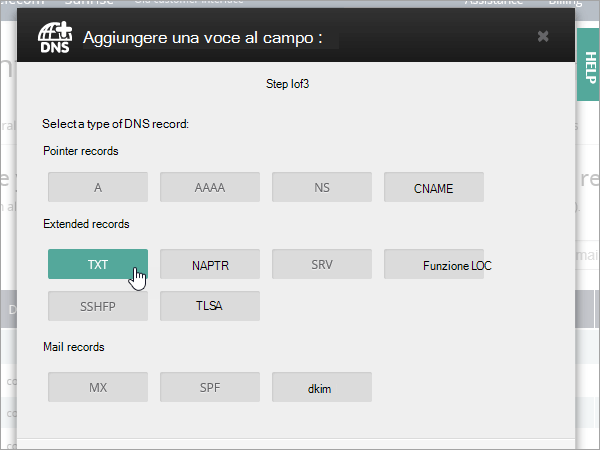
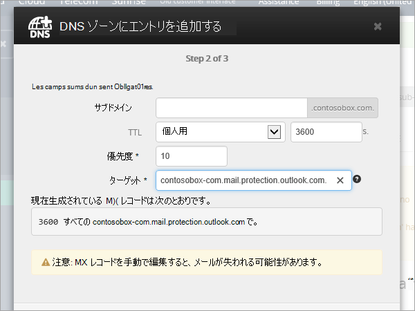
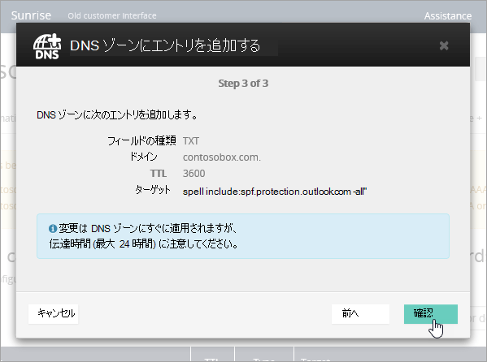

# OVH で DNS レコードを Microsoft 365 に接続する

探している内容が見つからない場合は、[ドメインに関する FAQ を確認](../setup/domains-faq.yml)してください。

使用している DNS ホスティング プロバイダーが OVH の場合は、この記事に記載された手順に従って、ドメインの確認とメールや Skype for Business Online などの DNS レコードのセットアップを行います。

OVH でこれらのレコードを追加すると、Microsoft サービスで動作するようにドメインが設定されます。

> [!NOTE]
> 通常、DNS の変更が有効になるのに 15 分ほどかかります。ただし、インターネットの DNS システム全体を更新する変更の場合、さらに長くかかることもあります。DNS レコードの追加でメール フローなどに問題が発生した場合は、「[ドメイン名または DNS レコードの変更後の問題に関するトラブルシューティング](../get-help-with-domains/find-and-fix-issues.md)」を参照してください。

## 確認のための TXT レコードを追加する

Microsoft のドメインを使うには、ドメインを所有していることを確認する必要があります。自分のドメイン レジストラーで自分のアカウントにログインし、DNS レコードを作成することができれば、Microsoft に対してドメインを所有していることを確認することができます。

> [!NOTE]
> このレコードは、ドメインを所有していることを確認するためだけに使用されます。その他には影響しません。 必要に応じて、後で削除することができます。

1. まず、[このリンク](https://www.ovh.com/manager/)を使って OVH でドメイン ページにアクセスします。 ログインするように求められます。

    

1. ダッシュボードのランディング ページの [ **すべてのアクティビティの表示**] で、編集するドメインの名前を選択します。

1. **[DNS ゾーン**] を選択します。

    

1. [ **エントリの追加] を選択します**。

    

1. **TXT を選択する**

    

1. 新規レコードのボックスに、次の表の値を入力するか、コピーして貼り付けます。 TTL 値を割り当てるには、ドロップダウン リストから **[カスタム** ] を選択し、テキスト ボックスに値を入力します。

   |レコードの種類|サブドメイン|TTL|値|
   |---|---|---|---|
   |TXT|(空白のまま)|3600 (秒)|MS=msxxxxxxxx    **注:** これは例です。 この表から **[宛先またはポイント先のアドレス]** の値を指定してください。  [確認する方法](../get-help-with-domains/information-for-dns-records.md)|

1. **[次へ]** を選択します。

1. **[確認]** を選択します。

    

1. 数分待つと、続行できます。この間、作成したレコードがインターネット全体で更新されます。

これで、ドメイン レジストラーのサイトでレコードが追加されました。Microsoft に戻り、レコードをリクエストします。 Microsoft で正しい TXT レコードが見つかった場合、ドメインは確認済みとなります。

Microsoft 365 でレコードを確認するには、

1. 管理センターで、[ **設定ドメイン]** \> に移動 <a href="https://go.microsoft.com/fwlink/p/?linkid=834818" target="_blank">**します**</a>。

1. [ドメイン] ページで、確認するドメインを選択し、[ **セットアップの開始]** を選択します。

    :::image type="content" source="../../media/dns-IONOS/IONOS-DomainConnects-2.png" alt-text="[セットアップの開始] を選択します。":::

1. **[続行]** を選択します。

1. **[ドメインの確認]** ページで、**[確認]** を選択します。

> [!NOTE]
>  通常、DNS の変更が有効になるのに 15 分ほどかかります。ただし、インターネットの DNS システム全体を更新する変更の場合、さらに長くかかることもあります。DNS レコードの追加でメール フローなどに問題が発生した場合は、「[ドメイン名または DNS レコードの変更後の問題に関するトラブルシューティング](../get-help-with-domains/find-and-fix-issues.md)」を参照してください。

## MX レコードを追加して、自分のドメインのメールが Microsoft に届くようにする

1. まず、[このリンク](https://www.ovh.com/manager/)を使って OVH でドメイン ページにアクセスします。 ログインするように求められます。

    

1. ダッシュボードのランディング ページの [ **すべてのアクティビティの表示**] で、編集するドメインの名前を選択します。

1. **[DNS ゾーン**] を選択します。

    

1. [ **エントリの追加] を選択します**。

    

1. **[MX**] を選択します。

    

1. 新規レコードのボックスに、次の表の値を入力するか、コピーして貼り付けます。 TTL 値を割り当てるには、ドロップダウン リストから **[カスタム** ] を選択し、テキスト ボックスに値を入力します。

    > [!NOTE]
    > 既定では、OVH はターゲットに相対表記を使用し、ターゲット レコードの末尾にドメイン名を追加します。 絶対表記を代わりに使用するには、次の表に示すように、ターゲット レコードにドットを追加します。

   |サブドメイン|TTL|優先度|Target|
   |---|---|---|---|
   |(空白のまま)|3600 (秒)|0    優先度の詳細については、「[MX 優先度とは何ですか?](../setup/domains-faq.yml)」を参照してください。|\<domain-key\>.mail.protection.outlook.com。    **メモ：** Microsoft アカウントから取得します *\<domain-key\>* 。 [確認する方法](../get-help-with-domains/information-for-dns-records.md)|

    

1. **[次へ]** を選択します。

    ![OVH MX レコードで [次へ] を選択します。](../../media/4db62d07-0dc4-49f6-bd19-2b4a07fd764a.png)

1. **[確認]** を選択します。

    ![OVH MX レコードの [確認] を選択します。](../../media/090bfb11-a753-4af0-8982-582a4069a169.png)

1. **DNS ゾーン** ページの一覧内の他の MX レコードをすべて削除します。 各レコードを選択し、[ **アクション]** 列でごみ箱の **[削除** ] アイコンを選択します。

    

1. **[確認]** を選択します。

## Microsoft に必要な CNAME レコードを追加する

1. まず、[このリンク](https://www.ovh.com/manager/)を使って OVH でドメイン ページにアクセスします。 ログインするように求められます。

    

1. ダッシュボードのランディング ページの [ **すべてのアクティビティの表示**] で、編集するドメインの名前を選択します。

1. **[DNS ゾーン**] を選択します。

    

1. [ **エントリの追加] を選択します**。

    

1. **CNAME を選択します**。

    

1. 新規レコードのボックスに、次の表の 1 行目の値を入力するか、コピーして貼り付けます。 TTL 値を割り当てるには、ドロップダウン リストから **[カスタム** ] を選択し、テキスト ボックスに値を入力します。

   |サブドメイン|TTL|Target|
   |---|---|---|
   |autodiscover|3600 (秒)|autodiscover.outlook.com.|

    

1. **[次へ]** を選択します。

    ![OVH CNAME 値を追加し、[次へ] を選択します。](../../media/f9481cb1-559d-4da1-9643-9cacb0d80d29.png)

1. **[確認]** を選択します。

## 迷惑メールの防止に役立つ、SPF の TXT レコードを追加する

> [!IMPORTANT]
> 1 つのドメインで、SPF に複数の TXT レコードを設定することはできません。 1 つのドメインに複数の SPF レコードがあると、メール、配信の分類、迷惑メールの分類で問題が発生することがあります。 使用しているドメインに既に SPF レコードがある場合は、Microsoft 用に新しいレコードを作成しないでください。 代わりに、必要な Microsoft 値を現在のレコードに追加して、両方の値セットを含む  *1 つの*  SPF レコードを作成します。

1. まず、[このリンク](https://www.ovh.com/manager/)を使って OVH でドメイン ページにアクセスします。 ログインするように求められます。

    

1. ダッシュボードのランディング ページの [ **すべてのアクティビティの表示**] で、編集するドメインの名前を選択します。

1. **[DNS ゾーン**] を選択します。

    

1. [ **エントリの追加] を選択します**。

    

1. **[TXT] を選択します**。

1. In the boxes for the new record, type or copy and paste the following values. TTL 値を割り当てるには、ドロップダウン リストから **[カスタム** ] を選択し、テキスト ボックスに値を入力します。

   |サブドメイン|TTL|値|
   |---|---|---|
   |(空白のまま)|3600 (秒)|v=spf1 include:spf.protection.outlook.com -all <br/**Note:** このエントリをコピーして貼り付け、すべての間隔が正しく維持されるようにすることをお勧めします。|

    

1. **[次へ]** を選択します。

    ![OVH SPF の TXT レコードを追加し、[次へ] を選択します。](../../media/7937eb7c-114f-479f-a916-bcbe476d6108.png)

1. **[確認]** を選択します。

    

## 詳細オプション: Skype for Business

Microsoft Teams に加えて、組織がチャット、電話会議、ビデオ通話などのオンラインコミュニケーション サービスにSkype for Businessを使用している場合にのみ、このオプションを選択します。 Skype には、ユーザー間通信用の 2 つの SRV レコードと、ユーザーをサインインしてサービスに接続するための 2 つの CNAME レコードの 4 つのレコードが必要です。

### 必要な 2 つの SRV レコードを追加する

1. まず、[このリンク](https://www.ovh.com/manager/)を使って OVH でドメイン ページにアクセスします。 ログインするように求められます。

    

1. ダッシュボードのランディング ページの [ **すべてのアクティビティの表示**] で、編集するドメインの名前を選択します。

1. **[DNS ゾーン**] を選択します。

    

1. [ **エントリの追加] を選択します**。

    

1. **[SRV] を選択します**。

1. In the boxes for the new record, type or copy and paste the following values. TTL 値を割り当てるには、ドロップダウン リストから **[カスタム** ] を選択し、テキスト ボックスに値を入力します。

   |サブドメイン|TTL (Seconds)|優先度|太さ|ポート|Target|
   |---|---|---|---|---|---|
   |_sip._tls|3600 (s.)|100|1|443|sipdir.online.lync.com **この値はピリオドで終わる必要があります (.)**>  **注:** スペースも正しく入力されるように、この値をコピーして貼り付けることをお勧めします。|
   |_sipfederationtls._tcp|3600 (s.)|100|1|5061|sipfed.online.lync.com。 **この値は、末尾がピリオド (.) でなければなりません**  **注:** スペースも正しく入力されるように、この値をコピーして貼り付けることをお勧めします。|

1. 他の SRV レコードを追加するには、[ **別のレコードの追加]** を選択し、テーブル内の次の行の値を使用して **レコードを作成** し、[レコードの作成] を選択します。

> [!NOTE]
> 通常、DNS の変更が反映されるまでの時間は約 15 分です。ただし、インターネットの DNS システム全体を更新する変更の場合、さらに長くかかることもあります。DNS レコードの追加後にメール フローなどに問題が発生した場合は、「[ドメインまたは DNS レコードを追加後に問題を特定して解決する](../get-help-with-domains/find-and-fix-issues.md)」を参照してください。

### Skype for Businessに必要な 2 つの CNAME レコードを追加する

1. まず、[このリンク](https://www.ovh.com/manager/)を使って OVH でドメイン ページにアクセスします。 ログインするように求められます。

    

1. ダッシュボードのランディング ページの [ **すべてのアクティビティの表示**] で、編集するドメインの名前を選択します。

1. **[DNS ゾーン**] を選択します。

    

1. [ **エントリの追加] を選択します**。

    

1. **CNAME を選択します**。

    

1. 新規レコードのボックスに、次の表の 1 行目の値を入力するか、コピーして貼り付けます。 TTL 値を割り当てるには、ドロップダウン リストから **[カスタム** ] を選択し、テキスト ボックスに値を入力します。

   |サブドメイン|TTL|Target|
   |---|---|---|
   |sip|3600 (s.)|sipdir.online.lync.com    **この値は、末尾がピリオド (.) でなければなりません**|
   |lyncdiscover|3600 (s.)|webdir.online.lync.com.    **この値は、末尾がピリオド (.) でなければなりません**|

1. **[次へ]** を選択します。

    ![OVH CNAME 値を追加し、[次へ] を選択します。](../../media/f9481cb1-559d-4da1-9643-9cacb0d80d29.png)

1. **[確認]** を選択します。

1. 他の CNAME レコードを追加します。

> [!NOTE]
> 通常、DNS の変更が有効になるのに 15 分ほどかかります。ただし、インターネットの DNS システム全体を更新する変更の場合、さらに長くかかることもあります。DNS レコードの追加でメール フローなどに問題が発生した場合は、「[ドメイン名または DNS レコードの変更後の問題に関するトラブルシューティング](../get-help-with-domains/find-and-fix-issues.md)」を参照してください。

## 詳細オプション: Microsoft 365 のIntuneとモバイル デバイス管理

このサービスは、ドメインに接続するモバイル デバイスをセキュリティで保護し、リモートで管理するのに役立ちます。 モバイル デバイス管理では、ユーザーがデバイスをサービスに登録できるように、2 つの CNAME レコードが必要です。

### Mobile デバイス管理に必要な 2 つの CNAME レコードを追加する

1. まず、[このリンク](https://www.ovh.com/manager/)を使って OVH でドメイン ページにアクセスします。 ログインするように求められます。

    

1. ダッシュボードのランディング ページの [ **すべてのアクティビティの表示**] で、編集するドメインの名前を選択します。

1. **[DNS ゾーン**] を選択します。

    

1. [ **エントリの追加] を選択します**。

    

1. **CNAME を選択します**。

    

1. 新規レコードのボックスに、次の表の 1 行目の値を入力するか、コピーして貼り付けます。 TTL 値を割り当てるには、ドロップダウン リストから **[カスタム** ] を選択し、テキスト ボックスに値を入力します。

   |サブドメイン|TTL|Target|
   |---|---|---|
   |enterpriseregistration   |3600 (s.)|enterpriseregistration.windows.net.    **この値は、末尾がピリオド (.) でなければなりません**|
   |enterpriseenrollment|3600 (s.)|enterpriseenrollment-s.manage.microsoft.com.    **この値は、末尾がピリオド (.) でなければなりません**|

1. **[次へ]** を選択します。

    ![OVH CNAME 値を追加し、[次へ] を選択します。](../../media/f9481cb1-559d-4da1-9643-9cacb0d80d29.png)

1. **[確認]** を選択します。

1. 他の CNAME レコードを追加します。

> [!NOTE]
> 通常、DNS の変更が有効になるのに 15 分ほどかかります。ただし、インターネットの DNS システム全体を更新する変更の場合、さらに長くかかることもあります。DNS レコードの追加でメール フローなどに問題が発生した場合は、「[ドメイン名または DNS レコードの変更後の問題に関するトラブルシューティング](../get-help-with-domains/find-and-fix-issues.md)」を参照してください。